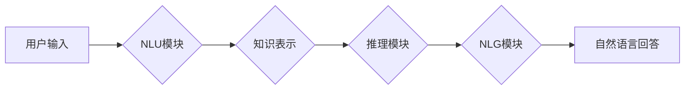

> 大模型、问答机器人、自然语言处理、准确度、自然度、生成模型、Transformer、BERT、GPT

## 1. 背景介绍

近年来，深度学习技术取得了飞速发展，特别是大规模语言模型（Large Language Models，LLMs）的出现，为自然语言处理（Natural Language Processing，NLP）领域带来了革命性的变革。大模型问答机器人（Dialogue-based Question Answering Systems）作为一种新型的智能交互系统，利用大模型的强大能力，能够理解用户自然语言问题，并生成准确、流畅、自然的回答。

问答机器人技术在各个领域都有着广泛的应用前景，例如：

* **客服服务:** 自动化处理客户咨询，提高服务效率。
* **教育领域:** 为学生提供个性化的学习辅导和知识解答。
* **搜索引擎:** 提供更精准、更人性化的搜索结果。
* **娱乐领域:** 开发更智能、更具交互性的游戏和虚拟助手。

然而，大模型问答机器人的发展也面临着一些挑战，主要体现在以下两个方面：

* **准确度:** 大模型在处理复杂、多义性的问题时，仍然存在一定的误判率，导致回答的准确性不足。
* **自然度:** 尽管大模型能够生成流畅的文本，但生成的回答有时缺乏自然语义和逻辑，难以与人类进行自然流畅的对话。

## 2. 核心概念与联系

大模型问答机器人主要由以下几个核心模块组成：

* **自然语言理解 (NLU):** 负责理解用户输入的自然语言问题，将其转换为机器可理解的结构化表示。
* **知识表示 (KR):** 将知识库中的信息以结构化的形式存储和管理，方便模型进行知识检索和推理。
* **推理模块:** 根据用户问题和知识库中的信息，进行逻辑推理，找到最合适的答案。
* **自然语言生成 (NLG):** 将推理结果转换为自然语言文本，生成流畅、自然的回答。

**Mermaid 流程图:**



## 3. 核心算法原理 & 具体操作步骤

### 3.1  算法原理概述

大模型问答机器人的核心算法主要基于深度学习技术，特别是 Transformer 架构和生成式模型。

* **Transformer 架构:** Transformer 是一种新型的深度学习网络结构，能够有效地处理序列数据，例如文本。它通过自注意力机制（Self-Attention）和多头注意力机制（Multi-Head Attention）来捕捉文本中的长距离依赖关系，从而提高模型的理解能力。

* **生成式模型:** 生成式模型能够根据输入数据生成新的数据，例如文本。常用的生成式模型包括 GPT（Generative Pre-trained Transformer）和 BERT（Bidirectional Encoder Representations from Transformers）。

### 3.2  算法步骤详解

大模型问答机器人的训练过程可以概括为以下步骤：

1. **数据预处理:** 收集和清洗问答数据集，将问题和答案转换为机器可理解的格式。
2. **模型训练:** 使用 Transformer 架构和生成式模型，训练问答机器人模型。训练过程中，模型会学习到问题和答案之间的关系，并能够生成符合语义的回答。
3. **模型评估:** 使用测试数据集评估模型的性能，包括准确率、自然度等指标。
4. **模型调优:** 根据评估结果，调整模型参数和训练策略，提高模型性能。

### 3.3  算法优缺点

**优点:**

* **高准确率:** 大模型能够处理复杂、多义性的问题，并提供准确的答案。
* **自然流畅的回答:** 生成式模型能够生成流畅、自然的文本，与人类进行自然对话。
* **可扩展性强:** 大模型可以根据需要进行扩展，处理更多类型的问答任务。

**缺点:**

* **训练成本高:** 大模型需要大量的计算资源和训练数据，训练成本较高。
* **数据依赖性强:** 大模型的性能取决于训练数据的质量，如果训练数据不足或不准确，模型的性能也会受到影响。
* **可解释性差:** 大模型的决策过程较为复杂，难以解释模型的 reasoning 过程。

### 3.4  算法应用领域

大模型问答机器人技术在各个领域都有着广泛的应用前景，例如：

* **客服服务:** 自动化处理客户咨询，提高服务效率。
* **教育领域:** 为学生提供个性化的学习辅导和知识解答。
* **搜索引擎:** 提供更精准、更人性化的搜索结果。
* **娱乐领域:** 开发更智能、更具交互性的游戏和虚拟助手。

## 4. 数学模型和公式 & 详细讲解 & 举例说明

### 4.1  数学模型构建

大模型问答机器人的数学模型主要基于 Transformer 架构和生成式模型。

**Transformer 架构:** Transformer 架构的核心是自注意力机制和多头注意力机制。

* **自注意力机制:** 自注意力机制能够捕捉文本中的长距离依赖关系，计算每个词与其他词之间的相关性。

公式：

$$
Attention(Q, K, V) = softmax(\frac{QK^T}{\sqrt{d_k}})V
$$

其中：

* $Q$：查询矩阵
* $K$：键矩阵
* $V$：值矩阵
* $d_k$：键向量的维度

* **多头注意力机制:** 多头注意力机制通过使用多个自注意力头，能够捕捉文本中的不同层次的依赖关系。

**生成式模型:** 生成式模型使用概率分布来表示文本的生成过程。常用的生成式模型包括 GPT 和 BERT。

* **GPT:** GPT 模型使用自回归的方式生成文本，即根据之前生成的词预测下一个词。

* **BERT:** BERT 模型使用双向编码的方式理解文本，并通过 masked language modeling 和 next sentence prediction 等预训练任务学习文本的语义表示。

### 4.2  公式推导过程

自注意力机制的公式推导过程如下：

1. 将输入序列 $X$ 转换为查询矩阵 $Q$、键矩阵 $K$ 和值矩阵 $V$。

2. 计算每个词与其他词之间的相关性，即 $QK^T$。

3. 对 $QK^T$ 进行归一化，得到注意力权重矩阵。

4. 将注意力权重矩阵与值矩阵 $V$ 相乘，得到最终的输出。

### 4.3  案例分析与讲解

例如，在问答机器人中，用户输入问题 "北京的首都吗?"，模型会使用自注意力机制来捕捉问题中的关键信息 "北京" 和 "首都" 之间的关系，并根据知识库中的信息判断 "北京" 是中国的首都。

## 5. 项目实践：代码实例和详细解释说明

### 5.1  开发环境搭建

* **操作系统:** Ubuntu 20.04
* **Python 版本:** 3.8
* **深度学习框架:** PyTorch 1.8

### 5.2  源代码详细实现

```python
# 导入必要的库
import torch
import torch.nn as nn

# 定义 Transformer 模型
class Transformer(nn.Module):
    def __init__(self, input_size, hidden_size, num_layers, num_heads):
        super(Transformer, self).__init__()
        self.encoder = nn.TransformerEncoder(nn.TransformerEncoderLayer(d_model=hidden_size, nhead=num_heads), num_layers)
        self.decoder = nn.TransformerDecoder(nn.TransformerDecoderLayer(d_model=hidden_size, nhead=num_heads), num_layers)
        self.linear = nn.Linear(hidden_size, input_size)

    def forward(self, src, tgt):
        # 编码器
        encoder_output = self.encoder(src)
        # 解码器
        decoder_output = self.decoder(tgt, encoder_output)
        # 输出层
        output = self.linear(decoder_output)
        return output

# 实例化模型
model = Transformer(input_size=100, hidden_size=512, num_layers=6, num_heads=8)

# 定义损失函数和优化器
criterion = nn.CrossEntropyLoss()
optimizer = torch.optim.Adam(model.parameters(), lr=0.001)

# 训练模型
for epoch in range(10):
    # 训练数据
    # ...
    # 前向传播
    output = model(src, tgt)
    # 计算损失
    loss = criterion(output, target)
    # 反向传播
    optimizer.zero_grad()
    loss.backward()
    # 更新参数
    optimizer.step()

```

### 5.3  代码解读与分析

* **Transformer 模型:** 代码中定义了一个 Transformer 模型，包含编码器和解码器。编码器负责将输入序列编码为隐藏表示，解码器负责根据编码结果生成输出序列。
* **损失函数和优化器:** 使用交叉熵损失函数和 Adam 优化器来训练模型。
* **训练过程:** 训练模型的过程包括前向传播、计算损失、反向传播和更新参数。

### 5.4  运行结果展示

训练完成后，可以使用测试数据评估模型的性能，例如计算准确率、困惑度等指标。

## 6. 实际应用场景

### 6.1  客服服务

大模型问答机器人可以用于自动化处理客户咨询，例如回答常见问题、提供产品信息、预约服务等。

### 6.2  教育领域

大模型问答机器人可以为学生提供个性化的学习辅导和知识解答，例如回答学习问题、提供学习资源、进行知识测试等。

### 6.3  搜索引擎

大模型问答机器人可以用于提供更精准、更人性化的搜索结果，例如理解用户意图、提供相关知识、生成摘要等。

### 6.4  未来应用展望

大模型问答机器人技术在未来将有更广泛的应用场景，例如：

* **医疗领域:** 提供医疗咨询、辅助诊断等服务。
* **法律领域:** 提供法律咨询、法律分析等服务。
* **金融领域:** 提供金融咨询、风险评估等服务。

## 7. 工具和资源推荐

### 7.1  学习资源推荐

* **书籍:**
    * 《深度学习》
    * 《自然语言处理》
* **在线课程:**
    * Coursera: 自然语言处理
    * Udacity: 深度学习

### 7.2  开发工具推荐

* **深度学习框架:** PyTorch, TensorFlow
* **自然语言处理库:** NLTK, spaCy
* **代码编辑器:** VS Code, Sublime Text

### 7.3  相关论文推荐

* **BERT: Pre-training of Deep Bidirectional Transformers for Language Understanding**
* **GPT: Generative Pre-trained Transformer**
* **Attention Is All You Need**

## 8. 总结：未来发展趋势与挑战

### 8.1  研究成果总结

大模型问答机器人技术取得了显著的进展，能够处理复杂、多义性的问题，并生成流畅、自然的回答。

### 8.2  未来发展趋势

* **模型规模更大:** 未来大模型规模将进一步扩大，提升模型的理解能力和生成能力。
* **多模态交互:** 大模型问答机器人将支持多模态交互，例如文本、图像、语音等。
* **个性化定制:** 大模型问答机器人将更加个性化，能够根据用户的需求和偏好进行定制。

### 8.3  面临的挑战

* **数据安全和隐私:** 大模型训练需要大量数据，如何保证数据安全和隐私是一个重要挑战。
* **模型可解释性:** 大模型的决策过程较为复杂，难以解释模型的 reasoning 过程。
* **伦理问题:** 大模型问答机器人可能被用于恶意目的，例如生成虚假信息、进行网络攻击等，需要关注伦理问题。

### 8.4  研究展望

未来研究方向包括：

* **提高模型的准确性和自然度:** 通过改进模型架构、训练方法和数据质量，提升模型的性能。
* **增强模型的解释性和可控性:** 研究模型的决策过程，提高模型的可解释性和可控性。
* **解决数据安全和隐私问题:** 研究数据安全和隐私保护技术，保障数据安全。
* **探讨大模型问答机器人的伦理问题:** 制定相关规范和政策，引导大模型问答机器人的健康发展。

## 9. 附录：常见问题与解答

### 9.1  常见问题

* **大模型问答机器人与传统问答系统的区别是什么？**
* **大模型问答机器人的训练数据有哪些？**
* **如何评估大模型问答机器人的性能？**

### 9.2  解答

* **大模型问答机器人与传统问答系统的区别:** 传统问答系统通常基于规则或模板，而大模型问答机器人则基于深度学习技术，能够学习和理解自然语言。
* **大模型问答机器人的训练数据:** 大模型问答机器人的训练数据通常包括问答对、文本语料库等。
* **如何评估大模型问答机器人的性能:** 可以使用准确率、困惑度、BLEU 等指标来评估大模型问答机器人的性能。


作者：禅与计算机程序设计艺术 / Zen and the Art of Computer Programming 
<end_of_turn>