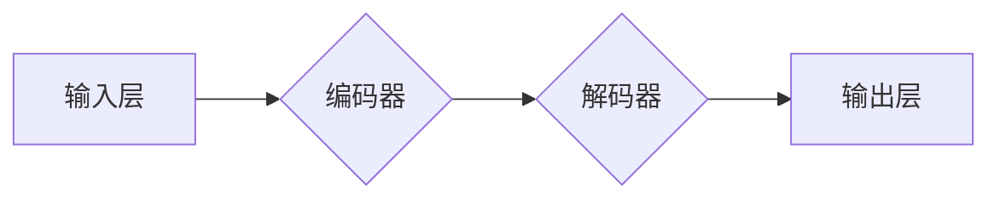

> 大规模语言模型，Transformer，深度学习，自然语言处理，文本生成，机器翻译，预训练模型，微调

## 1. 背景介绍

近年来，深度学习技术取得了飞速发展，特别是Transformer模型的出现，为自然语言处理（NLP）领域带来了革命性的变革。大规模语言模型（LLM）作为深度学习在NLP领域的顶尖成果，展现出强大的文本理解和生成能力，在机器翻译、文本摘要、对话系统、代码生成等领域取得了令人瞩目的成就。

然而，LLM的训练和应用也面临着诸多挑战，例如：

* **海量数据需求:** LLM的训练需要大量的文本数据，这对于数据获取和存储提出了巨大的挑战。
* **高计算成本:** LLM的训练需要消耗大量的计算资源，这使得其训练成本非常高昂。
* **模型复杂度:** LLM的模型结构非常复杂，其参数数量巨大，这使得模型的理解和调试难度很大。
* **伦理问题:** LLM的应用可能引发一些伦理问题，例如信息操纵、隐私泄露等。

为了更好地理解和应用LLM，本书将从理论到实践，系统地介绍LLM的各个方面，包括核心概念、算法原理、数学模型、项目实践、实际应用场景等。

## 2. 核心概念与联系

**2.1  自然语言处理（NLP）**

NLP是人工智能的一个分支，旨在使计算机能够理解、处理和生成人类语言。NLP的任务包括：

* **文本分类:** 将文本归类到预定义的类别中。
* **文本摘要:** 从长文本中提取关键信息生成摘要。
* **机器翻译:** 将文本从一种语言翻译成另一种语言。
* **对话系统:** 与人类进行自然语言对话。

**2.2  深度学习**

深度学习是一种机器学习的子领域，它利用多层神经网络来学习数据中的复杂模式。深度学习模型能够自动从数据中提取特征，无需人工特征工程。

**2.3  Transformer模型**

Transformer模型是一种基于深度学习的序列到序列模型，它利用注意力机制来捕捉文本中的长距离依赖关系。Transformer模型在机器翻译、文本摘要、对话系统等任务中取得了state-of-the-art的性能。

**2.4  大规模语言模型（LLM）**

LLM是指参数数量庞大的Transformer模型，它通过预训练的方式学习了大量的文本数据，并能够在各种NLP任务中进行微调。

**2.5  预训练与微调**

预训练是指在大量文本数据上训练一个通用语言模型，使其能够理解和生成自然语言。微调是指将预训练模型应用于特定任务，通过在少量任务数据上进行训练来提高模型在该任务上的性能。

**2.6  LLM的架构**



**2.7  LLM的应用场景**

LLM在以下领域具有广泛的应用场景：

* **机器翻译:** 将文本从一种语言翻译成另一种语言。
* **文本摘要:** 从长文本中提取关键信息生成摘要。
* **对话系统:** 与人类进行自然语言对话。
* **代码生成:** 根据自然语言描述生成代码。
* **文本创作:** 生成诗歌、小说、剧本等文本。

## 3. 核心算法原理 & 具体操作步骤

### 3.1  算法原理概述

LLM的核心算法是Transformer模型，它利用注意力机制来捕捉文本中的长距离依赖关系。Transformer模型由编码器和解码器两部分组成。

* **编码器:** 将输入文本序列编码成一个固定长度的向量表示。
* **解码器:** 根据编码器的输出生成目标文本序列。

Transformer模型的注意力机制能够学习到文本中不同词语之间的关系，从而更好地理解文本的语义。

### 3.2  算法步骤详解

1. **输入处理:** 将输入文本序列转换为数字表示。
2. **编码器:** 将输入文本序列编码成一个固定长度的向量表示。
3. **解码器:** 根据编码器的输出生成目标文本序列。
4. **输出处理:** 将解码器的输出转换为文本形式。

### 3.3  算法优缺点

**优点:**

* 能够捕捉文本中的长距离依赖关系。
* 训练效率高。
* 在各种NLP任务中取得了state-of-the-art的性能。

**缺点:**

* 模型参数数量庞大，训练成本高昂。
* 对训练数据质量要求高。

### 3.4  算法应用领域

Transformer模型和LLM在以下领域具有广泛的应用场景：

* **机器翻译:** 将文本从一种语言翻译成另一种语言。
* **文本摘要:** 从长文本中提取关键信息生成摘要。
* **对话系统:** 与人类进行自然语言对话。
* **代码生成:** 根据自然语言描述生成代码。
* **文本创作:** 生成诗歌、小说、剧本等文本。

## 4. 数学模型和公式 & 详细讲解 & 举例说明

### 4.1  数学模型构建

LLM的数学模型主要基于Transformer模型，其核心是注意力机制。注意力机制允许模型关注输入序列中与当前输出相关的部分，从而更好地理解文本的语义。

### 4.2  公式推导过程

**注意力机制公式:**

$$
Attention(Q, K, V) = softmax(\frac{QK^T}{\sqrt{d_k}})V
$$

其中：

* $Q$：查询矩阵
* $K$：键矩阵
* $V$：值矩阵
* $d_k$：键向量的维度
* $softmax$：softmax函数

**解释:**

1. 计算查询矩阵 $Q$ 与键矩阵 $K$ 的点积，并除以键向量的维度 $\sqrt{d_k}$。
2. 应用softmax函数将点积结果转换为概率分布。
3. 将概率分布与值矩阵 $V$ 相乘，得到注意力输出。

### 4.3  案例分析与讲解

假设我们有一个句子 "The cat sat on the mat"，我们想要计算 "sat" 这个词与其他词之间的注意力权重。

1. 将句子中的每个词转换为向量表示。
2. 计算查询向量 $Q$ 与所有键向量 $K$ 的点积。
3. 应用softmax函数将点积结果转换为概率分布。
4. 将概率分布与值向量 $V$ 相乘，得到每个词与 "sat" 的注意力权重。

通过分析注意力权重，我们可以了解 "sat" 这个词与其他词之间的关系，例如 "cat" 和 "mat" 与 "sat" 的注意力权重较高，表明它们与 "sat" 的关系更密切。

## 5. 项目实践：代码实例和详细解释说明

### 5.1  开发环境搭建

* Python 3.7+
* PyTorch 1.7+
* CUDA 10.2+

### 5.2  源代码详细实现

```python
import torch
import torch.nn as nn

class Transformer(nn.Module):
    def __init__(self, vocab_size, embedding_dim, num_heads, num_layers):
        super(Transformer, self).__init__()
        self.embedding = nn.Embedding(vocab_size, embedding_dim)
        self.encoder_layers = nn.ModuleList([EncoderLayer(embedding_dim, num_heads) for _ in range(num_layers)])
        self.decoder_layers = nn.ModuleList([DecoderLayer(embedding_dim, num_heads) for _ in range(num_layers)])

    def forward(self, src, tgt):
        src = self.embedding(src)
        tgt = self.embedding(tgt)
        # ... (编码器和解码器逻辑)

class EncoderLayer(nn.Module):
    # ... (编码器层逻辑)

class DecoderLayer(nn.Module):
    # ... (解码器层逻辑)
```

### 5.3  代码解读与分析

* **Transformer类:** 定义了Transformer模型的整体结构，包括嵌入层、编码器层和解码器层。
* **EncoderLayer类:** 定义了编码器层的结构，包含多头注意力机制和前馈神经网络。
* **DecoderLayer类:** 定义了解码器层的结构，包含多头注意力机制、编码器-解码器注意力机制和前馈神经网络。

### 5.4  运行结果展示

训练完成后，可以使用预训练的LLM模型进行文本生成、机器翻译等任务。

## 6. 实际应用场景

### 6.1  机器翻译

LLM可以用于将文本从一种语言翻译成另一种语言。例如，Google Translate使用LLM来实现机器翻译功能。

### 6.2  文本摘要

LLM可以用于从长文本中提取关键信息生成摘要。例如，新闻网站可以使用LLM来生成新闻文章的摘要。

### 6.3  对话系统

LLM可以用于构建对话系统，与人类进行自然语言对话。例如，ChatGPT是一个基于LLM的对话系统。

### 6.4  未来应用展望

LLM在未来将有更广泛的应用场景，例如：

* **个性化教育:** 根据学生的学习情况提供个性化的学习内容和辅导。
* **医疗诊断:** 辅助医生进行疾病诊断和治疗方案制定。
* **法律服务:** 帮助律师进行法律研究和案件分析。

## 7. 工具和资源推荐

### 7.1  学习资源推荐

* **书籍:**
    * 《深度学习》
    * 《自然语言处理》
* **在线课程:**
    * Coursera: 自然语言处理
    * Udacity: 深度学习

### 7.2  开发工具推荐

* **PyTorch:** 深度学习框架
* **TensorFlow:** 深度学习框架
* **Hugging Face Transformers:** 预训练Transformer模型库

### 7.3  相关论文推荐

* **Attention Is All You Need:** https://arxiv.org/abs/1706.03762
* **BERT: Pre-training of Deep Bidirectional Transformers for Language Understanding:** https://arxiv.org/abs/1810.04805

## 8. 总结：未来发展趋势与挑战

### 8.1  研究成果总结

LLM取得了显著的成果，在各种NLP任务中取得了state-of-the-art的性能。

### 8.2  未来发展趋势

* **模型规模更大:** 随着计算资源的不断发展，LLM的规模将继续扩大，模型能力将进一步提升。
* **训练效率更高:** 研究人员将探索新的训练方法，提高LLM的训练效率。
* **应用场景更广泛:** LLM将应用于更多领域，例如医疗、教育、法律等。

### 8.3  面临的挑战

* **数据安全和隐私:** LLM的训练需要大量数据，如何保证数据安全和隐私是一个重要挑战。
* **模型可解释性:** LLM的决策过程难以理解，如何提高模型的可解释性是一个重要的研究方向。
* **伦理问题:** LLM的应用可能引发一些伦理问题，例如信息操纵、歧视等，需要认真思考和解决。

### 8.4  研究展望

未来，LLM的研究将继续深入，探索更强大的模型、更有效的训练方法和更广泛的应用场景。


## 9. 附录：常见问题与解答

**Q1: 如何选择合适的LLM模型？**

**A1:** 选择合适的LLM模型需要根据具体的应用场景和需求进行选择。例如，对于机器翻译任务，可以选择专门针对机器翻译训练的LLM模型；对于文本生成任务，可以选择能够生成高质量文本的LLM模型。

**Q2: 如何训练自己的LLM模型？**

**A2:** 训练自己的LLM模型需要大量的计算资源和数据。可以使用开源的LLM框架，例如PyTorch和TensorFlow，以及预训练的模型作为起点进行微调。

**Q3: 如何评估LLM模型的性能？**

**A3:** LLM模型的性能可以根据具体的应用场景进行评估。例如，机器翻译任务可以使用BLEU分数进行评估；文本生成任务