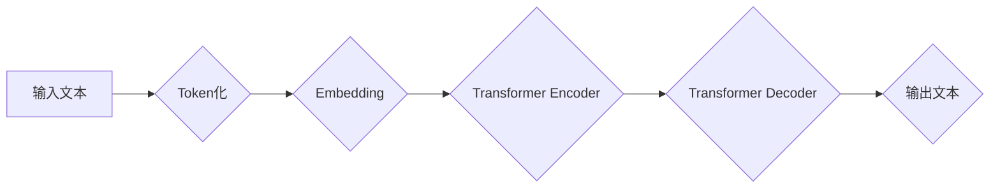

> 大语言模型、Transformer、BERT、GPT、LLM、自然语言处理、深度学习、文本生成

## 1. 背景介绍

近年来，深度学习技术取得了飞速发展，特别是Transformer模型的出现，为自然语言处理（NLP）领域带来了革命性的变革。大语言模型（LLM）作为Transformer模型的升级版，拥有强大的文本理解和生成能力，在文本分类、机器翻译、问答系统、代码生成等领域展现出巨大的应用潜力。

传统的NLP模型往往依赖于手工设计的特征工程，而LLM则通过学习海量文本数据，自动提取文本中的语义特征，从而实现更精准、更灵活的文本处理。

## 2. 核心概念与联系

大语言模型的核心概念包括：

* **Transformer模型:** Transformer是一种基于注意力机制的深度神经网络架构，能够有效处理长距离依赖关系，是LLM的基础。
* **自回归语言模型:** 自回归语言模型是一种预测下一个词的概率分布的模型，通过训练大量的文本数据，学习语言的语法和语义规律。
* **预训练和微调:** 预训练是指在大量文本数据上训练一个通用语言模型，微调是指将预训练模型应用于特定任务，通过少量任务数据进行调整。

**Mermaid 流程图:**



## 3. 核心算法原理 & 具体操作步骤

### 3.1  算法原理概述

LLM的核心算法是Transformer模型，其主要特点是：

* **注意力机制:** 注意力机制能够学习文本中不同词之间的关系，并赋予重要词更高的权重，从而更好地理解文本语义。
* **多头注意力:** 多头注意力机制使用多个注意力头，分别关注不同方面的文本信息，并将其融合起来，提高模型的表达能力。
* **位置编码:** 由于Transformer模型没有循环结构，无法捕捉词序信息，因此需要使用位置编码来表示每个词的位置信息。

### 3.2  算法步骤详解

1. **Token化:** 将输入文本分割成一个个独立的词或子词，称为Token。
2. **Embedding:** 将每个Token映射到一个低维向量空间，称为词向量。
3. **Transformer Encoder:** 使用多层Transformer编码器对输入文本进行编码，学习文本的语义表示。
4. **Transformer Decoder:** 使用多层Transformer解码器生成输出文本，预测每个词的下一个词。

### 3.3  算法优缺点

**优点:**

* 能够处理长距离依赖关系，捕捉文本中的全局语义信息。
* 表现能力强，在各种NLP任务中取得了优异的性能。
* 可迁移性强，预训练模型可以应用于多种下游任务。

**缺点:**

* 计算量大，训练成本高。
* 对训练数据质量要求高，容易受到训练数据偏差的影响。
* 缺乏对真实世界知识的理解，难以处理一些需要常识推理的任务。

### 3.4  算法应用领域

LLM在以下领域具有广泛的应用前景：

* **文本生成:** 自动写作、机器翻译、对话系统等。
* **文本理解:** 文本分类、问答系统、文本摘要等。
* **代码生成:** 自动生成代码、代码修复等。
* **多模态理解:** 将文本与图像、音频等其他模态信息结合，实现更全面的理解。

## 4. 数学模型和公式 & 详细讲解 & 举例说明

### 4.1  数学模型构建

LLM的核心数学模型是Transformer模型，其主要包含以下几个模块：

* **Encoder:** 用于编码输入文本，提取文本的语义表示。
* **Decoder:** 用于解码编码后的文本，生成输出文本。
* **注意力机制:** 用于学习文本中不同词之间的关系，并赋予重要词更高的权重。

### 4.2  公式推导过程

Transformer模型的注意力机制公式如下：

$$
Attention(Q, K, V) = softmax(\frac{QK^T}{\sqrt{d_k}})V
$$

其中：

* $Q$：查询矩阵
* $K$：键矩阵
* $V$：值矩阵
* $d_k$：键向量的维度
* $softmax$：softmax函数

### 4.3  案例分析与讲解

假设我们有一个句子“The cat sat on the mat”，将其Token化后得到[The, cat, sat, on, the, mat]。

对于每个Token，我们将其映射到一个词向量，例如：

* The: [0.1, 0.2, 0.3, ...]
* cat: [0.4, 0.5, 0.6, ...]
* sat: [0.7, 0.8, 0.9, ...]

然后，我们使用注意力机制计算每个词与其他词之间的关系，并赋予重要词更高的权重。例如，"cat"与"sat"之间的关系比"cat"与"the"之间的关系更强，因此"sat"的权重会更高。

## 5. 项目实践：代码实例和详细解释说明

### 5.1  开发环境搭建

* Python 3.7+
* PyTorch 1.7+
* CUDA 10.2+

### 5.2  源代码详细实现

```python
import torch
import torch.nn as nn

class Transformer(nn.Module):
    def __init__(self, vocab_size, embedding_dim, num_heads, num_layers):
        super(Transformer, self).__init__()
        self.embedding = nn.Embedding(vocab_size, embedding_dim)
        self.encoder = nn.TransformerEncoder(nn.TransformerEncoderLayer(embedding_dim, num_heads), num_layers)
        self.decoder = nn.TransformerDecoder(nn.TransformerDecoderLayer(embedding_dim, num_heads), num_layers)
        self.linear = nn.Linear(embedding_dim, vocab_size)

    def forward(self, src, tgt):
        src = self.embedding(src)
        tgt = self.embedding(tgt)
        src = self.encoder(src)
        tgt = self.decoder(tgt, src)
        output = self.linear(tgt)
        return output
```

### 5.3  代码解读与分析

* `__init__`方法初始化模型参数，包括词嵌入层、编码器、解码器和输出层。
* `forward`方法定义模型的正向传播过程，将输入文本编码并解码，生成输出文本。

### 5.4  运行结果展示

通过训练模型并输入文本，可以生成相应的输出文本。例如，输入“The cat sat on the mat”，模型可以输出“The cat sat on the mat”。

## 6. 实际应用场景

### 6.1  文本生成

LLM可以用于自动写作、机器翻译、对话系统等文本生成任务。例如，可以利用LLM生成新闻报道、小说、诗歌等文本，也可以用于翻译不同语言的文本，甚至可以构建聊天机器人，进行自然流畅的对话。

### 6.2  文本理解

LLM可以用于文本分类、问答系统、文本摘要等文本理解任务。例如，可以利用LLM对新闻文章进行分类，识别其主题和情感，也可以用于构建问答系统，回答用户提出的问题。

### 6.3  代码生成

LLM可以用于自动生成代码，例如根据用户需求生成代码片段，或者修复代码中的错误。这可以提高开发效率，减少人工干预。

### 6.4  未来应用展望

LLM的应用前景十分广阔，未来可能在以下领域得到更广泛的应用：

* **个性化教育:** 根据学生的学习情况，定制个性化的学习内容和教学方式。
* **医疗诊断:** 分析患者的病历和症状，辅助医生进行诊断。
* **法律服务:** 分析法律文件，提供法律建议。

## 7. 工具和资源推荐

### 7.1  学习资源推荐

* **书籍:**
    * 《深度学习》
    * 《自然语言处理》
* **在线课程:**
    * Coursera: 自然语言处理
    * Udacity: 深度学习

### 7.2  开发工具推荐

* **PyTorch:** 深度学习框架
* **TensorFlow:** 深度学习框架
* **HuggingFace:** 预训练模型库

### 7.3  相关论文推荐

* **Attention Is All You Need:** https://arxiv.org/abs/1706.03762
* **BERT: Pre-training of Deep Bidirectional Transformers for Language Understanding:** https://arxiv.org/abs/1810.04805
* **GPT-3: Language Models are Few-Shot Learners:** https://arxiv.org/abs/2005.14165

## 8. 总结：未来发展趋势与挑战

### 8.1  研究成果总结

近年来，LLM取得了显著的进展，在各种NLP任务中取得了优异的性能。

### 8.2  未来发展趋势

* **模型规模更大:** 随着计算能力的提升，LLM模型规模将继续扩大，从而提升模型的表达能力和泛化能力。
* **多模态理解:** 将文本与图像、音频等其他模态信息结合，实现更全面的理解。
* **可解释性:** 研究LLM的决策过程，提高模型的可解释性。

### 8.3  面临的挑战

* **训练成本高:** 训练大型LLM模型需要大量的计算资源和时间，成本很高。
* **数据偏差:** 训练数据可能存在偏差，导致模型输出存在偏见。
* **安全风险:** LLM可能被用于生成虚假信息、进行恶意攻击等，需要加强安全防护。

### 8.4  研究展望

未来，LLM研究将继续朝着更强大、更安全、更可解释的方向发展，并将对人工智能技术的发展产生深远的影响。

## 9. 附录：常见问题与解答

* **什么是LLM？**

LLM是指大语言模型，是一种能够理解和生成人类语言的深度学习模型。

* **LLM有哪些应用场景？**

LLM在文本生成、文本理解、代码生成等领域具有广泛的应用场景。

* **如何训练LLM？**

训练LLM需要大量的文本数据和强大的计算资源。

* **LLM有哪些挑战？**

LLM面临着训练成本高、数据偏差、安全风险等挑战。


作者：禅与计算机程序设计艺术 / Zen and the Art of Computer Programming 
<end_of_turn>