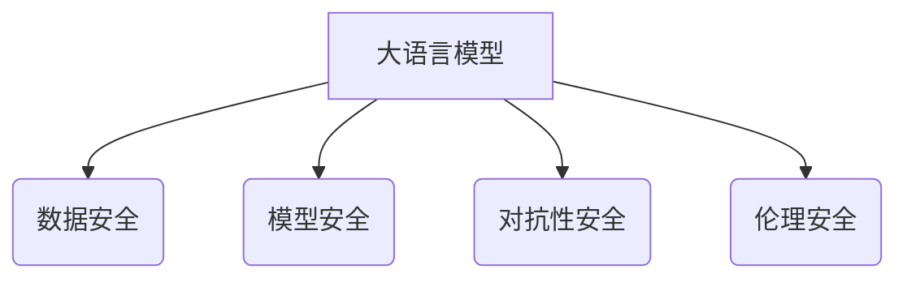

> 大语言模型，安全技术，攻击面，防御策略，对抗训练，数据安全，模型安全，伦理问题

## 1. 背景介绍

大语言模型（LLM）近年来取得了令人瞩目的进展，展现出强大的文本生成、理解和翻译能力。从ChatGPT到LaMDA，这些模型在各个领域引发了广泛的关注和应用。然而，随着LLM的快速发展，其安全问题也日益凸显。

LLM的安全问题主要体现在以下几个方面：

* **攻击面广阔:** LLM的开放性使其容易受到各种攻击，例如注入攻击、数据泄露、模型中毒等。
* **对抗样本:** 恶意攻击者可以构造对抗样本，欺骗LLM产生错误或有害的输出。
* **数据安全:** LLM的训练数据可能包含敏感信息，如果数据泄露，将造成严重后果。
* **模型安全:** LLM模型本身可能存在漏洞，被攻击者利用进行恶意操作。
* **伦理问题:** LLM的应用可能引发伦理问题，例如生成虚假信息、歧视性输出等。

## 2. 核心概念与联系

**2.1  大语言模型 (LLM)**

大语言模型是一种基于深度学习的强大人工智能模型，能够理解和生成人类语言。它们通常由 Transformer 架构构成，并通过海量文本数据进行训练。

**2.2  安全技术**

安全技术是指用于保护信息系统和数据免受攻击和损害的技术。在LLM领域，安全技术主要包括以下几个方面：

* **数据安全:** 保护LLM的训练数据和运行数据免受泄露和篡改。
* **模型安全:** 保护LLM模型本身免受攻击和操纵。
* **对抗性安全:** 使LLM能够抵抗对抗样本的攻击。
* **伦理安全:** 确保LLM的应用符合伦理规范。

**2.3  安全技术与LLM的关系**

LLM的安全技术旨在保护LLM及其应用免受各种安全威胁。数据安全技术确保LLM的训练数据和运行数据安全可靠。模型安全技术防止攻击者操纵或破坏LLM模型。对抗性安全技术使LLM能够识别和抵抗对抗样本的攻击。伦理安全技术确保LLM的应用符合伦理规范。



## 3. 核心算法原理 & 具体操作步骤

### 3.1  算法原理概述

LLM的安全技术涉及多种算法和技术，例如：

* **加密技术:** 用于保护LLM的训练数据和运行数据。
* **模型健壮性技术:** 使LLM能够抵抗对抗样本的攻击。
* **对抗训练:** 通过训练模型对抗对抗样本，提高模型的鲁棒性。
* **联邦学习:** 将模型训练分散在多个设备上，保护数据隐私。

### 3.2  算法步骤详解

**3.2.1  数据加密**

1. 选择合适的加密算法，例如AES或RSA。
2. 对训练数据和运行数据进行加密。
3. 在解密数据时，使用相应的密钥进行解密。

**3.2.2  对抗训练**

1. 生成对抗样本，例如通过梯度攻击。
2. 将对抗样本添加到训练数据中。
3. 训练模型，使其能够识别和抵抗对抗样本。

**3.2.3  联邦学习**

1. 将模型参数分散在多个设备上。
2. 在每个设备上训练模型，并更新模型参数。
3. 将更新后的模型参数聚合到中央服务器。
4. 将聚合后的模型参数广播到所有设备。

### 3.3  算法优缺点

**3.3.1  数据加密**

* **优点:** 可以有效保护数据隐私。
* **缺点:** 加密和解密过程会增加计算开销。

**3.3.2  对抗训练**

* **优点:** 可以提高模型的鲁棒性。
* **缺点:** 需要大量的对抗样本进行训练，训练过程复杂。

**3.3.3  联邦学习**

* **优点:** 可以保护数据隐私，避免数据集中化。
* **缺点:** 训练过程需要更多的通信和协调。

### 3.4  算法应用领域

* **数据安全:** 保护敏感数据，例如医疗记录、金融信息等。
* **模型安全:** 防止模型被攻击者操纵或破坏。
* **对抗性安全:** 使模型能够抵抗对抗样本的攻击。
* **隐私保护:** 保护用户隐私，例如在联邦学习中。

## 4. 数学模型和公式 & 详细讲解 & 举例说明

### 4.1  数学模型构建

LLM的训练通常基于最大似然估计（MLE）的原理。目标是找到一个模型参数，使得模型能够最大化预测目标文本的概率。

假设训练数据为{(x1, y1), (x2, y2), ..., (xn, yn)}，其中xi是输入文本，yi是对应的目标文本。模型参数为θ。则MLE的目标函数为：

$$
L(\theta) = \prod_{i=1}^{n} P(y_i | x_i, \theta)
$$

其中P(yi|xi, θ)是模型预测目标文本yi的概率。

### 4.2  公式推导过程

为了方便优化，通常使用对数似然函数：

$$
l(\theta) = \log L(\theta) = \sum_{i=1}^{n} \log P(y_i | x_i, \theta)
$$

通过梯度下降算法，不断更新模型参数θ，使得对数似然函数最大化。

### 4.3  案例分析与讲解

例如，在训练一个文本生成模型时，输入文本为“今天天气”，目标文本为“晴朗”。模型需要学习到“今天天气”这个输入文本对应“晴朗”这个输出文本的概率关系。通过训练数据和MLE目标函数，模型可以学习到这种关系，并生成类似的文本。

## 5. 项目实践：代码实例和详细解释说明

### 5.1  开发环境搭建

* Python 3.7+
* TensorFlow/PyTorch
* CUDA (可选)

### 5.2  源代码详细实现

```python
import tensorflow as tf

# 定义模型结构
model = tf.keras.Sequential([
    tf.keras.layers.Embedding(input_dim=vocab_size, output_dim=embedding_dim),
    tf.keras.layers.LSTM(units=hidden_size),
    tf.keras.layers.Dense(units=vocab_size, activation='softmax')
])

# 编译模型
model.compile(optimizer='adam', loss='sparse_categorical_crossentropy', metrics=['accuracy'])

# 训练模型
model.fit(x_train, y_train, epochs=10)

# 评估模型
loss, accuracy = model.evaluate(x_test, y_test)
print('Loss:', loss)
print('Accuracy:', accuracy)
```

### 5.3  代码解读与分析

* **模型结构:** 该代码定义了一个简单的文本生成模型，包含嵌入层、LSTM层和全连接层。
* **嵌入层:** 将单词映射到低维向量空间。
* **LSTM层:** 用于处理序列数据，捕捉文本中的上下文信息。
* **全连接层:** 将LSTM层的输出映射到目标词汇表。
* **编译模型:** 使用Adam优化器、交叉熵损失函数和准确率作为评估指标。
* **训练模型:** 使用训练数据训练模型，设置训练轮数为10。
* **评估模型:** 使用测试数据评估模型的性能。

### 5.4  运行结果展示

训练完成后，可以将模型应用于文本生成任务。例如，输入“今天天气”，模型可以生成“晴朗”或类似的文本。

## 6. 实际应用场景

### 6.1  聊天机器人

LLM可以用于构建更智能、更自然的聊天机器人，能够理解用户意图并提供更准确的回复。

### 6.2  文本摘要

LLM可以自动生成文本摘要，提取文本的关键信息，节省用户阅读时间。

### 6.3  机器翻译

LLM可以用于机器翻译，将文本从一种语言翻译成另一种语言。

### 6.4  未来应用展望

LLM的应用前景广阔，未来可能在以下领域得到更广泛的应用：

* **教育:** 个性化学习、智能辅导
* **医疗:** 疾病诊断、药物研发
* **法律:** 法律文本分析、合同审查
* **金融:** 风险评估、欺诈检测

## 7. 工具和资源推荐

### 7.1  学习资源推荐

* **书籍:**
    * 《深度学习》
    * 《自然语言处理》
* **在线课程:**
    * Coursera: 自然语言处理
    * edX: 深度学习
* **博客:**
    * The Gradient
    * Towards Data Science

### 7.2  开发工具推荐

* **TensorFlow:** 开源深度学习框架
* **PyTorch:** 开源深度学习框架
* **Hugging Face:** 提供预训练LLM模型和工具

### 7.3  相关论文推荐

* **BERT: Pre-training of Deep Bidirectional Transformers for Language Understanding**
* **GPT-3: Language Models are Few-Shot Learners**
* **T5: Text-to-Text Transfer Transformer**

## 8. 总结：未来发展趋势与挑战

### 8.1  研究成果总结

近年来，LLM取得了显著进展，在文本生成、理解和翻译等方面展现出强大的能力。

### 8.2  未来发展趋势

* **模型规模:** LLMs将继续朝着更大的规模发展，以提高性能和能力。
* **多模态学习:** LLMs将融合多模态数据，例如文本、图像和音频，以更好地理解和生成信息。
* **可解释性:** 研究将更加注重LLMs的解释性，使模型的决策过程更加透明。

### 8.3  面临的挑战

* **数据安全:** LLMs的训练数据可能包含敏感信息，需要采取措施保护数据隐私。
* **模型安全:** LLMs可能受到攻击，例如注入攻击和模型中毒攻击。
* **伦理问题:** LLMs的应用可能引发伦理问题，例如生成虚假信息和歧视性输出。

### 8.4  研究展望

未来研究将集中在解决LLM的安全性和伦理问题，使其能够安全、可靠地应用于各种领域。

## 9. 附录：常见问题与解答

**9.1  LLM如何生成文本？**

LLM使用概率模型预测下一个单词，根据上下文信息生成文本。

**9.2  LLM有哪些安全风险？**

LLM可能受到攻击，例如注入攻击、数据泄露和模型中毒攻击。

**9.3  如何保护LLM的安全？**

可以使用加密技术、对抗训练和联邦学习等技术保护LLM的安全。

**9.4  LLM的伦理问题有哪些？**

LLM的应用可能引发伦理问题，例如生成虚假信息、歧视性输出和隐私泄露。

**9.5  LLM的未来发展趋势是什么？**

LLM将朝着更大的规模、多模态学习和可解释性发展。


作者：禅与计算机程序设计艺术 / Zen and the Art of Computer Programming 
<end_of_turn>