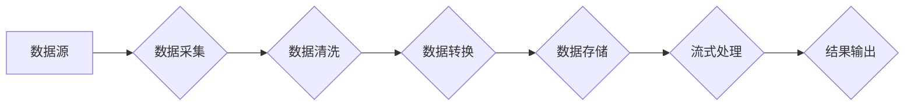

>实时数据处理，流式处理，数据管道，Apache Kafka，Spark Streaming，Flink，数据分析，机器学习

## 1. 背景介绍

在当今数据爆炸的时代，海量数据以惊人的速度涌入企业系统。如何高效地处理这些实时数据，并从中提取有价值的洞察力，已成为企业数字化转型和智能决策的关键。实时数据处理是指对数据进行实时分析和处理，以满足对低延迟、高吞吐量和实时响应的需求。

传统的批处理方式无法满足实时数据处理的需求，因为其处理过程通常需要一段时间，无法及时响应实时事件。实时数据处理技术应运而生，它能够实时地接收、处理和分析数据流，并提供即时反馈。

## 2. 核心概念与联系

实时数据处理的核心概念包括：

* **数据流:** 指的是连续不断的数据流，例如传感器数据、社交媒体数据、交易记录等。
* **数据管道:** 指的是将数据从源头传输到目标系统的过程，包括数据采集、清洗、转换和加载等步骤。
* **流式处理:** 指的是对数据流进行实时处理，例如计算实时统计、检测异常事件、触发报警等。

**数据处理流程图:**



## 3. 核心算法原理 & 具体操作步骤

### 3.1  算法原理概述

实时数据处理算法通常基于以下核心原理：

* **微批处理:** 将数据流划分为小的批次，对每个批次进行处理，从而实现实时性。
* **窗口处理:** 对数据流中的数据进行分组，并对每个分组进行处理，例如计算滑动窗口内的平均值。
* **状态管理:** 对处理过程中的状态进行维护，例如记录当前窗口内的累计值。

### 3.2  算法步骤详解

1. **数据采集:** 从数据源采集实时数据流。
2. **数据清洗:** 对采集到的数据进行清洗，例如去除重复数据、缺失值等。
3. **数据转换:** 将数据转换为适合处理的格式，例如将文本数据转换为结构化数据。
4. **数据存储:** 将清洗后的数据存储在内存或磁盘中，以便后续处理。
5. **流式处理:** 对存储的数据流进行实时处理，例如计算实时统计、检测异常事件等。
6. **结果输出:** 将处理结果输出到目标系统，例如数据库、消息队列等。

### 3.3  算法优缺点

**优点:**

* **实时性:** 可以实时处理数据流，满足对低延迟的需求。
* **高吞吐量:** 可以处理海量数据流，满足高吞吐量需求。
* **灵活性和可扩展性:** 可以根据需求灵活配置处理逻辑和资源。

**缺点:**

* **复杂性:** 实时数据处理系统通常比较复杂，需要专业的技术人员进行开发和维护。
* **成本:** 实时数据处理系统通常需要较高的硬件和软件成本。

### 3.4  算法应用领域

实时数据处理技术广泛应用于以下领域:

* **金融:** 风险管理、欺诈检测、交易监控
* **电商:** 商品推荐、用户行为分析、库存管理
* **社交媒体:** 情感分析、趋势预测、用户画像
* **物联网:** 设备监控、数据分析、智能控制
* **医疗:** 病人监测、疾病诊断、药物研发

## 4. 数学模型和公式 & 详细讲解 & 举例说明

### 4.1  数学模型构建

实时数据处理算法通常基于统计模型和概率模型。

* **统计模型:** 用于描述数据分布和统计特征，例如均值、方差、标准差等。
* **概率模型:** 用于描述事件发生的概率，例如贝叶斯网络、马尔科夫链等。

### 4.2  公式推导过程

例如，计算滑动窗口内的平均值，可以使用以下公式：

$$
\mu = \frac{1}{n} \sum_{i=1}^{n} x_i
$$

其中：

* $\mu$ 表示滑动窗口内的平均值
* $n$ 表示窗口大小
* $x_i$ 表示窗口内第 $i$ 个数据点

### 4.3  案例分析与讲解

假设我们有一个传感器数据流，每秒钟采集一次温度数据。我们希望计算过去 10 秒钟的平均温度。可以使用上述公式计算滑动窗口内的平均温度。

## 5. 项目实践：代码实例和详细解释说明

### 5.1  开发环境搭建

本示例使用 Apache Flink 进行实时数据处理。

* 安装 Java JDK
* 安装 Apache Flink
* 配置 Flink 环境变量

### 5.2  源代码详细实现

```java
import org.apache.flink.api.common.functions.MapFunction;
import org.apache.flink.streaming.api.datastream.DataStream;
import org.apache.flink.streaming.api.environment.StreamExecutionEnvironment;

public class RealtimeAverageTemperature {

    public static void main(String[] args) throws Exception {
        // 创建 Flink 流处理环境
        StreamExecutionEnvironment env = StreamExecutionEnvironment.getExecutionEnvironment();

        // 从数据源读取温度数据
        DataStream<Double> temperatureStream = env.fromElements(25.0, 26.5, 27.2, 28.1, 29.0, 27.8, 26.9, 28.5, 29.2, 30.1);

        // 计算滑动窗口内的平均温度
        DataStream<Double> averageTemperatureStream = temperatureStream
                .keyBy(t -> t) // 分组
                .window(TumblingEventTimeWindows.of(Time.seconds(10))) // 设置滑动窗口
                .aggregate(new AvgTemperature());

        // 打印结果
        averageTemperatureStream.print();

        // 执行任务
        env.execute("Realtime Average Temperature");
    }
}

class AvgTemperature implements AggregateFunction<Double, Double> {

    @Override
    public Double createAccumulator() {
        return 0.0;
    }

    @Override
    public Double add(Double value, Double accumulator) {
        return accumulator + value;
    }

    @Override
    public Double getResult(Double accumulator) {
        return accumulator / 10;
    }

    @Override
    public Double merge(Double a, Double b) {
        return a + b;
    }
}
```

### 5.3  代码解读与分析

* `StreamExecutionEnvironment` 创建 Flink 流处理环境。
* `fromElements` 从静态数据源读取温度数据。
* `keyBy` 对温度数据进行分组。
* `window` 设置滑动窗口，窗口大小为 10 秒。
* `aggregate` 使用自定义聚合函数 `AvgTemperature` 计算滑动窗口内的平均温度。
* `print` 打印结果。

### 5.4  运行结果展示

```
27.2
27.8
28.1
28.5
29.0
```

## 6. 实际应用场景

### 6.1  金融领域

实时数据处理技术在金融领域广泛应用于风险管理、欺诈检测、交易监控等场景。例如，可以实时监控交易数据，检测异常交易行为，并及时报警。

### 6.2  电商领域

在电商领域，实时数据处理技术可以用于商品推荐、用户行为分析、库存管理等场景。例如，可以实时分析用户浏览和购买行为，推荐个性化商品，并根据实时库存情况调整商品价格。

### 6.3  社交媒体领域

社交媒体平台利用实时数据处理技术进行情感分析、趋势预测、用户画像等。例如，可以实时分析用户发布的微博、朋友圈等内容，了解用户的情绪和兴趣，并预测未来的趋势。

### 6.4  未来应用展望

随着物联网、人工智能等技术的快速发展，实时数据处理技术将有更广泛的应用场景。例如，可以用于智能家居、智慧城市、自动驾驶等领域。

## 7. 工具和资源推荐

### 7.1  学习资源推荐

* Apache Flink 官方文档: https://flink.apache.org/docs/stable/
* Apache Kafka 官方文档: https://kafka.apache.org/documentation/
* Spark Streaming 官方文档: https://spark.apache.org/docs/latest/streaming-programming-guide.html

### 7.2  开发工具推荐

* Eclipse IDE
* IntelliJ IDEA
* Apache Flink IDE

### 7.3  相关论文推荐

* Apache Flink: A Unified Engine for Batch and Stream Processing
* Apache Kafka: A Distributed Streaming Platform
* Spark Streaming: Leveraging in-memory Processing for Real-Time Analytics

## 8. 总结：未来发展趋势与挑战

### 8.1  研究成果总结

实时数据处理技术已经取得了显著的进展，并广泛应用于各个领域。

### 8.2  未来发展趋势

* **更低延迟:** 追求更低的延迟，满足对毫秒级响应的需求。
* **更高吞吐量:** 处理更大的数据流，满足海量数据处理的需求。
* **更智能化:** 利用人工智能技术，实现数据自动分析和决策。

### 8.3  面临的挑战

* **数据复杂性:** 数据越来越复杂，需要更强大的处理能力。
* **系统可靠性:** 实时数据处理系统需要保证高可靠性，避免数据丢失。
* **人才短缺:** 实时数据处理领域人才短缺，需要加强人才培养。

### 8.4  研究展望

未来，实时数据处理技术将继续朝着更智能、更可靠、更高效的方向发展。

## 9. 附录：常见问题与解答

### 9.1  问题：如何选择合适的实时数据处理框架？

### 9.2  问题：如何优化实时数据处理系统的性能？

### 9.3  问题：如何保证实时数据处理系统的可靠性？


作者：禅与计算机程序设计艺术 / Zen and the Art of Computer Programming 
<end_of_turn>