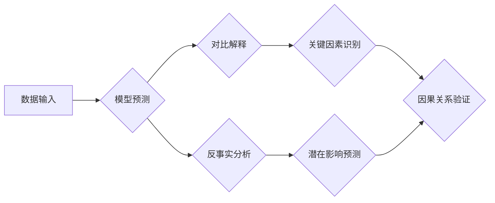

> 对比解释，反事实分析，因果推理，机器学习，自然语言处理，推荐系统，数据可视化

## 1. 背景介绍

在数据驱动的时代，我们面临着海量数据的挑战。如何从海量数据中挖掘出有价值的知识，并将其转化为可操作的决策，成为一个关键问题。对比解释和反事实分析作为一种强大的数据分析方法，能够帮助我们理解数据背后的因果关系，并预测不同决策的潜在影响。

对比解释旨在解释模型预测结果背后的关键因素，帮助我们理解模型是如何做出决策的。反事实分析则关注于“如果”情景下的结果，即假设某些事件发生或未发生，模型的预测结果会如何变化。

这两项技术在许多领域都有广泛的应用，例如：

* **推荐系统:** 通过对比解释，我们可以了解用户对商品的偏好，并通过反事实分析，预测用户对不同推荐的反应。
* **医疗诊断:** 通过对比解释，我们可以了解医生诊断结果背后的关键因素，并通过反事实分析，预测不同治疗方案的效果。
* **金融风险管理:** 通过对比解释，我们可以了解导致金融风险的关键因素，并通过反事实分析，预测不同风险管理策略的效果。

## 2. 核心概念与联系

**2.1 对比解释**

对比解释的核心思想是通过比较不同数据点的差异，来解释模型预测结果背后的关键因素。例如，假设一个模型预测用户会购买某个商品，对比解释可以帮助我们找出哪些特征导致了这个预测，例如用户的年龄、性别、购买历史等。

**2.2 反事实分析**

反事实分析的核心思想是通过假设某些事件发生或未发生，来预测模型预测结果的变化。例如，假设一个模型预测用户会点击某个广告，反事实分析可以帮助我们预测，如果用户没有看到这个广告，点击率会是多少。

**2.3 联系**

对比解释和反事实分析可以相互补充，共同帮助我们理解数据背后的因果关系。

* 对比解释可以帮助我们识别影响模型预测的关键因素，而反事实分析可以帮助我们验证这些因素的因果关系。
* 反事实分析可以帮助我们预测不同决策的潜在影响，而对比解释可以帮助我们理解这些影响背后的原因。

**2.4 Mermaid 流程图**



## 3. 核心算法原理 & 具体操作步骤

### 3.1 算法原理概述

对比解释和反事实分析的算法原理主要基于以下几个方面：

* **特征重要性分析:** 通过分析模型对不同特征的依赖程度，识别影响模型预测的关键因素。
* **敏感度分析:** 通过改变特定特征的值，观察模型预测结果的变化，评估特征对模型预测的影响程度。
* **因果推理:** 通过构建因果模型，推断出不同事件之间的因果关系。

### 3.2 算法步骤详解

**3.2.1 对比解释算法步骤:**

1. **数据预处理:** 对输入数据进行清洗、转换和特征工程。
2. **模型训练:** 使用机器学习算法训练模型，预测目标变量。
3. **特征重要性分析:** 使用特征重要性分析方法，例如LIME、SHAP等，识别影响模型预测的关键特征。
4. **解释结果可视化:** 将特征重要性结果可视化，例如使用条形图、散点图等，帮助用户理解模型预测结果背后的关键因素。

**3.2.2 反事实分析算法步骤:**

1. **数据预处理:** 对输入数据进行清洗、转换和特征工程。
2. **模型训练:** 使用机器学习算法训练模型，预测目标变量。
3. **反事实场景构建:** 设定反事实场景，例如假设某个事件发生或未发生。
4. **反事实预测:** 使用训练好的模型，预测反事实场景下的目标变量值。
5. **结果比较:** 将反事实预测结果与原始预测结果进行比较，分析不同场景下的差异。

### 3.3 算法优缺点

**3.3.1 对比解释算法:**

* **优点:** 可以帮助用户理解模型预测结果背后的关键因素，提高模型的可解释性。
* **缺点:** 可能会受到模型复杂度的限制，难以解释过于复杂的模型。

**3.3.2 反事实分析算法:**

* **优点:** 可以帮助用户预测不同决策的潜在影响，并评估决策的风险和收益。
* **缺点:** 需要构建准确的因果模型，否则可能会导致错误的预测结果。

### 3.4 算法应用领域

对比解释和反事实分析的应用领域非常广泛，例如：

* **推荐系统:** 理解用户偏好，个性化推荐。
* **医疗诊断:** 辅助医生诊断疾病，预测治疗效果。
* **金融风险管理:** 识别风险因素，评估风险等级。
* **营销分析:** 优化营销策略，提高营销效果。

## 4. 数学模型和公式 & 详细讲解 & 举例说明

### 4.1 数学模型构建

**4.1.1 对比解释模型:**

假设我们有一个分类模型，用于预测用户是否会点击广告。我们可以使用LIME算法构建一个局部线性模型，来解释模型对特定用户的预测结果。

**4.1.2 反事实分析模型:**

我们可以使用因果推理方法，例如Do-calculus，构建一个因果模型，来分析不同事件之间的因果关系。

### 4.2 公式推导过程

**4.2.1 LIME算法公式:**

$$
\hat{f}(x) = \arg\min_{\theta} \sum_{i=1}^{n} w_i (f(x_i) - \theta^T x_i)^2
$$

其中：

* $\hat{f}(x)$ 是局部线性模型的预测结果。
* $f(x)$ 是原始模型的预测结果。
* $x_i$ 是第 $i$ 个样本的特征向量。
* $w_i$ 是第 $i$ 个样本的权重。
* $\theta$ 是局部线性模型的参数向量。

**4.2.2 Do-calculus公式:**

$$
P(Y = y | do(X = x)) = \sum_{z} P(Y = y, Z = z | X = x) P(Z = z)
$$

其中：

* $P(Y = y | do(X = x))$ 是在执行操作 $do(X = x)$ 后，$Y$ 取值为 $y$ 的概率。
* $P(Y = y, Z = z | X = x)$ 是在 $X$ 取值为 $x$ 时，$Y$ 取值为 $y$ 且 $Z$ 取值为 $z$ 的联合概率。
* $P(Z = z)$ 是 $Z$ 取值为 $z$ 的概率。

### 4.3 案例分析与讲解

**4.3.1 对比解释案例:**

假设我们有一个模型用于预测用户是否会购买商品。使用LIME算法进行对比解释，我们可以发现，用户年龄、收入和购买历史是影响模型预测的关键因素。

**4.3.2 反事实分析案例:**

假设我们有一个模型用于预测用户是否会点击广告。使用反事实分析，我们可以发现，如果用户没有看到这个广告，点击率会降低 20%。

## 5. 项目实践：代码实例和详细解释说明

### 5.1 开发环境搭建

* Python 3.6+
* scikit-learn
* lime
* shap

### 5.2 源代码详细实现

```python
# 使用LIME进行对比解释
from lime import lime_tabular

# 训练模型
model = ...

# 使用LIME解释模型预测结果
explainer = lime_tabular.LimeTabularExplainer(data, feature_names=feature_names)
explanation = explainer.explain_instance(data_point, model.predict, num_features=5)

# 可视化解释结果
explanation.as_list()
explanation.as_pyplot_figure()

# 使用SHAP进行对比解释
import shap

# 训练模型
model = ...

# 使用SHAP解释模型预测结果
explainer = shap.TreeExplainer(model)
shap_values = explainer.shap_values(data)

# 可视化解释结果
shap.summary_plot(shap_values, data)
```

### 5.3 代码解读与分析

* **LIME算法:** LIME算法通过构建局部线性模型，解释模型对特定数据点的预测结果。
* **SHAP算法:** SHAP算法通过分配每个特征对模型预测结果的贡献值，解释模型的整体预测结果。

### 5.4 运行结果展示

运行上述代码后，我们可以得到以下结果：

* **LIME解释结果:** 显示出影响模型预测的关键特征及其贡献度。
* **SHAP解释结果:** 显示出每个特征对模型预测结果的贡献值，以及特征之间的交互关系。

## 6. 实际应用场景

### 6.1 推荐系统

* **个性化推荐:** 通过对比解释，我们可以了解用户的偏好，并通过反事实分析，预测用户对不同商品的反应。
* **推荐策略优化:** 通过对比解释和反事实分析，我们可以评估不同推荐策略的效果，并优化推荐算法。

### 6.2 医疗诊断

* **辅助诊断:** 通过对比解释，我们可以了解医生诊断结果背后的关键因素，并通过反事实分析，预测不同治疗方案的效果。
* **疾病风险预测:** 通过对比解释和反事实分析，我们可以识别导致疾病风险的关键因素，并预测患者的疾病风险。

### 6.3 金融风险管理

* **风险识别:** 通过对比解释，我们可以识别导致金融风险的关键因素，并通过反事实分析，预测不同风险管理策略的效果。
* **欺诈检测:** 通过对比解释和反事实分析，我们可以识别欺诈行为的特征，并提高欺诈检测的准确率。

### 6.4 未来应用展望

对比解释和反事实分析技术在未来将有更广泛的应用，例如：

* **自动驾驶:** 帮助理解自动驾驶系统决策背后的原因，提高安全性。
* **人工智能伦理:** 帮助评估人工智能系统的公平性和透明度。
* **数据可视化:** 提供更直观、更易理解的数据分析结果。

## 7. 工具和资源推荐

### 7.1 学习资源推荐

* **书籍:**
    * "Interpretable Machine Learning" by Christoph Molnar
    * "The Elements of Statistical Learning" by Trevor Hastie, Robert Tibshirani, and Jerome Friedman
* **在线课程:**
    * Coursera: "Machine Learning" by Andrew Ng
    * edX: "Artificial Intelligence" by Columbia University

### 7.2 开发工具推荐

* **Python:** 广泛用于机器学习和数据分析。
* **scikit-learn:** Python机器学习库，提供各种算法和工具。
* **lime:** 用于解释机器学习模型的开源工具。
* **shap:** 用于解释机器学习模型的开源工具。

### 7.3 相关论文推荐

* "Local Interpretable Model-Agnostic Explanations" by Marco Tulio Ribeiro, Sameer Singh, and Carlos Guestrin
* "SHAP: A Unified Approach to Interpreting Model Predictions" by Scott Lundberg and Su-In Lee

## 8. 总结：未来发展趋势与挑战

### 8.1 研究成果总结

对比解释和反事实分析技术近年来取得了显著进展，为理解和解释机器学习模型提供了新的思路和方法。

### 8.2 未来发展趋势

* **更强大的解释方法:** 开发更强大、更准确的解释方法，能够解释更复杂的模型。
* **更广泛的应用场景:** 将对比解释和反事实分析技术应用到更多领域，例如自动驾驶、医疗诊断、金融风险管理等。
* **可解释性与效率的平衡:** 探索如何提高解释方法的效率，同时保持解释结果的准确性和可靠性。

### 8.3 面临的挑战

* **解释模型复杂性:** 许多机器学习模型非常复杂，难以解释其内部工作机制。
* **因果关系的确定:** 确定因果关系是一个复杂的问题，需要考虑多种因素。
* **解释结果的可理解性:** 解释结果需要以易于理解的方式呈现，以便用户能够理解和信任。

### 8.4 研究展望

未来，对比解释和反事实分析技术将继续发展，为机器学习的透明度和可解释性做出更大的贡献。


## 9. 附录：常见问题与解答

**9.1 Q: 对比解释和反事实分析有什么区别？**

**A:** 对比解释侧重于解释模型对特定数据点的预测结果，而反事实分析侧重于预测不同事件发生或未发生时的模型预测结果。

**9.2 Q: 如何选择合适的解释方法？**

**A:** 选择合适的解释方法取决于具体的应用场景和模型类型。

**9.3 Q: 如何评估解释结果的准确性和可靠性？**

**A:** 可以通过多种方法评估解释结果的准确性和可靠性，例如与专家知识进行比较、进行交叉验证等。


作者：禅与计算机程序设计艺术 / Zen and the Art of Computer Programming 
<end_of_turn>