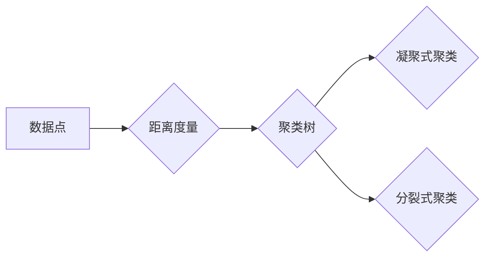

> 层次聚类, 聚类算法, 距离度量, 凝聚式聚类, 分裂式聚类,  dendrogram

## 1. 背景介绍

在数据挖掘和机器学习领域，聚类算法是无监督学习的重要组成部分，其目标是将数据点根据相似性划分为若干个互不相交的簇。层次聚类作为一种经典的聚类算法，通过构建层次结构来将数据点逐步聚合，最终形成一个包含所有数据点的树状结构，称为“dendrogram”。

层次聚类算法的优势在于其直观性强，易于理解和解释，并且能够处理不同形状和大小的簇。然而，它也存在一些缺点，例如计算复杂度较高，对噪声数据敏感，并且难以处理高维数据。

## 2. 核心概念与联系

层次聚类算法的核心概念包括：

* **距离度量:** 用于衡量数据点之间的相似程度，常见的距离度量包括欧氏距离、曼哈顿距离、余弦相似度等。
* **聚类树(dendrogram):** 层次聚类算法生成的树状结构，其中每个节点代表一个簇，叶子节点代表单个数据点。
* **凝聚式聚类:** 从每个数据点作为一个单独的簇开始，逐步合并相似的簇，最终形成一个包含所有数据点的簇。
* **分裂式聚类:** 从所有数据点作为一个整体簇开始，逐步将簇分割成更小的簇，最终形成多个独立的簇。

**Mermaid 流程图:**



## 3. 核心算法原理 & 具体操作步骤

### 3.1  算法原理概述

层次聚类算法的基本原理是通过不断合并或分割簇来构建聚类树。

* **凝聚式聚类:** 从每个数据点作为一个单独的簇开始，计算相邻簇之间的距离，合并距离最近的两个簇，重复该过程直到所有数据点合并到一个簇中。
* **分裂式聚类:** 从所有数据点作为一个整体簇开始，计算簇内数据点之间的距离，将距离最大的数据点分割到一个新的簇中，重复该过程直到每个簇包含单个数据点。

### 3.2  算法步骤详解

**凝聚式聚类步骤:**

1. 将每个数据点作为一个单独的簇。
2. 计算所有簇之间的距离。
3. 将距离最近的两个簇合并成一个新的簇。
4. 重复步骤2和3，直到所有数据点合并到一个簇中。

**分裂式聚类步骤:**

1. 将所有数据点作为一个整体簇。
2. 计算簇内数据点之间的距离。
3. 将距离最大的数据点分割到一个新的簇中。
4. 重复步骤2和3，直到每个簇包含单个数据点。

### 3.3  算法优缺点

**优点:**

* 直观性强，易于理解和解释。
* 能够处理不同形状和大小的簇。
* 不需要预先指定簇的数量。

**缺点:**

* 计算复杂度较高，尤其是在处理大规模数据集时。
* 对噪声数据敏感。
* 难以处理高维数据。

### 3.4  算法应用领域

层次聚类算法广泛应用于以下领域:

* **图像识别:** 将图像分割成不同的区域。
* **文本挖掘:** 将文本文档聚类到不同的主题。
* **生物信息学:** 将基因表达数据聚类到不同的生物学功能。
* **市场营销:** 将客户群体聚类到不同的消费行为类型。

## 4. 数学模型和公式 & 详细讲解 & 举例说明

### 4.1  数学模型构建

层次聚类算法的核心是距离度量和聚类树的构建。

* **距离度量:** 常见的距离度量包括欧氏距离、曼哈顿距离、余弦相似度等。

**欧氏距离:**

$$
d(x, y) = \sqrt{\sum_{i=1}^{n}(x_i - y_i)^2}
$$

其中，$x$ 和 $y$ 是两个数据点，$x_i$ 和 $y_i$ 是数据点在第 $i$ 维上的坐标。

* **聚类树:** 聚类树是一个树状结构，其中每个节点代表一个簇，叶子节点代表单个数据点。

### 4.2  公式推导过程

层次聚类算法的具体步骤涉及到距离计算、簇合并和聚类树构建等操作，这些操作可以通过数学公式进行描述。

例如，凝聚式聚类算法中，计算两个簇之间的距离可以使用以下公式:

$$
d(C_1, C_2) = \min_{x \in C_1, y \in C_2} d(x, y)
$$

其中，$C_1$ 和 $C_2$ 是两个簇，$d(x, y)$ 是数据点 $x$ 和 $y$ 之间的距离。

### 4.3  案例分析与讲解

假设我们有以下数据点:

```
data = [[1, 2], [1.5, 1.8], [5, 8], [8, 8], [1, 0.6], [9, 11]]
```

使用欧氏距离作为距离度量，我们可以使用凝聚式聚类算法将这些数据点聚类。

首先，将每个数据点作为一个单独的簇。然后，计算所有簇之间的距离，并合并距离最近的两个簇。重复该过程，直到所有数据点合并到一个簇中。

最终生成的聚类树可以用来可视化数据点的聚类结果。

## 5. 项目实践：代码实例和详细解释说明

### 5.1  开发环境搭建

本项目使用 Python 语言进行开发，需要安装以下库:

* scikit-learn: 用于实现层次聚类算法。
* matplotlib: 用于可视化聚类结果。

可以使用以下命令安装这些库:

```
pip install scikit-learn matplotlib
```

### 5.2  源代码详细实现

```python
import numpy as np
from sklearn.cluster import AgglomerativeClustering
import matplotlib.pyplot as plt

# 数据集
data = np.array([[1, 2], [1.5, 1.8], [5, 8], [8, 8], [1, 0.6], [9, 11]])

# 使用凝聚式聚类算法
model = AgglomerativeClustering(n_clusters=3, affinity='euclidean', linkage='ward')
model.fit(data)

# 获取聚类结果
labels = model.labels_

# 可视化聚类结果
plt.scatter(data[:, 0], data[:, 1], c=labels)
plt.title('层次聚类结果')
plt.show()
```

### 5.3  代码解读与分析

* `AgglomerativeClustering`: scikit-learn库中的层次聚类算法实现。
* `n_clusters`: 指定聚类簇的数量。
* `affinity`: 指定距离度量，这里使用欧氏距离。
* `linkage`: 指定聚类链接方式，这里使用Ward链接方式。
* `fit(data)`: 将数据点进行聚类。
* `labels`: 获取每个数据点的聚类标签。
* `plt.scatter`: 可视化数据点，颜色根据聚类标签进行区分。

### 5.4  运行结果展示

运行上述代码，将生成一个散点图，其中每个数据点用不同的颜色表示，颜色代表其所属的聚类簇。

## 6. 实际应用场景

层次聚类算法在许多实际应用场景中发挥着重要作用，例如:

* **图像分割:** 将图像分割成不同的区域，例如人脸识别、物体检测等。
* **文本挖掘:** 将文本文档聚类到不同的主题，例如新闻分类、文档聚合等。
* **生物信息学:** 将基因表达数据聚类到不同的生物学功能，例如疾病诊断、药物研发等。
* **市场营销:** 将客户群体聚类到不同的消费行为类型，例如精准营销、客户关系管理等。

### 6.4  未来应用展望

随着人工智能和机器学习技术的不断发展，层次聚类算法的应用场景将会更加广泛。例如:

* **大规模数据分析:** 随着数据量的不断增长，层次聚类算法需要进一步优化，以提高其处理大规模数据的效率。
* **高维数据处理:** 层次聚类算法在处理高维数据时存在一定的挑战，需要开发新的算法和方法来解决这个问题。
* **半监督和无监督学习:** 层次聚类算法可以与其他机器学习算法结合，例如半监督和无监督学习，以提高其性能。

## 7. 工具和资源推荐

### 7.1  学习资源推荐

* **书籍:**
    * "Introduction to Machine Learning" by Ethem Alpaydin
    * "The Elements of Statistical Learning" by Trevor Hastie, Robert Tibshirani, and Jerome Friedman
* **在线课程:**
    * Coursera: Machine Learning by Andrew Ng
    * edX: Introduction to Machine Learning by Columbia University

### 7.2  开发工具推荐

* **Python:** 作为机器学习和数据分析的常用语言，Python 提供了丰富的库和工具，例如 scikit-learn、numpy、pandas 等。
* **Jupyter Notebook:** 用于交互式编程和数据可视化的工具，方便进行机器学习实验和分析。

### 7.3  相关论文推荐

* "Hierarchical Clustering" by S. Hartigan and M. Wong
* "Agglomerative Nesting" by J. C. Bezdek

## 8. 总结：未来发展趋势与挑战

### 8.1  研究成果总结

层次聚类算法作为一种经典的聚类算法，在数据挖掘和机器学习领域取得了重要的成果。它能够处理不同形状和大小的簇，并且易于理解和解释。

### 8.2  未来发展趋势

层次聚类算法的未来发展趋势包括:

* **提高效率:** 针对大规模数据集，开发更有效的层次聚类算法。
* **处理高维数据:** 研究新的方法来处理高维数据，提高层次聚类算法的性能。
* **结合其他算法:** 将层次聚类算法与其他机器学习算法结合，例如半监督和无监督学习，以提高其性能。

### 8.3  面临的挑战

层次聚类算法也面临一些挑战，例如:

* **参数选择:** 层次聚类算法的性能受参数选择的影响，例如距离度量、链接方式等。
* **噪声数据:** 层次聚类算法对噪声数据敏感，需要开发新的方法来处理噪声数据。
* **解释性:** 虽然层次聚类算法易于理解，但其生成的聚类结果有时难以解释。

### 8.4  研究展望

未来，层次聚类算法的研究将继续深入，以解决上述挑战，并开发出更强大、更有效的聚类算法。


## 9. 附录：常见问题与解答

**1. 层次聚类算法的计算复杂度如何？**

层次聚类算法的计算复杂度较高，时间复杂度为 O(n^2 log n)，其中 n 是数据点的数量。

**2. 层次聚类算法对噪声数据敏感吗？**

是的，层次聚类算法对噪声数据敏感。噪声数据可能会导致聚类结果不准确。

**3. 如何选择层次聚类算法的参数？**

层次聚类算法的参数选择会影响聚类结果。常用的参数包括距离度量、链接方式等。可以通过交叉验证等方法选择最佳参数。


作者：禅与计算机程序设计艺术 / Zen and the Art of Computer Programming 
<end_of_turn>