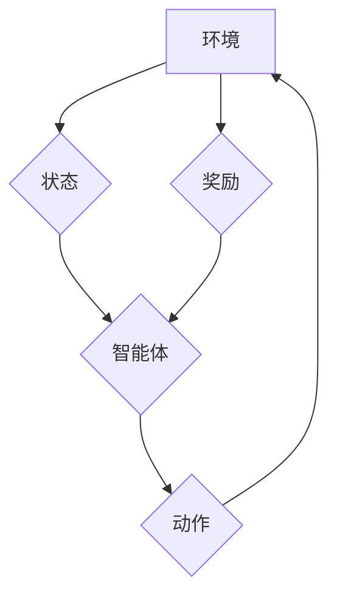

> 强化学习，金融风控，风险管理，机器学习，深度学习，模型训练，算法优化

## 1. 背景介绍

金融风控是金融机构的核心业务之一，旨在识别和管理金融风险，保障金融机构的稳定运营和客户利益。传统的风控方法主要依赖于规则引擎和统计模型，但随着金融业务的复杂化和数据量的激增，传统方法面临着越来越多的挑战。

强化学习（Reinforcement Learning，RL）作为一种新兴的机器学习方法，能够学习复杂的决策策略，并通过与环境的交互不断优化策略，在金融风控领域展现出巨大的潜力。

## 2. 核心概念与联系

**2.1 强化学习核心概念**

强化学习的核心概念包括：

* **Agent（智能体）：**  执行决策的实体，例如风控模型。
* **Environment（环境）：** 智能体所处的外部世界，例如金融市场。
* **State（状态）：** 环境的当前状态，例如客户的信用评分。
* **Action（动作）：** 智能体可以执行的行动，例如授予贷款或拒绝贷款。
* **Reward（奖励）：** 环境对智能体动作的反馈，例如贷款成功带来的收益或贷款违约带来的损失。
* **Policy（策略）：** 智能体根据当前状态选择动作的规则。

**2.2 强化学习与金融风控的联系**

在金融风控领域，我们可以将：

* 智能体：风控模型
* 环境：金融市场
* 状态：客户的信用评分、交易记录等
* 动作：授予贷款、拒绝贷款、设置风控措施等
* 奖励：降低贷款违约率、提高收益等

通过强化学习算法，我们可以训练一个能够学习并优化风控策略的智能体，从而提高风控效率和准确性。

**2.3 强化学习流程图**



## 3. 核心算法原理 & 具体操作步骤

**3.1 算法原理概述**

强化学习的核心算法是基于价值函数的策略梯度算法。价值函数用来评估某个状态下采取某个动作的长期收益。策略梯度算法通过调整策略参数，使得价值函数不断增加，从而学习出最优的策略。

**3.2 算法步骤详解**

1. **初始化：** 初始化策略参数和价值函数。
2. **环境交互：** 智能体与环境交互，获取状态和奖励。
3. **价值函数更新：** 根据奖励和状态转移概率，更新价值函数。
4. **策略更新：** 根据价值函数梯度，更新策略参数。
5. **重复步骤 2-4：** 直到策略收敛或达到预设的训练次数。

**3.3 算法优缺点**

**优点：**

* 可以学习复杂的决策策略。
* 不需要明确的奖励函数，可以从环境中学习奖励信号。
* 可以在线学习，随着时间的推移不断优化策略。

**缺点：**

* 训练过程可能比较复杂，需要大量的训练数据和计算资源。
* 容易陷入局部最优解。
* 奖励函数的设计对算法性能有很大影响。

**3.4 算法应用领域**

强化学习在金融风控领域有广泛的应用，例如：

* **信用风险评估：** 训练模型评估客户的信用风险，提高贷款审批效率和准确性。
* **欺诈检测：** 识别异常交易行为，降低欺诈风险。
* **投资策略优化：** 学习最优的投资策略，提高投资收益。
* **风险管理：** 优化风险配置，降低整体风险水平。

## 4. 数学模型和公式 & 详细讲解 & 举例说明

**4.1 数学模型构建**

强化学习的数学模型通常由以下几个部分组成：

* **状态空间 S：** 所有可能的系统状态的集合。
* **动作空间 A：** 智能体可以采取的所有动作的集合。
* **奖励函数 R(s, a)：** 描述智能体在状态 s 下采取动作 a 后获得的奖励。
* **状态转移概率 P(s', r | s, a)：** 描述智能体从状态 s 执行动作 a 后转移到状态 s' 并获得奖励 r 的概率。
* **价值函数 V(s)：** 描述状态 s 的期望长期奖励。
* **策略函数 π(s)：** 描述智能体在状态 s 下选择动作 a 的概率。

**4.2 公式推导过程**

价值函数的更新公式通常使用 Bellman 方程：

$$V(s) = \max_a \left[ R(s, a) + \gamma \sum_{s'} P(s' | s, a) V(s') \right]$$

其中：

* γ 是折扣因子，控制未来奖励的权重。

策略梯度算法的目标是最大化价值函数，可以通过更新策略参数来实现：

$$\theta' = \theta + \alpha \nabla_{\theta} V(s) \pi(s, a)$$

其中：

* α 是学习率。
* ∇θV(s) 是价值函数关于策略参数的梯度。

**4.3 案例分析与讲解**

假设我们训练一个强化学习模型来评估客户的信用风险。

* 状态空间 S 包含客户的信用评分、收入、工作年限等特征。
* 动作空间 A 包含授予贷款、拒绝贷款、设置风控措施等。
* 奖励函数 R(s, a) 可以根据贷款违约率或收益来定义。
* 状态转移概率 P(s', r | s, a) 可以根据历史数据来估计。

通过训练强化学习模型，我们可以学习到一个能够评估客户信用风险并做出最优决策的策略。

## 5. 项目实践：代码实例和详细解释说明

**5.1 开发环境搭建**

* Python 3.x
* TensorFlow 或 PyTorch
* NumPy
* Pandas

**5.2 源代码详细实现**

```python
import tensorflow as tf

# 定义价值函数网络
class ValueNetwork(tf.keras.Model):
    def __init__(self):
        super(ValueNetwork, self).__init__()
        self.dense1 = tf.keras.layers.Dense(64, activation='relu')
        self.dense2 = tf.keras.layers.Dense(32, activation='relu')
        self.output = tf.keras.layers.Dense(1)

    def call(self, state):
        x = self.dense1(state)
        x = self.dense2(x)
        return self.output(x)

# 定义策略网络
class PolicyNetwork(tf.keras.Model):
    def __init__(self):
        super(PolicyNetwork, self).__init__()
        self.dense1 = tf.keras.layers.Dense(64, activation='relu')
        self.dense2 = tf.keras.layers.Dense(32, activation='relu')
        self.output = tf.keras.layers.Dense(2, activation='softmax')

    def call(self, state):
        x = self.dense1(state)
        x = self.dense2(x)
        return self.output(x)

# 定义强化学习算法
class QLearningAgent:
    def __init__(self, state_size, action_size):
        self.state_size = state_size
        self.action_size = action_size
        self.value_network = ValueNetwork()
        self.policy_network = PolicyNetwork()
        self.optimizer = tf.keras.optimizers.Adam(learning_rate=0.001)

    def choose_action(self, state):
        probs = self.policy_network(state)
        action = tf.random.categorical(tf.math.log(probs), num_samples=1)[0, 0]
        return action

    def update_value_network(self, state, action, reward, next_state):
        target = reward + self.gamma * tf.reduce_max(self.value_network(next_state))
        with tf.GradientTape() as tape:
            value = self.value_network(state)
            loss = tf.keras.losses.MSE(target, value)
        gradients = tape.gradient(loss, self.value_network.trainable_variables)
        self.optimizer.apply_gradients(zip(gradients, self.value_network.trainable_variables))

    def train(self, env, num_episodes):
        for episode in range(num_episodes):
            state = env.reset()
            done = False
            while not done:
                action = self.choose_action(state)
                next_state, reward, done, _ = env.step(action)
                self.update_value_network(state, action, reward, next_state)
                state = next_state

```

**5.3 代码解读与分析**

* 代码定义了价值网络和策略网络，用于评估状态价值和选择动作。
* QLearningAgent 类实现了强化学习算法，包括选择动作、更新价值网络和训练模型。
* 训练过程模拟了与环境的交互，通过不断更新价值网络，学习最优的策略。

**5.4 运行结果展示**

训练完成后，可以评估模型的性能，例如在测试集上计算贷款违约率或收益。

## 6. 实际应用场景

**6.1 风险评估与管理**

强化学习可以用于评估客户的信用风险、市场风险和操作风险，并根据风险等级制定相应的风控措施。例如，可以训练一个模型来预测客户的贷款违约概率，并根据预测结果调整贷款利率或授信额度。

**6.2 欺诈检测**

强化学习可以学习识别异常交易行为，例如虚假交易、洗钱等，从而降低欺诈风险。例如，可以训练一个模型来分析交易记录，识别异常交易模式，并触发警报。

**6.3 投资策略优化**

强化学习可以学习最优的投资策略，例如股票投资、债券投资等，从而提高投资收益。例如，可以训练一个模型来分析市场数据，预测股票价格走势，并制定相应的投资策略。

**6.4 未来应用展望**

随着人工智能技术的不断发展，强化学习在金融风控领域的应用前景广阔。未来，强化学习可能被用于：

* 更精准的风险评估和管理
* 更智能的欺诈检测系统
* 更个性化的金融服务
* 更有效的风险控制策略

## 7. 工具和资源推荐

**7.1 学习资源推荐**

* **书籍:**
    * Reinforcement Learning: An Introduction by Richard S. Sutton and Andrew G. Barto
    * Deep Reinforcement Learning Hands-On by Maxim Lapan
* **在线课程:**
    * Coursera: Reinforcement Learning Specialization
    * Udacity: Deep Reinforcement Learning Nanodegree

**7.2 开发工具推荐**

* **TensorFlow:** 开源深度学习框架
* **PyTorch:** 开源深度学习框架
* **OpenAI Gym:** 强化学习环境库

**7.3 相关论文推荐**

* Deep Reinforcement Learning for Financial Risk Management
* A Survey of Reinforcement Learning in Finance
* Reinforcement Learning for Credit Risk Assessment

## 8. 总结：未来发展趋势与挑战

**8.1 研究成果总结**

强化学习在金融风控领域取得了显著的成果，例如提高了风险评估的准确性、降低了欺诈风险、优化了投资策略。

**8.2 未来发展趋势**

* **更复杂的模型:** 使用更复杂的深度学习模型，例如Transformer，来学习更复杂的金融数据。
* **多智能体强化学习:** 研究多智能体协作的强化学习算法，例如在金融市场中多个机构的交互。
* **解释性强化学习:** 研究如何解释强化学习模型的决策，提高模型的可解释性和可信度。

**8.3 面临的挑战**

* **数据安全和隐私:** 金融数据通常是敏感信息，需要确保数据安全和隐私。
* **模型可解释性:** 强化学习模型的决策过程通常是复杂的，需要提高模型的可解释性和可信度。
* **算法效率:** 强化学习算法的训练过程通常需要大量的计算资源，需要提高算法效率。

**8.4 研究展望**

未来，强化学习在金融风控领域将继续发展，并带来更多创新应用。

## 9. 附录：常见问题与解答

**9.1 如何选择合适的强化学习算法？**

选择合适的强化学习算法取决于具体的应用场景和数据特点。例如，对于离散动作空间的场景，可以使用Q-learning算法；对于连续动作空间的场景，可以使用Actor-Critic算法。

**9.2 如何评估强化学习模型的性能？**

强化学习模型的性能通常通过奖励函数来评估。例如，在信用风险评估场景中，可以评估模型预测的贷款违约率的准确性。

**9.3 如何解决强化学习模型的过拟合问题？**

可以使用正则化技术、数据增强和交叉验证等方法来解决强化学习模型的过拟合问题。


作者：禅与计算机程序设计艺术 / Zen and the Art of Computer Programming 
<end_of_turn>