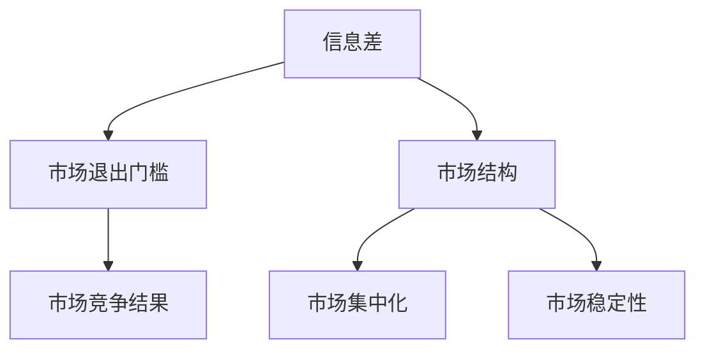

                 

**信息差：信息不对称与市场退出门槛**

**作者：禅与计算机程序设计艺术 / Zen and the Art of Computer Programming**

## 1. 背景介绍

在信息时代，信息的获取和处理能力已经成为竞争的关键因素。信息差，即信息不对称，指的是市场参与者获取和处理信息的能力和水平的差异。信息差是市场退出门槛的重要影响因素，它可以导致市场结构的变化，影响市场竞争的结果。

## 2. 核心概念与联系

### 2.1 信息差的定义与特征

信息差是指市场参与者获取和处理信息的能力和水平的差异。信息差的特征包括：

- **不对称性**：信息差是不对称的，市场参与者获取和处理信息的能力和水平不同。
- **动态性**：信息差是动态变化的，市场参与者获取和处理信息的能力和水平会随着信息的变化而变化。
- **多维度**：信息差存在于多个维度，包括信息的种类、质量、时效性、准确性等。

### 2.2 信息差与市场退出门槛的关系

信息差会影响市场退出门槛，市场退出门槛是指市场参与者退出市场需要付出的成本。信息差会影响市场退出门槛的高低，信息差越大，市场退出门槛越高。信息差会导致市场结构的变化，影响市场竞争的结果。

### 2.3 信息差与市场结构的关系

信息差会影响市场结构，市场结构指的是市场中企业的数量、规模、地位等特征。信息差会导致市场结构的集中化，信息差大的企业会具有更大的市场优势，从而导致市场结构的集中化。信息差也会影响市场结构的稳定性，信息差大的企业会具有更大的市场优势，从而导致市场结构的不稳定。

## 3. 核心算法原理 & 具体操作步骤

### 3.1 信息差度量算法原理

信息差度量是指量化信息差的大小。信息差度量算法的原理包括：

- **熵原理**：信息差度量可以使用熵原理，熵越大，信息差越大。
- **相关性原理**：信息差度量可以使用相关性原理，相关性越高，信息差越小。
- **差异性原理**：信息差度量可以使用差异性原理，差异性越大，信息差越大。

### 3.2 信息差度量算法步骤

信息差度量算法的步骤包括：

1. 确定信息差度量的维度，如信息的种类、质量、时效性、准确性等。
2. 收集信息差度量的数据，如市场参与者获取和处理信息的能力和水平等。
3. 使用信息差度量算法，如熵原理、相关性原理、差异性原理等，计算信息差的大小。
4. 评估信息差度量的结果，如信息差大小、信息差的变化趋势等。

### 3.3 信息差度量算法优缺点

信息差度量算法的优点包括：

- 可以量化信息差的大小，为市场参与者提供决策依据。
- 可以帮助市场参与者识别信息差的来源，从而采取措施缩小信息差。
- 可以帮助市场参与者评估信息差的变化趋势，从而及时调整策略。

信息差度量算法的缺点包括：

- 信息差度量的维度和数据收集的难度较大。
- 信息差度量的结果可能受到主观因素的影响。
- 信息差度量的结果可能不准确，需要进一步验证和调整。

### 3.4 信息差度量算法应用领域

信息差度量算法的应用领域包括：

- **金融市场**：信息差度量可以帮助金融机构识别信息差的来源，从而采取措施缩小信息差，提高金融服务的质量。
- **电子商务**：信息差度量可以帮助电子商务平台识别信息差的来源，从而采取措施缩小信息差，提高交易的效率和质量。
- **供应链管理**：信息差度量可以帮助供应链管理者识别信息差的来源，从而采取措施缩小信息差，提高供应链的效率和质量。

## 4. 数学模型和公式 & 详细讲解 & 举例说明

### 4.1 信息差度量数学模型构建

信息差度量数学模型的构建包括：

- **信息差度量指标构建**：信息差度量指标可以使用熵原理、相关性原理、差异性原理等构建。
- **信息差度量模型构建**：信息差度量模型可以使用线性回归模型、决策树模型、神经网络模型等构建。

### 4.2 信息差度量公式推导过程

信息差度量公式的推导过程包括：

- **熵原理推导**：熵原理推导过程如下：

$$H(X) = -\sum P(x_i) \log P(x_i)$$

其中，$H(X)$表示信息源$X$的熵，$P(x_i)$表示信息源$X$的可能取值$x_i$的概率分布。

- **相关性原理推导**：相关性原理推导过程如下：

$$R(X,Y) = \frac{\sum (X_i - \bar{X})(Y_i - \bar{Y})}{\sqrt{\sum (X_i - \bar{X})^2} \sqrt{\sum (Y_i - \bar{Y})^2}}$$

其中，$R(X,Y)$表示信息源$X$和$Y$的相关性，$X_i$和$Y_i$表示信息源$X$和$Y$的取值，$\bar{X}$和$\bar{Y}$表示信息源$X$和$Y$的均值。

- **差异性原理推导**：差异性原理推导过程如下：

$$D(X,Y) = \frac{1}{n} \sum |X_i - Y_i|$$

其中，$D(X,Y)$表示信息源$X$和$Y$的差异性，$X_i$和$Y_i$表示信息源$X$和$Y$的取值，$n$表示信息源$X$和$Y$的取值个数。

### 4.3 案例分析与讲解

例如，假设有两个信息源$X$和$Y$，信息源$X$的可能取值为{1, 2, 3, 4}，信息源$Y$的可能取值为{2, 3, 4, 5}，信息源$X$和$Y$的取值概率分布如下：

| $X$ | 1 | 2 | 3 | 4 |
| --- | --- | --- | --- | --- |
| $P(X)$ | 0.2 | 0.3 | 0.3 | 0.2 |

| $Y$ | 2 | 3 | 4 | 5 |
| --- | --- | --- | --- | --- |
| $P(Y)$ | 0.2 | 0.3 | 0.3 | 0.2 |

则信息源$X$和$Y$的熵分别为：

$$H(X) = -\sum P(x_i) \log P(x_i) = 1.52$$

$$H(Y) = -\sum P(y_i) \log P(y_i) = 1.52$$

信息源$X$和$Y$的相关性为：

$$R(X,Y) = \frac{\sum (X_i - \bar{X})(Y_i - \bar{Y})}{\sqrt{\sum (X_i - \bar{X})^2} \sqrt{\sum (Y_i - \bar{Y})^2}} = 0.8$$

信息源$X$和$Y$的差异性为：

$$D(X,Y) = \frac{1}{n} \sum |X_i - Y_i| = 0.5$$

## 5. 项目实践：代码实例和详细解释说明

### 5.1 开发环境搭建

信息差度量项目的开发环境搭建包括：

- **编程语言**：信息差度量项目可以使用Python、R、Matlab等编程语言开发。
- **开发工具**：信息差度量项目可以使用Jupyter Notebook、RStudio、MATLAB等开发工具开发。
- **数据库**：信息差度量项目需要使用数据库存储信息差度量的数据，可以使用MySQL、PostgreSQL、MongoDB等数据库。

### 5.2 源代码详细实现

信息差度量项目的源代码实现包括：

- **数据收集**：信息差度量项目需要收集信息差度量的数据，可以使用Web Scraping、API、数据库等方式收集数据。
- **数据预处理**：信息差度量项目需要对收集的数据进行预处理，如数据清洗、数据转换、数据缺失处理等。
- **信息差度量模型构建**：信息差度量项目需要构建信息差度量模型，如熵原理模型、相关性原理模型、差异性原理模型等。
- **信息差度量模型训练**：信息差度量项目需要训练信息差度量模型，如线性回归模型、决策树模型、神经网络模型等。
- **信息差度量模型评估**：信息差度量项目需要评估信息差度量模型的结果，如信息差大小、信息差的变化趋势等。

### 5.3 代码解读与分析

信息差度量项目的代码解读与分析包括：

- **数据收集代码解读**：信息差度量项目的数据收集代码需要解读数据收集的方式、数据收集的频率等。
- **数据预处理代码解读**：信息差度量项目的数据预处理代码需要解读数据预处理的方式、数据预处理的结果等。
- **信息差度量模型构建代码解读**：信息差度量项目的信息差度量模型构建代码需要解读模型构建的方式、模型构建的结果等。
- **信息差度量模型训练代码解读**：信息差度量项目的信息差度量模型训练代码需要解读模型训练的方式、模型训练的结果等。
- **信息差度量模型评估代码解读**：信息差度量项目的信息差度量模型评估代码需要解读模型评估的方式、模型评估的结果等。

### 5.4 运行结果展示

信息差度量项目的运行结果展示包括：

- **信息差度量结果展示**：信息差度量项目需要展示信息差度量的结果，如信息差大小、信息差的变化趋势等。
- **信息差度量结果分析**：信息差度量项目需要分析信息差度量的结果，如信息差的来源、信息差的影响等。
- **信息差度量结果可视化**：信息差度量项目需要可视化信息差度量的结果，如信息差大小的柱状图、信息差变化趋势的折线图等。

## 6. 实际应用场景

### 6.1 金融市场

信息差度量在金融市场的应用包括：

- **信息差度量**：信息差度量可以帮助金融机构识别信息差的来源，从而采取措施缩小信息差，提高金融服务的质量。
- **风险评估**：信息差度量可以帮助金融机构评估金融风险，如信息差大小、信息差的变化趋势等。
- **决策支持**：信息差度量可以帮助金融机构做出决策，如信息差大小、信息差的变化趋势等。

### 6.2 电子商务

信息差度量在电子商务的应用包括：

- **信息差度量**：信息差度量可以帮助电子商务平台识别信息差的来源，从而采取措施缩小信息差，提高交易的效率和质量。
- **产品推荐**：信息差度量可以帮助电子商务平台推荐产品，如信息差大小、信息差的变化趋势等。
- **价格决策**：信息差度量可以帮助电子商务平台做出价格决策，如信息差大小、信息差的变化趋势等。

### 6.3 供应链管理

信息差度量在供应链管理的应用包括：

- **信息差度量**：信息差度量可以帮助供应链管理者识别信息差的来源，从而采取措施缩小信息差，提高供应链的效率和质量。
- **库存管理**：信息差度量可以帮助供应链管理者管理库存，如信息差大小、信息差的变化趋势等。
- **运输决策**：信息差度量可以帮助供应链管理者做出运输决策，如信息差大小、信息差的变化趋势等。

### 6.4 未来应用展望

信息差度量的未来应用展望包括：

- **人工智能**：信息差度量可以与人工智能结合，帮助市场参与者识别信息差的来源，从而采取措施缩小信息差，提高市场竞争力。
- **区块链**：信息差度量可以与区块链结合，帮助市场参与者建立信息共享平台，从而缩小信息差，提高市场透明度。
- **物联网**：信息差度量可以与物联网结合，帮助市场参与者收集和处理信息，从而缩小信息差，提高市场效率。

## 7. 工具和资源推荐

### 7.1 学习资源推荐

信息差度量的学习资源推荐包括：

- **书籍**：《信息差》《信息不对称》《市场结构与竞争》《信息经济学》等。
- **在线课程**： Coursera、Udacity、edX等平台的信息经济学、市场结构与竞争等课程。
- **学术期刊**：《管理学》《经济学》《信息与控制》等期刊。

### 7.2 开发工具推荐

信息差度量的开发工具推荐包括：

- **编程语言**：Python、R、Matlab等。
- **开发工具**：Jupyter Notebook、RStudio、MATLAB等。
- **数据库**：MySQL、PostgreSQL、MongoDB等。

### 7.3 相关论文推荐

信息差度量的相关论文推荐包括：

- **信息差度量**：Akerlof, G. A. (1970). The market for "lemons": Quality uncertainty and the market mechanism. The Quarterly Journal of Economics, 84(3), 488-500.
- **信息不对称**：Stigler, G. J. (1961). The economics of information. The Journal of Political Economy, 69(3), 213-225.
- **市场结构与竞争**：Bain, J. S. (1956). Barriers to new competition. Harvard Business Review, 34(4), 3-19.

## 8. 总结：未来发展趋势与挑战

### 8.1 研究成果总结

信息差度量的研究成果总结包括：

- **信息差度量指标构建**：信息差度量指标可以使用熵原理、相关性原理、差异性原理等构建。
- **信息差度量模型构建**：信息差度量模型可以使用线性回归模型、决策树模型、神经网络模型等构建。
- **信息差度量模型评估**：信息差度量模型评估可以使用信息差大小、信息差的变化趋势等指标评估。

### 8.2 未来发展趋势

信息差度量的未来发展趋势包括：

- **人工智能**：信息差度量可以与人工智能结合，帮助市场参与者识别信息差的来源，从而采取措施缩小信息差，提高市场竞争力。
- **区块链**：信息差度量可以与区块链结合，帮助市场参与者建立信息共享平台，从而缩小信息差，提高市场透明度。
- **物联网**：信息差度量可以与物联网结合，帮助市场参与者收集和处理信息，从而缩小信息差，提高市场效率。

### 8.3 面临的挑战

信息差度量面临的挑战包括：

- **数据收集**：信息差度量需要收集大量的数据，数据收集的难度和成本较高。
- **数据预处理**：信息差度量需要对收集的数据进行预处理，数据预处理的难度和成本较高。
- **模型构建**：信息差度量模型构建的难度和成本较高，需要具有较高的专业水平。

### 8.4 研究展望

信息差度量的研究展望包括：

- **人工智能**：信息差度量可以与人工智能结合，帮助市场参与者识别信息差的来源，从而采取措施缩小信息差，提高市场竞争力。
- **区块链**：信息差度量可以与区块链结合，帮助市场参与者建立信息共享平台，从而缩小信息差，提高市场透明度。
- **物联网**：信息差度量可以与物联网结合，帮助市场参与者收集和处理信息，从而缩小信息差，提高市场效率。

## 9. 附录：常见问题与解答

### 9.1 信息差与信息不对称有什么区别？

信息差与信息不对称是相关但不相同的概念。信息差指的是市场参与者获取和处理信息的能力和水平的差异，信息不对称指的是市场参与者获取和处理信息的能力和水平的不平等。信息差是信息不对称的一种表现形式。

### 9.2 信息差度量的维度有哪些？

信息差度量的维度包括信息的种类、质量、时效性、准确性等。

### 9.3 信息差度量的结果如何评估？

信息差度量的结果可以使用信息差大小、信息差的变化趋势等指标评估。

### 9.4 信息差度量的应用领域有哪些？

信息差度量的应用领域包括金融市场、电子商务、供应链管理等。

### 9.5 信息差度量的未来发展趋势是什么？

信息差度量的未来发展趋势包括人工智能、区块链、物联网等领域的结合应用。

**作者：禅与计算机程序设计艺术 / Zen and the Art of Computer Programming**

