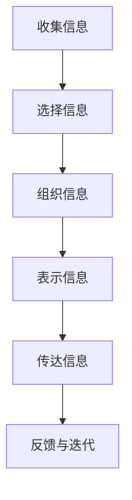

                 

**信息简化的好处与挑战：简化复杂性的艺术与实践**

**作者：禅与计算机程序设计艺术 / Zen and the Art of Computer Programming**

## 1. 背景介绍

在信息爆炸的时代，我们每天都要处理海量信息。然而，过多的信息并不等于更好的决策。相反，信息过载会导致注意力分散、决策延误甚至错误。信息简化因此变得至关重要。本文将探讨信息简化的好处、挑战，以及简化复杂性的艺术与实践。

## 2. 核心概念与联系

信息简化是指将复杂信息转化为更简单、更易于理解和使用的形式。它涉及到信息的选择、组织、表示和传达。信息简化的过程如下图所示：



## 3. 核心算法原理 & 具体操作步骤

### 3.1 算法原理概述

信息简化的算法原理基于信息论、心理学和认知科学。它包括信息熵的最小化、注意力模型、启发式搜索等。

### 3.2 算法步骤详解

1. **信息收集**：收集与目标相关的所有信息。
2. **信息选择**：基于重要性、相关性和可用性选择信息。
3. **信息组织**：将选择的信息组织成结构化的形式，如列表、树或图。
4. **信息表示**：将信息转化为易于理解的形式，如图表、图形或可视化。
5. **信息传达**：使用适当的渠道传达信息，如文本、语音或视频。
6. **反馈与迭代**：基于反馈调整信息简化过程，以提高有效性。

### 3.3 算法优缺点

**优点**：信息简化有助于提高信息的可理解性、可用性和可靠性，从而改善决策质量。

**缺点**：信息简化可能导致信息丢失或误解，需要平衡简化的程度和信息的完整性。

### 3.4 算法应用领域

信息简化应用广泛，包括数据可视化、人机交互、搜索引擎、新闻编辑等。

## 4. 数学模型和公式 & 详细讲解 & 举例说明

### 4.1 数学模型构建

信息熵是信息简化的关键数学模型。它衡量信息的不确定性或随机性。信息熵越高，信息越复杂。

### 4.2 公式推导过程

信息熵的公式如下：

$$
H(X) = -\sum P(x) \log P(x)
$$

其中，$X$是随机变量，$P(x)$是$x$的概率分布。

### 4.3 案例分析与讲解

例如，考虑一个二元随机变量$X$，其概率分布为$P(X=0)=0.6$和$P(X=1)=0.4$。则信息熵为：

$$
H(X) = -(0.6 \log 0.6 + 0.4 \log 0.4) \approx 0.971
$$

## 5. 项目实践：代码实例和详细解释说明

### 5.1 开发环境搭建

本项目使用Python和Matplotlib库进行信息简化的可视化。

### 5.2 源代码详细实现

```python
import matplotlib.pyplot as plt
import numpy as np

# 定义信息熵函数
def entropy(probs):
    return -np.sum(probs * np.log2(probs))

# 定义信息熵可视化函数
def visualize_entropy(n):
    x = np.linspace(0, 1, n)
    probs = x
    ent = entropy(probs)
    plt.plot(x, ent)
    plt.xlabel('Probability')
    plt.ylabel('Entropy')
    plt.title(f'Entropy of a Binomial Distribution (n={n})')
    plt.show()

# 可视化信息熵
visualize_entropy(100)
```

### 5.3 代码解读与分析

该代码定义了信息熵函数`entropy`和信息熵可视化函数`visualize_entropy`。`visualize_entropy`函数绘制了二元随机变量的信息熵随概率的变化。


## 6. 实际应用场景

信息简化在新闻编辑、搜索引擎、数据可视化等领域有广泛应用。例如，新闻编辑需要选择和组织信息以吸引读者，搜索引擎需要简化搜索结果以改善用户体验。

### 6.4 未来应用展望

未来，信息简化将继续在人工智能、虚拟现实和增强现实等领域扮演关键角色。

## 7. 工具和资源推荐

### 7.1 学习资源推荐

- "Information Visualization: Perception for Design" by Colin Ware
- "The Design of Everyday Things" by Don Norman

### 7.2 开发工具推荐

- Python和Matplotlib：信息简化的强大工具。
- Tableau和Power BI：数据可视化工具。

### 7.3 相关论文推荐

- "Information Theory, Inference, and Learning Algorithms" by MacKay
- "The Quest for Simplicity: A Study of Information Visualization" by Tufte

## 8. 总结：未来发展趋势与挑战

### 8.1 研究成果总结

信息简化是信息处理的关键步骤。它有助于改善决策质量，提高信息的可理解性和可用性。

### 8.2 未来发展趋势

未来，信息简化将继续在人工智能、虚拟现实和增强现实等领域扮演关键角色。它将与其他技术结合，如深度学习和自然语言处理，以提供更智能、更个性化的信息简化。

### 8.3 面临的挑战

信息简化的挑战包括信息丢失或误解，需要平衡简化的程度和信息的完整性。

### 8.4 研究展望

未来的研究将关注信息简化的自适应性、个性化和动态性。此外，研究将探索信息简化与其他技术的结合，如深度学习和自然语言处理。

## 9. 附录：常见问题与解答

**Q：信息简化会导致信息丢失吗？**

**A：**是的，信息简化可能导致信息丢失。因此，需要平衡简化的程度和信息的完整性。

**Q：信息简化适用于所有信息吗？**

**A：**不，信息简化适用于复杂信息。简单信息不需要简化。

**Q：信息简化需要多长时间？**

**A：**信息简化的时间取决于信息的复杂性和简化的程度。复杂信息可能需要更长时间。

**作者：禅与计算机程序设计艺术 / Zen and the Art of Computer Programming**

