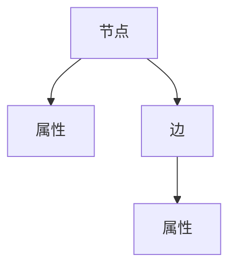

                 

## 1. 背景介绍

图数据库是一种用于存储和查询图形数据的数据库系统。与传统的关系型数据库不同，图数据库将数据表示为图形结构，其中节点表示实体，边表示实体之间的关系。图数据库在处理复杂的关系和模式变化的场景中表现出色，因此被广泛应用于社交网络、推荐系统、金融风险分析等领域。

## 2. 核心概念与联系

图数据库的核心概念包括节点（或顶点）、边和属性。节点表示实体，边表示实体之间的关系，属性则描述节点或边的特征。图数据库的架构可以表示为以下 Mermaid 流程图：



## 3. 核心算法原理 & 具体操作步骤

### 3.1 算法原理概述

图数据库的核心算法包括图遍历算法、路径查找算法和图模式匹配算法。这些算法的目的是在图中查找和匹配特定的结构或模式。

### 3.2 算法步骤详解

#### 图遍历算法

图遍历算法的目的是访问图中所有的节点。常见的图遍历算法包括深度优先搜索（DFS）和广度优先搜索（BFS）。DFS 从当前节点出发，沿着任意一条边向前走，直到到达某个节点时无法再深入，然后回溯到上一个节点，继续搜索其他路径。BFS 则从当前节点出发，沿着所有可能的路径同时向前走，直到所有路径都被搜索完毕。

#### 路径查找算法

路径查找算法的目的是在图中查找两个节点之间的路径。常见的路径查找算法包括 Dijkstra 算法和 A\* 算法。Dijkstra 算法用于查找图中两个节点之间的最短路径，而 A\* 算法则在 Dijkstra 算法的基础上添加了启发式heuristic 函数，用于优化搜索路径。

#### 图模式匹配算法

图模式匹配算法的目的是在图中查找和匹配特定的模式。常见的图模式匹配算法包括图同构（isomorphism）检测和图子图（subgraph）检测。图同构检测用于判断两个图是否结构相同，而图子图检测则用于查找图中是否存在特定的子图结构。

### 3.3 算法优缺点

图遍历算法的优点是可以访问图中所有的节点，缺点是可能会导致重复访问节点。路径查找算法的优点是可以查找两个节点之间的最短路径，缺点是可能会导致搜索路径过长。图模式匹配算法的优点是可以查找和匹配特定的模式，缺点是可能会导致搜索空间过大。

### 3.4 算法应用领域

图遍历算法常用于社交网络分析，路径查找算法常用于推荐系统和导航系统，图模式匹配算法常用于金融风险分析和生物信息学领域。

## 4. 数学模型和公式 & 详细讲解 & 举例说明

### 4.1 数学模型构建

图数据库的数学模型可以表示为无向图 $G = (V, E)$，其中 $V$ 是节点集合，$E$ 是边集合。每条边 $e \in E$ 连接两个节点 $u, v \in V$，表示节点 $u$ 和节点 $v$ 之间的关系。

### 4.2 公式推导过程

图数据库的数学模型可以推导出图的邻接矩阵 $A$。邻接矩阵 $A$ 是一个 $n \times n$ 的矩阵，其中 $n$ 是节点集合 $V$ 中的节点数。邻接矩阵 $A$ 的元素 $a_{ij}$ 表示节点 $i$ 和节点 $j$ 之间是否存在边，如果存在边则 $a_{ij} = 1$，否则 $a_{ij} = 0$。

### 4.3 案例分析与讲解

例如，考虑以下图数据库的示例：


该图数据库的邻接矩阵 $A$ 为：

$$
A = \begin{bmatrix}
0 & 1 & 1 & 0 \\
1 & 0 & 1 & 1 \\
1 & 1 & 0 & 1 \\
0 & 1 & 1 & 0
\end{bmatrix}
$$

## 5. 项目实践：代码实例和详细解释说明

### 5.1 开发环境搭建

本项目使用 Python 和 NetworkX 库来实现图数据库的功能。首先，需要安装 NetworkX 库，可以使用以下命令安装：

```bash
pip install networkx
```

### 5.2 源代码详细实现

以下是使用 NetworkX 库实现图数据库的示例代码：

```python
import networkx as nx

# 创建一个空图
G = nx.Graph()

# 添加节点
G.add_node(1)
G.add_node(2)
G.add_node(3)
G.add_node(4)

# 添加边
G.add_edge(1, 2)
G.add_edge(1, 3)
G.add_edge(2, 3)
G.add_edge(2, 4)
G.add_edge(3, 4)

# 打印图的邻接矩阵
print(nx.adjacency_matrix(G).todense())
```

### 5.3 代码解读与分析

在示例代码中，首先使用 `nx.Graph()` 创建一个空图 `G`。然后，使用 `G.add_node()` 添加节点，使用 `G.add_edge()` 添加边。最后，使用 `nx.adjacency_matrix(G).todense()` 打印图的邻接矩阵。

### 5.4 运行结果展示

运行示例代码后，输出的邻接矩阵为：

$$
\begin{bmatrix}
0 & 1 & 1 & 0 \\
1 & 0 & 1 & 1 \\
1 & 1 & 0 & 1 \\
0 & 1 & 1 & 0
\end{bmatrix}
$$

## 6. 实际应用场景

图数据库在社交网络分析、推荐系统、金融风险分析等领域有着广泛的应用。例如，在社交网络分析中，图数据库可以用于分析用户之间的关系，发现关键用户和影响力用户。在推荐系统中，图数据库可以用于查找用户感兴趣的内容，提供个性化推荐。在金融风险分析中，图数据库可以用于查找高风险交易和可疑交易。

### 6.4 未来应用展望

随着图数据库技术的不断发展，图数据库在更多领域的应用将变得更加广泛。例如，图数据库可以用于智能交通系统，优化交通路径和路网规划。图数据库也可以用于物联网领域，实现设备之间的通信和协作。

## 7. 工具和资源推荐

### 7.1 学习资源推荐

推荐阅读以下图数据库相关的书籍和论文：

* 书籍：
	+ "Graph Databases" by Ian Robinson, Jim Webber, and Emil Eifrem
	+ "Graph Algorithms" by Mark Newman
* 论文：
	+ "Google's Graph Database: A New Way to Store and Query Data" by Jim Gray, Peter Bailis, and Michael J. Franklin
	+ "PowerGraph: A Graph Analytics System for Large-Scale Data Processing" by David E. Hay, Michael J. Franklin, and Scott R. Shenker

### 7.2 开发工具推荐

推荐使用以下开发工具来实现图数据库：

* Python：Python 是一种流行的编程语言，具有丰富的图数据库库，如 NetworkX、Py2neo、Neo4j Python Driver。
* Neo4j：Neo4j 是一种流行的图数据库管理系统，提供了丰富的功能和开发工具。
* Amazon Neptune：Amazon Neptune 是一种由 AWS 提供的图数据库服务，提供了高可用性和可扩展性。

### 7.3 相关论文推荐

推荐阅读以下图数据库相关的论文：

* "Graph Databases: A Survey" by Ian Robinson, Jim Webber, and Emil Eifrem
* "Graph Analytics: Algorithms, Models, and Applications" by David E. Hay, Michael J. Franklin, and Scott R. Shenker
* "PowerGraph: A Graph Analytics System for Large-Scale Data Processing" by David E. Hay, Michael J. Franklin, and Scott R. Shenker

## 8. 总结：未来发展趋势与挑战

### 8.1 研究成果总结

图数据库技术已经取得了显著的进展，在社交网络分析、推荐系统、金融风险分析等领域有着广泛的应用。图数据库的数学模型和算法已经得到了广泛的研究，并被成功应用于实际场景中。

### 8.2 未来发展趋势

未来，图数据库技术将继续发展，并扩展到更多领域。图数据库将与其他技术结合，实现更复杂的应用。例如，图数据库将与机器学习技术结合，实现图数据挖掘和图数据分析。图数据库也将与区块链技术结合，实现分布式图数据库和图数据共享。

### 8.3 面临的挑战

图数据库技术面临的挑战包括：

* 规模问题：图数据库需要处理海量数据，如何高效地存储和查询图数据是一个挑战。
* 实时性问题：图数据库需要实时地更新和查询图数据，如何保证实时性是一个挑战。
* 可扩展性问题：图数据库需要支持水平扩展，如何实现可扩展的图数据库是一个挑战。

### 8.4 研究展望

未来的研究将关注图数据库的可扩展性、实时性和安全性。研究人员将开发新的图数据库算法和模型，以提高图数据库的性能和可用性。研究人员也将开发新的图数据库应用，扩展图数据库在更多领域的应用。

## 9. 附录：常见问题与解答

**Q1：图数据库与关系型数据库有何区别？**

A1：图数据库与关系型数据库的区别在于数据模型。关系型数据库使用表格模型存储数据，而图数据库使用图形模型存储数据。图数据库更适合存储和查询复杂的关系和模式变化的数据。

**Q2：图数据库的优势是什么？**

A2：图数据库的优势包括：

* 可以表示复杂的关系和模式变化的数据。
* 可以高效地查找和匹配特定的模式。
* 可以实时地更新和查询图数据。
* 可以支持水平扩展。

**Q3：图数据库的缺点是什么？**

A3：图数据库的缺点包括：

* 存储和查询图数据需要更多的计算资源。
* 图数据库的模型和算法更复杂。
* 图数据库的可视化和调试更困难。

## 作者：禅与计算机程序设计艺术 / Zen and the Art of Computer Programming

