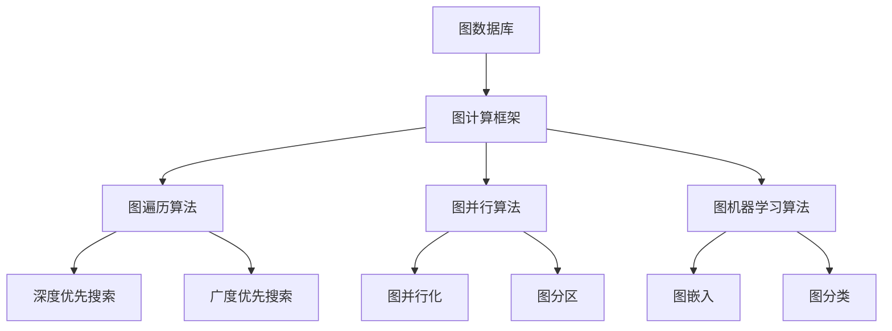

                 

**图计算引擎原理与代码实例讲解**

**作者：禅与计算机程序设计艺术 / Zen and the Art of Computer Programming**

## 1. 背景介绍

图计算是一种在图结构上进行的计算，它在数据挖掘、推荐系统、社交网络分析等领域有着广泛的应用。图计算引擎是一种软件平台，用于高效地执行图计算任务。本文将深入探讨图计算引擎的原理，并提供代码实例进行讲解。

## 2. 核心概念与联系

图计算引擎的核心是图数据库和图计算框架。图数据库用于存储和管理图结构的数据，图计算框架则提供了执行图计算任务的接口和算法。下图展示了图计算引擎的核心概念及其联系：



## 3. 核心算法原理 & 具体操作步骤

### 3.1 算法原理概述

图计算引擎的核心算法包括图遍历算法、图并行算法和图机器学习算法。图遍历算法用于遍历图结构，图并行算法用于提高图计算的效率，图机器学习算法则用于从图结构中学习有用的信息。

### 3.2 算法步骤详解

- **图遍历算法**：图遍历算法的目的是访问图中的所有节点。常见的图遍历算法包括深度优先搜索（DFS）和广度优先搜索（BFS）。DFS 从当前节点出发，沿着任意一条边向前走，直到走到一条边的尽头，然后回溯。BFS 则是从当前节点出发，沿着所有边向前走，直到所有边都走完。
- **图并行算法**：图并行算法的目的是提高图计算的效率。常见的图并行算法包括图并行化和图分区。图并行化是将图计算任务分成多个子任务，并行地执行这些子任务。图分区则是将图结构分成多个子图，并行地处理这些子图。
- **图机器学习算法**：图机器学习算法的目的是从图结构中学习有用的信息。常见的图机器学习算法包括图嵌入和图分类。图嵌入是将图结构嵌入到低维空间中，以便于后续的分析。图分类则是将图结构分成不同的类别，以便于后续的预测。

### 3.3 算法优缺点

- **图遍历算法**：DFS 的优点是空间复杂度低，缺点是可能会陷入死循环。BFS 的优点是可以保证找到最短路径，缺点是空间复杂度高。
- **图并行算法**：图并行化的优点是可以提高计算效率，缺点是可能会导致数据不一致。图分区的优点是可以减少通信开销，缺点是可能会导致数据冗余。
- **图机器学习算法**：图嵌入的优点是可以保留图结构的特征，缺点是可能会丢失部分信息。图分类的优点是可以提高预测准确性，缺点是可能会导致过拟合。

### 3.4 算法应用领域

图遍历算法常用于图搜索和路径规划。图并行算法常用于大规模图计算任务。图机器学学习算法常用于推荐系统、社交网络分析和知识图谱构建。

## 4. 数学模型和公式 & 详细讲解 & 举例说明

### 4.1 数学模型构建

图计算引擎的数学模型是图结构本身。图结构可以表示为无向图 $G = (V, E)$，其中 $V$ 是节点集合，$E$ 是边集合。每条边 $e \in E$ 连接两个节点 $u, v \in V$，表示这两个节点之间存在某种关系。

### 4.2 公式推导过程

图计算引擎的公式推导过程取决于具体的图计算任务。例如，在图遍历算法中，可以使用深度优先搜索的递归公式来推导节点的访问顺序：

$$DFS(u) = \{u\} \cup \bigcup_{v \in N(u)} DFS(v)$$

其中 $N(u)$ 是节点 $u$ 的邻居集合。

### 4.3 案例分析与讲解

假设我们有一个无向图 $G = (V, E)$，其中 $V = \{1, 2, 3, 4, 5\}$，$E = \{(1, 2), (1, 3), (2, 3), (3, 4), (4, 5)\}$。我们使用深度优先搜索遍历这个图结构。根据上述公式，我们可以推导出节点的访问顺序为 $\{1, 2, 3, 4, 5\}$。

## 5. 项目实践：代码实例和详细解释说明

### 5.1 开发环境搭建

我们将使用 Python 和 NetworkX 库来实现图计算引擎的代码实例。首先，我们需要安装 NetworkX 库。可以使用以下命令安装：

```bash
pip install networkx
```

### 5.2 源代码详细实现

以下是使用 NetworkX 库实现深度优先搜索的代码实例：

```python
import networkx as nx

def dfs(G, u, visited):
    visited.add(u)
    print(u, end=' ')
    for v in G.neighbors(u):
        if v not in visited:
            dfs(G, v, visited)

G = nx.Graph()
G.add_edges_from([(1, 2), (1, 3), (2, 3), (3, 4), (4, 5)])
visited = set()
dfs(G, 1, visited)
```

### 5.3 代码解读与分析

在上述代码中，我们首先导入 NetworkX 库，并定义了一个函数 `dfs` 来实现深度优先搜索。函数 `dfs` 接受三个参数：图结构 `G`，起始节点 `u` 和已访问节点集合 `visited`。函数首先将当前节点 `u` 添加到已访问节点集合中，并打印当前节点。然后，函数遍历当前节点的邻居节点，如果邻居节点还没有被访问过，则递归地调用 `dfs` 函数。

### 5.4 运行结果展示

运行上述代码，我们可以得到节点的访问顺序为 $\{1, 2, 3, 4, 5\}$，与我们之前推导出的结果一致。

## 6. 实际应用场景

图计算引擎可以应用于各种领域，例如：

- **社交网络分析**：图计算引擎可以用于分析社交网络结构，找出关键节点和影响力用户。
- **推荐系统**：图计算引擎可以用于构建推荐系统，根据用户的兴趣和行为推荐相关内容。
- **知识图谱构建**：图计算引擎可以用于构建知识图谱，将海量的数据转化为结构化的图结构。

### 6.4 未来应用展望

随着图计算技术的不断发展，图计算引擎的应用领域将会不断扩展。未来，图计算引擎可能会应用于自动驾驶、智能制造和物联网等领域。

## 7. 工具和资源推荐

### 7.1 学习资源推荐

- **图计算引擎相关书籍**：推荐阅读《图计算引擎：原理与实践》和《图数据库：原理与应用》。
- **图计算引擎相关课程**：推荐学习 Coursera 上的《图计算》课程和 Udacity 上的《图数据库》课程。

### 7.2 开发工具推荐

- **图数据库**：推荐使用 Neo4j、Amazon Neptune 和 JanusGraph 等图数据库。
- **图计算框架**：推荐使用 Giraph、GraphX 和 GraphLab 等图计算框架。

### 7.3 相关论文推荐

- **图计算引擎的原理和架构**：推荐阅读论文《GraphLab：一个分布式图计算引擎》和《Giraph：一个通用的图并行计算框架》。
- **图计算引擎的应用**：推荐阅读论文《图数据库在推荐系统中的应用》和《图计算在社交网络分析中的应用》。

## 8. 总结：未来发展趋势与挑战

### 8.1 研究成果总结

图计算引擎是一种高效的图计算平台，它可以应用于各种领域，并取得了显著的成果。然而，图计算引擎仍然面临着许多挑战。

### 8.2 未来发展趋势

未来，图计算引擎的发展趋势包括：

- **分布式图计算**：随着数据规模的不断扩大，分布式图计算将会成为图计算引擎的主要发展方向。
- **弹性图计算**：弹性图计算可以根据数据规模和计算资源动态调整计算任务，以提高计算效率。
- **图机器学习**：图机器学习是图计算引擎的重要应用领域，未来将会有更多的图机器学习算法被开发出来。

### 8.3 面临的挑战

图计算引擎面临的挑战包括：

- **数据规模**：随着数据规模的不断扩大，图计算引擎需要处理海量的数据，这对计算资源和存储资源提出了很高的要求。
- **计算效率**：图计算引擎需要高效地执行图计算任务，以满足用户的需求。然而，图计算任务往往涉及到大量的数据传输和计算，这对计算效率提出了很高的要求。
- **算法创新**：图计算引擎需要不断地开发新的算法，以满足用户的需求。然而，图计算任务往往涉及到复杂的图结构和数据，这对算法创新提出了很高的要求。

### 8.4 研究展望

未来，图计算引擎的研究展望包括：

- **分布式图计算引擎的设计和实现**：分布式图计算引擎是图计算引擎的主要发展方向，需要设计和实现新的分布式图计算引擎。
- **弹性图计算引擎的设计和实现**：弹性图计算引擎可以根据数据规模和计算资源动态调整计算任务，需要设计和实现新的弹性图计算引擎。
- **图机器学习算法的开发和应用**：图机器学习是图计算引擎的重要应用领域，需要开发新的图机器学习算法，并应用于实际场景。

## 9. 附录：常见问题与解答

**Q1：什么是图计算引擎？**

A1：图计算引擎是一种软件平台，用于高效地执行图计算任务。

**Q2：图计算引擎的核心概念是什么？**

A2：图计算引擎的核心概念包括图数据库和图计算框架。

**Q3：图计算引擎的核心算法是什么？**

A3：图计算引擎的核心算法包括图遍历算法、图并行算法和图机器学习算法。

**Q4：图计算引擎的应用领域是什么？**

A4：图计算引擎的应用领域包括社交网络分析、推荐系统和知识图谱构建等。

**Q5：图计算引擎的未来发展趋势是什么？**

A5：图计算引擎的未来发展趋势包括分布式图计算、弹性图计算和图机器学习等。

**Q6：图计算引擎面临的挑战是什么？**

A6：图计算引擎面临的挑战包括数据规模、计算效率和算法创新等。

**Q7：图计算引擎的研究展望是什么？**

A7：图计算引擎的研究展望包括分布式图计算引擎的设计和实现、弹性图计算引擎的设计和实现、图机器学习算法的开发和应用等。

## 结束语

图计算引擎是一种高效的图计算平台，它可以应用于各种领域，并取得了显著的成果。然而，图计算引擎仍然面临着许多挑战。未来，图计算引擎的发展趋势包括分布式图计算、弹性图计算和图机器学习等。图计算引擎的研究展望包括分布式图计算引擎的设计和实现、弹性图计算引擎的设计和实现、图机器学习算法的开发和应用等。我们期待着图计算引擎的不断发展和创新。

**作者：禅与计算机程序设计艺术 / Zen and the Art of Computer Programming**

