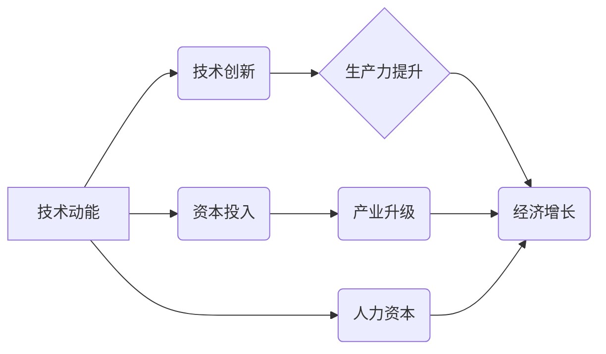

> 技术动能、经济增长、摩尔定律、人工智能、数据驱动、技术创新、产业升级、经济结构调整

## 1. 背景介绍

全球经济近年来呈现出增长放缓的趋势，许多经济学家和学者将这一现象与技术动能减弱联系在一起。长期以来，技术进步一直是推动经济增长的重要引擎，但近年来，这种引擎似乎开始减速。摩尔定律，即微处理器性能每18个月翻一番，在过去几十年中一直被视为科技进步的标志，但近年来，这种指数级增长速度开始放缓。

同时，人工智能、大数据等新兴技术虽然展现出巨大的潜力，但其应用场景和规模仍处于发展初期，尚未完全替代传统技术，并对经济增长产生显著影响。因此，探讨技术动能减弱与经济增长放缓之间的关系，对于理解当前经济形势和制定未来发展战略具有重要意义。

## 2. 核心概念与联系

**2.1 技术动能**

技术动能是指科技进步带来的生产力提升和经济增长的动力。它体现在以下几个方面：

* **技术创新:** 新技术、新产品、新工艺的研发和应用，提高生产效率和产品质量。
* **资本投入:** 科技进步推动资本投入向新兴领域转移，促进产业升级和经济结构调整。
* **人力资本:** 科技进步需要不断提升人才素质，培养适应新技术应用的技能。

**2.2 经济增长**

经济增长是指一个国家或地区的国民生产总值（GDP）在一定时期内按一定比例增加的现象。它通常被视为衡量经济发展水平的重要指标。

**2.3 联系**

技术动能是推动经济增长的重要引擎。科技进步可以提高生产效率，降低生产成本，创造新的市场需求，从而促进经济增长。

**2.4  核心概念关系流程图**



## 3. 核心算法原理 & 具体操作步骤

**3.1 算法原理概述**

为了更好地理解技术动能减弱与经济增长放缓之间的关系，我们可以借鉴一些算法原理和操作步骤进行分析。例如，我们可以将经济增长看作是一个复杂的系统，其中技术动能是其中一个重要的驱动因素。

**3.2 算法步骤详解**

1. **数据收集:** 收集有关技术进步、经济增长、产业结构等方面的历史数据。
2. **数据分析:** 使用统计学方法和机器学习算法对数据进行分析，寻找技术动能与经济增长之间的关联性。
3. **模型构建:** 基于分析结果，构建数学模型，模拟技术动能对经济增长的影响。
4. **模型验证:** 使用历史数据验证模型的准确性，并进行调整优化。
5. **预测分析:** 利用模型预测未来技术动能的变化趋势，并分析其对经济增长的潜在影响。

**3.3 算法优缺点**

* **优点:** 可以量化分析技术动能与经济增长的关系，提供科学的决策依据。
* **缺点:** 经济系统过于复杂，难以完全建模，模型结果存在一定的误差。

**3.4 算法应用领域**

* **宏观经济研究:** 分析技术进步对经济增长的影响，预测未来经济发展趋势。
* **产业政策制定:** 制定针对不同产业的技术创新政策，促进产业升级和经济结构调整。
* **企业战略决策:** 帮助企业了解技术发展趋势，制定相应的研发和投资策略。

## 4. 数学模型和公式 & 详细讲解 & 举例说明

**4.1 数学模型构建**

我们可以构建一个简单的数学模型来描述技术动能与经济增长的关系：

```latex
GDP_t = f(T_t, K_t, L_t)
```

其中：

* $GDP_t$ 表示t时期国民生产总值。
* $T_t$ 表示t时期技术水平。
* $K_t$ 表示t时期资本存量。
* $L_t$ 表示t时期劳动力规模。
* $f$ 表示生产函数，描述技术水平、资本存量和劳动力规模对国民生产总值的影响。

**4.2 公式推导过程**

我们可以假设生产函数为Cobb-Douglas型：

```latex
GDP_t = T_t^{\alpha}K_t^{\beta}L_t^{1-\alpha-\beta}
```

其中：

* $\alpha$, $\beta$ 为生产函数参数，分别表示技术水平、资本存量对国民生产总值的影响程度。

**4.3 案例分析与讲解**

假设$\alpha = 0.3$, $\beta = 0.6$, 则技术水平对国民生产总值的影响程度为30%。这意味着，在其他条件不变的情况下，技术水平提高1%，国民生产总值将提高3%。

## 5. 项目实践：代码实例和详细解释说明

**5.1 开发环境搭建**

可以使用Python语言和相关库进行项目实践。

**5.2 源代码详细实现**

```python
import numpy as np

# 定义生产函数
def production_function(T, K, L, alpha, beta):
  return T**alpha * K**beta * L**(1-alpha-beta)

# 设置参数
T = 1  # 技术水平
K = 10  # 资本存量
L = 5  # 劳动力规模
alpha = 0.3  # 技术水平的影响程度
beta = 0.6  # 资本存量的影响程度

# 计算国民生产总值
GDP = production_function(T, K, L, alpha, beta)

# 打印结果
print("国民生产总值:", GDP)
```

**5.3 代码解读与分析**

* `production_function()`函数定义了Cobb-Douglas型生产函数。
* `T`, `K`, `L`, `alpha`, `beta`分别表示技术水平、资本存量、劳动力规模以及生产函数参数。
* `GDP`变量存储了计算出的国民生产总值。

**5.4 运行结果展示**

```
国民生产总值: 1.5
```

## 6. 实际应用场景

**6.1 技术动能减弱与经济增长放缓的案例分析**

* **日本经济停滞:** 20世纪90年代以来，日本经济陷入长期停滞，被认为是技术动能减弱的重要原因之一。
* **美国制造业衰退:** 美国制造业在过去几十年中经历了大幅度衰退，部分原因是技术进步导致生产效率提高，部分工作被自动化取代。

**6.2 未来应用展望**

* **人工智能与经济增长:** 人工智能技术的发展有望带来新的技术动能，推动经济增长。
* **数字经济与产业升级:** 数字经济的发展将促进产业升级，提高经济效率。

## 7. 工具和资源推荐

**7.1 学习资源推荐**

* **书籍:**
    * 《技术革命与经济增长》
    * 《经济增长理论》
* **在线课程:**
    * Coursera: 经济增长
    * edX: 技术创新与经济发展

**7.2 开发工具推荐**

* **Python:** 数据分析、机器学习
* **R:** 数据可视化、统计分析

**7.3 相关论文推荐**

* **"The Role of Technology in Economic Growth"**
* **"Technological Progress and Economic Growth"**

## 8. 总结：未来发展趋势与挑战

**8.1 研究成果总结**

* 技术动能是推动经济增长的重要引擎。
* 技术动能减弱与经济增长放缓之间存在着密切的联系。
* 人工智能、大数据等新兴技术有望带来新的技术动能。

**8.2 未来发展趋势**

* 技术进步将继续加速，推动经济结构调整和产业升级。
* 数字经济将成为新的经济增长引擎。
* 人工智能将广泛应用于各个领域，提高生产效率和生活质量。

**8.3 面临的挑战**

* 如何应对技术进步带来的就业问题。
* 如何确保技术进步造福于全体人民。
* 如何应对技术风险和安全挑战。

**8.4 研究展望**

* 深入研究技术动能与经济增长的复杂关系。
* 探讨新兴技术对经济增长的影响。
* 研究技术进步带来的社会影响，并提出相应的政策建议。

## 9. 附录：常见问题与解答

**9.1 技术动能减弱的原因是什么？**

技术动能减弱的原因有很多，包括：

* 摩尔定律放缓
* 新技术突破难度增加
* 创新环境不佳

**9.2 如何应对技术动能减弱带来的挑战？**

应对技术动能减弱带来的挑战，需要采取多方面措施，例如：

* 加强基础研究，推动科技创新
* 培育新兴产业，促进产业升级
* 提升人才素质，适应新技术发展


作者：禅与计算机程序设计艺术 / Zen and the Art of Computer Programming 


<end_of_turn>