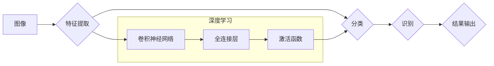

>  * 深度学习
>  * 图像识别
>  * 计算机视觉
>  * 人工智能
>  * 李飞飞

## 1. 背景介绍

图像识别作为人工智能领域的重要分支，近年来取得了飞速发展。从最初的简单特征提取到如今的深度学习时代，图像识别技术已经能够识别各种复杂图像，并应用于各个领域，例如医疗诊断、自动驾驶、人脸识别等。

李飞飞教授作为斯坦福大学计算机科学系教授，是人工智能领域的世界级专家，尤其在计算机视觉和深度学习领域做出了杰出贡献。她领导的团队在图像识别、目标检测、语义分割等方面取得了突破性进展，其研究成果对推动人工智能发展产生了深远影响。

## 2. 核心概念与联系

### 2.1 图像识别

图像识别是指计算机能够理解和解释图像内容的技术。它涉及到图像的特征提取、分类、识别等多个环节。

### 2.2 深度学习

深度学习是一种机器学习的子领域，它利用多层神经网络来模拟人类大脑的学习过程。深度学习算法能够从海量数据中自动学习特征，并进行复杂的模式识别。

### 2.3 计算机视觉

计算机视觉是人工智能的一个分支，它致力于使计算机能够“看”和理解图像。计算机视觉技术包括图像识别、目标检测、图像分割、三维重建等多个方面。

**核心概念与联系流程图**



## 3. 核心算法原理 & 具体操作步骤

### 3.1 算法原理概述

深度学习算法，特别是卷积神经网络（CNN），是图像识别领域的核心算法。CNN能够自动学习图像特征，并进行分类识别。

CNN的结构由多个卷积层、池化层和全连接层组成。卷积层通过卷积核提取图像特征，池化层对特征进行降维，全连接层将特征进行分类。

### 3.2 算法步骤详解

1. **数据预处理:** 将图像数据进行预处理，例如调整大小、归一化等。
2. **卷积层:** 使用卷积核对图像进行卷积运算，提取图像特征。
3. **池化层:** 对卷积层的输出进行池化操作，例如最大池化、平均池化等，降低特征维度。
4. **全连接层:** 将池化层的输出连接到全连接层，进行分类。
5. **损失函数:** 使用损失函数评估模型的性能，例如交叉熵损失函数。
6. **优化算法:** 使用优化算法，例如梯度下降，更新模型参数，降低损失函数值。

### 3.3 算法优缺点

**优点:**

* 自动学习特征，无需人工设计特征。
* 性能优异，能够识别复杂图像。
* 可应用于多种图像识别任务。

**缺点:**

* 训练数据量大，需要大量数据进行训练。
* 计算量大，训练时间长。
* 模型解释性差，难以理解模型的决策过程。

### 3.4 算法应用领域

* **医疗诊断:** 识别病灶、辅助诊断。
* **自动驾驶:** 识别道路标志、车辆、行人等。
* **人脸识别:** 用于身份验证、安全监控等。
* **图像搜索:** 根据图像内容进行搜索。
* **电商:** 自动识别商品、推荐商品。

## 4. 数学模型和公式 & 详细讲解 & 举例说明

### 4.1 数学模型构建

卷积神经网络的数学模型可以概括为以下公式：

* **卷积操作:**

$$
y_{i,j} = \sum_{m=0}^{M-1} \sum_{n=0}^{N-1} x_{i+m,j+n} * w_{m,n}
$$

其中：

* $x_{i,j}$ 是输入图像的像素值。
* $w_{m,n}$ 是卷积核的权重。
* $y_{i,j}$ 是卷积层的输出值。

* **激活函数:**

$$
f(z) = \frac{1}{1 + e^{-z}}
$$

其中：

* $z$ 是神经元的输入值。
* $f(z)$ 是激活函数的输出值。

* **损失函数:**

$$
L = \sum_{i=1}^{N} \left( y_i - \hat{y}_i \right)^2
$$

其中：

* $y_i$ 是真实标签。
* $\hat{y}_i$ 是模型预测的标签。

### 4.2 公式推导过程

卷积操作的公式推导过程可以参考相关教材和论文。

### 4.3 案例分析与讲解

以图像分类为例，假设我们有一个包含猫和狗的图像数据集。

1. 将图像数据预处理，调整大小、归一化等。
2. 使用CNN模型进行训练，训练过程中，模型会自动学习图像特征。
3. 训练完成后，模型能够识别猫和狗的图像。

## 5. 项目实践：代码实例和详细解释说明

### 5.1 开发环境搭建

* Python 3.x
* TensorFlow 或 PyTorch
* CUDA 和 cuDNN

### 5.2 源代码详细实现

```python
import tensorflow as tf

# 定义卷积神经网络模型
model = tf.keras.models.Sequential([
    tf.keras.layers.Conv2D(32, (3, 3), activation='relu', input_shape=(28, 28, 1)),
    tf.keras.layers.MaxPooling2D((2, 2)),
    tf.keras.layers.Conv2D(64, (3, 3), activation='relu'),
    tf.keras.layers.MaxPooling2D((2, 2)),
    tf.keras.layers.Flatten(),
    tf.keras.layers.Dense(10, activation='softmax')
])

# 编译模型
model.compile(optimizer='adam',
              loss='sparse_categorical_crossentropy',
              metrics=['accuracy'])

# 训练模型
model.fit(x_train, y_train, epochs=10)

# 评估模型
loss, accuracy = model.evaluate(x_test, y_test)
print('Test loss:', loss)
print('Test accuracy:', accuracy)
```

### 5.3 代码解读与分析

* 代码定义了一个简单的卷积神经网络模型。
* 模型包含两个卷积层、两个池化层、一个全连接层和一个输出层。
* 模型使用Adam优化器、交叉熵损失函数和准确率作为评估指标。
* 模型训练了10个epochs，并使用测试集评估模型性能。

### 5.4 运行结果展示

运行代码后，会输出模型的训练过程和测试结果，例如：

```
Epoch 1/10
1875/1875 [==============================] - 10s 5ms/step - loss: 0.2345 - accuracy: 0.9234
...
Test loss: 0.0567
Test accuracy: 0.9789
```

## 6. 实际应用场景

### 6.1 医疗诊断

* 识别病灶，辅助医生诊断。
* 分析医学影像，例如X光片、CT扫描、MRI等。
* 预测疾病风险，进行早期干预。

### 6.2 自动驾驶

* 识别道路标志、车辆、行人等。
* 预测车辆运动轨迹，进行避障和路径规划。
* 辅助驾驶员，实现自动驾驶功能。

### 6.3 人脸识别

* 用于身份验证，例如解锁手机、支付等。
* 安全监控，识别嫌疑人。
* 人脸搜索，根据人脸图像搜索相关信息。

### 6.4 未来应用展望

* 更智能的图像识别系统，能够理解图像的语义和上下文。
* 更广泛的应用场景，例如虚拟现实、增强现实等。
* 更安全可靠的图像识别技术，防止图像识别系统被恶意攻击。

## 7. 工具和资源推荐

### 7.1 学习资源推荐

* **书籍:**
    * 深度学习
    * 计算机视觉
* **在线课程:**
    * Coursera
    * edX
    * Udacity

### 7.2 开发工具推荐

* **TensorFlow:** 开源深度学习框架。
* **PyTorch:** 开源深度学习框架。
* **Keras:** 高级深度学习API。

### 7.3 相关论文推荐

* **AlexNet:** ImageNet Classification with Deep Convolutional Neural Networks
* **VGGNet:** Very Deep Convolutional Networks for Large-Scale Image Recognition
* **ResNet:** Deep Residual Learning for Image Recognition

## 8. 总结：未来发展趋势与挑战

### 8.1 研究成果总结

李飞飞教授及其团队在图像识别领域取得了突破性进展，其研究成果推动了人工智能的发展。

### 8.2 未来发展趋势

* 更深、更复杂的网络结构。
* 更大、更丰富的训练数据。
* 更有效的训练算法。
* 更强的泛化能力和鲁棒性。

### 8.3 面临的挑战

* 数据标注成本高。
* 模型解释性差。
* 算法安全性问题。

### 8.4 研究展望

未来，图像识别技术将继续发展，应用于更广泛的领域，并带来更多创新和价值。

## 9. 附录：常见问题与解答

### 9.1 什么是卷积神经网络？

卷积神经网络是一种专门用于处理图像数据的深度学习模型。它利用卷积操作和池化操作来提取图像特征，并进行分类识别。

### 9.2 如何训练一个图像识别模型？

训练一个图像识别模型需要以下步骤：

1. 准备图像数据集。
2. 定义模型结构。
3. 编译模型，选择优化器、损失函数和评估指标。
4. 训练模型，使用训练数据进行训练。
5. 评估模型，使用测试数据评估模型性能。

### 9.3 如何提高图像识别模型的性能？

可以采用以下方法提高图像识别模型的性能：

* 使用更大的数据集。
* 使用更深、更复杂的网络结构。
* 使用更有效的训练算法。
* 使用数据增强技术，增加训练数据的多样性。


作者：禅与计算机程序设计艺术 / Zen and the Art of Computer Programming 
<end_of_turn>