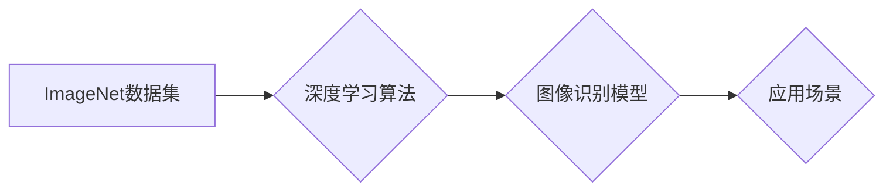

> ImageNet, 深度学习, 计算机视觉, 迁移学习, 算法创新, 数据驱动

## 1. 背景介绍

20世纪90年代末，计算机视觉领域陷入了一场“人工智能冬天”。尽管早期的计算机视觉研究取得了一些成果，但由于缺乏足够的数据和计算能力，许多任务的性能仍然很低，难以满足实际应用需求。

然而，2009年，斯坦福大学教授李飞飞带领团队发起了一个名为ImageNet的项目，彻底改变了计算机视觉的格局。ImageNet是一个大型的图像识别数据集，包含超过1400万张图像，并被分类到超过2万个类别。这个数据集的规模和质量远远超过了当时任何其他公开数据集，为深度学习算法的训练提供了充足的数据支持。

## 2. 核心概念与联系

ImageNet的出现，为深度学习算法的训练提供了充足的数据支持，也促进了深度学习算法的快速发展。

**核心概念：**

* **ImageNet:** 一个包含超过1400万张图像，并被分类到超过2万个类别的大型图像识别数据集。
* **深度学习:** 一种机器学习方法，利用多层神经网络来学习数据特征，能够自动提取图像中的复杂特征。
* **迁移学习:** 利用预训练模型在新的任务上进行微调，能够提高模型的性能和训练效率。

**架构图：**



## 3. 核心算法原理 & 具体操作步骤

### 3.1  算法原理概述

深度学习算法的核心是多层神经网络。神经网络由多个层组成，每一层都包含多个神经元。每个神经元接收来自上一层的输入，并通过一个激活函数进行处理，然后将处理后的结果传递给下一层。

深度学习算法通过训练神经网络来学习数据特征。训练过程 involves 使用训练数据来调整神经网络的权重和偏差，使得模型能够准确地预测图像的类别。

### 3.2  算法步骤详解

1. **数据预处理:** 将图像数据预处理，例如调整大小、归一化等。
2. **模型构建:** 设计和构建深度学习模型，例如卷积神经网络（CNN）。
3. **模型训练:** 使用训练数据训练模型，调整模型的权重和偏差。
4. **模型评估:** 使用测试数据评估模型的性能，例如准确率、召回率等。
5. **模型调优:** 根据评估结果，调整模型的超参数，例如学习率、批处理大小等，以提高模型性能。

### 3.3  算法优缺点

**优点:**

* 能够自动提取图像特征，无需人工特征工程。
* 性能优于传统计算机视觉算法。
* 能够处理大规模图像数据。

**缺点:**

* 训练数据量大，计算资源消耗高。
* 模型解释性差，难以理解模型的决策过程。

### 3.4  算法应用领域

* **图像识别:** 识别图像中的物体、场景、人物等。
* **目标检测:** 在图像中定位和识别目标。
* **图像分类:** 将图像分类到不同的类别。
* **图像分割:** 将图像分割成不同的区域。
* **图像生成:** 生成新的图像。

## 4. 数学模型和公式 & 详细讲解 & 举例说明

### 4.1  数学模型构建

深度学习模型的数学基础是神经网络。神经网络可以看作是一个复杂的函数，其输入是图像数据，输出是图像的类别预测。

神经网络的每个神经元都接收来自上一层的输入，并通过一个激活函数进行处理。激活函数的作用是将输入信号转换为输出信号，并引入非线性，使得神经网络能够学习复杂的特征。

### 4.2  公式推导过程

神经网络的输出可以表示为：

$$
y = f(W x + b)
$$

其中：

* $y$ 是神经网络的输出。
* $f$ 是激活函数。
* $W$ 是权重矩阵。
* $x$ 是输入数据。
* $b$ 是偏差向量。

### 4.3  案例分析与讲解

例如，在图像分类任务中，输入数据是图像像素值，输出是图像所属的类别概率。

激活函数可以选择ReLU函数，其表达式为：

$$
f(x) = max(0, x)
$$

权重矩阵 $W$ 和偏差向量 $b$ 通过训练过程学习得到。

## 5. 项目实践：代码实例和详细解释说明

### 5.1  开发环境搭建

使用Python语言和深度学习框架TensorFlow或PyTorch进行开发。

### 5.2  源代码详细实现

```python
import tensorflow as tf

# 定义模型结构
model = tf.keras.models.Sequential([
    tf.keras.layers.Conv2D(32, (3, 3), activation='relu', input_shape=(224, 224, 3)),
    tf.keras.layers.MaxPooling2D((2, 2)),
    tf.keras.layers.Conv2D(64, (3, 3), activation='relu'),
    tf.keras.layers.MaxPooling2D((2, 2)),
    tf.keras.layers.Flatten(),
    tf.keras.layers.Dense(10, activation='softmax')
])

# 编译模型
model.compile(optimizer='adam',
              loss='sparse_categorical_crossentropy',
              metrics=['accuracy'])

# 训练模型
model.fit(train_images, train_labels, epochs=10)

# 评估模型
loss, accuracy = model.evaluate(test_images, test_labels)
print('Test loss:', loss)
print('Test accuracy:', accuracy)
```

### 5.3  代码解读与分析

代码首先定义了模型结构，包括卷积层、池化层、全连接层等。然后编译模型，指定优化器、损失函数和评价指标。最后训练模型，并评估模型的性能。

### 5.4  运行结果展示

训练完成后，可以将模型应用于新的图像数据进行预测。

## 6. 实际应用场景

ImageNet的出现，推动了深度学习在计算机视觉领域的广泛应用，例如：

* **自动驾驶:** 用于识别道路标志、车辆、行人等。
* **医疗诊断:** 用于识别病灶、辅助诊断疾病。
* **人脸识别:** 用于身份验证、安全监控。
* **图像搜索:** 用于根据图像内容进行搜索。

### 6.4  未来应用展望

随着深度学习算法的不断发展，ImageNet将继续推动计算机视觉领域的创新，并应用于更多领域，例如：

* **增强现实:** 用于将虚拟物体叠加到现实世界中。
* **虚拟现实:** 用于创建沉浸式的虚拟环境。
* **机器人视觉:** 用于帮助机器人理解和交互与周围环境。

## 7. 工具和资源推荐

### 7.1  学习资源推荐

* **斯坦福大学CS231n课程:** https://cs231n.stanford.edu/
* **Deep Learning Book:** https://www.deeplearningbook.org/

### 7.2  开发工具推荐

* **TensorFlow:** https://www.tensorflow.org/
* **PyTorch:** https://pytorch.org/

### 7.3  相关论文推荐

* **ImageNet Classification with Deep Convolutional Neural Networks:** https://arxiv.org/abs/1202.1409

## 8. 总结：未来发展趋势与挑战

### 8.1  研究成果总结

ImageNet的出现，标志着深度学习在计算机视觉领域的突破，推动了计算机视觉算法的快速发展，并应用于多个领域。

### 8.2  未来发展趋势

未来，深度学习在计算机视觉领域将继续发展，主要趋势包括：

* **模型更深更复杂:** 探索更深层次、更复杂的网络结构，提高模型的性能。
* **数据更丰富更多样:** 收集更多、更丰富、更多样化的图像数据，提高模型的泛化能力。
* **算法更智能更高效:** 研究更智能、更有效的算法，提高模型的训练效率和推理速度。

### 8.3  面临的挑战

深度学习在计算机视觉领域也面临一些挑战，例如：

* **数据标注成本高:** 高质量的图像数据标注成本高昂，难以获取。
* **模型解释性差:** 深度学习模型的决策过程难以解释，难以理解模型的错误原因。
* **模型安全性问题:** 深度学习模型容易受到攻击，存在安全风险。

### 8.4  研究展望

未来，需要继续研究解决这些挑战，推动深度学习在计算机视觉领域的进一步发展。

## 9. 附录：常见问题与解答

### 9.1  常见问题

* **ImageNet数据集的规模有多大？**

ImageNet数据集包含超过1400万张图像，并被分类到超过2万个类别。

* **深度学习算法的训练需要多少计算资源？**

深度学习算法的训练需要大量的计算资源，例如GPU。

* **如何评估深度学习模型的性能？**

可以使用准确率、召回率等指标来评估深度学习模型的性能。

### 9.2  解答

* **ImageNet数据集的规模有多大？**

ImageNet数据集包含超过1400万张图像，并被分类到超过2万个类别。

* **深度学习算法的训练需要多少计算资源？**

深度学习算法的训练需要大量的计算资源，例如GPU。

* **如何评估深度学习模型的性能？**

可以使用准确率、召回率等指标来评估深度学习模型的性能。


作者：禅与计算机程序设计艺术 / Zen and the Art of Computer Programming 
<end_of_turn>