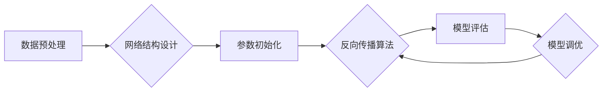

> 深度学习、神经网络、算法设计、机器学习、数据分析、人工智能、创新

## 1. 背景介绍

在当今数据爆炸的时代，人工智能（AI）正以惊人的速度发展，深刻地改变着我们生活的方方面面。从自动驾驶汽车到智能语音助手，从医疗诊断到金融预测，AI技术的应用无处不在。然而，在AI领域取得突破性进展的关键，在于我们对算法设计、数据分析和模型构建的深刻理解。

本篇文章将深入探讨深度学习算法的设计原理，并通过具体的案例分析，阐明如何从反思到创新，最终实现AI技术的突破性发展。

## 2. 核心概念与联系

深度学习是机器学习的一个子领域，它利用多层神经网络来模拟人类大脑的学习过程。

**核心概念：**

* **神经网络:** 由多个相互连接的神经元组成，每个神经元接收输入信号，对其进行处理，并输出信号。
* **层级结构:** 神经网络通常由多个层级组成，包括输入层、隐藏层和输出层。
* **权重和偏置:** 每个神经元都有一个权重和偏置，这些参数决定了神经元对输入信号的响应程度。
* **激活函数:** 用于将神经元的输出映射到一个特定的范围，例如 sigmoid 函数和 ReLU 函数。

**核心联系：**

深度学习算法的核心在于通过训练神经网络，学习到数据中的模式和规律。训练过程涉及以下步骤：

1. **数据预处理:** 将原始数据转换为神经网络可以理解的格式。
2. **网络结构设计:** 根据任务需求设计神经网络的层级结构和神经元数量。
3. **参数初始化:** 为神经网络的参数（权重和偏置）赋予初始值。
4. **反向传播算法:** 利用梯度下降算法，调整神经网络的参数，使其能够更好地预测输出。
5. **模型评估:** 使用测试数据评估模型的性能，并根据评估结果进行模型调优。

**Mermaid 流程图:**



## 3. 核心算法原理 & 具体操作步骤

### 3.1  算法原理概述

深度学习算法的核心是反向传播算法，它是一种迭代优化算法，用于调整神经网络的参数，使其能够更好地预测输出。

反向传播算法的基本原理是：

1. 将输入数据输入神经网络，计算输出结果。
2. 计算输出结果与真实值的误差。
3. 根据误差反向传播，计算每个神经元的梯度。
4. 利用梯度下降算法，更新每个神经元的权重和偏置。
5. 重复步骤 1-4，直到误差达到预设阈值。

### 3.2  算法步骤详解

1. **前向传播:** 将输入数据逐层传递到神经网络，计算每个神经元的输出。
2. **损失函数计算:** 计算输出结果与真实值的误差，使用损失函数衡量误差的大小。
3. **反向传播:** 计算每个神经元的梯度，即参数变化对误差的影响。
4. **参数更新:** 利用梯度下降算法，更新每个神经元的权重和偏置。

### 3.3  算法优缺点

**优点:**

* **强大的学习能力:** 深度学习算法能够学习到数据中的复杂模式和规律。
* **自动特征提取:** 深度学习算法能够自动提取数据的特征，无需人工特征工程。
* **泛化能力强:** 深度学习算法能够很好地推广到新的数据。

**缺点:**

* **训练时间长:** 深度学习算法的训练时间通常很长，需要大量的计算资源。
* **数据依赖性强:** 深度学习算法的性能依赖于训练数据的质量和数量。
* **可解释性差:** 深度学习算法的决策过程难以解释，难以理解模型的内部机制。

### 3.4  算法应用领域

深度学习算法在各个领域都有广泛的应用，例如：

* **计算机视觉:** 图像识别、物体检测、图像分割、人脸识别等。
* **自然语言处理:** 文本分类、情感分析、机器翻译、语音识别等。
* **语音合成:** 生成逼真的语音。
* **医疗诊断:** 辅助医生诊断疾病。
* **金融预测:** 预测股票价格、信用风险等。

## 4. 数学模型和公式 & 详细讲解 & 举例说明

### 4.1  数学模型构建

深度学习算法的数学模型主要基于线性变换和非线性激活函数。

**线性变换:**

$$
y = Wx + b
$$

其中：

* $y$ 是神经元的输出。
* $x$ 是神经元的输入。
* $W$ 是权重矩阵。
* $b$ 是偏置向量。

**非线性激活函数:**

常用的激活函数包括 sigmoid 函数、ReLU 函数、tanh 函数等。

**sigmoid 函数:**

$$
f(x) = \frac{1}{1 + e^{-x}}
$$

**ReLU 函数:**

$$
f(x) = max(0, x)
$$

### 4.2  公式推导过程

反向传播算法的核心是利用梯度下降算法，更新神经网络的参数。

**梯度下降算法:**

$$
\theta = \theta - \alpha \nabla J(\theta)
$$

其中：

* $\theta$ 是参数向量。
* $\alpha$ 是学习率。
* $\nabla J(\theta)$ 是损失函数 $J(\theta)$ 的梯度。

### 4.3  案例分析与讲解

假设我们有一个简单的线性回归问题，目标是预测房价。

**数据:**

* 房屋面积 (x)
* 房屋价格 (y)

**模型:**

$$
y = Wx + b
$$

**损失函数:**

$$
J(\theta) = \frac{1}{2} \sum_{i=1}^{n} (y_i - \hat{y}_i)^2
$$

其中：

* $n$ 是样本数量。
* $y_i$ 是第 $i$ 个样本的真实价格。
* $\hat{y}_i$ 是第 $i$ 个样本的预测价格。

**反向传播算法:**

1. 将输入数据 (x) 传入模型，计算预测价格 ($\hat{y}$)。
2. 计算损失函数 $J(\theta)$。
3. 计算梯度 $\nabla J(\theta)$。
4. 更新参数 $\theta$ (W 和 b)。
5. 重复步骤 1-4，直到损失函数达到最小值。

## 5. 项目实践：代码实例和详细解释说明

### 5.1  开发环境搭建

* Python 3.x
* TensorFlow 或 PyTorch

### 5.2  源代码详细实现

```python
import tensorflow as tf

# 定义模型
model = tf.keras.models.Sequential([
    tf.keras.layers.Dense(64, activation='relu', input_shape=(1,)),
    tf.keras.layers.Dense(1)
])

# 编译模型
model.compile(optimizer='adam', loss='mse')

# 训练模型
model.fit(x_train, y_train, epochs=100)

# 评估模型
loss = model.evaluate(x_test, y_test)
print('Loss:', loss)
```

### 5.3  代码解读与分析

* **模型定义:** 使用 TensorFlow 的 Keras API 定义一个简单的多层感知机模型。
* **编译模型:** 使用 Adam 优化器和均方误差损失函数编译模型。
* **训练模型:** 使用训练数据训练模型，设置训练轮数为 100。
* **评估模型:** 使用测试数据评估模型的性能，并打印损失值。

### 5.4  运行结果展示

训练完成后，可以将模型应用于新的数据，进行预测。

## 6. 实际应用场景

深度学习算法在各个领域都有广泛的应用，例如：

* **图像识别:** 自动识别图像中的物体，例如人脸、车辆、动物等。
* **自然语言处理:** 理解和生成人类语言，例如机器翻译、文本摘要、聊天机器人等。
* **语音识别:** 将语音转换为文本，例如语音助手、语音搜索等。
* **医疗诊断:** 辅助医生诊断疾病，例如癌症检测、疾病预测等。
* **金融预测:** 预测股票价格、信用风险等。

### 6.4  未来应用展望

随着深度学习算法的不断发展，未来将有更多新的应用场景出现，例如：

* **自动驾驶:** 深度学习算法可以帮助汽车识别道路环境、预测其他车辆的行为，实现自动驾驶。
* **个性化推荐:** 深度学习算法可以根据用户的行为数据，推荐个性化的商品、服务等。
* **药物研发:** 深度学习算法可以加速药物研发过程，例如预测药物的有效性、安全性等。

## 7. 工具和资源推荐

### 7.1  学习资源推荐

* **书籍:**
    * 深度学习 (Deep Learning) - Ian Goodfellow, Yoshua Bengio, Aaron Courville
    * 深度学习实践 (Deep Learning with Python) - Francois Chollet
* **在线课程:**
    * Coursera: 深度学习 Specialization
    * Udacity: 深度学习 Nanodegree
    * fast.ai: 深度学习课程

### 7.2  开发工具推荐

* **TensorFlow:** 开源深度学习框架，由 Google 开发。
* **PyTorch:** 开源深度学习框架，由 Facebook 开发。
* **Keras:** 高级深度学习 API，可以运行在 TensorFlow、Theano 或 CNTK 后端。

### 7.3  相关论文推荐

* **ImageNet Classification with Deep Convolutional Neural Networks** - Alex Krizhevsky, Ilya Sutskever, Geoffrey E. Hinton
* **Sequence to Sequence Learning with Neural Networks** - Ilya Sutskever, Oriol Vinyals, Quoc V. Le
* **Attention Is All You Need** - Ashish Vaswani, Noam Shazeer, Niki Parmar, Jakob Uszkoreit, Llion Jones, Aidan N Gomez, Łukasz Kaiser, Illia Polosukhin

## 8. 总结：未来发展趋势与挑战

### 8.1  研究成果总结

深度学习算法取得了令人瞩目的成就，在各个领域都取得了突破性进展。

### 8.2  未来发展趋势

* **模型规模和复杂度:** 深度学习模型将继续朝着更大、更复杂的方向发展。
* **数据效率:** 研究更有效的训练方法，降低对数据量的依赖。
* **可解释性:** 研究更可解释的深度学习模型，提高模型的透明度和可信度。
* **硬件加速:** 研究新的硬件架构，加速深度学习模型的训练和推理。

### 8.3  面临的挑战

* **数据获取和标注:** 深度学习算法需要大量的标注数据，数据获取和标注成本高昂。
* **模型训练时间:** 深度学习模型的训练时间很长，需要大量的计算资源。
* **模型泛化能力:** 深度学习模型在新的数据上可能表现不佳，泛化能力需要进一步提升。

### 8.4  研究展望

未来，深度学习研究将继续朝着更智能、更安全、更可解释的方向发展，为人类社会带来更多福祉。

## 9. 附录：常见问题与解答

**常见问题:**

* **什么是深度学习？**

深度学习是一种机器学习的子领域，它利用多层神经网络来模拟人类大脑的学习过程。

* **深度学习算法有哪些？**

常见的深度学习算法包括卷积神经网络 (CNN)、循环神经网络 (RNN)、生成对抗网络 (GAN) 等。

* **深度学习算法的应用场景有哪些？**

深度学习算法在各个领域都有广泛的应用，例如图像识别、自然语言处理、语音识别、医疗诊断、金融预测等。

**解答:**

* **什么是深度学习？**

深度学习是一种机器学习的子领域，它利用多层神经网络来模拟人类大脑的学习过程。

* **深度学习算法有哪些？**

常见的深度学习算法包括卷积神经网络 (CNN)、循环神经网络 (RNN)、生成对抗网络 (GAN) 等。

* **深度学习算法的应用场景有哪些？**

深度学习算法在各个领域都有广泛的应用，例如图像识别、自然语言处理、语音识别、医疗诊断、金融预测等。


作者：禅与计算机程序设计艺术 / Zen and the Art of Computer Programming 
<end_of_turn>