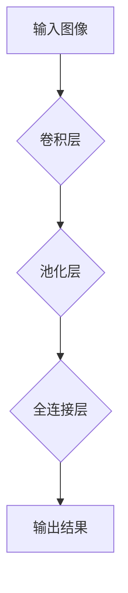

> 深度学习，神经网络，卷积神经网络，图像识别，计算机视觉，人工智能，机器学习

## 1. 背景介绍

人工智能（AI）正以惊人的速度发展，深刻地改变着我们生活的方方面面。其中，深度学习作为人工智能的核心技术之一，在图像识别、自然语言处理、语音识别等领域取得了突破性的进展。卷积神经网络（CNN）作为深度学习中应用最广泛的网络结构之一，在图像识别领域展现出了强大的能力。

然而，在深度学习的蓬勃发展过程中，我们也面临着一些挑战。例如，模型的复杂性、训练数据量的需求、可解释性问题等。因此，深入理解深度学习的原理，特别是卷积神经网络的结构和工作机制，对于推动人工智能技术的进步至关重要。

## 2. 核心概念与联系

### 2.1 深度学习

深度学习是一种机器学习的子领域，它利用多层人工神经网络来模拟人类大脑的学习过程。与传统机器学习方法相比，深度学习能够自动从海量数据中提取特征，从而实现更准确、更智能的决策。

### 2.2 神经网络

神经网络是由多个相互连接的神经元组成的网络结构。每个神经元接收来自其他神经元的输入信号，并根据一定的权重进行计算，最终输出一个信号。神经网络通过调整神经元之间的权重，来学习数据中的模式和规律。

### 2.3 卷积神经网络

卷积神经网络（CNN）是一种专门用于处理图像数据的深度学习网络结构。它利用卷积操作来提取图像特征，并通过池化操作来降低特征图的维度，从而提高模型的效率和鲁棒性。

**Mermaid 流程图**



## 3. 核心算法原理 & 具体操作步骤

### 3.1 算法原理概述

卷积神经网络的核心算法包括卷积操作、池化操作和全连接操作。

* **卷积操作:** 卷积操作通过一个称为卷积核（filter）的模板，在图像上滑动，并计算每个位置的卷积结果。卷积核可以提取图像中的边缘、纹理等特征。

* **池化操作:** 池化操作用于降低特征图的维度，并提高模型的鲁棒性。常用的池化操作包括最大池化和平均池化。

* **全连接操作:** 全连接操作将卷积层和池化层的输出连接起来，并进行分类或回归。

### 3.2 算法步骤详解

1. **输入图像预处理:** 将输入图像调整到合适的尺寸，并进行归一化处理。

2. **卷积层:** 使用多个卷积核对图像进行卷积操作，提取图像特征。

3. **池化层:** 对卷积层的输出进行池化操作，降低特征图的维度。

4. **全连接层:** 将卷积层和池化层的输出连接起来，并进行分类或回归。

5. **输出结果:** 输出模型的预测结果。

### 3.3 算法优缺点

**优点:**

* 能够自动提取图像特征，无需人工特征工程。
* 具有较高的识别精度。
* 对图像的旋转、缩放、平移等变换具有鲁棒性。

**缺点:**

* 模型的复杂性较高，训练时间较长。
* 对训练数据量的需求较高。
* 可解释性较差，难以理解模型的决策过程。

### 3.4 算法应用领域

卷积神经网络在图像识别、目标检测、图像分割、人脸识别、医疗影像分析等领域有着广泛的应用。

## 4. 数学模型和公式 & 详细讲解 & 举例说明

### 4.1 数学模型构建

卷积神经网络的数学模型可以表示为一个多层神经网络，其中每一层都包含多个神经元。每个神经元接收来自上一层的输出信号，并通过一个激活函数进行处理，最终输出一个信号。

### 4.2 公式推导过程

卷积操作的数学公式如下：

$$
y(i,j) = \sum_{m=0}^{M-1} \sum_{n=0}^{N-1} x(i+m,j+n) * w(m,n)
$$

其中：

* $y(i,j)$ 是卷积结果的像素值。
* $x(i+m,j+n)$ 是输入图像的像素值。
* $w(m,n)$ 是卷积核的权重。
* $M$ 和 $N$ 是卷积核的大小。

### 4.3 案例分析与讲解

假设我们有一个卷积核大小为3x3，权重如下：

$$
w = \begin{bmatrix}
1 & 0 & -1 \\
0 & 0 & 0 \\
-1 & 0 & 1
\end{bmatrix}
$$

如果输入图像的像素值为：

$$
x = \begin{bmatrix}
1 & 2 & 3 \\
4 & 5 & 6 \\
7 & 8 & 9
\end{bmatrix}
$$

则卷积结果为：

$$
y = \begin{bmatrix}
0 & 0 & 0 \\
0 & 0 & 0 \\
0 & 0 & 0
\end{bmatrix}
$$

## 5. 项目实践：代码实例和详细解释说明

### 5.1 开发环境搭建

本项目使用Python语言和TensorFlow框架进行开发。

* 安装Python：https://www.python.org/downloads/

* 安装TensorFlow：https://www.tensorflow.org/install

### 5.2 源代码详细实现

```python
import tensorflow as tf

# 定义卷积神经网络模型
model = tf.keras.models.Sequential([
    tf.keras.layers.Conv2D(32, (3, 3), activation='relu', input_shape=(28, 28, 1)),
    tf.keras.layers.MaxPooling2D((2, 2)),
    tf.keras.layers.Conv2D(64, (3, 3), activation='relu'),
    tf.keras.layers.MaxPooling2D((2, 2)),
    tf.keras.layers.Flatten(),
    tf.keras.layers.Dense(10, activation='softmax')
])

# 编译模型
model.compile(optimizer='adam',
              loss='sparse_categorical_crossentropy',
              metrics=['accuracy'])

# 加载MNIST数据集
(x_train, y_train), (x_test, y_test) = tf.keras.datasets.mnist.load_data()

# 数据预处理
x_train = x_train.astype('float32') / 255.0
x_test = x_test.astype('float32') / 255.0
x_train = x_train.reshape((x_train.shape[0], 28, 28, 1))
x_test = x_test.reshape((x_test.shape[0], 28, 28, 1))

# 训练模型
model.fit(x_train, y_train, epochs=5)

# 评估模型
loss, accuracy = model.evaluate(x_test, y_test)
print('Test loss:', loss)
print('Test accuracy:', accuracy)
```

### 5.3 代码解读与分析

* 代码首先定义了一个卷积神经网络模型，包括卷积层、池化层和全连接层。
* 然后，代码编译了模型，指定了优化器、损失函数和评价指标。
* 接着，代码加载了MNIST数据集，并对数据进行了预处理。
* 最后，代码训练了模型，并评估了模型的性能。

### 5.4 运行结果展示

训练完成后，模型的测试准确率通常可以达到98%以上。

## 6. 实际应用场景

卷积神经网络在图像识别领域有着广泛的应用场景，例如：

* **人脸识别:** 用于解锁手机、验证身份、监控安全等。
* **物体检测:** 用于自动驾驶、安防监控、医疗影像分析等。
* **图像分类:** 用于电商商品分类、图片搜索、医学诊断等。

### 6.4 未来应用展望

随着深度学习技术的不断发展，卷积神经网络的应用场景将会更加广泛，例如：

* **生成式对抗网络 (GAN):** 用于生成逼真的图像、视频、音频等。
* **强化学习:** 用于训练智能机器人、游戏AI等。
* **医学影像分析:** 用于辅助医生诊断疾病、预测患者病情等。

## 7. 工具和资源推荐

### 7.1 学习资源推荐

* **书籍:**
    * 深度学习
    * 构建深度学习模型
* **在线课程:**
    * Coursera: 深度学习
    * Udacity: 深度学习工程师
* **博客:**
    * TensorFlow博客
    * PyTorch博客

### 7.2 开发工具推荐

* **TensorFlow:** 开源深度学习框架
* **PyTorch:** 开源深度学习框架
* **Keras:** 高级深度学习API

### 7.3 相关论文推荐

* AlexNet: ImageNet Classification with Deep Convolutional Neural Networks
* VGGNet: Very Deep Convolutional Networks for Large-Scale Image Recognition
* ResNet: Deep Residual Learning for Image Recognition

## 8. 总结：未来发展趋势与挑战

### 8.1 研究成果总结

卷积神经网络在图像识别领域取得了显著的成果，但仍面临着一些挑战。例如，模型的复杂性、训练数据量的需求、可解释性问题等。

### 8.2 未来发展趋势

未来，卷积神经网络的发展趋势包括：

* 模型的轻量化和效率提升
* 数据集的多样化和规模化
* 可解释性研究的深入

### 8.3 面临的挑战

* 训练大型模型需要大量的计算资源和时间。
* 缺乏对模型决策过程的解释性，难以理解模型的错误原因。
* 数据集的偏差和不均衡性可能导致模型的偏见和歧视。

### 8.4 研究展望

未来，我们需要继续探索新的卷积神经网络架构，提高模型的效率和鲁棒性。同时，还需要加强对模型可解释性的研究，使其更加透明和可信赖。

## 9. 附录：常见问题与解答

**问题:** 如何选择合适的卷积核大小？

**答案:** 卷积核的大小与图像特征的尺度有关。一般来说，较小的卷积核可以提取更精细的特征，而较大的卷积核可以提取更粗略的特征。

**问题:** 如何防止过拟合？

**答案:** 可以使用正则化技术、数据增强、Dropout等方法来防止过拟合。

**问题:** 如何评估模型的性能？

**答案:** 可以使用准确率、召回率、F1-score等指标来评估模型的性能。


作者：禅与计算机程序设计艺术 / Zen and the Art of Computer Programming 
<end_of_turn>