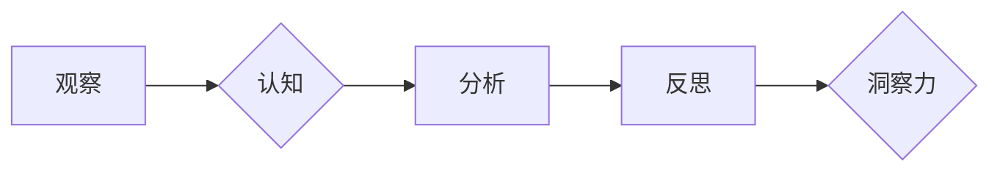

> 洞察力，观察，反思，模式识别，知识构建，创新，人工智能，机器学习

## 1. 背景介绍

在瞬息万变的科技时代，洞察力已成为至关重要的竞争优势。无论是企业决策、产品创新还是技术突破，都离不开对复杂现象的深刻理解和前瞻性预判。然而，洞察力并非天生的天赋，而是通过不断观察、思考和反思逐步积累的宝贵财富。

人工智能的兴起为洞察力的提升提供了强大的工具和平台。机器学习算法能够从海量数据中识别出隐藏的模式和趋势，为人类提供更全面、更精准的洞察。然而，人工智能仅仅是工具，真正的洞察力来自于人类的思考和判断。

## 2. 核心概念与联系

洞察力的形成是一个复杂的过程，涉及到观察、认知、分析和反思等多个环节。

**观察:** 这是洞察力的起点，需要我们敏锐地捕捉周围环境中的信息，包括数据、事件、行为和语言等。

**认知:**  将观察到的信息转化为有意义的知识，需要我们对事物进行分类、归纳和总结。

**分析:**  深入挖掘信息背后的逻辑关系和因果机制，需要我们运用逻辑思维、推理能力和批判性思考。

**反思:**  对分析结果进行总结和评价，并将其与自身经验和知识体系进行整合，形成新的认知和洞察。

**Mermaid 流程图:**



## 3. 核心算法原理 & 具体操作步骤

### 3.1  算法原理概述

机器学习算法在洞察力形成过程中扮演着重要的角色。这些算法能够从数据中学习模式和规律，并将其应用于新的数据预测和分析。常见的机器学习算法包括：

* **监督学习:**  利用标记数据训练模型，预测新的数据标签。例如，图像分类、文本情感分析等。
* **无监督学习:**  从未标记数据中发现隐藏的结构和模式。例如，聚类分析、降维等。
* **强化学习:**  通过试错学习，在环境中获得最大奖励。例如，游戏AI、机器人控制等。

### 3.2  算法步骤详解

以监督学习为例，其基本步骤如下：

1. **数据收集和预处理:**  收集相关数据，并进行清洗、转换和特征工程等预处理操作。
2. **模型选择:**  根据任务需求选择合适的机器学习模型。
3. **模型训练:**  利用标记数据训练模型，调整模型参数以最小化预测误差。
4. **模型评估:**  使用测试数据评估模型性能，并进行调参优化。
5. **模型部署:**  将训练好的模型部署到实际应用场景中。

### 3.3  算法优缺点

**优点:**

* 自动化学习：无需人工编程，模型能够自动从数据中学习。
* 高精度：在特定领域，机器学习模型能够达到甚至超过人类的预测精度。
* 可扩展性：能够处理海量数据，并进行快速预测。

**缺点:**

* 数据依赖：模型性能依赖于训练数据的质量和数量。
* 黑盒效应：模型内部决策机制难以解释，缺乏可解释性。
* 泛化能力：模型可能难以泛化到新的数据分布或场景。

### 3.4  算法应用领域

机器学习算法广泛应用于各个领域，例如：

* **医疗保健:**  疾病诊断、药物研发、个性化治疗等。
* **金融科技:**  欺诈检测、风险评估、投资决策等。
* **电商:**  商品推荐、用户画像、精准营销等。
* **智能交通:**  交通预测、自动驾驶、智能交通管理等。

## 4. 数学模型和公式 & 详细讲解 & 举例说明

### 4.1  数学模型构建

机器学习算法通常基于数学模型进行构建。这些模型试图用数学公式来描述数据之间的关系。例如，线性回归模型试图用一条直线来拟合数据点之间的关系。

### 4.2  公式推导过程

线性回归模型的目标是找到一条直线，使得这条直线与数据点之间的距离最小。

**公式:**

$$y = mx + c$$

其中：

* $y$ 是预测值
* $x$ 是输入特征
* $m$ 是斜率
* $c$ 是截距

**推导过程:**

线性回归模型使用最小二乘法来求解 $m$ 和 $c$ 的值。最小二乘法试图最小化预测值与实际值之间的平方误差。

### 4.3  案例分析与讲解

假设我们有一组数据，记录了房屋面积和房屋价格的关系。我们可以使用线性回归模型来预测房屋价格。

**数据:**

| 房屋面积 (平方米) | 房屋价格 (万元) |
|---|---|
| 60 | 100 |
| 80 | 150 |
| 100 | 200 |
| 120 | 250 |

**模型训练:**

使用线性回归模型训练数据，得到 $m = 1.67$ 和 $c = 66.7$。

**预测:**

如果我们想要预测一个面积为 150 平方米的房屋价格，可以使用以下公式：

$$y = 1.67 * 150 + 66.7 = 300.0$$

因此，我们预测该房屋价格为 300 万元。

## 5. 项目实践：代码实例和详细解释说明

### 5.1  开发环境搭建

本项目使用 Python 语言进行开发，需要安装以下软件：

* Python 3.x
* scikit-learn 库

### 5.2  源代码详细实现

```python
import pandas as pd
from sklearn.linear_model import LinearRegression

# 数据加载
data = pd.read_csv('house_data.csv')

# 特征和目标变量分离
X = data[['面积']]
y = data['价格']

# 模型训练
model = LinearRegression()
model.fit(X, y)

# 模型预测
new_house_area = 150
predicted_price = model.predict([[new_house_area]])
print(f'预测价格: {predicted_price[0]} 万元')
```

### 5.3  代码解读与分析

* 数据加载：使用 pandas 库读取数据文件。
* 特征和目标变量分离：将数据分为输入特征 (面积) 和目标变量 (价格)。
* 模型训练：使用 scikit-learn 库的 LinearRegression 类创建线性回归模型，并使用 fit() 方法训练模型。
* 模型预测：使用 predict() 方法预测新房屋价格。

### 5.4  运行结果展示

运行代码后，将输出预测价格。

## 6. 实际应用场景

### 6.1  金融领域

* **信用评分:**  根据客户的财务数据，预测其信用风险。
* **欺诈检测:**  识别异常交易行为，防止金融欺诈。
* **投资决策:**  分析市场数据，预测股票价格走势。

### 6.2  医疗领域

* **疾病诊断:**  根据患者的症状和检查结果，诊断疾病类型。
* **药物研发:**  预测药物的疗效和安全性。
* **个性化治疗:**  根据患者的基因信息和病史，制定个性化治疗方案。

### 6.3  电商领域

* **商品推荐:**  根据用户的购买历史和浏览记录，推荐相关商品。
* **用户画像:**  分析用户的行为数据，构建用户画像。
* **精准营销:**  根据用户的特征和需求，进行精准营销。

### 6.4  未来应用展望

随着人工智能技术的不断发展，洞察力将应用于更广泛的领域，例如：

* **智能城市:**  利用数据分析，优化城市交通、能源管理和公共安全等。
* **个性化教育:**  根据学生的学习情况，提供个性化的学习方案。
* **科学研究:**  加速科学发现，推动科技创新。

## 7. 工具和资源推荐

### 7.1  学习资源推荐

* **在线课程:**  Coursera、edX、Udacity 等平台提供丰富的机器学习课程。
* **书籍:**  《机器学习》 (周志华)、《深度学习》 (Ian Goodfellow) 等经典书籍。
* **博客和论坛:**  机器学习相关的博客和论坛，例如 Towards Data Science、Kaggle 等。

### 7.2  开发工具推荐

* **Python:**  机器学习开发的常用语言。
* **scikit-learn:**  Python 机器学习库。
* **TensorFlow:**  深度学习框架。
* **PyTorch:**  深度学习框架。

### 7.3  相关论文推荐

* **《机器学习》 (周志华)**
* **《深度学习》 (Ian Goodfellow)**
* **《Pattern Recognition and Machine Learning》 (Christopher M. Bishop)**

## 8. 总结：未来发展趋势与挑战

### 8.1  研究成果总结

近年来，人工智能领域取得了显著进展，机器学习算法在洞察力形成方面发挥了重要作用。

### 8.2  未来发展趋势

* **模型更加智能:**  未来机器学习模型将更加智能，能够更好地理解和解释数据。
* **数据更加丰富:**  随着数据采集技术的进步，机器学习模型将拥有更多的数据进行训练。
* **应用更加广泛:**  机器学习将应用于更多领域，为人类社会带来更多价值。

### 8.3  面临的挑战

* **数据隐私和安全:**  机器学习模型依赖于大量数据，如何保护数据隐私和安全是一个重要挑战。
* **算法可解释性:**  许多机器学习模型是黑盒模型，其决策机制难以解释，这限制了其在一些领域中的应用。
* **算法公平性:**  机器学习模型可能存在偏见，导致不公平的结果，需要研究如何构建公平的算法。

### 8.4  研究展望

未来，人工智能领域的研究将继续深入，探索更智能、更安全、更公平的机器学习算法，为人类社会创造更多价值。

## 9. 附录：常见问题与解答

**问题 1:**  机器学习算法需要多少数据才能训练？

**答案:**  机器学习算法对数据的需求量取决于模型复杂度和任务难度。一般来说，模型越复杂，任务越难，需要的训练数据越多。

**问题 2:**  如何评估机器学习模型的性能？

**答案:**  常用的评估指标包括准确率、召回率、F1-score 等。具体的评估指标选择取决于任务类型和业务需求。

**问题 3:**  如何解决机器学习模型的过拟合问题？

**答案:**  过拟合是指模型在训练数据上表现很好，但在测试数据上表现较差。解决过拟合的方法包括：

* 减少模型复杂度
* 增加训练数据量
* 使用正则化技术
* 使用交叉验证

作者：禅与计算机程序设计艺术 / Zen and the Art of Computer Programming


<end_of_turn>