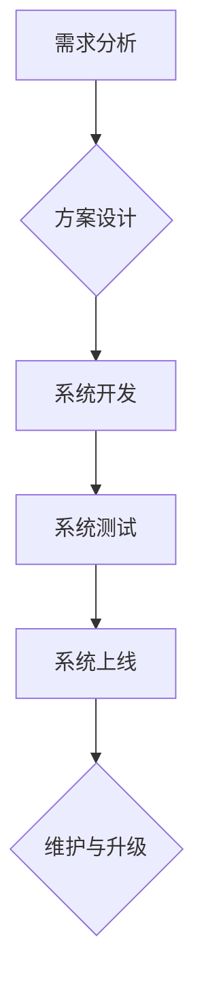

> 消费品行业,信息化建设,数字化转型,供应链管理,数据分析,人工智能,云计算,物联网

## 1. 背景介绍

消费品行业作为国民经济的重要组成部分，近年来面临着激烈的市场竞争和不断变化的消费需求。传统消费品企业的经营模式和管理方式逐渐难以适应新时代的发展趋势。信息化建设和数字化转型已成为消费品行业发展的重要驱动力，能够帮助企业提升运营效率、优化资源配置、增强市场竞争力。

**1.1. 信息化建设的必要性**

信息化建设对于消费品行业具有以下重要意义：

* **提升运营效率:** 通过信息化手段，企业可以实现生产、销售、物流等环节的自动化和智能化，提高运营效率，降低成本。
* **优化资源配置:** 信息化系统可以帮助企业实时掌握市场需求、库存情况、生产进度等信息，实现资源的优化配置，避免资源浪费。
* **增强市场竞争力:** 信息化建设可以帮助企业更好地了解消费者需求，开发更符合市场需求的产品，提升产品竞争力。
* **促进企业转型升级:** 信息化建设是消费品行业数字化转型的基础，能够帮助企业实现业务模式创新、产品创新和管理模式创新。

**1.2. 信息化建设面临的挑战**

消费品行业信息化建设也面临着一些挑战：

* **技术复杂性:** 信息化建设需要掌握多种技术，例如云计算、大数据、人工智能等，技术门槛较高。
* **数据安全问题:** 信息化建设需要处理大量数据，数据安全问题需要得到高度重视。
* **成本投入:** 信息化建设需要投入大量资金，企业需要做好成本控制。
* **人才短缺:** 信息化建设需要专业人才，人才短缺是制约信息化建设的重要因素。

## 2. 核心概念与联系

**2.1. 信息化建设的核心理念**

信息化建设的核心是将信息技术应用于企业经营管理各个环节，实现信息资源的共享、利用和优化。

**2.2. 信息化建设的架构**

信息化建设的架构通常包括以下几个层次：

* **基础设施层:** 包括硬件、软件、网络等基础设施。
* **应用软件层:** 包括企业资源规划 (ERP)、客户关系管理 (CRM)、供应链管理 (SCM) 等应用软件。
* **数据层:** 包括企业内部的数据以及外部的数据。
* **服务层:** 包括数据分析、人工智能等服务。

**2.3. 信息化建设的流程**

信息化建设的流程通常包括以下几个阶段：

* **需求分析:** 确定信息化建设的目标、范围和需求。
* **方案设计:** 设计信息化建设的方案，包括技术架构、应用软件、数据管理等。
* **系统开发:** 开发信息化系统，包括软件开发、硬件配置、网络部署等。
* **系统测试:** 对信息化系统进行测试，确保系统功能正常运行。
* **系统上线:** 将信息化系统上线运行，并进行维护和升级。

**2.4. 信息化建设的流程图**

## 3. 核心算法原理 & 具体操作步骤

**3.1. 算法原理概述**

在消费品行业信息化建设中，各种算法被广泛应用于数据分析、预测、优化等方面。例如，推荐算法可以根据用户的购买历史和喜好，推荐相关的商品；预测算法可以预测未来的市场需求和销售额；优化算法可以优化生产计划和物流配送路线。

**3.2. 算法步骤详解**

具体算法的步骤详解取决于具体的算法类型。例如，协同过滤推荐算法的步骤如下：

1. 收集用户行为数据，例如用户购买历史、浏览记录、评分等。
2. 计算用户之间的相似度，例如基于物品的协同过滤和基于用户的协同过滤。
3. 根据用户相似度，推荐用户可能感兴趣的商品。

**3.3. 算法优缺点**

不同的算法具有不同的优缺点。例如，协同过滤推荐算法的优点是能够推荐个性化的商品，缺点是需要大量的用户行为数据，并且容易出现冷启动问题。

**3.4. 算法应用领域**

算法在消费品行业信息化建设中的应用领域非常广泛，例如：

* **推荐系统:** 推荐商品、广告、内容等。
* **预测分析:** 预测市场需求、销售额、库存水平等。
* **优化决策:** 优化生产计划、物流配送路线、库存管理等。
* **客户关系管理:** 分析客户行为、识别潜在客户、提供个性化服务等。

## 4. 数学模型和公式 & 详细讲解 & 举例说明

**4.1. 数学模型构建**

在信息化建设中，数学模型可以用来描述系统行为、预测未来趋势、优化决策等。例如，可以使用线性回归模型来预测销售额，可以使用决策树模型来进行客户分群。

**4.2. 公式推导过程**

具体的数学模型和公式推导过程取决于具体的应用场景。例如，线性回归模型的公式如下：

$$y = mx + c$$

其中，y是预测值，x是自变量，m是斜率，c是截距。

**4.3. 案例分析与讲解**

例如，可以使用线性回归模型来预测某商品的销售额。假设我们收集了该商品过去一年的销售数据，以及相应的广告投入数据。我们可以将广告投入作为自变量，销售额作为因变量，建立线性回归模型，并通过模型预测未来一年的销售额。

## 5. 项目实践：代码实例和详细解释说明

**5.1. 开发环境搭建**

信息化建设项目需要搭建相应的开发环境，包括硬件、软件、网络等。例如，可以使用云计算平台搭建开发环境，也可以使用本地服务器搭建开发环境。

**5.2. 源代码详细实现**

具体的源代码实现取决于具体的应用场景和技术方案。例如，可以使用Python语言开发一个推荐系统，可以使用Java语言开发一个供应链管理系统。

**5.3. 代码解读与分析**

需要对源代码进行解读和分析，理解代码的功能、逻辑和结构。

**5.4. 运行结果展示**

需要对系统进行测试，并展示系统运行的结果。例如，可以展示推荐系统的推荐结果，展示供应链管理系统的物流配送路线等。

## 6. 实际应用场景

**6.1. 供应链管理**

信息化建设可以帮助消费品企业优化供应链管理，提高供应链效率。例如，可以使用物联网技术跟踪商品的运输过程，可以使用大数据分析预测商品的需求量，可以使用人工智能优化物流配送路线。

**6.2. 生产管理**

信息化建设可以帮助消费品企业提高生产管理效率。例如，可以使用MES系统管理生产过程，可以使用ERP系统整合生产计划和物料需求，可以使用人工智能优化生产流程。

**6.3. 销售管理**

信息化建设可以帮助消费品企业提高销售管理效率。例如，可以使用CRM系统管理客户关系，可以使用电商平台进行线上销售，可以使用数据分析预测市场需求。

**6.4. 未来应用展望**

未来，消费品行业信息化建设将更加深入，更加智能化。例如，将更加广泛应用人工智能、物联网、云计算等新技术，实现更加智能化的生产、销售、物流等管理模式。

## 7. 工具和资源推荐

**7.1. 学习资源推荐**

* **书籍:** 《消费品行业信息化建设与管理》、《数字化转型实践案例》
* **网站:** 中国消费品协会网站、互联网金融协会网站
* **课程:** 线上课程平台提供的消费品行业信息化建设相关课程

**7.2. 开发工具推荐**

* **云计算平台:** AWS、阿里云、腾讯云
* **数据库:** MySQL、MongoDB、Oracle
* **编程语言:** Python、Java、C++

**7.3. 相关论文推荐**

* **消费品行业信息化建设研究**
* **数字化转型对消费品行业的影响**
* **人工智能在消费品行业应用研究**

## 8. 总结：未来发展趋势与挑战

**8.1. 研究成果总结**

消费品行业信息化建设取得了显著成果，提高了企业运营效率、优化了资源配置、增强了市场竞争力。

**8.2. 未来发展趋势**

未来，消费品行业信息化建设将更加深入，更加智能化，将更加广泛应用人工智能、物联网、云计算等新技术。

**8.3. 面临的挑战**

消费品行业信息化建设也面临着一些挑战，例如技术复杂性、数据安全问题、成本投入、人才短缺等。

**8.4. 研究展望**

未来研究需要重点关注以下几个方面：

* **新技术应用:** 研究如何将人工智能、物联网、云计算等新技术应用于消费品行业信息化建设。
* **数据安全:** 研究如何保障消费品行业信息化建设中的数据安全。
* **人才培养:** 加强消费品行业信息化建设人才的培养。

## 9. 附录：常见问题与解答

**9.1. 信息化建设需要投入多少资金？**

信息化建设的资金投入取决于企业的规模、业务类型、技术方案等因素。一般来说，信息化建设的资金投入需要根据企业的实际情况进行规划。

**9.2. 信息化建设需要多少时间？**

信息化建设的时间取决于企业的规模、业务类型、技术方案等因素。一般来说，信息化建设的时间需要根据企业的实际情况进行规划。

**9.3. 信息化建设需要哪些人才？**

信息化建设需要具备以下人才：

* **软件开发工程师:** 负责开发信息化系统。
* **数据库管理员:** 负责管理数据库。
* **网络管理员:** 负责管理网络系统。
* **项目经理:** 负责项目管理。

**9.4. 信息化建设有哪些风险？**

信息化建设存在以下风险：

* **技术风险:** 技术方案不成熟、技术更新速度快等。
* **数据安全风险:** 数据泄露、数据丢失等。
* **成本超支风险:** 项目成本超出预算等。
* **项目延期风险:** 项目进度落后等。

作者：禅与计算机程序设计艺术 / Zen and the Art of Computer Programming 
<end_of_turn>