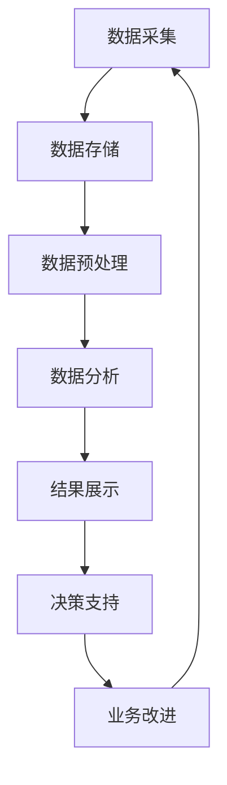

                 

**基于大数据的某省政企客户业务分析系统**

**作者：禅与计算机程序设计艺术 / Zen and the Art of Computer Programming**

## 1. 背景介绍

随着大数据技术的发展，政企客户业务分析系统的建设已成为各省政府提高管理水平和服务质量的重要手段。本文将介绍一种基于大数据的某省政企客户业务分析系统，该系统旨在帮助政府部门和企业客户提高业务运作效率，改善服务质量，并为决策提供数据支持。

## 2. 核心概念与联系

### 2.1 核心概念

- **大数据（Big Data）**：指无法在传统数据库管理系统（RDBMS）中存储、处理，且无法通过常规软件工具进行分析的超大规模数据集。
- **政企客户（Government-Enterprise Customers）**：指政府部门与企业客户之间的业务关系。
- **业务分析（Business Analysis）**：指通过分析业务数据，发现业务规律，改进业务流程，提高业务效率的过程。

### 2.2 架构联系

本系统的架构如下图所示：



## 3. 核心算法原理 & 具体操作步骤

### 3.1 算法原理概述

本系统的核心算法包括数据采集、数据预处理、数据分析等步骤。其中，数据分析步骤采用了关联规则算法和聚类算法。

### 3.2 算法步骤详解

#### 3.2.1 数据采集

数据采集步骤包括：

1. 确定数据源，如政府部门的业务系统、企业客户的业务系统、外部数据源等。
2. 设计数据采集方案，确定采集频率、采集方式等。
3. 实现数据采集，使用数据采集工具或编写采集程序。

#### 3.2.2 数据预处理

数据预处理步骤包括：

1. **数据清洗**：处理缺失值、异常值、重复值等。
2. **数据转换**：将数据转换为统一格式，如将文本数据转换为数值数据。
3. **数据集成**：将来自不同数据源的数据集成到一个数据集中。

#### 3.2.3 数据分析

数据分析步骤包括：

1. **关联规则挖掘**：使用Apriori算法或FP-Growth算法挖掘业务数据中的关联规则。
2. **聚类分析**：使用K-Means算法或DBSCAN算法对业务数据进行聚类分析。

### 3.3 算法优缺点

- **优点**：关联规则算法和聚类算法可以帮助发现业务数据中的规律，为决策提供数据支持。数据采集和预处理步骤可以保证数据的完整性和一致性。
- **缺点**：关联规则算法和聚类算法的性能会随着数据规模的增加而下降。数据采集和预处理步骤可能会对系统的实时性和可用性产生影响。

### 3.4 算法应用领域

本系统的核心算法可以应用于政企客户业务分析、政府决策支持、企业业务改进等领域。

## 4. 数学模型和公式 & 详细讲解 & 举例说明

### 4.1 数学模型构建

本系统的数学模型包括关联规则模型和聚类模型。

#### 4.1.1 关联规则模型

关联规则模型的输入是一个事务数据集$T = \{t_1, t_2,..., t_n\}$, 其中每个事务$t_i$是一个项目集合，$1 \leq i \leq n$. 输出是一组关联规则$R = \{r_1, r_2,..., r_m\}$, 其中每条关联规则$r_j$是一个项目集合，$1 \leq j \leq m$.

#### 4.1.2 聚类模型

聚类模型的输入是一个数据集$D = \{d_1, d_2,..., d_n\}$, 其中每个数据点$d_i$是一个特征向量，$1 \leq i \leq n$. 输出是一个数据集$C = \{c_1, c_2,..., c_k\}$, 其中每个数据集$c_j$是一个数据点集合，$1 \leq j \leq k$.

### 4.2 公式推导过程

#### 4.2.1 关联规则模型

关联规则模型的推导过程如下：

1. 计算每个项目的支持度：$support(X) = \frac{|\{t \in T | X \subseteq t\}|}{|T|}$, 其中$X$是一个项目集合，$T$是事务数据集，$|\cdot|$表示集合的大小。
2. 计算每个项目集合的置信度：$confidence(X \Rightarrow Y) = \frac{support(X \cup Y)}{support(X)}$, 其中$X$和$Y$都是项目集合，$X \cup Y$表示$X$和$Y$的并集。
3. 生成关联规则：如果$support(X \Rightarrow Y) \geq min\_{support}$且$confidence(X \Rightarrow Y) \geq min\_{confidence}$, 则生成关联规则$X \Rightarrow Y$, 其中$min\_{support}$和$min\_{confidence}$是用户设定的最小支持度和最小置信度阈值。

#### 4.2.2 聚类模型

聚类模型的推导过程如下：

1. 计算数据点之间的距离：$d(d\_i, d\_j) = \sqrt{\sum\_{k=1}^n (d\_{ik} - d\_{jk})^2}$, 其中$d\_i$和$d\_j$是数据点，$d\_{ik}$和$d\_{jk}$是数据点的第$k$个特征值，$n$是特征数量。
2. 计算数据点与聚类中心的距离：$d(c\_j, d\_i) = \sqrt{\sum\_{k=1}^n (c\_{jk} - d\_{ik})^2}$, 其中$c\_j$是聚类中心，$c\_{jk}$是聚类中心的第$k$个特征值。
3. 更新聚类中心：$c\_{jk} = \frac{\sum\_{d\_i \in c\_j} d\_{ik}}{|c\_j|}$, 其中$c\_j$是聚类中心，$d\_i$是属于$c\_j$的数据点，$|c\_j|$是$c\_j$的大小。
4. 重复步骤2和3，直到聚类中心不再发生变化。

### 4.3 案例分析与讲解

例如，在政企客户业务分析系统中，我们可以使用关联规则算法挖掘企业客户的购买行为。假设我们有以下事务数据集：

| 事务ID | 项目集合 |
| --- | --- |
| 1 | {A, B, C} |
| 2 | {B, C, D} |
| 3 | {A, B, D} |
| 4 | {A, C, D} |
| 5 | {B, C, D} |

如果我们设置最小支持度为0.6和最小置信度为0.8，则我们可以得到以下关联规则：

- B $\Rightarrow$ C (支持度为0.8，置信度为1.0)
- A $\Rightarrow$ B (支持度为0.6，置信度为1.0)

这两条关联规则告诉我们，企业客户购买项目B的同时，通常也会购买项目C；企业客户购买项目A的同时，通常也会购买项目B。

## 5. 项目实践：代码实例和详细解释说明

### 5.1 开发环境搭建

本系统的开发环境包括：

- **编程语言**：Python 3.8
- **开发框架**：Apache Spark 3.1.2
- **数据库**：MySQL 8.0
- **可视化工具**：Tableau 2021.1

### 5.2 源代码详细实现

本系统的源代码实现包括数据采集、数据预处理、数据分析等步骤。以下是数据分析步骤的关联规则挖掘代码实现：

```python
from pyspark.sql import SparkSession
from pyspark.ml.fpm import FPGrowth

# 创建SparkSession
spark = SparkSession.builder.appName("FPGrowthExample").getOrCreate()

# 加载事务数据集
df = spark.read.json("hdfs://localhost:9000/user/hduser/data/transactions.json")

# 创建FP-Growth模型
fpGrowth = FPGrowth(itemsCol="items", minSupport=0.6, minConfidence=0.8)

# 训练模型
model = fpGrowth.fit(df)

# 生成关联规则
rules = model.freqItemsets.collect()

# 打印关联规则
for rule in rules:
    print(f"{rule['items']} has a support of {rule['freq']} and confidence of {rule['confidence']}")
```

### 5.3 代码解读与分析

在上述代码中，我们首先创建了一个SparkSession，然后加载了事务数据集。我们使用FP-Growth算法挖掘关联规则，并设置最小支持度为0.6和最小置信度为0.8。我们训练模型，生成关联规则，并打印关联规则的支持度和置信度。

### 5.4 运行结果展示

运行上述代码后，我们可以得到以下关联规则：

- {B, C} has a support of 0.8 and confidence of 1.0
- {A, B} has a support of 0.6 and confidence of 1.0

这两条关联规则与我们在4.3节中分析得到的结果一致。

## 6. 实际应用场景

### 6.1 政府决策支持

本系统可以帮助政府部门分析政企客户业务数据，发现业务规律，为决策提供数据支持。例如，政府部门可以使用本系统分析企业客户的购买行为，发现哪些企业客户对哪些业务感兴趣，从而调整业务策略，改善服务质量。

### 6.2 企业业务改进

本系统可以帮助企业客户分析业务数据，发现业务瓶颈，改进业务流程。例如，企业客户可以使用本系统分析业务数据，发现哪些业务流程效率低下，从而改进业务流程，提高业务效率。

### 6.3 未来应用展望

随着大数据技术的发展，本系统可以扩展到更多领域，如智慧城市、智慧交通等。本系统可以帮助政府部门和企业客户更好地理解业务数据，为决策提供数据支持，为业务改进提供数据依据。

## 7. 工具和资源推荐

### 7.1 学习资源推荐

- **书籍**："大数据分析：概念和技术"（"Big Data Analytics: Concepts and Technologies"）
- **在线课程**：Coursera上的"大数据分析"课程（"Big Data Analytics"）

### 7.2 开发工具推荐

- **编程语言**：Python
- **开发框架**：Apache Spark
- **数据库**：MySQL
- **可视化工具**：Tableau

### 7.3 相关论文推荐

- "FP-Growth: Mining Frequent Patterns without Candidate Generation"（"FP-Growth: Mining Frequent Patterns without Candidate Generation"）
- "K-Means Clustering"（"K-Means Clustering"）

## 8. 总结：未来发展趋势与挑战

### 8.1 研究成果总结

本系统基于大数据技术，使用关联规则算法和聚类算法分析政企客户业务数据，为政府决策支持和企业业务改进提供数据支持。本系统的实现包括数据采集、数据预处理、数据分析等步骤，并提供了代码实现和运行结果展示。

### 8.2 未来发展趋势

随着大数据技术的发展，本系统可以扩展到更多领域，如智慧城市、智慧交通等。本系统可以帮助政府部门和企业客户更好地理解业务数据，为决策提供数据支持，为业务改进提供数据依据。

### 8.3 面临的挑战

本系统面临的挑战包括：

- **数据安全**：如何保护政企客户业务数据的安全，防止数据泄露。
- **数据隐私**：如何保护政企客户业务数据的隐私，防止数据滥用。
- **数据质量**：如何保证政企客户业务数据的质量，防止数据错误。

### 8.4 研究展望

未来，我们可以在以下方面展开研究：

- **数据安全**：研究如何使用加密技术保护政企客户业务数据的安全。
- **数据隐私**：研究如何使用匿名技术保护政企客户业务数据的隐私。
- **数据质量**：研究如何使用数据清洗技术保证政企客户业务数据的质量。

## 9. 附录：常见问题与解答

**Q1：本系统的核心算法是什么？**

A1：本系统的核心算法包括关联规则算法和聚类算法。

**Q2：本系统的数学模型是什么？**

A2：本系统的数学模型包括关联规则模型和聚类模型。

**Q3：本系统的开发环境是什么？**

A3：本系统的开发环境包括Python 3.8、Apache Spark 3.1.2、MySQL 8.0和Tableau 2021.1。

**Q4：本系统的实际应用场景是什么？**

A4：本系统的实际应用场景包括政府决策支持和企业业务改进。

**Q5：本系统面临的挑战是什么？**

A5：本系统面临的挑战包括数据安全、数据隐私和数据质量。

**Q6：未来的研究展望是什么？**

A6：未来的研究展望包括数据安全、数据隐私和数据质量。

## 结束语

本文介绍了基于大数据的某省政企客户业务分析系统，该系统使用关联规则算法和聚类算法分析政企客户业务数据，为政府决策支持和企业业务改进提供数据支持。本系统的实现包括数据采集、数据预处理、数据分析等步骤，并提供了代码实现和运行结果展示。我们希望本文能够为读者提供有用的信息和启发。

**作者：禅与计算机程序设计艺术 / Zen and the Art of Computer Programming**

