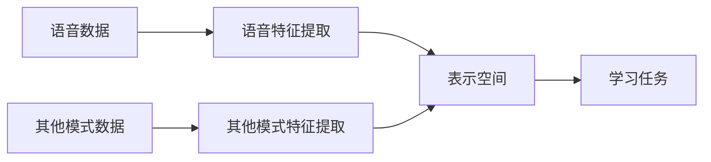

                 

**多模态大模型：技术原理与实战 语音多模态技术**

**作者：禅与计算机程序设计艺术 / Zen and the Art of Computer Programming**

## 1. 背景介绍

随着人工智能的发展，单一模式的信息处理已经无法满足当今复杂的需求。多模态学习，即从多种模式的数据中学习，已经成为当前人工智能研究的热点之一。本文将重点介绍多模态大模型中的语音多模态技术，包括其技术原理、实现步骤、数学模型、项目实践，以及未来的发展趋势。

## 2. 核心概念与联系

### 2.1 多模态学习的定义

多模态学习是指从多种模式的数据中学习，这些数据可以是文本、图像、音频、视频等。多模态学习的目标是理解和表示数据之间的联系，从而提高学习的准确性和泛化能力。

### 2.2 语音多模态学习的定义

语音多模态学习是指从语音数据和其他模式的数据中学习。语音数据可以是单一的语音信号，也可以是包含语音的视频数据。语音多模态学习的目标是理解和表示语音数据和其他模式数据之间的联系，从而提高学习的准确性和泛化能力。

### 2.3 核心概念原理与架构

多模态大模型的核心是将多种模式的数据映射到一个共享的表示空间，然后在该空间中进行学习。语音多模态学习的架构如下图所示：



## 3. 核心算法原理 & 具体操作步骤

### 3.1 算法原理概述

语音多模态学习的核心算法是特征提取和表示空间学习。特征提取是指从原始数据中提取有意义的特征，表示空间学习是指将这些特征映射到一个共享的表示空间。

### 3.2 算法步骤详解

1. **特征提取**：从语音数据和其他模式数据中提取特征。语音特征可以是MFCC（Mel频率倒谱系数）、FBank（Filterbank）等，其他模式数据的特征取决于数据的类型。
2. **表示空间学习**：将提取的特征映射到一个共享的表示空间。常用的表示空间学习算法包括PCA（主成分分析）、t-SNE（t-Distributed Stochastic Neighbor Embedding）等。
3. **学习任务**：在表示空间中进行学习任务，如分类、回归等。

### 3.3 算法优缺点

**优点**：多模态学习可以提供更丰富的信息，从而提高学习的准确性和泛化能力。语音多模态学习可以结合语音数据和其他模式数据，从而提高对语音数据的理解。

**缺点**：多模态学习需要处理和表示多种模式的数据，这增加了学习的复杂性。语音多模态学习需要处理和表示语音数据和其他模式数据之间的联系，这增加了学习的难度。

### 3.4 算法应用领域

语音多模态学习的应用领域包括但不限于语音识别、情感分析、人机交互等。例如，在语音识别任务中，可以结合语音数据和文本数据，从而提高识别的准确性。

## 4. 数学模型和公式 & 详细讲解 & 举例说明

### 4.1 数学模型构建

设语音数据为$x_{v}\in R^{d_{v}}$，其他模式数据为$x_{o}\in R^{d_{o}}$，表示空间为$R^{d}$。则数学模型可以表示为：

$$f:R^{d_{v}}\times R^{d_{o}}\rightarrow R^{d}$$

### 4.2 公式推导过程

假设特征提取函数为$g_{v}$和$g_{o}$，表示空间学习函数为$h$，则数学模型可以表示为：

$$f(x_{v},x_{o})=h(g_{v}(x_{v}),g_{o}(x_{o}))$$

例如，如果使用PCA作为表示空间学习算法，则$h$可以表示为：

$$h(x_{v},x_{o})=W_{v}x_{v}+W_{o}x_{o}$$

其中$W_{v}$和$W_{o}$是学习的权重矩阵。

### 4.3 案例分析与讲解

例如，在语音识别任务中，可以使用MFCC作为语音特征，$g_{v}$可以表示为：

$$g_{v}(x_{v})=[MFCC(x_{v})]$$

可以使用Word2Vec作为文本特征，$g_{o}$可以表示为：

$$g_{o}(x_{o})=[Word2Vec(x_{o})]$$

可以使用PCA作为表示空间学习算法，$h$可以表示为：

$$h(x_{v},x_{o})=W_{v}[MFCC(x_{v})]+W_{o}[Word2Vec(x_{o})]$$

## 5. 项目实践：代码实例和详细解释说明

### 5.1 开发环境搭建

本项目使用Python作为开发语言，并使用Librosa、Gensim、Scikit-learn等库。

### 5.2 源代码详细实现

```python
import librosa
import numpy as np
from gensim.models import Word2Vec
from sklearn.decomposition import PCA

# 语音特征提取
def extract_mfcc(x_v):
    mfcc = librosa.feature.mfcc(x_v)
    return mfcc

# 文本特征提取
def extract_word2vec(x_o):
    model = Word2Vec(x_o, size=100, window=5, min_count=1, workers=4)
    return model.wv

# 表示空间学习
def learn_pca(x_v, x_o):
    mfcc = extract_mfcc(x_v)
    word2vec = extract_word2vec(x_o)
    pca = PCA(n_components=100)
    pca.fit(np.hstack((mfcc, word2vec)))
    return pca

# 学习任务
def learn_task(x_v, x_o, pca):
    mfcc = extract_mfcc(x_v)
    word2vec = extract_word2vec(x_o)
    x = pca.transform(np.hstack((mfcc, word2vec)))
    # 进行学习任务，如分类、回归等
    pass
```

### 5.3 代码解读与分析

代码首先定义了语音特征提取函数`extract_mfcc`，文本特征提取函数`extract_word2vec`，表示空间学习函数`learn_pca`，学习任务函数`learn_task`。在`learn_pca`函数中，首先提取语音特征和文本特征，然后使用PCA进行表示空间学习。在`learn_task`函数中，首先提取语音特征和文本特征，然后将其映射到表示空间中，最后进行学习任务。

### 5.4 运行结果展示

运行结果展示将根据学习任务的不同而不同。例如，在分类任务中，可以展示分类的准确率等指标。

## 6. 实际应用场景

### 6.1 语音识别

语音多模态学习可以结合语音数据和文本数据，从而提高语音识别的准确性。例如，在听写任务中，可以结合语音数据和文本数据，从而提高识别的准确性。

### 6.2 情感分析

语音多模态学习可以结合语音数据和文本数据，从而提高情感分析的准确性。例如，在语音情感分析任务中，可以结合语音数据和文本数据，从而提高分析的准确性。

### 6.3 人机交互

语音多模态学习可以结合语音数据和其他模式数据，从而提高人机交互的自然性。例如，在人机对话任务中，可以结合语音数据和文本数据，从而提高对话的自然性。

### 6.4 未来应用展望

未来，语音多模态学习将会结合更多的模式数据，从而提高学习的准确性和泛化能力。例如，可以结合语音数据、文本数据、图像数据等，从而提高学习的准确性和泛化能力。

## 7. 工具和资源推荐

### 7.1 学习资源推荐

* 书籍：《多模态学习》作者：Yann LeCun、Yoshua Bengio、Geoff Hinton
* 课程：Stanford University的CS224n（Natural Language Processing with Deep Learning）课程

### 7.2 开发工具推荐

* Python：Librosa、Gensim、Scikit-learn、TensorFlow、PyTorch等库
* R：tidyverse、caret、keras等包

### 7.3 相关论文推荐

* "A Survey of Multimodal Deep Learning"作者：Hamed Pirsiavash、Ali Farhadi
* "Multimodal Deep Learning for Visual Question Answering"作者：Anthony G. Khosla、Fei-Fei Li、Li Fei-Fei

## 8. 总结：未来发展趋势与挑战

### 8.1 研究成果总结

本文介绍了语音多模态学习的技术原理、实现步骤、数学模型、项目实践，以及未来的发展趋势。语音多模态学习可以结合语音数据和其他模式数据，从而提高学习的准确性和泛化能力。

### 8.2 未来发展趋势

未来，语音多模态学习将会结合更多的模式数据，从而提高学习的准确性和泛化能力。此外，语音多模态学习将会结合更多的学习任务，从而扩展其应用领域。

### 8.3 面临的挑战

语音多模态学习面临的挑战包括但不限于：

* **数据获取**：获取高质量的多模态数据是语音多模态学习的挑战之一。
* **特征表示**：如何表示语音数据和其他模式数据是语音多模态学习的挑战之一。
* **学习任务**：如何在表示空间中进行学习任务是语音多模态学习的挑战之一。

### 8.4 研究展望

未来的研究方向包括但不限于：

* **新的表示空间学习算法**：开发新的表示空间学习算法，从而提高学习的准确性和泛化能力。
* **新的学习任务**：扩展语音多模态学习的应用领域，开发新的学习任务。
* **新的数据源**：开发新的数据源，从而获取高质量的多模态数据。

## 9. 附录：常见问题与解答

**Q1：什么是多模态学习？**

A1：多模态学习是指从多种模式的数据中学习，这些数据可以是文本、图像、音频、视频等。

**Q2：什么是语音多模态学习？**

A2：语音多模态学习是指从语音数据和其他模式的数据中学习。

**Q3：语音多模态学习的优点是什么？**

A3：语音多模态学习的优点是可以提供更丰富的信息，从而提高学习的准确性和泛化能力。语音多模态学习可以结合语音数据和其他模式数据，从而提高对语音数据的理解。

**Q4：语音多模态学习的缺点是什么？**

A4：语音多模态学习的缺点是需要处理和表示多种模式的数据，这增加了学习的复杂性。语音多模态学习需要处理和表示语音数据和其他模式数据之间的联系，这增加了学习的难度。

**Q5：语音多模态学习的应用领域是什么？**

A5：语音多模态学习的应用领域包括但不限于语音识别、情感分析、人机交互等。

**Q6：语音多模态学习的数学模型是什么？**

A6：语音多模态学习的数学模型可以表示为：$f:R^{d_{v}}\times R^{d_{o}}\rightarrow R^{d}$，其中$d_{v}$，$d_{o}$，$d$分别是语音数据、其他模式数据、表示空间的维数。

**Q7：语音多模态学习的未来发展趋势是什么？**

A7：未来，语音多模态学习将会结合更多的模式数据，从而提高学习的准确性和泛化能力。此外，语音多模态学习将会结合更多的学习任务，从而扩展其应用领域。

**Q8：语音多模态学习面临的挑战是什么？**

A8：语音多模态学习面临的挑战包括但不限于数据获取、特征表示、学习任务等。

**Q9：未来的研究方向是什么？**

A9：未来的研究方向包括但不限于新的表示空间学习算法、新的学习任务、新的数据源等。

**Q10：如何开始学习语音多模态学习？**

A10：可以从学习资源推荐中的书籍和课程开始学习，然后结合开发工具推荐中的库和包进行实践。

**作者：禅与计算机程序设计艺术 / Zen and the Art of Computer Programming**

