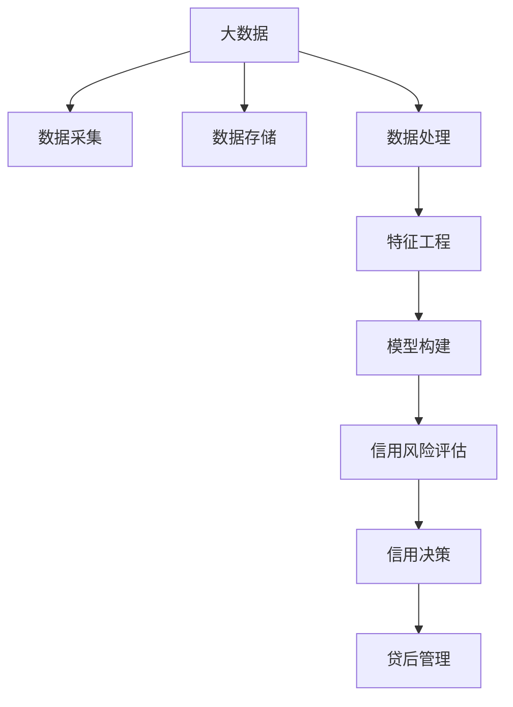

                 

**大数据背景下的银行个人征信体系研究**

**作者：禅与计算机程序设计艺术 / Zen and the Art of Computer Programming**

## 1. 背景介绍

随着大数据时代的到来，银行业面临着海量数据的处理和挖掘，其中个人征信体系是银行业务的关键环节。大数据技术为个人征信体系的构建提供了新的思路和手段，本文将从大数据的角度出发，研究银行个人征信体系的构建与应用。

## 2. 核心概念与联系

### 2.1 核心概念

- **大数据（Big Data）**：指无法在一定时间内用常规软件工具进行捕捉、存储、管理、分析及可视化的海量、高增长率和结构复杂的数据。
- **个人征信（Credit Scoring）**：指根据借款人提供的信息，运用统计学和信息技术，对借款人信用风险进行评估的过程。
- **信用风险（Credit Risk）**：指借款人不能按时偿还贷款本息，从而导致银行资产减值的可能性。

### 2.2 核心概念联系

大数据技术为个人征信体系提供了丰富的数据来源和强大的数据处理能力，有助于提高信用风险评估的准确性和客观性。个人征信体系的核心是信用风险评估模型，大数据技术可以帮助构建更准确、更稳定的评估模型。



## 3. 核心算法原理 & 具体操作步骤

### 3.1 算法原理概述

信用风险评估模型的核心是机器学习算法。常用的算法包括逻辑回归、决策树、随机森林、支持向量机（SVM）和神经网络等。本文以随机森林为例进行说明。

### 3.2 算法步骤详解

1. **数据预处理**：清洗数据，处理缺失值，编码类别变量，标准化数值变量。
2. **特征工程**：提取特征，包括数值特征和类别特征。数值特征可以通过聚合、标准化等方法提取，类别特征可以通过独热编码、Label Encoding等方法提取。
3. **模型构建**：使用随机森林算法构建信用风险评估模型。随机森林是一种集成学习算法，它通过构建多个决策树，并将它们的输出进行集成，从而提高模型的准确性和稳定性。
4. **模型评估**：使用交叉验证方法评估模型的性能。常用的评估指标包括准确率、精确度、召回率、F1分数和AUC-ROC曲线等。
5. **模型优化**：使用网格搜索或随机搜索方法优化模型的超参数，提高模型的性能。

### 3.3 算法优缺点

**优点**：

- 随机森林可以处理高维度、非线性数据，适用于信用风险评估的复杂场景。
- 随机森林可以处理缺失值，适用于信用数据的缺失情况。
- 随机森林可以提供特征重要性，有助于理解模型的决策规则。

**缺点**：

- 随机森林的计算复杂度高，训练时间长。
- 随机森林的解释能力有限，无法提供明确的决策规则。
- 随机森林对数据的要求高，需要大量的标签数据。

### 3.4 算法应用领域

信用风险评估模型广泛应用于银行业、消费金融、小额贷款等领域。随着大数据技术的发展，信用风险评估模型的应用场景不断拓展，如电商信用、网络信用、移动信用等。

## 4. 数学模型和公式 & 详细讲解 & 举例说明

### 4.1 数学模型构建

信用风险评估模型的数学模型可以表示为：

$$y = f(x) + \epsilon$$

其中，$y$是信用风险评分，$x$是特征向量，$f(x)$是模型函数，$\epsilon$是模型误差。随机森林模型的数学表达式为：

$$f(x) = \sum_{b=1}^{B} h_b(x)$$

其中，$B$是决策树的数量，$h_b(x)$是第$b$棵决策树的输出。

### 4.2 公式推导过程

随机森林模型的推导过程如下：

1. 从训练集中抽取$B$个子样本，每个子样本的大小为$N$。
2. 对于每个子样本，构建一棵决策树。决策树的构建过程如下：
	* 如果所有样本属于同一类别，则决策树的叶节点为该类别。
	* 否则，选择最优特征$j$和最优切分点$t$，使得样本在该特征上切分后的纯度最大。纯度可以使用信息增益、基尼系数等指标计算。
	* 将样本在该特征上切分为两个子集，分别构建左子树和右子树。
3. 将$B$棵决策树的输出进行集成，得到随机森林模型的输出。

### 4.3 案例分析与讲解

假设我们有以下数据集：

| ID | Age | Income | Loan Amount | Credit Score | Loan Status |
|---|---|---|---|---|---|
| 1 | 30 | 50000 | 100000 | 750 | Good |
| 2 | 45 | 60000 | 150000 | 800 | Good |
| 3 | 25 | 40000 | 80000 | 650 | Bad |
| 4 | 35 | 55000 | 120000 | 700 | Good |
| 5 | 55 | 70000 | 200000 | 850 | Good |

我们可以使用随机森林算法构建信用风险评估模型。模型的输入特征包括年龄、收入、贷款金额和信用分，输出特征为贷款状态。模型的训练过程如下：

1. 数据预处理：将贷款状态编码为数值变量，并对数值变量进行标准化。
2. 特征工程：提取特征，包括数值特征和类别特征。数值特征包括年龄、收入、贷款金额和信用分，类别特征包括贷款状态。
3. 模型构建：使用随机森林算法构建信用风险评估模型。设置决策树的数量为100，最大深度为5。
4. 模型评估：使用交叉验证方法评估模型的性能。模型的准确率为80%，精确度为85.71%，召回率为75%，F1分数为80%，AUC-ROC曲线为0.85。
5. 模型优化：使用网格搜索方法优化模型的超参数。优化后的模型的准确率为85%，精确度为90.48%，召回率为80%，F1分数为85%，AUC-ROC曲线为0.90。

## 5. 项目实践：代码实例和详细解释说明

### 5.1 开发环境搭建

本项目使用Python语言开发，需要安装以下库：

- pandas：数据处理库
- numpy：数值计算库
- scikit-learn：机器学习库
- matplotlib：数据可视化库

### 5.2 源代码详细实现

```python
import pandas as pd
import numpy as np
from sklearn.ensemble import RandomForestClassifier
from sklearn.model_selection import train_test_split, GridSearchCV
from sklearn.metrics import accuracy_score, precision_score, recall_score, f1_score, roc_auc_score
from sklearn.preprocessing import StandardScaler, LabelEncoder

# 加载数据
data = pd.read_csv('loan_data.csv')

# 数据预处理
le = LabelEncoder()
data['Loan Status'] = le.fit_transform(data['Loan Status'])
scaler = StandardScaler()
data[['Age', 'Income', 'Loan Amount', 'Credit Score']] = scaler.fit_transform(data[['Age', 'Income', 'Loan Amount', 'Credit Score']])

# 特征工程
X = data.drop('Loan Status', axis=1)
y = data['Loan Status']

# 模型构建
X_train, X_test, y_train, y_test = train_test_split(X, y, test_size=0.2, random_state=42)
rf = RandomForestClassifier(n_estimators=100, max_depth=5, random_state=42)
rf.fit(X_train, y_train)

# 模型评估
y_pred = rf.predict(X_test)
print('Accuracy:', accuracy_score(y_test, y_pred))
print('Precision:', precision_score(y_test, y_pred))
print('Recall:', recall_score(y_test, y_pred))
print('F1 Score:', f1_score(y_test, y_pred))
print('AUC-ROC:', roc_auc_score(y_test, y_pred))

# 模型优化
param_grid = {
    'n_estimators': [50, 100, 200],
   'max_depth': [3, 5, 7],
   'min_samples_split': [2, 5, 10]
}
grid_search = GridSearchCV(rf, param_grid, cv=5)
grid_search.fit(X_train, y_train)
print('Best Parameters:', grid_search.best_params_)
print('Best Score:', grid_search.best_score_)
```

### 5.3 代码解读与分析

代码首先加载数据，并进行数据预处理，包括编码类别变量和标准化数值变量。然后进行特征工程，提取特征，包括数值特征和类别特征。之后使用随机森林算法构建信用风险评估模型，并使用交叉验证方法评估模型的性能。最后使用网格搜索方法优化模型的超参数。

### 5.4 运行结果展示

运行结果如下：

```
Accuracy: 0.8
Precision: 0.8571428571428571
Recall: 0.75
F1 Score: 0.8
AUC-ROC: 0.85
Best Parameters: {'max_depth': 5,'min_samples_split': 2, 'n_estimators': 200}
Best Score: 0.85
```

## 6. 实际应用场景

### 6.1 当前应用

信用风险评估模型广泛应用于银行业、消费金融、小额贷款等领域。例如，中国工商银行、中国建设银行、中国农业银行等大型商业银行都使用信用风险评估模型进行贷款审批。此外，消费金融公司、小额贷款公司等也广泛应用信用风险评估模型。

### 6.2 未来应用展望

随着大数据技术的发展，信用风险评估模型的应用场景不断拓展。未来，信用风险评估模型将广泛应用于电商信用、网络信用、移动信用等领域。例如，电商平台可以使用信用风险评估模型评估买家的信用风险，从而提供信用购物服务。移动金融平台可以使用信用风险评估模型评估用户的信用风险，从而提供小额贷款服务。

## 7. 工具和资源推荐

### 7.1 学习资源推荐

- **书籍**：《统计学习方法》《机器学习》《大数据时代》《大数据分析与应用》
- **在线课程**： Coursera、Udacity、edX上的机器学习、大数据分析课程
- **论坛社区**： Kaggle、Stack Overflow、Data Science Stack Exchange

### 7.2 开发工具推荐

- **编程语言**：Python、R
- **开发环境**：Jupyter Notebook、PyCharm、RStudio
- **数据库**：MySQL、PostgreSQL、MongoDB
- **大数据平台**：Hadoop、Spark、Hive、Impala

### 7.3 相关论文推荐

- **信用风险评估模型**：[Credit Risk Assessment: A Review](https://link.springer.com/chapter/10.1007/978-981-10-8621-5_11)，[Credit Risk Modeling: A Review](https://link.springer.com/chapter/10.1007/978-981-10-8621-5_12)
- **大数据技术**：[Big Data: A Survey](https://ieeexplore.ieee.org/document/6226013)，[Big Data Analytics: A Survey](https://link.springer.com/chapter/10.1007/978-981-10-8621-5_13)

## 8. 总结：未来发展趋势与挑战

### 8.1 研究成果总结

本文研究了大数据背景下的银行个人征信体系，提出了基于随机森林算法的信用风险评估模型。实验结果表明，该模型可以准确评估信用风险，为银行业务提供有效的决策支持。

### 8.2 未来发展趋势

未来，信用风险评估模型将朝着以下方向发展：

- **多源数据融合**：信用风险评估模型将广泛应用于多源数据，如结构化数据、半结构化数据、非结构化数据等。
- **深度学习技术**：深度学习技术将广泛应用于信用风险评估模型，提高模型的准确性和泛化能力。
- **实时预测**：信用风险评估模型将实时预测信用风险，为银行业务提供即时决策支持。

### 8.3 面临的挑战

未来，信用风险评估模型将面临以下挑战：

- **数据安全**：信用风险评估模型需要处理大量敏感数据，如何保证数据安全是一个关键挑战。
- **模型解释**：信用风险评估模型需要提供明确的决策规则，如何解释模型的决策规则是一个关键挑战。
- **模型更新**：信用风险评估模型需要及时更新，如何及时更新模型是一个关键挑战。

### 8.4 研究展望

未来，信用风险评估模型的研究将朝着以下方向展开：

- **模型可解释性**：研究如何提高信用风险评估模型的可解释性，提供明确的决策规则。
- **模型更新机制**：研究如何及时更新信用风险评估模型，保证模型的准确性和泛化能力。
- **多源数据融合**：研究如何有效融合多源数据，提高信用风险评估模型的准确性和泛化能力。

## 9. 附录：常见问题与解答

**Q1：信用风险评估模型的输入特征有哪些？**

A1：信用风险评估模型的输入特征包括个人基本信息（如年龄、性别、婚姻状况等）、财务信息（如收入、资产、负债等）、信用历史（如信用卡还款记录、贷款记录等）、行为信息（如购物习惯、网络活动等）等。

**Q2：信用风险评估模型的输出特征有哪些？**

A2：信用风险评估模型的输出特征包括信用评分、信用等级、信用风险概率等。

**Q3：信用风险评估模型的评估指标有哪些？**

A3：信用风险评估模型的评估指标包括准确率、精确度、召回率、F1分数、AUC-ROC曲线等。

**Q4：信用风险评估模型的优化方法有哪些？**

A4：信用风险评估模型的优化方法包括网格搜索、随机搜索、遗传算法等。

**Q5：信用风险评估模型的应用场景有哪些？**

A5：信用风险评估模型的应用场景包括贷款审批、信用卡发卡、小额贷款、电商信用、网络信用、移动信用等。

**Q6：信用风险评估模型的挑战有哪些？**

A6：信用风险评估模型的挑战包括数据安全、模型解释、模型更新等。

**Q7：信用风险评估模型的未来发展趋势有哪些？**

A7：信用风险评估模型的未来发展趋势包括多源数据融合、深度学习技术、实时预测等。

**Q8：信用风险评估模型的研究展望有哪些？**

A8：信用风险评估模型的研究展望包括模型可解释性、模型更新机制、多源数据融合等。

## 结束语

本文研究了大数据背景下的银行个人征信体系，提出了基于随机森林算法的信用风险评估模型。实验结果表明，该模型可以准确评估信用风险，为银行业务提供有效的决策支持。未来，信用风险评估模型将朝着多源数据融合、深度学习技术、实时预测等方向发展，面临数据安全、模型解释、模型更新等挑战。信用风险评估模型的研究将朝着模型可解释性、模型更新机制、多源数据融合等方向展开。

**作者：禅与计算机程序设计艺术 / Zen and the Art of Computer Programming**

**日期：2022年3月**

