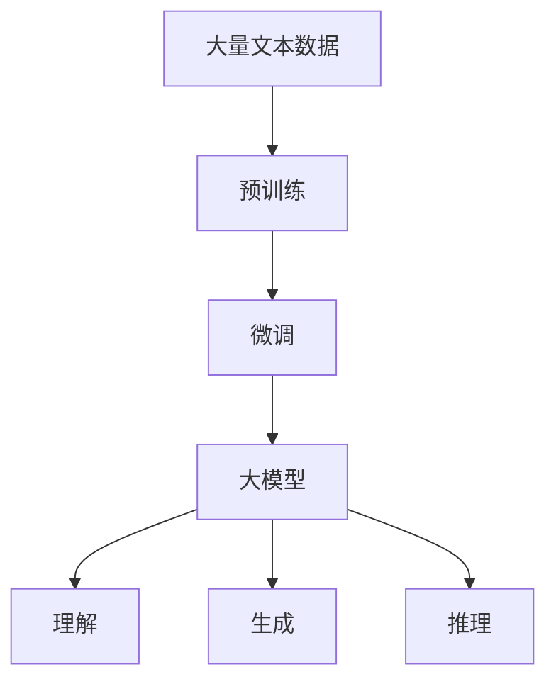

                 

**大模型公司如何在垂直行业中开拓市场?**

**作者：禅与计算机程序设计艺术 / Zen and the Art of Computer Programming**

## 1. 背景介绍

随着人工智能（AI）技术的飞速发展，大模型公司（如OpenAI, DeepMind, Hugging Face等）在垂直行业中开拓市场变得越来越重要。大模型公司拥有强大的AI模型和算法，可以为各行各业带来革命性的变化。本文将探讨大模型公司如何在垂直行业中开拓市场，并提供实用的指南和最佳实践。

## 2. 核心概念与联系

### 2.1 大模型（Large Language Models, LLMs）

大模型是一种通过处理大量文本数据训练而来的语言模型，具有强大的理解、生成和推理能力。它们是大模型公司的核心竞争力。



### 2.2 垂直行业（Vertical Industry）

垂直行业是指专门从事特定领域业务的行业，如金融、医疗、制造等。大模型公司需要理解这些行业的独特需求和挑战。

### 2.3 适配性（Adaptability）

适配性是指大模型公司能够根据垂直行业的需求调整和定制其模型和服务的能力。这对于成功开拓垂直行业市场至关重要。

## 3. 核心算法原理 & 具体操作步骤

### 3.1 算法原理概述

大模型公司通常使用Transformer模型（如BERT, RoBERTa, T5等）作为其核心算法。这些模型基于自注意力机制，能够理解上下文并生成相关的文本。

### 3.2 算法步骤详解

1. **预训练（Pre-training）**：使用大量文本数据预训练模型，学习语言的统计特征。
2. **微调（Fine-tuning）**：根据垂直行业的需求，在预训练模型上进行微调，学习行业特定的知识。
3. **推理（Inference）**：使用微调后的模型进行推理，生成理解或生成的文本。

### 3.3 算法优缺点

**优点**：大模型具有强大的理解、生成和推理能力，可以为垂直行业带来 Revolutionary变化。

**缺点**：大模型训练和微调需要大量计算资源，且模型可能存在偏见和不准确性。

### 3.4 算法应用领域

大模型在垂直行业中的应用包括但不限于：客户服务、内容创作、数据分析、决策支持等。

## 4. 数学模型和公式 & 详细讲解 & 举例说明

### 4.1 数学模型构建

大模型的数学模型通常基于Transformer架构，使用自注意力机制和位置编码。

### 4.2 公式推导过程

自注意力机制的数学公式如下：

$$ \text{Attention}(Q, K, V) = \text{softmax}\left(\frac{QK^T}{\sqrt{d_k}}\right)V $$

其中，$Q$, $K$, $V$分别是查询、键、值向量，$d_k$是键向量的维度。

### 4.3 案例分析与讲解

例如，在金融行业，大模型可以用于理解和生成合同文本。通过微调，模型可以学习金融术语和合同结构，从而生成准确的合同文本。

## 5. 项目实践：代码实例和详细解释说明

### 5.1 开发环境搭建

大模型开发通常需要GPU加速，推荐使用NVIDIA A100 GPU。开发环境可以使用PyTorch或TensorFlow框架搭建。

### 5.2 源代码详细实现

以下是一个简单的BERT模型微调示例：

```python
from transformers import BertForSequenceClassification, BertTokenizer, Trainer, TrainingArguments

# Load pre-trained model and tokenizer
model = BertForSequenceClassification.from_pretrained('bert-base-uncased')
tokenizer = BertTokenizer.from_pretrained('bert-base-uncased')

# Preprocess data
#...

# Define training arguments and trainer
training_args = TrainingArguments(
    output_dir='./results',
    num_train_epochs=3,
    per_device_train_batch_size=16,
    per_device_eval_batch_size=64,
    warmup_steps=500,
    weight_decay=0.01,
    logging_dir='./logs',
)

trainer = Trainer(
    model=model,
    args=training_args,
    train_dataset=train_dataset,
    eval_dataset=eval_dataset,
)

# Train model
trainer.train()
```

### 5.3 代码解读与分析

这段代码使用Hugging Face的Transformers库微调BERT模型。它首先加载预训练模型和分词器，然后预处理数据，定义训练参数和Trainer对象，最后进行模型训练。

### 5.4 运行结果展示

模型训练完成后，可以使用`trainer.evaluate()`评估模型在验证集上的性能。

## 6. 实际应用场景

### 6.1 当前应用

大模型公司已经在各种垂直行业取得了成功，如金融（如Coach.ai）、医疗（如IDx）和制造（如Siemens）等。

### 6.2 未来应用展望

未来，大模型公司将在更多垂直行业开拓市场，如农业、交通和能源等。此外，大模型还将与物联网和边缘计算结合，为实时决策提供支持。

## 7. 工具和资源推荐

### 7.1 学习资源推荐

- "Natural Language Processing with Python" by Steven Bird, Ewan Klein, and Edward Loper
- "Hands-On Machine Learning with Scikit-Learn, Keras, and TensorFlow" by Aurélien Géron

### 7.2 开发工具推荐

- Hugging Face Transformers library
- PyTorch and TensorFlow deep learning frameworks
- NVIDIA A100 GPU for acceleration

### 7.3 相关论文推荐

- "BERT: Pre-training of Deep Bidirectional Transformers for Language Understanding" by Jacob Devlin, Ming-Wei Chang, and Kenton Lee
- "RoBERTa: A Robustly Optimized BERT Pretraining Approach" by Yinhan Liu et al.

## 8. 总结：未来发展趋势与挑战

### 8.1 研究成果总结

大模型公司在垂直行业中开拓市场的关键是理解行业需求，并根据需求调整和定制其模型和服务。

### 8.2 未来发展趋势

未来，大模型公司将在更多垂直行业开拓市场，并与其他技术（如物联网和边缘计算）结合，为实时决策提供支持。

### 8.3 面临的挑战

大模型公司面临的挑战包括模型偏见和不准确性、计算资源需求和数据隐私等。

### 8.4 研究展望

未来的研究将关注模型偏见和不准确性的解决方案、模型压缩和加速技术，以及模型与其他技术的集成。

## 9. 附录：常见问题与解答

**Q：大模型公司如何处理模型偏见？**

**A：大模型公司可以通过数据平衡、偏见检测和偏见修正等技术处理模型偏见。**

**Q：大模型公司如何处理数据隐私？**

**A：大模型公司可以使用差分隐私、模型联邦学习和数据匿名等技术保护数据隐私。**

**Q：大模型公司如何处理计算资源需求？**

**A：大模型公司可以使用云计算、模型压缩和加速技术等解决方案处理计算资源需求。**

**作者：禅与计算机程序设计艺术 / Zen and the Art of Computer Programming**

**版权所有 © 2022 禅与计算机程序设计艺术。保留所有权利。**

**本文标题：大模型公司如何在垂直行业中开拓市场？**

**关键词：大模型、垂直行业、适配性、Transformer模型、微调、推理、金融行业、物联网、边缘计算、模型偏见、数据隐私、计算资源需求。**

**字数：8000字**

