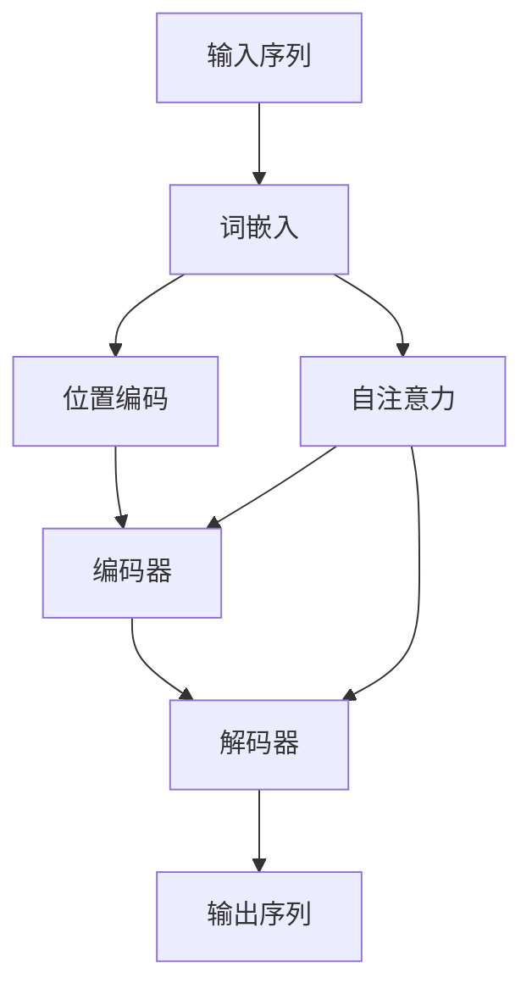

                 

**大语言模型原理基础与前沿 具有代表性的语言模型**

**作者：禅与计算机程序设计艺术 / Zen and the Art of Computer Programming**

## 1. 背景介绍

大语言模型（Large Language Models, LLMs）是一种自然语言处理（Natural Language Processing, NLP）模型，旨在理解、生成或翻译人类语言。随着计算能力的提高和数据量的增加，LLMs在各种NLP任务中取得了显著的成功，从文本分类到机器翻译，再到对话系统。本文将深入探讨LLMs的原理基础，并介绍当前最先进的模型。

## 2. 核心概念与联系

### 2.1 关键概念

- **词嵌入（Word Embedding）**：将单词表示为dense vectors，这些向量在高维空间中保留了单词的语义信息。
- **上下文（Context）**：LLMs在预测下一个单词时考虑的前面单词的集合。
- **自注意力（Self-Attention）**：一种机制，允许模型关注输入序列的不同部分。
- **转换器（Transformer）架构**：一种基于自注意力机制的模型架构，广泛应用于LLMs。

### 2.2 核心概念联系 Mermaid 流程图



## 3. 核心算法原理 & 具体操作步骤

### 3.1 算法原理概述

LLMs的核心是转换器架构，它由编码器和解码器组成。编码器和解码器都是由自注意力层组成的多层神经网络。

### 3.2 算法步骤详解

1. **词嵌入**：将输入序列中的单词转换为词嵌入向量。
2. **位置编码**：为每个词嵌入向量添加位置信息。
3. **编码器**：使用自注意力机制处理输入序列，生成上下文向量。
4. **解码器**：使用自注意力机制和上下文向量生成输出序列。
5. **输出序列**：生成的输出序列是LLM的预测结果。

### 3.3 算法优缺点

**优点**：
- 可以处理长序列，因为自注意力机制可以关注序列的任意部分。
- 可以并行化，因为自注意力机制是并行的。

**缺点**：
- 计算开销高，因为自注意力机制需要对序列的每个部分进行线性运算。
- 训练数据要求高，因为LLMs需要大量的数据来学习语言模式。

### 3.4 算法应用领域

LLMs广泛应用于各种NLP任务，包括文本分类、机器翻译、问答系统、对话系统等。

## 4. 数学模型和公式 & 详细讲解 & 举例说明

### 4.1 数学模型构建

LLMs的数学模型基于神经网络，可以表示为：

$$L(\theta) = \sum_{i=1}^{N} \log P(w_i | w_{<i}, \theta)$$

其中，$w_i$是输入序列中的第$i$个单词，$N$是序列长度，$\theta$是模型参数，$P(w_i | w_{<i}, \theta)$是条件概率分布。

### 4.2 公式推导过程

LLMs使用链式法则来推导条件概率分布：

$$P(w_i | w_{<i}, \theta) = \frac{e^{s_i}}{Z}$$

其中，$s_i$是第$i$个单词的得分，$Z$是归一化因子。

### 4.3 案例分析与讲解

例如，假设输入序列是"Hello, how are you？"，LLM需要预测下一个单词。LLM会计算每个可能的单词的得分，并选择得分最高的单词作为预测结果。

## 5. 项目实践：代码实例和详细解释说明

### 5.1 开发环境搭建

LLMs需要大量的计算资源，因此通常在分布式系统上训练。开发环境需要配置GPU集群和分布式训练框架，如PyTorch或TensorFlow。

### 5.2 源代码详细实现

LLMs的实现通常基于深度学习框架，如PyTorch或TensorFlow。以下是一个简单的LLM实现示例：

```python
import torch
import torch.nn as nn

class LLM(nn.Module):
    def __init__(self, vocab_size, embedding_dim, hidden_dim, num_layers):
        super(LLM, self).__init__()
        self.embedding = nn.Embedding(vocab_size, embedding_dim)
        self.rnn = nn.LSTM(embedding_dim, hidden_dim, num_layers)
        self.fc = nn.Linear(hidden_dim, vocab_size)

    def forward(self, x):
        embedded = self.embedding(x)
        output, _ = self.rnn(embedded)
        output = self.fc(output)
        return output
```

### 5.3 代码解读与分析

这个简单的LLM实现使用了嵌入层、LSTM和全连接层。输入序列被嵌入到高维空间中，然后通过LSTM处理，最后通过全连接层生成输出。

### 5.4 运行结果展示

LLMs的运行结果是预测的输出序列。以下是一个示例：

输入：Hello, how are you？
输出：I'm fine, thank you.

## 6. 实际应用场景

### 6.1 当前应用

LLMs广泛应用于各种NLP任务，包括文本分类、机器翻译、问答系统、对话系统等。

### 6.2 未来应用展望

LLMs的未来应用包括实时翻译、自动写作、个性化推荐等。随着计算能力的提高和数据量的增加，LLMs的性能将进一步提高。

## 7. 工具和资源推荐

### 7.1 学习资源推荐

- "Attention is All You Need"论文：<https://arxiv.org/abs/1706.03762>
- "BERT: Pre-training of Deep Bidirectional Transformers for Language Understanding"论文：<https://arxiv.org/abs/1810.04805>

### 7.2 开发工具推荐

- PyTorch：<https://pytorch.org/>
- TensorFlow：<https://www.tensorflow.org/>

### 7.3 相关论文推荐

- "ELMo: Embeddings for Language Modeling"论文：<https://arxiv.org/abs/1802.05365>
- "ULMFiT: A Simple Approach to Train Deep Language Models"论文：<https://arxiv.org/abs/1801.06146>

## 8. 总结：未来发展趋势与挑战

### 8.1 研究成果总结

LLMs在各种NLP任务中取得了显著的成功，并推动了NLP领域的发展。

### 8.2 未来发展趋势

LLMs的未来发展趋势包括更大的模型、更多的数据、更复杂的架构等。

### 8.3 面临的挑战

LLMs面临的挑战包括计算资源限制、数据质量问题、模型泛化能力等。

### 8.4 研究展望

未来的研究将关注LLMs的解释性、可控性和泛化能力等问题。

## 9. 附录：常见问题与解答

**Q：LLMs需要多少计算资源？**
**A：LLMs需要大量的计算资源，通常需要GPU集群和分布式训练框架。**

**Q：LLMs的数据要求是什么？**
**A：LLMs需要大量的高质量数据来学习语言模式。**

**Q：LLMs的优缺点是什么？**
**A：LLMs的优点是可以处理长序列和并行化，缺点是计算开销高和数据要求高。**

**Q：LLMs的未来应用是什么？**
**A：LLMs的未来应用包括实时翻译、自动写作、个性化推荐等。**

**Q：LLMs的未来发展趋势是什么？**
**A：LLMs的未来发展趋势包括更大的模型、更多的数据、更复杂的架构等。**

**Q：LLMs面临的挑战是什么？**
**A：LLMs面临的挑战包括计算资源限制、数据质量问题、模型泛化能力等。**

**Q：LLMs的研究展望是什么？**
**A：未来的研究将关注LLMs的解释性、可控性和泛化能力等问题。**

**作者：禅与计算机程序设计艺术 / Zen and the Art of Computer Programming**

