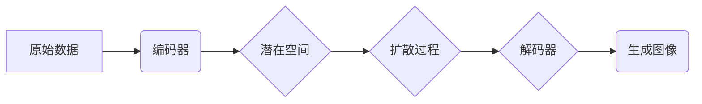

> 潜在扩散模型，Latent Diffusion Model，扩散模型，文本到图像生成，图像修复，图像编辑，深度学习，生成对抗网络

## 1. 背景介绍

近年来，生成对抗网络（GAN）在图像生成领域取得了显著进展，但其训练过程往往不稳定，难以收敛。扩散模型作为一种新兴的生成模型，凭借其稳定性、易于训练的特点，在图像生成、图像修复、图像编辑等领域展现出巨大的潜力。

潜在扩散模型（Latent Diffusion Model，LDM）是扩散模型的一种变体，它将扩散过程进行在潜在空间中，从而有效降低了计算复杂度，提高了生成图像的质量。LDM在文本到图像生成、图像修复等任务上取得了突破性进展，成为当前图像生成领域的研究热点。

## 2. 核心概念与联系

### 2.1 扩散模型

扩散模型是一种基于概率的生成模型，其核心思想是将数据逐渐添加噪声，最终变成纯噪声，然后通过学习逆向过程，从纯噪声中生成原始数据。

**扩散模型的训练过程可以分为两个阶段：**

1. **前向过程（扩散过程）：** 将原始数据逐渐添加噪声，直到变成纯噪声。
2. **后向过程（反扩散过程）：** 学习从纯噪声中逐渐去除噪声，最终生成原始数据。

### 2.2 潜在空间

潜在空间是一种低维度的表示空间，可以将高维数据映射到更低维度的空间，同时保留数据的关键信息。

**潜在空间的优势：**

* **降低计算复杂度：** 在潜在空间中进行操作，可以有效降低计算复杂度。
* **提高生成图像质量：** 潜在空间可以更好地捕捉数据的本质特征，从而生成更高质量的图像。

### 2.3 潜在扩散模型

潜在扩散模型将扩散过程进行在潜在空间中，从而结合了扩散模型的优势和潜在空间的优势。

**潜在扩散模型的架构：**

1. **编码器：** 将原始数据映射到潜在空间。
2. **扩散过程：** 在潜在空间中逐渐添加噪声。
3. **解码器：** 从潜在空间中生成图像。

**Mermaid 流程图：**



## 3. 核心算法原理 & 具体操作步骤

### 3.1 算法原理概述

潜在扩散模型的核心思想是学习一个从纯噪声到原始数据的逆向过程。

**具体来说，LDM的训练过程可以分为以下步骤：**

1. **前向过程：** 将原始数据逐渐添加噪声，直到变成纯噪声。
2. **后向过程：** 学习从纯噪声中逐渐去除噪声，最终生成原始数据。

### 3.2 算法步骤详解

**1. 前向过程：**

* 将原始数据输入编码器，将其映射到潜在空间。
* 在潜在空间中，逐步添加噪声，直到数据变成纯噪声。

**2. 后向过程：**

* 从纯噪声开始，学习逐渐去除噪声，最终生成原始数据。
* 使用解码器将潜在空间中的数据解码成图像。

**3. 训练过程：**

* 使用最小二乘法或变分自编码器（VAE）等方法，训练模型学习前向过程和后向过程。

### 3.3 算法优缺点

**优点：**

* **稳定性好：** 训练过程相对稳定，易于收敛。
* **生成图像质量高：** 可以生成高质量的图像。
* **可解释性强：** 扩散过程可以被理解为一种渐进式的降噪过程。

**缺点：**

* **计算复杂度高：** 训练过程需要大量的计算资源。
* **训练时间长：** 训练过程需要较长时间。

### 3.4 算法应用领域

* 文本到图像生成
* 图像修复
* 图像编辑
* 3D建模
* 视频生成

## 4. 数学模型和公式 & 详细讲解 & 举例说明

### 4.1 数学模型构建

潜在扩散模型的数学模型可以表示为一个马尔可夫链，其中每个状态代表数据在扩散过程中的一个阶段。

**状态转移概率：**

$$
p(x_t | x_{t-1}) = \mathcal{N}(x_t; \sqrt{1-\beta_t} x_{t-1}, \beta_t I)
$$

其中：

* $x_t$ 表示数据在第 $t$ 个时间步的状态。
* $x_{t-1}$ 表示数据在第 $t-1$ 个时间步的状态。
* $\beta_t$ 是一个控制噪声添加程度的超参数。
* $I$ 是单位矩阵。

**目标函数：**

$$
\mathcal{L} = \mathbb{E}_{x, \epsilon} [-\log p_{\theta}(x_0 | x_T + \epsilon)]
$$

其中：

* $x_0$ 是原始数据。
* $x_T$ 是纯噪声。
* $\epsilon$ 是噪声项。
* $p_{\theta}(x_0 | x_T + \epsilon)$ 是模型预测的原始数据在纯噪声加上噪声项后的概率。

### 4.2 公式推导过程

**目标函数的推导过程：**

* 使用贝叶斯公式，将目标函数表示为：

$$
\mathcal{L} = \mathbb{E}_{x, \epsilon} [-\log p_{\theta}(x_0 | x_T + \epsilon)] = \mathbb{E}_{x, \epsilon} [-\log \frac{p_{\theta}(x_T + \epsilon | x_0) p_{\theta}(x_0)}{p_{\theta}(x_T + \epsilon)}]
$$

* 由于 $p_{\theta}(x_T + \epsilon)$ 是一个常数，可以将其忽略。
* 使用链式法则，将 $p_{\theta}(x_T + \epsilon | x_0)$ 表示为一系列状态转移概率的乘积。
* 将状态转移概率代入目标函数，得到最终的目标函数。

### 4.3 案例分析与讲解

**案例：**

使用潜在扩散模型生成一张猫的图像。

**步骤：**

1. 将一张猫的图像输入编码器，将其映射到潜在空间。
2. 在潜在空间中，逐步添加噪声，直到数据变成纯噪声。
3. 从纯噪声开始，使用解码器逐渐去除噪声，最终生成一张猫的图像。

**分析：**

潜在扩散模型可以学习到猫的特征，并将其表示在潜在空间中。通过逐渐去除噪声，模型可以生成一张逼真的猫的图像。

## 5. 项目实践：代码实例和详细解释说明

### 5.1 开发环境搭建

* Python 3.7+
* PyTorch 1.7+
* CUDA 10.2+
* 其他依赖库：torchvision, numpy, matplotlib等

### 5.2 源代码详细实现

```python
import torch
import torch.nn as nn
import torch.optim as optim

# 定义编码器
class Encoder(nn.Module):
    def __init__(self):
        super(Encoder, self).__init__()
        # ...

    def forward(self, x):
        # ...

# 定义解码器
class Decoder(nn.Module):
    def __init__(self):
        super(Decoder, self).__init__()
        # ...

    def forward(self, x):
        # ...

# 定义潜在扩散模型
class LatentDiffusionModel(nn.Module):
    def __init__(self):
        super(LatentDiffusionModel, self).__init__()
        self.encoder = Encoder()
        self.decoder = Decoder()

    def forward(self, x):
        # ...

# 实例化模型
model = LatentDiffusionModel()

# 定义损失函数
criterion = nn.MSELoss()

# 定义优化器
optimizer = optim.Adam(model.parameters(), lr=0.001)

# 训练模型
for epoch in range(num_epochs):
    # ...
```

### 5.3 代码解读与分析

* **编码器和解码器：** 编码器将原始数据映射到潜在空间，解码器将潜在空间中的数据解码成图像。
* **潜在扩散模型：** 将编码器和解码器组合在一起，形成潜在扩散模型。
* **训练过程：** 使用最小二乘法或变分自编码器（VAE）等方法，训练模型学习前向过程和后向过程。

### 5.4 运行结果展示

* 使用训练好的模型，可以生成高质量的图像。

## 6. 实际应用场景

### 6.1 文本到图像生成

潜在扩散模型可以根据文本描述生成相应的图像，例如，输入“一只可爱的猫”，模型可以生成一张可爱的猫的图像。

### 6.2 图像修复

潜在扩散模型可以修复损坏的图像，例如，修复图像中的缺失部分或噪声。

### 6.3 图像编辑

潜在扩散模型可以编辑图像，例如，改变图像中的物体位置或颜色。

### 6.4 未来应用展望

* **更逼真的图像生成：** 随着模型的不断改进，生成的图像将更加逼真。
* **更灵活的图像编辑：** 潜在扩散模型可以实现更灵活的图像编辑，例如，根据文本描述编辑图像。
* **新的应用场景：** 潜在扩散模型将在更多领域得到应用，例如，视频生成、3D建模等。

## 7. 工具和资源推荐

### 7.1 学习资源推荐

* **论文：**
    * Denoising Diffusion Probabilistic Models (DDPM)
    * Imagen: Text-to-Image Diffusion Models
* **博客文章：**
    * https://lilianweng.github.io/posts/2021-07-11-diffusion-models/
    * https://towardsdatascience.com/understanding-latent-diffusion-models-a-comprehensive-guide-74949499794c

### 7.2 开发工具推荐

* **PyTorch:** https://pytorch.org/
* **Hugging Face Transformers:** https://huggingface.co/docs/transformers/index

### 7.3 相关论文推荐

* **Denoising Diffusion Probabilistic Models (DDPM)**
* **Imagen: Text-to-Image Diffusion Models**
* **High-Resolution Image Synthesis with Latent Diffusion Models**

## 8. 总结：未来发展趋势与挑战

### 8.1 研究成果总结

潜在扩散模型在图像生成领域取得了显著进展，其生成图像的质量和多样性都得到了大幅提升。

### 8.2 未来发展趋势

* **更高分辨率的图像生成：** 研究更高分辨率的潜在扩散模型，以生成更加细节丰富的图像。
* **更灵活的图像编辑：** 研究更灵活的图像编辑方法，例如，根据文本描述编辑图像。
* **多模态生成：** 研究将潜在扩散模型应用于多模态生成，例如，文本到图像、文本到视频等。

### 8.3 面临的挑战

* **计算复杂度：** 潜在扩散模型的训练过程需要大量的计算资源。
* **训练时间：** 潜在扩散模型的训练时间较长。
* **数据依赖性：** 潜在扩散模型的性能依赖于训练数据的质量。

### 8.4 研究展望

未来，潜在扩散模型将继续朝着更高质量、更灵活、更广泛应用的方向发展。

## 9. 附录：常见问题与解答

* **Q：潜在扩散模型与GAN有什么区别？**

* **A：** 潜在扩散模型和GAN都是生成模型，但其训练过程和原理不同。GAN通过对抗训练生成图像，而潜在扩散模型通过学习从纯噪声中生成原始数据的逆向过程。

* **Q：潜在扩散模型的训练过程需要多长时间？**

* **A：** 潜在扩散模型的训练时间取决于模型的复杂度、数据集的大小和硬件资源等因素。一般来说，训练时间可能需要几天到几周。

* **Q：如何评估潜在扩散模型的性能？**

* **A：** 可以使用诸如Inception Score（IS）、Fréchet Inception Distance（FID）等指标来评估潜在扩散模型的性能。

作者：禅与计算机程序设计艺术 / Zen and the Art of Computer Programming


<end_of_turn>