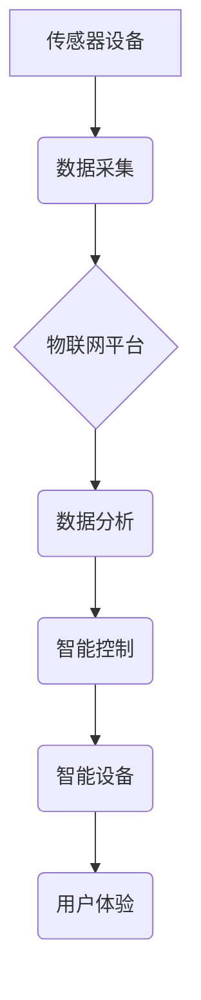

> 物联网 (IoT)、传感器、房地产、智能家居、数据分析、自动化、能源效率、安全保障

## 1. 背景介绍

随着物联网 (IoT) 技术的快速发展和普及，传感器设备的成本不断下降，数据处理能力不断提升，物联网在各个领域都展现出巨大的应用潜力。房地产行业作为传统产业，也开始积极拥抱物联网技术，利用其带来的智能化、高效化和个性化体验，提升居住品质和运营效率。

传统的房地产模式主要以房屋买卖和租赁为主，缺乏对居住者的个性化服务和体验。而物联网技术为房地产行业带来了全新的发展机遇，可以实现房屋智能化管理、个性化定制、安全保障和能源效率提升等功能，从而打造更加智能、舒适、安全和环保的居住环境。

## 2. 核心概念与联系

**2.1 物联网 (IoT)**

物联网是指通过传感器、网络、数据处理和人工智能等技术，将各种物理设备、物体和环境连接起来，形成一个互联互通的智能网络。物联网的核心是数据采集、传输、处理和应用，通过收集和分析设备和环境的数据，实现对设备和环境的远程控制、监控和管理。

**2.2 传感器设备**

传感器是物联网的核心组成部分，负责采集各种物理量信息，例如温度、湿度、光照、压力、气体浓度等。传感器可以是独立的设备，也可以集成在其他设备中，例如智能家居设备、智能门锁、智能照明等。

**2.3 房地产应用场景**

物联网技术在房地产领域的应用场景非常广泛，包括：

* **智能家居:** 通过传感器和智能设备，实现对家居环境的智能控制，例如远程控制灯光、空调、窗帘等，以及根据居住者的习惯和需求自动调节温度、湿度等。
* **安全保障:** 利用传感器和视频监控系统，实现对房屋和财产的安全监控，例如入侵报警、火灾报警、漏水报警等，并及时通知相关人员。
* **能源效率:** 通过传感器监测房屋的能源消耗情况，例如电、水、气等，并根据实际需求进行智能调节，从而降低能源消耗和运营成本。
* **物业管理:** 利用物联网平台，实现对房屋和小区的智能管理，例如远程监控设备状态、收集居民反馈、提供在线服务等，提高物业管理效率和服务质量。

**2.4 架构图**



## 3. 核心算法原理 & 具体操作步骤

**3.1 算法原理概述**

物联网在房地产领域的应用主要依赖于以下核心算法：

* **数据采集和传输算法:** 用于实现传感器设备的实时数据采集和传输，确保数据传输的可靠性和实时性。
* **数据处理和分析算法:** 用于对采集到的数据进行清洗、转换、分析和挖掘，提取有价值的信息，并为智能控制提供决策依据。
* **智能控制算法:** 用于根据数据分析结果，对智能设备进行控制和调节，实现对房屋环境的智能化管理。

**3.2 算法步骤详解**

1. **数据采集:** 传感器设备采集房屋环境的各种物理量信息，例如温度、湿度、光照、压力、气体浓度等。
2. **数据传输:** 传感器设备将采集到的数据通过无线网络或有线网络传输到物联网平台。
3. **数据处理:** 物联网平台对接收到的数据进行清洗、转换、格式化等处理，确保数据的质量和一致性。
4. **数据分析:** 物联网平台利用数据分析算法，对处理后的数据进行分析和挖掘，例如识别模式、发现异常、预测趋势等。
5. **智能控制:** 物联网平台根据数据分析结果，对智能设备进行控制和调节，例如远程控制灯光、空调、窗帘等，以及根据居住者的习惯和需求自动调节温度、湿度等。
6. **用户体验:** 智能设备根据物联网平台的控制指令，实现对房屋环境的智能化管理，为居住者提供更加舒适、安全和便捷的居住体验。

**3.3 算法优缺点**

* **优点:**
    * 智能化管理: 实现对房屋环境的智能化控制和管理，提高居住品质和运营效率。
    * 数据驱动决策: 通过数据分析，为房屋管理和运营提供数据驱动的决策依据。
    * 个性化定制: 根据居住者的需求和习惯，提供个性化的服务和体验。
    * 安全保障: 利用传感器和视频监控系统，实现对房屋和财产的安全监控。
* **缺点:**
    * 系统复杂性: 物联网系统涉及多个环节和技术，系统设计和部署较为复杂。
    * 数据安全: 物联网系统涉及大量数据传输和存储，需要加强数据安全防护。
    * 隐私保护: 物联网系统可能会收集到用户的个人信息，需要妥善处理用户的隐私问题。

**3.4 算法应用领域**

物联网技术在房地产领域的应用不仅限于智能家居，还包括：

* **智慧社区:** 利用物联网技术，实现对社区环境的智能管理，例如垃圾分类、停车管理、公共设施监控等。
* **智慧城市:** 物联网技术可以与城市管理系统集成，实现对城市资源的优化配置和管理，例如交通管理、环境监测、公共安全等。
* **智慧楼宇:** 利用物联网技术，实现对办公楼宇的智能化管理，例如能源管理、安全管理、人员管理等。

## 4. 数学模型和公式 & 详细讲解 & 举例说明

**4.1 数学模型构建**

物联网在房地产领域的应用可以构建以下数学模型：

* **能源消耗模型:**

$$
E = f(T, H, L, P)
$$

其中：

* $E$ 表示房屋的能源消耗量
* $T$ 表示房屋的温度
* $H$ 表示房屋的湿度
* $L$ 表示房屋的光照强度
* $P$ 表示房屋的人员活动量

* **安全风险模型:**

$$
R = g(I, V, A)
$$

其中：

* $R$ 表示房屋的安全风险等级
* $I$ 表示入侵事件的发生概率
* $V$ 表示视频监控系统的覆盖率
* $A$ 表示报警系统的响应时间

**4.2 公式推导过程**

以上模型的具体推导过程需要根据实际应用场景和数据进行调整和优化。例如，能源消耗模型的推导需要考虑房屋的建筑结构、保温性能、设备类型等因素，安全风险模型的推导需要考虑房屋的地理位置、周边环境、安全设施等因素。

**4.3 案例分析与讲解**

假设一个智能家居系统，通过传感器监测房屋的温度、湿度和光照强度，并根据预设的舒适度标准，自动调节空调、窗帘和灯光，从而实现对房屋环境的智能化控制。

通过能源消耗模型，可以分析不同温度、湿度和光照强度下房屋的能源消耗情况，并根据分析结果，优化空调、窗帘和灯光的控制策略，从而降低房屋的能源消耗。

通过安全风险模型，可以评估房屋的安全风险等级，并根据风险等级，调整安全设施的配置和监控策略，例如增加视频监控摄像头、安装入侵报警系统等，从而提高房屋的安全保障水平。

## 5. 项目实践：代码实例和详细解释说明

**5.1 开发环境搭建**

* 操作系统: Ubuntu 20.04 LTS
* 编程语言: Python 3.8
* 物联网平台: AWS IoT Core
* 传感器设备: DHT11 温度湿度传感器

**5.2 源代码详细实现**

```python
import RPi.GPIO as GPIO
import time
import json
import requests

# DHT11传感器引脚配置
DHTPIN = 4

# AWS IoT Core配置
AWS_IOT_ENDPOINT = "a1s3t234567890.iot.us-east-1.amazonaws.com"
AWS_IOT_TOPIC = "iot/sensor/data"
AWS_IOT_KEY_ID = "YOUR_KEY_ID"
AWS_IOT_SECRET_KEY = "YOUR_SECRET_KEY"

# 初始化GPIO
GPIO.setmode(GPIO.BCM)
GPIO.setup(DHTPIN, GPIO.IN)

# DHT11传感器读取函数
def read_dht11():
    # ... (DHT11传感器读取代码)

# 发送数据到AWS IoT Core
def send_data(data):
    # ... (AWS IoT Core数据发送代码)

# 主程序
if __name__ == "__main__":
    try:
        while True:
            # 读取DHT11传感器数据
            temperature, humidity = read_dht11()

            # 组装数据
            data = {
                "temperature": temperature,
                "humidity": humidity
            }

            # 发送数据到AWS IoT Core
            send_data(data)

            # 打印数据
            print(f"Temperature: {temperature:.2f}°C, Humidity: {humidity:.2f}%")

            # 延时
            time.sleep(10)

    except KeyboardInterrupt:
        GPIO.cleanup()
        print("Exiting...")
```

**5.3 代码解读与分析**

* 代码首先定义了传感器引脚、AWS IoT Core配置信息和函数。
* `read_dht11()` 函数负责读取DHT11传感器的温度和湿度数据。
* `send_data()` 函数负责将数据发送到AWS IoT Core。
* 主程序循环读取传感器数据，组装数据并发送到AWS IoT Core，同时打印数据。

**5.4 运行结果展示**

运行代码后，传感器数据将实时发送到AWS IoT Core，并可以在AWS IoT Core控制台查看数据。

## 6. 实际应用场景

**6.1 智能家居**

物联网技术可以实现对智能家居设备的智能化控制，例如远程控制灯光、空调、窗帘等，以及根据居住者的习惯和需求自动调节温度、湿度等。

**6.2 安全保障**

物联网技术可以实现对房屋和财产的安全监控，例如入侵报警、火灾报警、漏水报警等，并及时通知相关人员。

**6.3 能源效率**

物联网技术可以监测房屋的能源消耗情况，例如电、水、气等，并根据实际需求进行智能调节，从而降低能源消耗和运营成本。

**6.4 物业管理**

物联网平台可以实现对房屋和小区的智能管理，例如远程监控设备状态、收集居民反馈、提供在线服务等，提高物业管理效率和服务质量。

**6.5 未来应用展望**

物联网技术在房地产领域的应用前景广阔，未来将更加智能化、个性化和服务化。例如：

* **虚拟现实 (VR) 和增强现实 (AR) 技术:** 利用VR和AR技术，为潜在购房者提供更加沉浸式的房屋体验，并帮助他们更好地了解房屋的结构、功能和周边环境。
* **人工智能 (AI) 技术:** 利用AI技术，实现对房屋环境的更智能化管理，例如自动调节温度、湿度、灯光等，并根据居住者的习惯和需求提供个性化的服务。
* **区块链技术:** 利用区块链技术，实现房屋产权的透明化和安全化管理，并提高房屋交易的效率和安全性。

## 7. 工具和资源推荐

**7.1 学习资源推荐**

* **书籍:**
    * 物联网技术入门
    * Python编程
    * AWS云计算
* **在线课程:**
    * Coursera 物联网课程
    * Udemy Python编程课程
    * AWS官方文档

**7.2 开发工具推荐**

* **物联网平台:** AWS IoT Core, Azure IoT Hub, Google Cloud IoT Core
* **编程语言:** Python, C++, Java
* **传感器设备:** DHT11, BMP180, BME280

**7.3 相关论文推荐**

* 物联网在房地产领域的应用研究
* 智能家居系统设计与实现
* 基于物联网技术的智慧社区建设

## 8. 总结：未来发展趋势与挑战

**8.1 研究成果总结**

物联网技术在房地产领域的应用取得了显著的成果，例如智能家居、安全保障、能源效率和物业管理等方面都取得了突破性的进展。

**8.2 未来发展趋势**

未来物联网技术在房地产领域的应用将更加智能化、个性化和服务化，例如利用VR/AR技术、AI技术和区块链技术，为用户提供更加沉浸式、个性化和安全的居住体验。

**8.3 面临的挑战**

物联网技术在房地产领域的应用也面临着一些挑战，例如数据安全、隐私保护、系统复杂性和成本控制等。

**8.4 研究展望**

未来研究方向包括：

* 开发更加安全可靠的物联网系统
* 探索新的物联网应用场景
* 降低物联网系统的成本

## 9. 附录：常见问题与解答

**9.1 如何选择合适的物联网平台？**

选择物联网平台需要考虑以下因素：

* 平台功能：平台是否支持所需的传感器设备、数据处理和分析功能
* 平台安全性：平台是否提供足够的安全性保障，例如数据加密、身份认证等
* 平台成本：平台的订阅费用、硬件成本等
* 平台生态：平台是否拥有丰富的生态系统，例如开发工具、应用案例等

**9.2 如何保障物联网系统的安全？**

保障物联网系统的安全需要采取以下措施：

* 使用安全的网络协议和加密算法
* 进行身份认证和授权管理
* 定期更新软件和固件
* 监控系统日志和异常行为

**9.3 如何保护用户的隐私？**

保护用户的隐私需要采取以下措施：

* 明确收集和使用用户的个人信息
* 采取必要的技术措施保护用户的个人信息
* 遵守相关的隐私保护法律法规


作者：禅与计算机程序设计艺术 / Zen and the Art of Computer Programming<end_of_turn>