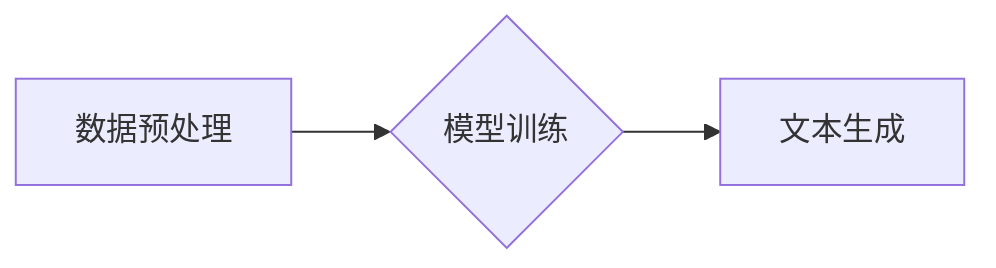

> 生成式AI, AIGC, 自然语言处理, 深度学习, Transformer, 文本生成, 图像生成, 代码生成, 伦理问题

## 1. 背景介绍

近年来，人工智能（AI）技术取得了飞速发展，其中生成式人工智能（Generative AI）作为其重要分支，展现出强大的潜力，引发了广泛的关注和研究。生成式AI是指能够根据输入数据生成新数据的AI模型，其应用场景涵盖文本、图像、音频、视频等多媒体领域。

传统的AI模型主要侧重于分类、识别等任务，而生成式AI则能够创造新的内容，这使得其在创意、艺术、科学研究等领域具有巨大的应用价值。例如，生成式AI可以用于创作诗歌、小说、剧本、音乐、绘画、图像等，还可以用于自动生成代码、翻译文本、总结文档等。

## 2. 核心概念与联系

**2.1 生成式AI的本质**

生成式AI的核心是学习数据中的模式和规律，并根据这些模式生成新的数据。它本质上是一种概率模型，通过学习数据分布，预测下一个数据点或序列。

**2.2 核心技术：深度学习与Transformer**

深度学习是生成式AI的核心技术之一，它利用多层神经网络来学习数据特征。其中，Transformer模型作为深度学习的最新进展，在自然语言处理领域取得了突破性进展，也为生成式AI的发展提供了强大的工具。

Transformer模型的核心特点是其自注意力机制，能够捕捉文本序列中不同词语之间的长距离依赖关系，从而更好地理解上下文信息，生成更流畅、更自然的文本。

**2.3 生成式AI的架构**

生成式AI的架构通常包括以下几个部分：

* **数据预处理:** 将原始数据进行清洗、格式化、编码等处理，使其能够被模型理解。
* **模型训练:** 利用深度学习算法，训练生成式AI模型，使其能够学习数据中的模式和规律。
* **文本生成:** 将输入文本或其他数据作为模型的输入，模型根据训练得到的知识生成新的文本或其他数据。

**Mermaid 流程图**



## 3. 核心算法原理 & 具体操作步骤

### 3.1 算法原理概述

生成式AI的核心算法原理是基于概率模型，通过学习数据分布，预测下一个数据点或序列。常见的生成式AI算法包括：

* **变分自编码器（VAE）:** 通过编码器将数据压缩成低维表示，然后通过解码器将低维表示恢复成原始数据，从而学习数据的潜在结构。
* **生成对抗网络（GAN）:** 由两个网络组成：生成器和判别器。生成器试图生成逼真的数据，而判别器试图区分真实数据和生成数据。两者相互竞争，最终生成器能够生成逼真的数据。

### 3.2 算法步骤详解

以生成对抗网络（GAN）为例，其训练步骤如下：

1. **初始化生成器和判别器:** 随机初始化生成器和判别器的参数。
2. **生成器训练:** 生成器根据随机噪声生成数据，并将数据输入判别器。
3. **判别器训练:** 判别器接收真实数据和生成数据，并预测每个数据的真实性。
4. **更新参数:** 根据判别器的反馈，更新生成器的参数，使其生成的數據更逼真。
5. **重复步骤2-4:** 重复上述步骤，直到生成器能够生成逼真的数据。

### 3.3 算法优缺点

**VAE:**

* **优点:** 可以生成高质量的数据，并且能够学习数据的潜在结构。
* **缺点:** 训练过程相对复杂，容易出现模式崩溃问题。

**GAN:**

* **优点:** 可以生成非常逼真的数据，并且能够学习数据的复杂分布。
* **缺点:** 训练过程不稳定，容易出现模式崩溃问题，并且需要大量的训练数据。

### 3.4 算法应用领域

生成式AI算法在各个领域都有广泛的应用，例如：

* **文本生成:** 自动写作、机器翻译、聊天机器人等。
* **图像生成:** 生成艺术作品、合成图像、修复图像等。
* **音频生成:** 生成音乐、语音合成、音频降噪等。
* **视频生成:** 生成视频特效、视频剪辑等。

## 4. 数学模型和公式 & 详细讲解 & 举例说明

### 4.1 数学模型构建

生成式AI模型通常基于概率模型，例如：

* **条件概率分布:**  P(x|y)，表示给定输入y的情况下，输出x的概率。
* **联合概率分布:** P(x,y)，表示输入x和输出y同时发生的概率。

### 4.2 公式推导过程

例如，在文本生成任务中，我们可以使用条件概率分布来预测下一个词语。假设我们有一个训练数据集D，包含一系列文本序列，每个序列由一系列词语组成。我们可以使用最大似然估计来估计条件概率分布P(x|y)，即：

$$P(x|y) = \frac{ \sum_{i=1}^{N} I(x_i = x, y_i = y) }{ \sum_{i=1}^{N} I(y_i = y) }$$

其中：

* $x$ 是要预测的词语。
* $y$ 是前面的词语序列。
* $N$ 是训练数据集的大小。
* $I(a)$ 是指示函数，当a为真时返回1，否则返回0。

### 4.3 案例分析与讲解

例如，假设我们训练了一个文本生成模型，并输入了词语序列“今天天气”，模型会根据训练数据中的统计信息，预测下一个词语可能是“晴朗”、“阴天”等。

## 5. 项目实践：代码实例和详细解释说明

### 5.1 开发环境搭建

* **操作系统:** Linux/macOS/Windows
* **编程语言:** Python
* **深度学习框架:** TensorFlow/PyTorch
* **其他工具:** Git、Jupyter Notebook

### 5.2 源代码详细实现

以下是一个使用PyTorch实现文本生成器的简单代码示例：

```python
import torch
import torch.nn as nn

class TextGenerator(nn.Module):
    def __init__(self, vocab_size, embedding_dim, hidden_dim):
        super(TextGenerator, self).__init__()
        self.embedding = nn.Embedding(vocab_size, embedding_dim)
        self.lstm = nn.LSTM(embedding_dim, hidden_dim)
        self.fc = nn.Linear(hidden_dim, vocab_size)

    def forward(self, x):
        embedded = self.embedding(x)
        output, (hidden, cell) = self.lstm(embedded)
        output = self.fc(output[:, -1, :])
        return output

# ... 模型训练和使用代码 ...
```

### 5.3 代码解读与分析

* **模型结构:** 该模型采用嵌入层、LSTM层和全连接层组成。
* **嵌入层:** 将词语转换为低维向量表示。
* **LSTM层:** 学习文本序列中的长距离依赖关系。
* **全连接层:** 将LSTM输出映射到词语的概率分布。

### 5.4 运行结果展示

训练完成后，可以将模型输入一个词语序列，模型会根据训练数据预测下一个词语。

## 6. 实际应用场景

### 6.1 文本生成

* **自动写作:** 生成新闻报道、产品描述、广告文案等。
* **机器翻译:** 将文本从一种语言翻译成另一种语言。
* **聊天机器人:** 与用户进行自然语言对话。

### 6.2 图像生成

* **艺术创作:** 生成绘画、雕塑、音乐等艺术作品。
* **图像合成:** 合成逼真的图像，例如人脸合成、场景合成等。
* **图像修复:** 修复损坏的图像，例如去除噪点、修复缺失部分等。

### 6.3 代码生成

* **自动代码补全:** 根据代码上下文自动补全代码。
* **代码生成:** 根据自然语言描述自动生成代码。
* **代码翻译:** 将代码从一种编程语言翻译成另一种编程语言。

### 6.4 未来应用展望

生成式AI技术的发展将带来更多创新应用，例如：

* **个性化内容生成:** 根据用户的喜好生成个性化的内容，例如新闻推荐、个性化广告等。
* **虚拟助手:** 更智能、更人性化的虚拟助手，能够理解用户的需求并提供更精准的帮助。
* **科学研究:** 辅助科学家进行科学研究，例如药物研发、材料设计等。

## 7. 工具和资源推荐

### 7.1 学习资源推荐

* **书籍:**
    * 《深度学习》
    * 《生成对抗网络》
* **在线课程:**
    * Coursera: 深度学习
    * Udacity: 生成对抗网络
* **博客和论坛:**
    * TensorFlow Blog
    * PyTorch Blog
    * Reddit: r/MachineLearning

### 7.2 开发工具推荐

* **深度学习框架:** TensorFlow, PyTorch
* **文本处理工具:** NLTK, SpaCy
* **图像处理工具:** OpenCV, Pillow

### 7.3 相关论文推荐

* **Generative Adversarial Networks**
* **Attention Is All You Need**
* **Variational Autoencoders for Generation**

## 8. 总结：未来发展趋势与挑战

### 8.1 研究成果总结

近年来，生成式AI技术取得了显著进展，能够生成逼真的文本、图像、音频等数据，并在各个领域展现出巨大的应用潜力。

### 8.2 未来发展趋势

* **模型能力提升:** 模型规模和复杂度将进一步提升，能够生成更高质量、更复杂的生成内容。
* **多模态生成:** 将文本、图像、音频等多种模态数据融合，实现多模态生成。
* **个性化生成:** 根据用户的需求和喜好，生成个性化的内容。
* **伦理与安全:** 关注生成式AI的伦理问题和安全风险，确保其安全、可控地发展。

### 8.3 面临的挑战

* **数据依赖:** 生成式AI模型依赖于大量的训练数据，数据质量和数量直接影响模型性能。
* **训练成本:** 训练大型生成式AI模型需要大量的计算资源和时间，成本较高。
* **伦理问题:** 生成式AI可能被用于生成虚假信息、恶意内容等，需要关注其伦理问题。

### 8.4 研究展望

未来，生成式AI技术将继续发展，并带来更多创新应用。研究者将继续探索新的算法、模型架构和训练方法，提升模型能力和效率，同时关注其伦理问题和安全风险，确保其安全、可控地发展。

## 9. 附录：常见问题与解答

* **什么是生成式AI？**

生成式AI是指能够根据输入数据生成新数据的AI模型。

* **生成式AI有哪些应用场景？**

生成式AI的应用场景非常广泛，例如文本生成、图像生成、音频生成、代码生成等。

* **如何训练生成式AI模型？**

训练生成式AI模型需要大量的训练数据和强大的计算资源。常见的训练方法包括监督学习、无监督学习和强化学习。

* **生成式AI有哪些伦理问题？**

生成式AI可能被用于生成虚假信息、恶意内容等，需要关注其伦理问题，确保其安全、可控地发展。


作者：禅与计算机程序设计艺术 / Zen and the Art of Computer Programming 
<end_of_turn>