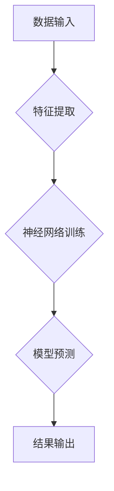

> 深度学习，神经网络，机器学习，人工智能，算法，数据结构，认知科学

## 1. 背景介绍

在当今数据爆炸的时代，人工智能（AI）正以惊人的速度发展，其应用领域不断拓展，深刻地改变着我们的生活。从自动驾驶汽车到智能语音助手，从医疗诊断到金融预测，AI技术的应用无处不在。然而，在追求AI技术突破的同时，我们也需要思考一个更深层次的问题：真正的智慧，究竟是什么？

传统的AI技术主要依赖于大量的训练数据和复杂的算法模型，能够完成许多令人惊叹的任务。但这些技术往往缺乏对事物的本质理解和认知能力，只能在已知范围内进行操作，难以应对未知情况和复杂问题。

真正的智慧，源自对事物本质的深刻理解认知与洞察。它不仅需要强大的计算能力，更需要对知识的理解、对世界的感知和对问题的思考。

## 2. 核心概念与联系

**2.1 深度学习与神经网络**

深度学习是机器学习的一个子领域，它利用多层神经网络来模拟人类大脑的学习过程。神经网络由许多相互连接的神经元组成，每个神经元接收来自其他神经元的输入，并根据一定的权重进行计算，最终输出结果。

通过训练大量的样本数据，神经网络可以学习到数据的特征和模式，从而实现对数据的理解和预测。

**2.2 认知科学与人工智能**

认知科学研究人类的认知过程，包括感知、记忆、语言、推理和决策等。将认知科学的原理应用于人工智能，可以帮助我们构建更智能、更具认知能力的AI系统。

例如，我们可以利用认知科学的知识来设计更有效的学习算法、更自然的语言理解模型和更合理的决策机制。

**Mermaid 流程图**



## 3. 核心算法原理 & 具体操作步骤

**3.1 算法原理概述**

深度学习算法的核心是反向传播算法。反向传播算法通过计算误差，并根据误差调整神经网络的权重，从而使模型的预测结果越来越准确。

**3.2 算法步骤详解**

1. **数据预处理:** 将原始数据进行清洗、转换和特征提取，以便于神经网络的训练。
2. **网络结构设计:** 根据任务需求设计神经网络的结构，包括神经元的数量、连接方式和激活函数等。
3. **参数初始化:** 为神经网络的参数（权重和偏置）进行随机初始化。
4. **前向传播:** 将输入数据通过神经网络进行前向传播，得到模型的预测结果。
5. **误差计算:** 计算模型预测结果与真实结果之间的误差。
6. **反向传播:** 将误差反向传播到神经网络的各个层，并根据误差调整权重和偏置。
7. **迭代训练:** 重复步骤4-6，直到模型的预测结果达到预期的精度。

**3.3 算法优缺点**

**优点:**

* 能够学习到数据的复杂特征和模式。
* 性能优于传统机器学习算法。
* 应用范围广泛。

**缺点:**

* 需要大量的训练数据。
* 计算量大，训练时间长。
* 模型解释性差。

**3.4 算法应用领域**

* 图像识别
* 自然语言处理
* 语音识别
* 机器翻译
* 医疗诊断
* 金融预测

## 4. 数学模型和公式 & 详细讲解 & 举例说明

**4.1 数学模型构建**

深度学习模型可以看作是一个复杂的数学函数，其输入是数据，输出是预测结果。

**4.2 公式推导过程**

反向传播算法的核心是利用链式法则对损失函数进行求导，从而计算出每个参数的梯度。

**损失函数:**

$$L = \frac{1}{N} \sum_{i=1}^{N} (y_i - \hat{y}_i)^2$$

其中：

* $L$ 是损失函数
* $N$ 是样本数量
* $y_i$ 是真实标签
* $\hat{y}_i$ 是模型预测结果

**梯度下降:**

$$\theta = \theta - \alpha \nabla L$$

其中：

* $\theta$ 是模型参数
* $\alpha$ 是学习率
* $\nabla L$ 是损失函数的梯度

**4.3 案例分析与讲解**

假设我们有一个简单的线性回归模型，其预测公式为：

$$\hat{y} = w_0 + w_1 x$$

其中：

* $\hat{y}$ 是模型预测结果
* $w_0$ 和 $w_1$ 是模型参数
* $x$ 是输入特征

我们可以使用反向传播算法来训练这个模型，并找到最优的 $w_0$ 和 $w_1$ 值。

## 5. 项目实践：代码实例和详细解释说明

**5.1 开发环境搭建**

* Python 3.x
* TensorFlow 或 PyTorch

**5.2 源代码详细实现**

```python
import tensorflow as tf

# 定义模型
model = tf.keras.models.Sequential([
    tf.keras.layers.Dense(10, activation='relu', input_shape=(1,)),
    tf.keras.layers.Dense(1)
])

# 定义损失函数和优化器
model.compile(loss='mse', optimizer='adam')

# 训练模型
model.fit(x_train, y_train, epochs=100)

# 预测结果
predictions = model.predict(x_test)
```

**5.3 代码解读与分析**

* 我们使用 TensorFlow 库构建了一个简单的线性回归模型。
* 模型包含两层全连接神经元，第一层有 10 个神经元，使用 ReLU 激活函数，输入维度为 1；第二层只有一个神经元，输出预测结果。
* 我们使用均方误差 (MSE) 作为损失函数，并使用 Adam 优化器进行训练。
* 训练模型 100 个 epochs，并使用训练数据 $x_train$ 和 $y_train$ 进行训练。
* 训练完成后，我们可以使用模型预测测试数据 $x_test$ 的结果。

**5.4 运行结果展示**

训练完成后，我们可以评估模型的性能，例如使用测试数据计算模型的均方误差。

## 6. 实际应用场景

深度学习技术在各个领域都有广泛的应用，例如：

* **图像识别:** 用于人脸识别、物体检测、图像分类等。
* **自然语言处理:** 用于机器翻译、文本摘要、情感分析等。
* **语音识别:** 用于语音助手、语音搜索等。
* **医疗诊断:** 用于疾病诊断、影像分析等。
* **金融预测:** 用于股票预测、风险评估等。

**6.4 未来应用展望**

随着深度学习技术的不断发展，其应用场景将更加广泛，例如：

* **自动驾驶:** 深度学习可以帮助自动驾驶汽车感知周围环境、做出决策。
* **个性化教育:** 深度学习可以根据学生的学习情况提供个性化的学习方案。
* **智能客服:** 深度学习可以帮助企业构建智能客服系统，提供更便捷的客户服务。

## 7. 工具和资源推荐

**7.1 学习资源推荐**

* **书籍:**
    * 深度学习
    * 
* **在线课程:**
    * Coursera
    * edX
    * Udacity

**7.2 开发工具推荐**

* TensorFlow
* PyTorch
* Keras

**7.3 相关论文推荐**

* ImageNet Classification with Deep Convolutional Neural Networks
* Attention Is All You Need

## 8. 总结：未来发展趋势与挑战

**8.1 研究成果总结**

深度学习技术取得了令人瞩目的成就，在图像识别、自然语言处理等领域取得了突破性的进展。

**8.2 未来发展趋势**

* **模型更深、更复杂:** 研究更深层次、更复杂的深度学习模型，以提高模型的性能和泛化能力。
* **数据更丰富、更多样:** 探索新的数据来源，并开发新的数据处理方法，以提高模型的训练效果。
* **算法更智能、更高效:** 研究更智能、更有效的深度学习算法，以降低模型的训练时间和计算成本。

**8.3 面临的挑战**

* **数据隐私和安全:** 深度学习模型需要大量的训练数据，如何保护数据隐私和安全是一个重要的挑战。
* **模型解释性和可信度:** 深度学习模型的决策过程往往难以解释，如何提高模型的解释性和可信度是一个重要的研究方向。
* **算法公平性和可控性:** 深度学习模型可能存在偏见和歧视，如何确保算法的公平性和可控性是一个重要的伦理问题。

**8.4 研究展望**

未来，深度学习技术将继续发展，并应用于更多领域。我们需要不断探索新的算法、新的数据和新的应用场景，以推动深度学习技术的发展，并将其应用于解决人类面临的各种挑战。

## 9. 附录：常见问题与解答

**9.1 什么是深度学习？**

深度学习是一种机器学习的子领域，它利用多层神经网络来模拟人类大脑的学习过程。

**9.2 深度学习的应用领域有哪些？**

深度学习的应用领域非常广泛，包括图像识别、自然语言处理、语音识别、机器翻译、医疗诊断、金融预测等。

**9.3 如何学习深度学习？**

有很多学习深度学习的资源，包括书籍、在线课程、开源代码等。

**9.4 深度学习的未来发展趋势是什么？**

深度学习的未来发展趋势包括模型更深、更复杂、数据更丰富、算法更智能、更高效等。


作者：禅与计算机程序设计艺术 / Zen and the Art of Computer Programming 
<end_of_turn>