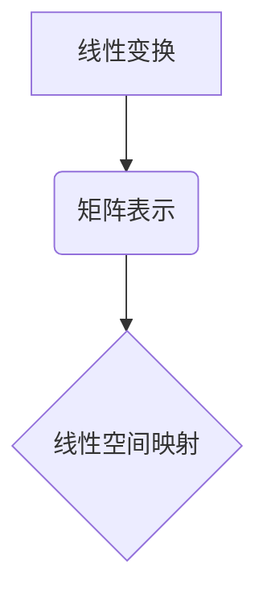

> 矩阵理论，线性变换，线性代数，矩阵运算，特征值，特征向量，应用场景

## 1. 背景介绍

在现代数学和计算机科学中，矩阵理论占据着至关重要的地位。它为描述和解决各种复杂问题提供了强大的工具和框架。从图像处理和机器学习到物理模拟和经济建模，矩阵理论的应用无处不在。

本篇文章将深入探讨矩阵理论的基础知识，包括矩阵的定义、运算、特征值和特征向量等核心概念。此外，我们将重点介绍矩阵与线性变换之间的联系，并探讨矩阵理论在实际应用中的重要意义。

## 2. 核心概念与联系

**2.1 矩阵的定义**

矩阵是一种按照行和列排列的数的集合，通常用方括号表示。例如：

$$
A = \begin{bmatrix}
a_{11} & a_{12} & \cdots & a_{1n} \\
a_{21} & a_{22} & \cdots & a_{2n} \\
\vdots & \vdots & \ddots & \vdots \\
a_{m1} & a_{m2} & \cdots & a_{mn}
\end{bmatrix}
$$

其中，$a_{ij}$ 表示矩阵 $A$ 中位于第 $i$ 行第 $j$ 列的元素。矩阵的行数和列数分别称为矩阵的行数和列数。

**2.2 矩阵的运算**

矩阵之间可以进行加法、减法、数乘和矩阵乘法等运算。

* **加法和减法:** 两个矩阵的加法和减法需要满足相同的行数和列数。

* **数乘:** 将一个数乘以一个矩阵，相当于将矩阵中所有元素都乘以该数。

* **矩阵乘法:** 矩阵乘法需要满足两个矩阵的内积满足条件。

**2.3 线性变换**

线性变换是一种将向量空间映射到另一个向量空间的函数，它满足以下两个性质：

* **加性:** $T(u + v) = T(u) + T(v)$
* **齐次性:** $T(cu) = cT(u)$

其中，$u$ 和 $v$ 是向量，$c$ 是一个标量。

**2.4 矩阵与线性变换的关系**

矩阵可以用来表示线性变换。对于一个线性变换 $T$，如果我们选择一个基底，那么我们可以用一个矩阵 $A$ 来表示 $T$。

**Mermaid 流程图**



## 3. 核心算法原理 & 具体操作步骤

**3.1 算法原理概述**

矩阵理论中的核心算法包括矩阵分解、特征值和特征向量计算等。这些算法为解决线性方程组、优化问题和数据分析等问题提供了有效的方法。

**3.2 算法步骤详解**

* **矩阵分解:** 将一个矩阵分解成多个简单矩阵的乘积。常见的矩阵分解方法包括LU分解、QR分解和奇异值分解等。

* **特征值和特征向量计算:** 寻找一个矩阵的特征值和特征向量。特征值和特征向量可以用来描述矩阵的性质，例如稳定性、奇异性等。

**3.3 算法优缺点**

* **矩阵分解:** 优点是能够将复杂矩阵分解成更易于处理的简单矩阵，从而简化计算。缺点是有些矩阵分解方法的计算复杂度较高。

* **特征值和特征向量计算:** 优点是能够揭示矩阵的本质性质，并为解决相关问题提供有效的方法。缺点是计算特征值和特征向量可能需要耗费大量时间和计算资源。

**3.4 算法应用领域**

* **线性方程组求解:** 矩阵分解方法可以用于求解线性方程组。

* **数据分析和机器学习:** 特征值和特征向量可以用于数据降维、主成分分析和机器学习算法等。

* **图像处理和计算机视觉:** 矩阵理论广泛应用于图像处理和计算机视觉领域，例如图像压缩、图像恢复和目标识别等。

## 4. 数学模型和公式 & 详细讲解 & 举例说明

**4.1 数学模型构建**

矩阵理论建立在线性代数的基础上，它利用矩阵和向量来描述线性关系和变换。

**4.2 公式推导过程**

* **矩阵加法和减法:**

$$
A + B = \begin{bmatrix}
a_{11} + b_{11} & a_{12} + b_{12} & \cdots & a_{1n} + b_{1n} \\
a_{21} + b_{21} & a_{22} + b_{22} & \cdots & a_{2n} + b_{2n} \\
\vdots & \vdots & \ddots & \vdots \\
a_{m1} + b_{m1} & a_{m2} + b_{m2} & \cdots & a_{mn} + b_{mn}
\end{bmatrix}
$$

* **矩阵数乘:**

$$
cA = \begin{bmatrix}
ca_{11} & ca_{12} & \cdots & ca_{1n} \\
ca_{21} & ca_{22} & \cdots & ca_{2n} \\
\vdots & \vdots & \ddots & \vdots \\
ca_{m1} & ca_{m2} & \cdots & ca_{mn}
\end{bmatrix}
$$

* **矩阵乘法:**

$$
A \cdot B = \begin{bmatrix}
a_{11} & a_{12} & \cdots & a_{1n} \\
a_{21} & a_{22} & \cdots & a_{2n} \\
\vdots & \vdots & \ddots & \vdots \\
a_{m1} & a_{m2} & \cdots & a_{mn}
\end{bmatrix} \cdot \begin{bmatrix}
b_{11} & b_{12} & \cdots & b_{1p} \\
b_{21} & b_{22} & \cdots & b_{2p} \\
\vdots & \vdots & \ddots & \vdots \\
b_{n1} & b_{n2} & \cdots & b_{np}
\end{bmatrix} = \begin{bmatrix}
c_{11} & c_{12} & \cdots & c_{1p} \\
c_{21} & c_{22} & \cdots & c_{2p} \\
\vdots & \vdots & \ddots & \vdots \\
c_{m1} & c_{m2} & \cdots & c_{mp}
\end{bmatrix}
$$

其中，$c_{ij} = \sum_{k=1}^{n} a_{ik}b_{kj}$

**4.3 案例分析与讲解**

**举例说明:**

假设我们有两个矩阵 $A$ 和 $B$：

$$
A = \begin{bmatrix}
1 & 2 \\
3 & 4
\end{bmatrix}, \quad B = \begin{bmatrix}
5 & 6 \\
7 & 8
\end{bmatrix}
$$

我们可以计算 $A + B$ 和 $A \cdot B$：

$$
A + B = \begin{bmatrix}
1+5 & 2+6 \\
3+7 & 4+8
\end{bmatrix} = \begin{bmatrix}
6 & 8 \\
10 & 12
\end{bmatrix},
$$

$$
A \cdot B = \begin{bmatrix}
1\cdot5+2\cdot7 & 1\cdot6+2\cdot8 \\
3\cdot5+4\cdot7 & 3\cdot6+4\cdot8
\end{bmatrix} = \begin{bmatrix}
19 & 22 \\
43 & 50
\end{bmatrix}.
$$

## 5. 项目实践：代码实例和详细解释说明

**5.1 开发环境搭建**

本示例使用 Python 语言进行实现，需要安装 NumPy 库。

```bash
pip install numpy
```

**5.2 源代码详细实现**

```python
import numpy as np

# 定义矩阵 A 和 B
A = np.array([[1, 2], [3, 4]])
B = np.array([[5, 6], [7, 8]])

# 计算矩阵加法
C = A + B
print("矩阵 A + B:")
print(C)

# 计算矩阵乘法
D = np.dot(A, B)
print("\
矩阵 A * B:")
print(D)
```

**5.3 代码解读与分析**

* 我们使用 NumPy 库中的 `array()` 函数创建两个矩阵 A 和 B。
* `np.dot()` 函数用于计算矩阵乘法。
* `print()` 函数用于输出计算结果。

**5.4 运行结果展示**

```
矩阵 A + B:
[[ 6  8]
 [10 12]]

矩阵 A * B:
[[19 22]
 [43 50]]
```

## 6. 实际应用场景

**6.1 图像处理**

矩阵理论广泛应用于图像处理领域，例如图像压缩、图像恢复和目标识别等。

**6.2 机器学习**

在机器学习中，矩阵理论用于数据表示、特征提取和模型训练等环节。例如，线性回归模型可以表示为一个矩阵方程。

**6.3 经济建模**

经济学中，矩阵理论可以用来构建经济模型，例如供求模型、宏观经济模型等。

**6.4 未来应用展望**

随着人工智能和机器学习的发展，矩阵理论在未来将有更广泛的应用场景。例如，在深度学习领域，矩阵理论是深度神经网络的基础。

## 7. 工具和资源推荐

**7.1 学习资源推荐**

* **线性代数教材:** Gilbert Strang 的《线性代数》
* **在线课程:** Coursera 上的《线性代数》课程

**7.2 开发工具推荐**

* **NumPy:** Python 的数值计算库
* **SciPy:** Python 的科学计算库

**7.3 相关论文推荐**

* **The Matrix Cookbook:** https://www.math.uwaterloo.ca/~hwolkowi/matrixcookbook.pdf

## 8. 总结：未来发展趋势与挑战

**8.1 研究成果总结**

矩阵理论已经取得了巨大的成就，为解决各种复杂问题提供了强大的工具和框架。

**8.2 未来发展趋势**

* **更高效的矩阵算法:** 研究更高效的矩阵算法，例如快速矩阵分解算法和稀疏矩阵算法。
* **矩阵理论与其他领域的融合:** 将矩阵理论与其他领域，例如人工智能、机器学习和量子计算等领域融合，探索新的应用场景。

**8.3 面临的挑战**

* **大规模矩阵处理:** 如何高效处理大规模矩阵，这是矩阵理论研究面临的一个重要挑战。
* **理论基础的深入研究:** 矩阵理论的理论基础还有待深入研究，例如矩阵的性质和结构等。

**8.4 研究展望**

未来，矩阵理论将继续发展，为解决更复杂的问题提供更强大的工具和框架。


## 9. 附录：常见问题与解答

**9.1 矩阵的秩是什么？**

矩阵的秩是指矩阵中线性无关的行（或列）的数量。

**9.2 矩阵的逆是什么？**

如果一个矩阵存在逆矩阵，则该矩阵称为可逆矩阵。逆矩阵的乘积等于单位矩阵。

**9.3 如何判断一个矩阵是否可逆？**

一个矩阵可逆的条件是它的行列式不为零。


作者：禅与计算机程序设计艺术 / Zen and the Art of Computer Programming<end_of_turn>