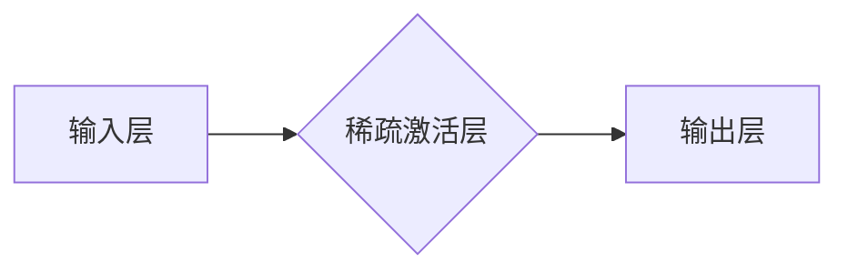

>稀疏激活，神经网络，深度学习，脑科学，计算效率，模型泛化能力

## 1. 背景介绍

深度学习近年来取得了令人瞩目的成就，在图像识别、自然语言处理、语音识别等领域取得了突破性的进展。然而，随着模型规模的不断扩大，训练和部署深度学习模型面临着越来越大的挑战。其中，计算效率和模型泛化能力是两个关键问题。

传统的神经网络通常使用全连接结构，每个神经元都与前一层的所有神经元连接。这种全连接结构虽然能够学习复杂的特征，但也导致了大量的参数和计算量。此外，全连接结构也容易导致过拟合问题，即模型在训练数据上表现良好，但在未见过的数据上表现较差。

受人脑神经元稀疏激活机制的启发，稀疏激活方法逐渐成为深度学习领域的研究热点。人脑中，神经元在处理信息时通常只激活一小部分神经元，而大部分神经元处于静止状态。这种稀疏激活机制能够有效降低计算量，提高计算效率，并增强模型的泛化能力。

## 2. 核心概念与联系

稀疏激活的核心概念是通过引入特殊的激活函数，使得神经网络在训练过程中只激活一小部分神经元。这种激活机制能够模拟人脑神经元的稀疏激活特性，从而提高模型的效率和泛化能力。

**Mermaid 流程图:**



## 3. 核心算法原理 & 具体操作步骤

### 3.1  算法原理概述

稀疏激活算法的核心是使用特殊的激活函数，例如：

* **ReLU（Rectified Linear Unit）**：对于正值输入，输出为输入本身；对于负值输入，输出为0。
* **Leaky ReLU**：对于负值输入，输出为一个小的负值，而不是0。
* **ELU（Exponential Linear Unit）**：对于负值输入，输出为一个指数函数的负值。

这些激活函数能够有效地抑制神经网络中不重要的特征，从而实现稀疏激活。

### 3.2  算法步骤详解

1. **输入数据:** 将输入数据传递到神经网络的第一层。
2. **前向传播:** 通过神经网络层级，逐层计算激活值。
3. **稀疏激活:** 使用稀疏激活函数对每个神经元的输出进行处理，只保留激活值大于某个阈值的输出。
4. **反向传播:** 计算误差，并根据误差反向传播，更新神经网络的权重和偏置。
5. **迭代训练:** 重复上述步骤，直到模型达到预定的精度。

### 3.3  算法优缺点

**优点:**

* **提高计算效率:** 稀疏激活能够有效减少计算量，提高模型的训练和推理速度。
* **增强模型泛化能力:** 稀疏激活能够抑制过拟合，提高模型在未见过的数据上的泛化能力。
* **降低内存占用:** 稀疏激活能够减少模型参数的数量，从而降低内存占用。

**缺点:**

* **选择合适的激活函数:** 不同的稀疏激活函数适用于不同的任务和数据集，需要进行仔细选择。
* **训练难度:** 稀疏激活算法的训练过程可能比传统神经网络更加复杂。

### 3.4  算法应用领域

稀疏激活算法在以下领域具有广泛的应用前景：

* **图像识别:** 提高图像识别模型的效率和精度。
* **自然语言处理:** 增强文本分类、机器翻译等任务的性能。
* **语音识别:** 提高语音识别模型的鲁棒性和准确性。
* **推荐系统:** 建立更精准的推荐模型。

## 4. 数学模型和公式 & 详细讲解 & 举例说明

### 4.1  数学模型构建

假设一个神经网络层包含N个神经元，每个神经元接收M个输入。神经元的激活函数为f(x)，其中x是神经元的输入值。

稀疏激活的数学模型可以表示为：

$$
y_i = \begin{cases}
f(x_i) & \text{if } x_i > \theta \\
0 & \text{otherwise}
\end{cases}
$$

其中：

* $y_i$ 是神经元i的输出值。
* $x_i$ 是神经元i的输入值。
* $\theta$ 是一个阈值。

### 4.2  公式推导过程

稀疏激活的数学模型可以理解为对输入值进行阈值化处理。当输入值大于阈值时，神经元被激活，输出值为激活函数的输出；否则，神经元处于抑制状态，输出值为0。

### 4.3  案例分析与讲解

例如，使用ReLU激活函数作为稀疏激活函数，当输入值大于0时，输出值为输入值本身；否则，输出值为0。

假设一个神经元的输入值为-2，则根据ReLU激活函数的定义，输出值为0。

## 5. 项目实践：代码实例和详细解释说明

### 5.1  开发环境搭建

本项目使用Python语言进行开发，所需的库包括TensorFlow或PyTorch等深度学习框架。

### 5.2  源代码详细实现

```python
import tensorflow as tf

# 定义稀疏激活层
class SparseActivation(tf.keras.layers.Layer):
    def __init__(self, threshold=0.5, activation='relu'):
        super(SparseActivation, self).__init__()
        self.threshold = threshold
        self.activation = tf.keras.activations.get(activation)

    def call(self, inputs):
        return tf.where(inputs > self.threshold, self.activation(inputs), 0)

# 创建一个包含稀疏激活层的模型
model = tf.keras.models.Sequential([
    tf.keras.layers.Dense(128, activation='relu'),
    SparseActivation(threshold=0.2),
    tf.keras.layers.Dense(10, activation='softmax')
])

# 编译模型
model.compile(optimizer='adam',
              loss='sparse_categorical_crossentropy',
              metrics=['accuracy'])

# 训练模型
model.fit(x_train, y_train, epochs=10)
```

### 5.3  代码解读与分析

* 首先定义了一个自定义的稀疏激活层，该层接受一个阈值和一个激活函数作为参数。
* 在`call`方法中，根据阈值对输入值进行判断，大于阈值则使用激活函数进行激活，否则输出为0。
* 然后创建了一个包含稀疏激活层的模型，并使用Adam优化器、交叉熵损失函数和准确率指标进行训练。

### 5.4  运行结果展示

训练完成后，可以评估模型的性能，例如在测试集上的准确率。

## 6. 实际应用场景

稀疏激活算法在实际应用场景中具有广泛的应用前景，例如：

* **图像识别:** 稀疏激活能够有效减少图像识别模型的计算量，提高识别速度和效率。
* **自然语言处理:** 稀疏激活能够增强文本分类、机器翻译等任务的性能，并降低模型的内存占用。
* **语音识别:** 稀疏激活能够提高语音识别模型的鲁棒性和准确性，使其能够更好地处理噪声和背景干扰。

### 6.4  未来应用展望

随着深度学习技术的不断发展，稀疏激活算法的应用场景将会更加广泛。未来，稀疏激活算法可能会应用于以下领域：

* **自动驾驶:** 提高自动驾驶系统的实时性和安全性。
* **医疗诊断:** 辅助医生进行疾病诊断和治疗方案制定。
* **金融风险控制:** 识别和预测金融风险。

## 7. 工具和资源推荐

### 7.1  学习资源推荐

* **书籍:**
    * 《深度学习》
    * 《神经网络与深度学习》
* **在线课程:**
    * Coursera深度学习课程
    * Udacity深度学习课程

### 7.2  开发工具推荐

* **TensorFlow:** 开源深度学习框架
* **PyTorch:** 开源深度学习框架
* **Keras:** 高级深度学习API

### 7.3  相关论文推荐

* **《Sparsely Gated Mixture-of-Experts》**
* **《Lottery Ticket Hypothesis: Finding Sparse, Trainable Neural Networks》**
* **《EfficientNet: Rethinking Model Scaling for Convolutional Neural Networks》**

## 8. 总结：未来发展趋势与挑战

### 8.1  研究成果总结

稀疏激活算法在深度学习领域取得了显著的进展，能够有效提高模型的计算效率和泛化能力。

### 8.2  未来发展趋势

未来，稀疏激活算法的研究方向将包括：

* **探索新的稀疏激活函数:** 设计更有效的稀疏激活函数，以适应不同的任务和数据集。
* **结合其他优化技术:** 将稀疏激活算法与其他优化技术相结合，例如模型剪枝、知识蒸馏等，进一步提高模型的效率和性能。
* **研究稀疏激活的生物学机制:** 深入研究人脑神经元的稀疏激活机制，为设计更有效的稀疏激活算法提供理论依据。

### 8.3  面临的挑战

稀疏激活算法也面临着一些挑战，例如：

* **选择合适的阈值:** 阈值的设置对稀疏激活效果有重要影响，需要进行仔细的调优。
* **训练难度:** 稀疏激活算法的训练过程可能比传统神经网络更加复杂，需要更强大的计算资源和更先进的训练算法。

### 8.4  研究展望

尽管面临着挑战，但稀疏激活算法仍然是一个非常有前景的研究方向。随着技术的不断发展，相信稀疏激活算法将在未来深度学习领域发挥越来越重要的作用。

## 9. 附录：常见问题与解答

**Q1: 稀疏激活算法与传统神经网络相比有什么优势？**

**A1:** 稀疏激活算法能够有效降低计算量，提高模型的训练和推理速度，并增强模型的泛化能力。

**Q2: 如何选择合适的稀疏激活函数？**

**A2:** 不同的稀疏激活函数适用于不同的任务和数据集，需要根据实际情况进行选择。

**Q3: 稀疏激活算法的训练难度大吗？**

**A3:** 稀疏激活算法的训练过程可能比传统神经网络更加复杂，需要更强大的计算资源和更先进的训练算法。


作者：禅与计算机程序设计艺术 / Zen and the Art of Computer Programming 
<end_of_turn>