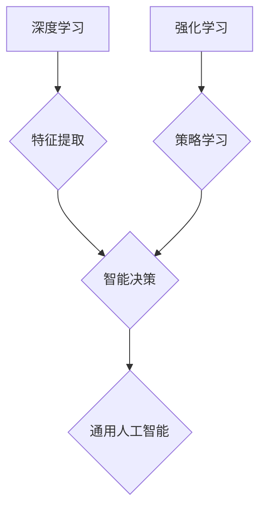

> 第三代人工智能，通用人工智能，深度学习，强化学习，神经网络，自然语言处理，计算机视觉，伦理问题

## 1. 背景介绍

人工智能（AI）作为一项颠覆性技术，近年来取得了令人瞩目的进展。从早期基于规则的专家系统到如今的深度学习模型，人工智能已经渗透到我们生活的方方面面，为社会带来了巨大的变革。然而，现有的第二代人工智能仍然局限于特定领域，缺乏人类般的通用智能。

第三代人工智能的目标是构建能够像人类一样学习、思考、解决问题和创造的通用人工智能系统。这将标志着人工智能技术的飞跃，并对人类社会产生深远的影响。

## 2. 核心概念与联系

**2.1 通用人工智能 (AGI)**

通用人工智能是指能够执行任何智力任务，并达到或超过人类水平的智能系统。AGI 具备以下关键特征：

* **学习能力:** AGI 能够从数据中学习，并不断提升其知识和技能。
* **推理能力:** AGI 能够进行逻辑推理，解决复杂问题，并做出明智的决策。
* **语言理解和生成能力:** AGI 能够理解和生成人类语言，并进行自然流畅的对话。
* **感知和交互能力:** AGI 能够感知周围环境，并与之交互，例如识别物体、理解场景和控制机器人。

**2.2 深度学习 (Deep Learning)**

深度学习是机器学习的一个子领域，它利用多层神经网络来模拟人类大脑的学习过程。深度学习模型能够从海量数据中提取复杂特征，并实现对图像、语音、文本等多种数据类型的处理。

**2.3 强化学习 (Reinforcement Learning)**

强化学习是一种基于奖励机制的机器学习方法。在强化学习中，智能体通过与环境交互，获得奖励或惩罚，并根据这些反馈调整其行为，以最大化长期奖励。

**2.4 融合与协同**

第三代人工智能将融合深度学习、强化学习等多种技术，构建更加强大的智能系统。例如，深度学习可以提供强大的特征提取能力，而强化学习可以帮助智能体学习策略，并进行决策。

**Mermaid 流程图**



## 3. 核心算法原理 & 具体操作步骤

**3.1 算法原理概述**

第三代人工智能的核心算法原理基于深度学习、强化学习和自然语言处理等技术的融合。

* **深度学习:** 利用多层神经网络模拟人类大脑的学习过程，从海量数据中提取复杂特征。
* **强化学习:** 通过奖励机制训练智能体，使其学习最佳策略，并进行决策。
* **自然语言处理:** 赋予人工智能理解和生成人类语言的能力，实现人机交互。

**3.2 算法步骤详解**

1. **数据收集和预处理:** 收集大量相关数据，并进行清洗、格式化和特征提取。
2. **模型构建:** 根据任务需求选择合适的深度学习、强化学习和自然语言处理模型。
3. **模型训练:** 利用训练数据训练模型，并调整模型参数，使其能够准确地完成任务。
4. **模型评估:** 使用测试数据评估模型的性能，并进行调整和优化。
5. **模型部署:** 将训练好的模型部署到实际应用场景中，并进行监控和维护。

**3.3 算法优缺点**

**优点:**

* **学习能力强:** 能够从海量数据中学习，并不断提升其知识和技能。
* **适应性强:** 可以适应不同的任务和环境。
* **性能优越:** 在许多领域已经取得了超越人类水平的性能。

**缺点:**

* **数据依赖:** 需要大量的数据进行训练，否则性能会下降。
* **计算资源消耗大:** 训练大型模型需要大量的计算资源。
* **可解释性差:** 难以理解模型的决策过程。

**3.4 算法应用领域**

* **自然语言处理:** 语音识别、机器翻译、文本摘要、聊天机器人等。
* **计算机视觉:** 图像识别、物体检测、场景理解、视频分析等。
* **医疗保健:** 疾病诊断、药物研发、个性化医疗等。
* **金融科技:** 风险管理、欺诈检测、投资决策等。
* **自动驾驶:** 路线规划、物体识别、决策控制等。

## 4. 数学模型和公式 & 详细讲解 & 举例说明

**4.1 数学模型构建**

第三代人工智能的数学模型通常基于神经网络和强化学习算法。

* **神经网络:** 神经网络是一种模仿人类大脑结构的计算模型，由多个层级的神经元组成。每个神经元接收输入信号，并通过激活函数进行处理，输出信号到下一层神经元。

* **强化学习:** 强化学习模型使用状态、动作、奖励和价值函数来描述智能体与环境的交互过程。

**4.2 公式推导过程**

* **神经网络的激活函数:**

$$
f(x) = \frac{1}{1 + e^{-x}}
$$

* **强化学习的价值函数:**

$$
V(s) = \max_{\pi} \mathbb{E}_{\pi}[R_t + \gamma R_{t+1} + \gamma^2 R_{t+2} + ...]
$$

**4.3 案例分析与讲解**

* **图像识别:** 使用卷积神经网络 (CNN) 对图像进行特征提取，并进行分类。

* **游戏AI:** 使用深度强化学习 (Deep RL) 训练智能体，使其能够在游戏中取得高分。

## 5. 项目实践：代码实例和详细解释说明

**5.1 开发环境搭建**

* **操作系统:** Ubuntu 20.04 LTS
* **编程语言:** Python 3.8
* **深度学习框架:** TensorFlow 2.0
* **强化学习库:** OpenAI Gym

**5.2 源代码详细实现**

```python
import tensorflow as tf
from tensorflow.keras.models import Sequential
from tensorflow.keras.layers import Conv2D, MaxPooling2D, Flatten, Dense

# 定义卷积神经网络模型
model = Sequential()
model.add(Conv2D(32, (3, 3), activation='relu', input_shape=(28, 28, 1)))
model.add(MaxPooling2D((2, 2)))
model.add(Conv2D(64, (3, 3), activation='relu'))
model.add(MaxPooling2D((2, 2)))
model.add(Flatten())
model.add(Dense(10, activation='softmax'))

# 编译模型
model.compile(optimizer='adam',
              loss='sparse_categorical_crossentropy',
              metrics=['accuracy'])

# 训练模型
model.fit(x_train, y_train, epochs=10)

# 评估模型
loss, accuracy = model.evaluate(x_test, y_test)
print('Test loss:', loss)
print('Test accuracy:', accuracy)
```

**5.3 代码解读与分析**

* **模型定义:** 使用 `Sequential` 类定义一个顺序模型，并添加卷积层、池化层、扁平化层和全连接层。
* **模型编译:** 使用 `adam` 优化器、`sparse_categorical_crossentropy` 损失函数和 `accuracy` 评估指标编译模型。
* **模型训练:** 使用 `fit` 方法训练模型，输入训练数据和标签，并设置训练轮数。
* **模型评估:** 使用 `evaluate` 方法评估模型在测试数据上的性能。

**5.4 运行结果展示**

训练完成后，模型将输出测试数据的损失值和准确率。

## 6. 实际应用场景

**6.1 自然语言处理**

* **聊天机器人:** 利用自然语言处理技术，构建能够与人类进行自然对话的聊天机器人。
* **机器翻译:** 将一种语言翻译成另一种语言，例如将英文翻译成中文。
* **文本摘要:** 从长篇文本中提取关键信息，生成简短的摘要。

**6.2 计算机视觉**

* **图像识别:** 识别图像中的物体，例如人脸、车辆、动物等。
* **物体检测:** 在图像中定位和识别多个物体。
* **场景理解:** 理解图像中的场景内容，例如人物关系、活动场景等。

**6.3 其他应用场景**

* **医疗保健:** 辅助医生诊断疾病、分析医学影像、预测患者风险。
* **金融科技:** 识别欺诈交易、预测股票价格、提供个性化理财建议。
* **自动驾驶:** 帮助车辆感知周围环境、规划路线、控制行驶。

**6.4 未来应用展望**

第三代人工智能将应用于更广泛的领域，例如教育、娱乐、艺术等。

## 7. 工具和资源推荐

**7.1 学习资源推荐**

* **书籍:**
    * 《深度学习》
    * 《强化学习：原理、算法和应用》
    * 《自然语言处理》
* **在线课程:**
    * Coursera: 深度学习
    * Udacity: 强化学习
    * edX: 自然语言处理

**7.2 开发工具推荐**

* **深度学习框架:** TensorFlow, PyTorch, Keras
* **强化学习库:** OpenAI Gym, Stable Baselines3
* **自然语言处理库:** NLTK, spaCy, Transformers

**7.3 相关论文推荐**

* **AlphaGo:** Mastering the game of Go with deep neural networks and tree search
* **BERT:** Pre-training of deep bidirectional transformers for language understanding
* **GPT-3:** Language Models are Few-Shot Learners

## 8. 总结：未来发展趋势与挑战

**8.1 研究成果总结**

第三代人工智能取得了显著的进展，在图像识别、自然语言处理、游戏AI等领域取得了突破性成果。

**8.2 未来发展趋势**

* **更强大的模型:** 训练更大规模、更复杂的模型，以提高人工智能的性能。
* **更广泛的应用:** 将人工智能应用于更多领域，例如医疗保健、教育、娱乐等。
* **更安全的AI:** 研究人工智能的安全性、可靠性和可解释性，确保人工智能的负责任发展。

**8.3 面临的挑战**

* **数据获取和隐私问题:** 训练人工智能模型需要大量数据，如何获取高质量数据并保护用户隐私是一个挑战。
* **计算资源限制:** 训练大型人工智能模型需要大量的计算资源，这对于资源有限的机构和个人来说是一个障碍。
* **伦理问题:** 人工智能的快速发展引发了伦理问题，例如算法偏见、工作岗位替代等，需要社会各界共同探讨和解决。

**8.4 研究展望**

未来，人工智能研究将继续朝着通用人工智能的目标发展，探索人工智能的本质，并将其应用于更广泛的领域，为人类社会带来更多福祉。

## 9. 附录：常见问题与解答

**9.1 如何选择合适的深度学习框架？**

选择深度学习框架需要考虑项目需求、个人经验和社区支持等因素。

* **TensorFlow:** 功能强大、社区活跃、应用广泛。
* **PyTorch:** 使用简单、灵活度高、适合研究。
* **Keras:** 易于上手、可与多种深度学习框架集成。

**9.2 如何解决人工智能模型的过拟合问题？**

过拟合是指模型在训练数据上表现良好，但在测试数据上表现差。

* **增加训练数据:** 更多的训练数据可以帮助模型泛化能力。
* **正则化:** 使用正则化技术，例如L1正则化和L2正则化，来惩罚模型的复杂度。
* **Dropout:** 在训练过程中随机丢弃一些神经元，防止模型过拟合。

**9.3 如何评估人工智能模型的性能？**

常用的评估指标包括准确率、召回率、F1-score、AUC等。

* **准确率:** 正确预测的样本数占总样本数的比例。
* **召回率:** 正确预测的正样本数占所有正样本数的比例。
* **F1-