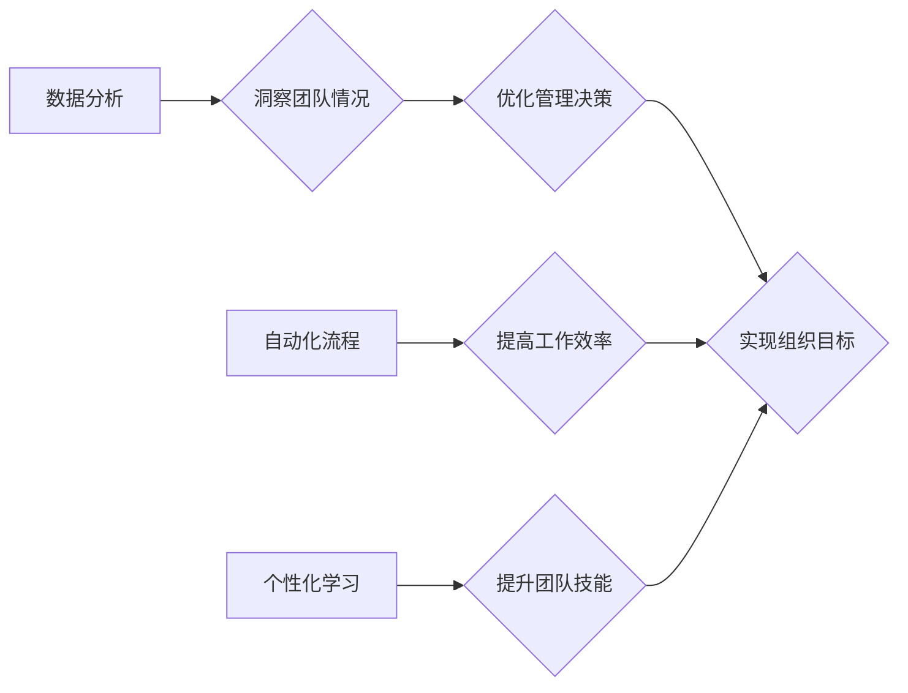

>  人工智能、管理、团队协作、沟通、领导力、技术创新、文化建设、高效执行

## 1. 背景介绍

在当今科技飞速发展的时代，人工智能（AI）正以惊人的速度改变着我们的生活和工作方式。作为一名AI专家，我深刻体会到，技术进步的驱动力量不仅来自算法和模型的不断优化，更来自于高效的团队管理和良好的组织文化。

传统的管理模式往往侧重于控制和监督，而AI时代需要更加注重激发团队成员的潜能和善意，营造一个充满协作、创新和学习氛围的工作环境。

## 2. 核心概念与联系

### 2.1  管理的本质

管理的本质是通过协调和引导资源，实现组织目标。在AI时代，资源不仅包括人力、物力、财力，还包括数据、算法和技术。

### 2.2  激发潜能与善意

激发潜能是指帮助团队成员发挥自身优势，实现个人价值最大化。善意是指建立信任、尊重和理解的团队文化，鼓励成员积极参与、共同进步。

### 2.3  AI与管理的融合

AI技术可以为管理提供强大的工具和支持，例如：

* **数据分析:** AI可以分析海量数据，洞察团队成员的工作效率、沟通模式、协作情况等，为管理决策提供数据支撑。
* **自动化流程:** AI可以自动化一些重复性任务，例如日程安排、会议管理、文档处理等，释放团队成员更多的时间和精力，让他们专注于更具创造性和战略性的工作。
* **个性化学习:** AI可以根据团队成员的学习风格和需求，提供个性化的学习内容和路径，帮助他们提升技能和知识水平。

**Mermaid 流程图**



## 3. 核心算法原理 & 具体操作步骤

### 3.1  算法原理概述

在AI管理中，常用的算法包括：

* **推荐算法:** 根据团队成员的兴趣、技能和工作经验，推荐合适的项目、任务和学习资源。
* **预测算法:** 预测团队成员的工作效率、项目进度和潜在风险，帮助管理者提前预警和应对。
* **协作算法:** 优化团队成员之间的沟通和协作，提高团队效率和创新能力。

### 3.2  算法步骤详解

以推荐算法为例，其基本步骤包括：

1. **数据收集:** 收集团队成员的个人信息、工作记录、项目参与情况、学习行为等数据。
2. **数据预处理:** 对收集到的数据进行清洗、转换和特征提取，以便算法模型的训练和使用。
3. **模型训练:** 使用机器学习算法，训练推荐模型，学习团队成员的兴趣和偏好。
4. **推荐生成:** 根据训练好的模型，为团队成员生成个性化的推荐结果，例如推荐合适的项目、任务或学习资源。
5. **效果评估:** 评估推荐算法的准确性和有效性，并根据评估结果进行模型优化和调整。

### 3.3  算法优缺点

**优点:**

* **个性化:** 可以根据团队成员的个体差异，提供个性化的推荐和服务。
* **效率提升:** 可以帮助团队成员快速找到所需信息和资源，提高工作效率。
* **数据驱动:** 基于数据分析和预测，可以帮助管理者做出更科学和有效的决策。

**缺点:**

* **数据依赖:** 推荐算法的准确性和有效性依赖于数据的质量和丰富程度。
* **算法黑盒:** 一些复杂的机器学习算法难以解释，其决策过程可能难以理解。
* **伦理风险:** 需要关注推荐算法的公平性、透明性和可解释性，避免产生歧视或误导。

### 3.4  算法应用领域

推荐算法在AI管理中应用广泛，例如：

* **人才招聘:** 推荐合适的候选人，提高招聘效率。
* **项目分配:** 根据团队成员的技能和经验，推荐合适的项目，提高项目成功率。
* **学习资源推荐:** 根据团队成员的学习需求，推荐合适的学习资源，提升团队技能水平。

## 4. 数学模型和公式 & 详细讲解 & 举例说明

### 4.1  数学模型构建

推荐算法通常使用协同过滤模型，其核心思想是：

* **用户相似性:** 找到具有相似兴趣和偏好的用户，推荐他们喜欢的物品。
* **物品相似性:** 找到具有相似特征和属性的物品，推荐用户喜欢的物品。

### 4.2  公式推导过程

协同过滤模型的评分预测公式可以表示为：

$$
\hat{r}_{u,i} = \bar{r}_u + \frac{\sum_{v \in N(u)} (r_{v,i} - \bar{r}_v) \cdot s_{u,v}}{\sum_{v \in N(u)} s_{u,v}}
$$

其中：

* $\hat{r}_{u,i}$: 用户 $u$ 对物品 $i$ 的预测评分。
* $\bar{r}_u$: 用户 $u$ 的平均评分。
* $r_{v,i}$: 用户 $v$ 对物品 $i$ 的真实评分。
* $\bar{r}_v$: 用户 $v$ 的平均评分。
* $s_{u,v}$: 用户 $u$ 和 $v$ 的相似度。
* $N(u)$: 用户 $u$ 的邻居集合。

### 4.3  案例分析与讲解

假设有一个电影推荐系统，用户 Alice 和 Bob 都喜欢动作片，但 Alice 更喜欢科幻片，Bob 更喜欢喜剧片。

根据协同过滤模型，系统会根据 Alice 和 Bob 的评分历史，计算出他们之间的相似度。然后，系统会推荐 Alice 喜欢的科幻片，并推荐 Bob 喜欢的喜剧片。

## 5. 项目实践：代码实例和详细解释说明

### 5.1  开发环境搭建

* 操作系统: Ubuntu 20.04
* Python 版本: 3.8
* 依赖库: pandas, numpy, scikit-learn

### 5.2  源代码详细实现

```python
import pandas as pd
from sklearn.metrics.pairwise import cosine_similarity

# 加载电影评分数据
ratings_data = pd.read_csv('ratings.csv')

# 计算用户之间的相似度
user_similarity = cosine_similarity(ratings_data.T)

# 获取用户 Alice 的邻居
alice_neighbors = ratings_data.index[user_similarity[0] > 0.8]

# 预测用户 Alice 对电影 X 的评分
alice_predicted_rating = (
    (ratings_data.loc[alice_neighbors, 'X'] - ratings_data.loc[alice_neighbors].mean())
    * user_similarity[0][alice_neighbors]
).sum() / user_similarity[0][alice_neighbors].sum()

print(f'用户 Alice 对电影 X 的预测评分: {alice_predicted_rating}')
```

### 5.3  代码解读与分析

* 代码首先加载电影评分数据，并使用 cosine_similarity 函数计算用户之间的相似度。
* 然后，代码获取用户 Alice 的邻居，并根据邻居的评分历史预测 Alice 对电影 X 的评分。
* 最后，代码输出用户 Alice 对电影 X 的预测评分。

### 5.4  运行结果展示

运行代码后，会输出用户 Alice 对电影 X 的预测评分。

## 6. 实际应用场景

AI管理在各个行业都有广泛的应用场景，例如：

* **科技公司:** 优化团队协作、提升研发效率、加速产品迭代。
* **金融机构:** 提升客户服务质量、降低风险、提高投资收益。
* **教育机构:** 个性化学习推荐、提升教学效率、促进学生成长。

### 6.4  未来应用展望

随着AI技术的不断发展，AI管理将在未来发挥更加重要的作用，例如：

* **更精准的预测:** 利用更先进的机器学习算法，对团队成员的工作效率、项目进度和潜在风险进行更精准的预测。
* **更个性化的服务:** 基于大数据分析和人工智能，为每个团队成员提供更个性化的学习、发展和成长路径。
* **更智能的决策:** 利用AI辅助决策，帮助管理者做出更科学、更有效的决策。

## 7. 工具和资源推荐

### 7.1  学习资源推荐

* **在线课程:** Coursera, edX, Udemy 等平台提供丰富的AI管理课程。
* **书籍:** 《管理的本质》、《人工智能时代》、《数据驱动管理》等书籍。
* **博客和论坛:** 关注AI管理领域的博客和论坛，例如Towards Data Science, Machine Learning Mastery 等。

### 7.2  开发工具推荐

* **Python:** 作为AI开发的常用语言，Python拥有丰富的库和工具，例如pandas, numpy, scikit-learn 等。
* **Jupyter Notebook:** 用于数据分析和机器学习模型开发的交互式环境。
* **TensorFlow, PyTorch:** 深度学习框架，用于训练和部署AI模型。

### 7.3  相关论文推荐

* **"The Impact of Artificial Intelligence on Management"**
* **"AI-Powered Talent Management: A Review"**
* **"Data-Driven Decision Making in Organizations"**

## 8. 总结：未来发展趋势与挑战

### 8.1  研究成果总结

AI管理的研究取得了显著成果，为提高团队效率、激发潜能、优化组织结构提供了新的思路和方法。

### 8.2  未来发展趋势

* **更智能的AI助手:** AI助手将更加智能化，能够自动完成更多管理任务，例如日程安排、会议管理、文档处理等。
* **更个性化的管理方案:** 基于大数据分析和人工智能，将能够为每个团队成员提供更个性化的管理方案，帮助他们实现个人价值最大化。
* **更注重伦理和可解释性:** AI管理的发展需要更加注重伦理和可解释性，避免产生歧视或误导。

### 8.3  面临的挑战

* **数据安全和隐私保护:** AI管理需要处理大量个人数据，因此数据安全和隐私保护是一个重要的挑战。
* **算法偏见:** AI算法可能存在偏见，导致不公平的管理决策。
* **技术人才短缺:** AI管理需要大量的技术人才，而目前技术人才短缺是一个普遍问题。

### 8.4  研究展望

未来，AI管理的研究将更加注重以下方面:

* **开发更安全、更可靠的AI算法。**
* **解决AI算法偏见问题。**
* **培养更多AI管理人才。**


## 9. 附录：常见问题与解答

**Q1: AI管理会取代人类管理吗？**

A1: AI管理不会完全取代人类管理，而是会与人类管理相辅相成。AI可以帮助管理者自动化一些重复性任务，释放更多时间和精力，专注于更具创造性和战略性的工作。

**Q2: 如何确保AI管理的公平性和透明性？**

A2: 确保AI管理的公平性和透明性需要从以下几个方面入手：

* 使用公平的算法模型，避免算法偏见。
* 对AI算法进行透明化解释，让管理者和员工能够理解算法的决策过程。
* 建立有效的监督机制，定期评估AI管理的公平性和有效性。

**Q3: 如何培养AI管理人才？**

A3: 培养AI管理人才需要以下几个方面：

* 加强AI基础知识的学习。
* 学习AI管理相关的理论和实践经验。
* 积累实际工作经验，并不断提升自己的技能和能力。


作者：禅与计算机程序设计艺术 / Zen and the Art of Computer Programming 
<end_of_turn>