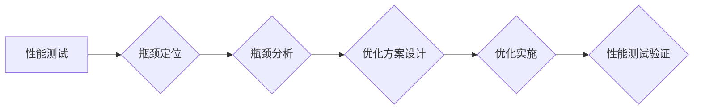

> 系统瓶颈，性能优化，负载测试，性能调优，系统架构，数据库优化，缓存机制，代码优化

## 1. 背景介绍

在当今以数字化转型为核心的时代，软件系统扮演着越来越重要的角色。无论是企业内部的业务系统，还是面向用户的互联网应用，都面临着日益增长的性能和可靠性要求。然而，随着系统规模的不断扩大，复杂度的不断提升，系统性能瓶颈问题也日益突出。

系统瓶颈是指系统中某一环节或组件的性能无法满足系统整体需求，从而导致系统整体性能下降的现象。识别和解决系统瓶颈是提升系统性能和用户体验的关键。

## 2. 核心概念与联系

**2.1 系统瓶颈类型**

系统瓶颈可以分为以下几种类型：

* **硬件瓶颈:** CPU、内存、硬盘、网络带宽等硬件资源不足，导致系统性能下降。
* **软件瓶颈:** 代码逻辑缺陷、算法效率低下、数据库查询效率低、缓存机制不合理等软件因素导致系统性能下降。
* **网络瓶颈:** 网络带宽不足、网络延迟高、网络拥塞等网络因素导致系统性能下降。

**2.2 系统瓶颈分析流程**

系统瓶颈分析流程通常包括以下几个步骤：

1. **性能测试:** 通过负载测试等手段，模拟真实用户场景，测量系统性能指标，例如响应时间、吞吐量、资源利用率等。
2. **瓶颈定位:** 分析性能测试结果，识别系统性能下降的主要原因，定位系统瓶颈所在。
3. **瓶颈分析:** 对定位到的瓶颈进行深入分析，了解其根本原因，例如代码逻辑缺陷、数据库查询效率低、网络带宽不足等。
4. **优化方案设计:** 根据瓶颈分析结果，设计相应的优化方案，例如代码重构、数据库优化、缓存机制调整、硬件升级等。
5. **优化实施:** 将优化方案实施到系统中，并进行性能测试验证，确保优化效果。

**2.3 系统瓶颈分析工具**

常用的系统瓶颈分析工具包括：

* **性能监控工具:** JMeter、LoadRunner、Gatling等
* **系统诊断工具:**  top、htop、iostat、netstat等
* **数据库性能分析工具:**  MySQL Workbench、SQL Server Management Studio等

**2.4 Mermaid 流程图**



## 3. 核心算法原理 & 具体操作步骤

### 3.1 算法原理概述

系统瓶颈分析的核心算法通常基于以下原理：

* **性能指标分析:** 通过分析系统性能指标，例如响应时间、吞吐量、资源利用率等，识别系统性能下降的趋势和特征。
* **数据采集与分析:** 收集系统运行期间的各种数据，例如CPU使用率、内存使用率、网络流量等，并进行分析，找出性能瓶颈的根源。
* **模型构建与预测:** 建立系统性能模型，预测系统在不同负载下的性能表现，从而提前识别潜在的瓶颈。

### 3.2 算法步骤详解

系统瓶颈分析算法的具体步骤如下：

1. **数据采集:** 收集系统运行期间的各种数据，例如CPU使用率、内存使用率、网络流量等。
2. **数据预处理:** 对采集到的数据进行清洗、转换、归一化等预处理操作，以便于后续分析。
3. **性能指标计算:** 计算系统性能指标，例如响应时间、吞吐量、资源利用率等。
4. **异常值检测:** 检测数据中的异常值，排除由于数据采集错误或系统故障导致的异常数据。
5. **瓶颈定位:** 分析性能指标和数据特征，识别系统性能下降的主要原因，定位系统瓶颈所在。
6. **瓶颈分析:** 对定位到的瓶颈进行深入分析，了解其根本原因，例如代码逻辑缺陷、数据库查询效率低、网络带宽不足等。
7. **优化方案设计:** 根据瓶颈分析结果，设计相应的优化方案，例如代码重构、数据库优化、缓存机制调整、硬件升级等。

### 3.3 算法优缺点

**优点:**

* **自动化程度高:** 系统瓶颈分析算法可以自动化识别和定位系统瓶颈，减少人工干预。
* **分析能力强:** 算法可以分析大量的数据，识别出隐藏的性能瓶颈。
* **优化效果好:** 算法可以根据瓶颈分析结果，设计有效的优化方案，提升系统性能。

**缺点:**

* **算法复杂度高:** 系统瓶颈分析算法的实现较为复杂，需要专业的技术人员进行开发和维护。
* **数据依赖性强:** 算法的准确性依赖于数据质量，如果数据采集不准确，算法结果也会受到影响。
* **环境适应性差:** 算法可能需要根据不同的系统环境进行调整，才能达到最佳效果。

### 3.4 算法应用领域

系统瓶颈分析算法广泛应用于以下领域：

* **Web应用性能优化:** 识别和解决Web应用的性能瓶颈，提升用户体验。
* **数据库性能优化:** 优化数据库查询效率，提升数据库性能。
* **云计算平台性能管理:** 监控和管理云计算平台的性能，确保平台稳定运行。
* **大数据处理系统性能优化:** 优化大数据处理系统的性能，提高数据处理效率。

## 4. 数学模型和公式 & 详细讲解 & 举例说明

### 4.1 数学模型构建

系统瓶颈分析可以利用数学模型来描述系统性能和瓶颈现象。例如，可以建立一个线性回归模型来预测系统响应时间与负载之间的关系。

**4.1.1 线性回归模型**

假设系统响应时间为y，负载为x，则线性回归模型可以表示为：

$$y = a + bx$$

其中，a为截距，b为斜率。

**4.1.2 模型参数估计**

可以使用最小二乘法估计模型参数a和b。最小二乘法是指通过最小化模型预测值与实际值的平方差来估计模型参数。

### 4.2 公式推导过程

最小二乘法推导过程如下：

1. 定义误差函数：

$$E = \sum_{i=1}^{n}(y_i - \hat{y}_i)^2$$

其中，$y_i$为实际响应时间，$\hat{y}_i$为模型预测响应时间。

2. 对误差函数求偏导：

$$\frac{\partial E}{\partial a} = -2\sum_{i=1}^{n}(y_i - a - bx_i)$$

$$\frac{\partial E}{\partial b} = -2\sum_{i=1}^{n}x_i(y_i - a - bx_i)$$

3. 令偏导数等于零，解出a和b：

$$a = \bar{y} - b\bar{x}$$

$$b = \frac{\sum_{i=1}^{n}(x_i - \bar{x})(y_i - \bar{y})}{\sum_{i=1}^{n}(x_i - \bar{x})^2}$$

其中，$\bar{y}$为平均响应时间，$\bar{x}$为平均负载。

### 4.3 案例分析与讲解

假设我们收集到以下数据：

| 负载 (x) | 响应时间 (y) |
|---|---|
| 10 | 100 |
| 20 | 150 |
| 30 | 200 |
| 40 | 250 |

我们可以使用线性回归模型来预测系统响应时间与负载之间的关系。

根据公式，我们可以计算出a和b的值，得到线性回归模型：

$$y = 80 + 5x$$

这个模型表示，当负载增加1单位时，系统响应时间会增加5毫秒。

## 5. 项目实践：代码实例和详细解释说明

### 5.1 开发环境搭建

* 操作系统: Ubuntu 20.04 LTS
* 编程语言: Python 3.8
* 性能测试工具: JMeter 5.5

### 5.2 源代码详细实现

```python
import time
import threading

def task(name):
    print(f"Task {name} started")
    time.sleep(1)
    print(f"Task {name} finished")

if __name__ == "__main__":
    threads = []
    for i in range(10):
        thread = threading.Thread(target=task, args=(i,))
        threads.append(thread)
        thread.start()

    for thread in threads:
        thread.join()
    print("All tasks completed")
```

### 5.3 代码解读与分析

这段代码演示了使用多线程来提高程序执行效率。

* `task` 函数模拟一个耗时任务，在执行过程中模拟工作量。
* `threading.Thread` 创建一个新的线程，并将 `task` 函数作为目标函数传递。
* `thread.start()` 启动线程执行。
* `thread.join()` 等待线程完成执行。

### 5.4 运行结果展示

运行这段代码后，你会看到10个任务并发执行，每个任务的执行时间约为1秒。

## 6. 实际应用场景

### 6.1 系统性能瓶颈分析

系统性能瓶颈分析可以应用于各种系统，例如Web应用、数据库系统、云计算平台等。通过分析系统性能指标和数据特征，可以识别系统性能下降的主要原因，定位系统瓶颈所在。

### 6.2 性能优化方案设计

系统性能瓶颈分析可以帮助设计有效的性能优化方案。例如，如果数据库查询效率低，可以优化数据库索引、调整查询语句等；如果网络带宽不足，可以升级网络设备、优化网络拓扑等。

### 6.3 预防性性能监控

系统性能瓶颈分析可以用于建立性能监控系统，提前识别潜在的性能瓶颈。通过监控系统性能指标，可以及时发现性能下降的趋势，并采取措施进行预防。

### 6.4 未来应用展望

随着云计算、大数据、人工智能等技术的快速发展，系统性能瓶颈分析将面临新的挑战和机遇。未来，系统性能瓶颈分析将更加智能化、自动化，能够更准确地识别和定位系统瓶颈，并提供更有效的优化方案。

## 7. 工具和资源推荐

### 7.1 学习资源推荐

* **书籍:**
    * 《系统性能优化》
    * 《性能测试与优化》
* **在线课程:**
    * Coursera: Performance Engineering
    * Udemy: Performance Testing and Optimization

### 7.2 开发工具推荐

* **性能测试工具:** JMeter, LoadRunner, Gatling
* **系统诊断工具:** top, htop, iostat, netstat
* **数据库性能分析工具:** MySQL Workbench, SQL Server Management Studio

### 7.3 相关论文推荐

* **论文:**
    * "A Survey of Performance Bottleneck Analysis Techniques"
    * "Performance Optimization Techniques for Cloud Computing"

## 8. 总结：未来发展趋势与挑战

### 8.1 研究成果总结

系统性能瓶颈分析已经取得了显著的成果，能够有效地识别和定位系统瓶颈，并提供有效的优化方案。

### 8.2 未来发展趋势

未来，系统性能瓶颈分析将朝着以下方向发展：

* **智能化:** 利用机器学习等人工智能技术，自动识别和定位系统瓶颈。
* **自动化:** 自动化系统性能测试和优化过程，减少人工干预。
* **云原生:** 针对云原生应用，提供更有效的性能瓶颈分析和优化方案。

### 8.3 面临的挑战

系统性能瓶颈分析也面临着一些挑战：

* **数据复杂性:** 系统运行数据越来越复杂，分析难度不断增加。
* **环境多样性:** 系统运行环境多样化，需要针对不同的环境进行分析和优化。
* **技术迭代:** 系统技术不断迭代更新，需要不断更新分析方法和工具。

### 8.4 研究展望

未来，我们需要继续加强系统性能瓶颈分析的研究，开发更智能、更自动化、更适应云原生环境的分析方法和工具，为系统性能优化提供更强大的支持。

## 9. 附录：常见问题与解答

### 9.1 如何识别系统瓶颈？

可以通过分析系统性能指标、数据特征、日志信息等方式识别系统瓶颈。

### 9.2 如何优化系统性能？

系统性能优化方案需要根据具体情况进行设计，常见方法包括：

* **代码优化:** 优化代码逻辑、减少代码冗余、提高代码执行效率。
* **数据库优化:** 优化数据库索引、调整查询语句、优化数据库配置。
* **缓存机制:** 使用缓存机制减少数据库访问次数、提高数据访问效率。
* **硬件升级:** 升级硬件资源，例如CPU、内存、硬盘等，提升系统性能。

### 9.3 如何选择合适的性能测试工具？

选择性能测试工具需要根据具体情况进行选择，需要考虑以下因素：

* **测试场景:** 不同的测试场景需要使用不同的工具。
* **系统规模:** 系统规模越大，需要使用更强大的工具。
* **预算:** 不同的工具价格不同，需要根据预算进行选择。


作者：禅与计算机程序设计艺术 / Zen and the Art of Computer Programming 
<end_of_turn>