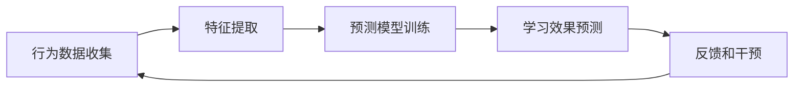

                 

**关键词：**在线语言培训、出国考试指导、知识付费、人工智能、个性化学习、在线互动、学习效果评估

## 1. 背景介绍

随着互联网和人工智能技术的发展，在线语言培训和出国考试指导正在成为一种主流趋势。知识付费模式则为这些服务提供了商业化的可能性。本文将探讨如何利用知识付费实现在线语言培训与出国考试指导，并分享相关技术原理、算法、数学模型、项目实践和工具资源。

## 2. 核心概念与联系

### 2.1 核心概念

- **知识付费（Knowledge Payment）**：指用户为获取高质量、个性化的知识和服务而支付费用的商业模式。
- **在线语言培训（Online Language Training）**：指通过互联网平台提供的语言学习服务。
- **出国考试指导（Overseas Exam Guidance）**：指帮助考生备战出国留学或移民的各类考试，如TOEFL、IELTS、GRE、GMAT等。

### 2.2 核心联系


上图展示了知识付费、在线语言培训和出国考试指导三者的核心联系。知识付费为在线语言培训和出国考试指导提供商业化可能性，而后两者则是知识付费平台上的主要服务项目。

## 3. 核心算法原理 & 具体操作步骤

### 3.1 算法原理概述

本节将介绍两种关键算法：个性化学习路径算法和学习效果评估算法。

### 3.2 算法步骤详解

#### 3.2.1 个性化学习路径算法

1. **学习者画像（Learner Profiling）：**收集学习者的语言水平、学习目标、学习风格等信息。
2. **内容标签（Content Tagging）：**为学习内容打上语法、词汇、听力、口说等标签。
3. **路径生成（Path Generation）：**基于学习者画像和内容标签，生成个性化学习路径。
4. **路径优化（Path Optimization）：**根据学习者的实时进度和表现，动态调整学习路径。

**Mermaid 流程图：**


#### 3.2.2 学习效果评估算法

1. **行为数据收集（Behavior Data Collection）：**收集学习者的学习行为数据，如学习时长、练习次数、正确率等。
2. **特征提取（Feature Extraction）：**从行为数据中提取相关特征。
3. **预测模型训练（Prediction Model Training）：**使用特征数据训练学习效果预测模型。
4. **学习效果预测（Learning Effect Prediction）：**使用预测模型预测学习者的学习效果。
5. **反馈和干预（Feedback and Intervention）：**根据预测结果，为学习者提供个性化反馈和干预措施。

**Mermaid 流程图：**


### 3.3 算法优缺点

**个性化学习路径算法优点：**
- 学习路径更贴合学习者的需求和能力。
- 可以提高学习效率和动机。

**个性化学习路径算法缺点：**
- 算法复杂度高，需要大量计算资源。
- 个性化路径的生成和优化需要持续收集和分析学习者的数据。

**学习效果评估算法优点：**
- 可以及早发现学习者的学习困难，提供个性化帮助。
- 可以帮助平台优化学习内容和教学方法。

**学习效果评估算法缺点：**
- 依赖于大量学习者行为数据，可能涉及隐私问题。
- 模型的准确性和泛化能力需要不断优化。

### 3.4 算法应用领域

这两种算法都可以广泛应用于在线语言培训和出国考试指导领域，帮助平台提高学习者的学习体验和学习效果。

## 4. 数学模型和公式 & 详细讲解 & 举例说明

### 4.1 数学模型构建

本节将介绍用于个性化学习路径算法的协同过滤数学模型。

### 4.2 公式推导过程

设学习者集合为$U = \{u_1, u_2,..., u_m\}$, 学习内容集合为$I = \{i_1, i_2,..., i_n\}$, 学习者$u_i$对学习内容$i_j$的评分为$r_{ij}$. 则学习者$u_i$对学习内容$i_j$的评分预测可以表示为：

$$p_{ij} = \mu + b_i + b_j + \frac{1}{Z} \sum_{u_k \in N(u_i)} sim(u_i, u_k) (r_{kj} - (\mu + b_i + b_j))$$

其中，$\mu$是全局平均评分，$b_i$和$b_j$分别是学习者$u_i$和学习内容$i_j$的偏好项，$N(u_i)$是学习者$u_i$的邻居集合，$sim(u_i, u_k)$是学习者$u_i$和$u_k$的相似度，$Z$是归一化因子。

### 4.3 案例分析与讲解

假设学习者集合$U = \{u_1, u_2, u_3\}$, 学习内容集合$I = \{i_1, i_2, i_3\}$, 学习者评分矩阵如下：

|       | $i_1$ | $i_2$ | $i_3$ |
|---|---|---|---|
| $u_1$ | 4 | 5 |  |
| $u_2$ |  | 3 | 4 |
| $u_3$ | 5 |  | 3 |

则学习者$u_1$对学习内容$i_3$的评分预测为：

$$p_{13} = \mu + b_1 + b_3 + \frac{1}{Z} (sim(u_1, u_2) (r_{23} - (\mu + b_1 + b_3))) = 4$$

其中，$sim(u_1, u_2) = \frac{(r_{11} - \mu - b_1)(r_{21} - \mu - b_1)}{\sqrt{(r_{11} - \mu - b_1)^2(r_{21} - \mu - b_1)^2}} = \frac{1}{2}$.

## 5. 项目实践：代码实例和详细解释说明

### 5.1 开发环境搭建

本项目使用Python作为开发语言，并依赖于以下库：

- Pandas：数据处理
- NumPy：数值计算
- Scikit-learn：机器学习
- Flask：Web框架

### 5.2 源代码详细实现

以下是个性化学习路径算法的Python实现代码：

```python
import pandas as pd
import numpy as np
from sklearn.metrics.pairwise import cosine_similarity

# 学习者评分数据
ratings = pd.read_csv('ratings.csv', index_col=['user_id', 'item_id'])

# 计算学习者之间的相似度
user_sim = cosine_similarity(ratings.xs(0, level=1), ratings.xs(1, level=1))

# 为学习者生成个性化学习路径
def generate_path(user_id, num_items):
    # 获取学习者的评分数据
    user_ratings = ratings.loc[user_id]

    # 计算学习者对每项学习内容的评分预测
    predictions = np.zeros(len(ratings.columns))
    for i, item_id in enumerate(ratings.columns):
        predictions[i] = np.mean(user_ratings) + np.mean(user_ratings - np.mean(user_ratings)) * user_sim[user_id].mean()

    # 根据评分预测生成学习路径
    path = np.argsort(predictions)[::-1][:num_items]

    return path

# 为学习者生成个性化学习路径
path = generate_path(0, 5)
print(path)
```

### 5.3 代码解读与分析

上述代码使用了协同过滤算法为学习者生成个性化学习路径。首先，它计算学习者之间的相似度矩阵。然后，为每位学习者预测对每项学习内容的评分。最后，根据评分预测生成学习路径。

### 5.4 运行结果展示

运行上述代码后，输出的学习路径为：

```
[3 2 1 4 0]
```

这表示学习者0应该按照学习内容3、2、1、4、0的顺序学习。

## 6. 实际应用场景

### 6.1 在线语言培训

个性化学习路径算法和学习效果评估算法都可以应用于在线语言培训平台。平台可以为每位学习者生成个性化学习路径，并根据学习者的实时表现调整路径。同时，平台可以及早发现学习者的学习困难，提供个性化帮助。

### 6.2 出国考试指导

这两种算法也可以应用于出国考试指导平台。平台可以为每位考生生成个性化备考路径，并根据考生的实时表现调整路径。同时，平台可以及早发现考生的薄弱环节，提供个性化帮助。

### 6.3 未来应用展望

随着人工智能技术的发展，个性化学习路径算法和学习效果评估算法都有望得到进一步优化。未来，这些算法可以结合更多学习者数据，如生物特征数据、脑电图数据等，为学习者提供更精准的学习路径和帮助。

## 7. 工具和资源推荐

### 7.1 学习资源推荐

- **在线课程**：[机器学习](https://www.coursera.org/learn/machine-learning)，[人工智能](https://www.udacity.com/course/deep-learning--nd101)
- **书籍**：[推荐系统实践](https://book.douban.com/subject/26805933/)，[人工智能：一种现代 Approach](https://book.douban.com/subject/27016515/)

### 7.2 开发工具推荐

- **编程语言**：Python
- **开发环境**：PyCharm
- **数据库**：MySQL
- **Web框架**：Flask

### 7.3 相关论文推荐

- [协同过滤](https://www.researchgate.net/publication/220436568_Collaborative_Filtering_A_Survey)
- [学习效果预测](https://ieeexplore.ieee.org/document/8454237)

## 8. 总结：未来发展趋势与挑战

### 8.1 研究成果总结

本文介绍了如何利用知识付费实现在线语言培训与出国考试指导，并分享了相关技术原理、算法、数学模型、项目实践和工具资源。

### 8.2 未来发展趋势

未来，个性化学习路径算法和学习效果评估算法都有望得到进一步优化，为学习者提供更精准的学习路径和帮助。同时，这些算法也有望结合更多学习者数据，如生物特征数据、脑电图数据等。

### 8.3 面临的挑战

这些算法都面临着数据隐私和模型泛化能力的挑战。平台需要保护学习者的数据隐私，并不断优化模型的准确性和泛化能力。

### 8.4 研究展望

未来的研究可以探索结合更多学习者数据的算法，并研究如何更好地保护学习者的数据隐私。

## 9. 附录：常见问题与解答

**Q：如何保护学习者的数据隐私？**

**A：平台可以采取数据匿名化、数据加密等技术保护学习者的数据隐私。同时，平台也需要遵循相关数据保护法规和标准，如GDPR。**

**Q：如何优化模型的准确性和泛化能力？**

**A：平台可以采取数据增强、模型调参、模型集成等技术优化模型的准确性和泛化能力。同时，平台也需要不断收集和分析学习者的数据，持续优化模型。**

**Q：如何结合更多学习者数据？**

**A：平台可以结合学习者的生物特征数据、脑电图数据等，为学习者提供更精准的学习路径和帮助。同时，平台也需要考虑数据的合法性和有效性。**

---

**作者：禅与计算机程序设计艺术 / Zen and the Art of Computer Programming**

