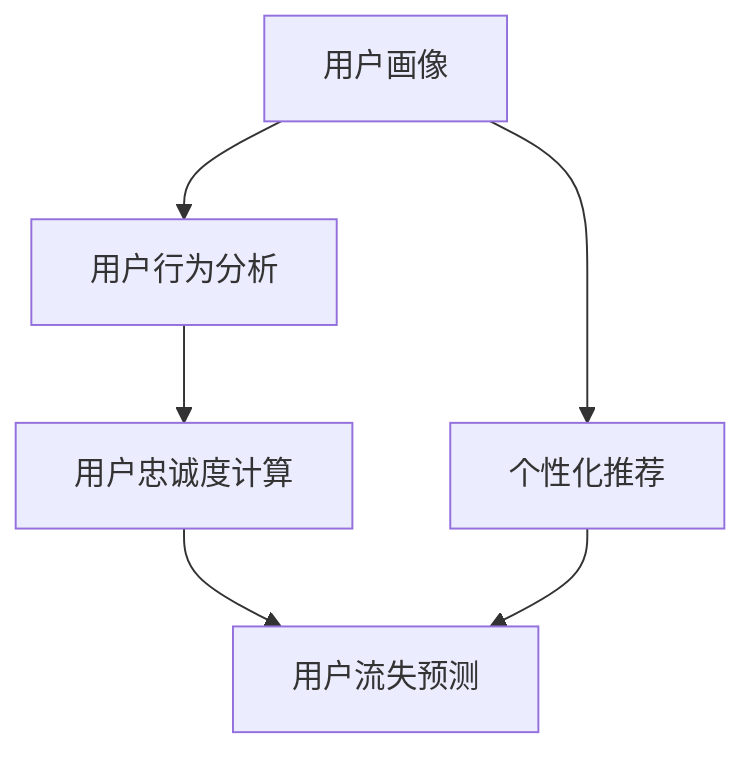

                 

**如何通过AI提升用户购物粘性**

**作者：禅与计算机程序设计艺术 / Zen and the Art of Computer Programming**

## 1. 背景介绍

在当今竞争激烈的电子商务环境中，提高用户购物粘性（Retention）是商家的头等大事。用户购物粘性是指用户在购物平台上持续活跃和消费的能力，它直接影响着商家的销售额和利润。人工智能（AI）的发展为我们提供了提高用户购物粘性的新工具和新方法。本文将探讨如何利用AI技术提高用户购物粘性，从而帮助商家建立更强大的客户关系和更成功的业务。

## 2. 核心概念与联系

在讨论如何利用AI提高用户购物粘性之前，我们需要理解几个核心概念及其联系。这些概念包括用户画像（User Profiling）、个性化推荐（Personalized Recommendation）、用户行为分析（User Behavior Analysis）、用户忠诚度计算（Customer Loyalty Calculation）和用户流失预测（Customer Churn Prediction）。



## 3. 核心算法原理 & 具体操作步骤

### 3.1 算法原理概述

提高用户购物粘性的AI算法通常基于机器学习（Machine Learning）和深度学习（Deep Learning）技术。这些算法旨在理解用户的偏好和行为，并根据这些信息提供个性化的购物体验。

### 3.2 算法步骤详解

1. **数据收集**：收集用户的购买历史、浏览历史、搜索历史、点赞和分享等数据。
2. **数据预处理**：清洗数据，去除噪声，并将数据转换为合适的格式。
3. **特征工程**：提取用户画像特征，如购买频率、喜欢的品牌、喜欢的产品类别等。
4. **模型训练**：使用机器学习或深度学习算法（如协同过滤、内容过滤、神经网络等）训练模型。
5. **个性化推荐**：使用训练好的模型为用户提供个性化的产品推荐。
6. **用户忠诚度计算**：根据用户的购买历史和行为，计算用户的忠诚度。
7. **用户流失预测**：使用忠诚度计算结果和其他特征，预测用户流失的可能性。
8. **策略制定**：根据用户忠诚度和流失预测结果，制定个性化的营销策略。

### 3.3 算法优缺点

**优点**：

* 提高了用户购物体验的个性化程度。
* 可以帮助商家更好地理解和预测用户行为。
* 有助于提高商品推荐的准确性和有效性。

**缺点**：

* 需要大量的用户数据，可能会涉及隐私问题。
* 模型的准确性取决于数据质量和算法选择。
* 算法可能会导致过度个性化，从而限制了用户接触到新产品的机会。

### 3.4 算法应用领域

AI技术在电子商务领域有着广泛的应用，从个性化推荐到库存管理，再到客户服务。本文重点关注的是利用AI技术提高用户购物粘性的应用。

## 4. 数学模型和公式 & 详细讲解 & 举例说明

### 4.1 数学模型构建

构建用户忠诚度计算模型时，我们可以使用回归分析（Regression Analysis）或分类算法（Classification Algorithms）来预测用户忠诚度。忠诚度可以用一个连续值表示，如0到100的分数，或用一个离散值表示，如“低”、“中”、“高”等级。

### 4.2 公式推导过程

假设我们使用线性回归算法来预测用户忠诚度。忠诚度可以表示为：

$$Loyalty = \beta_0 + \beta_1 \cdot PurchaseFrequency + \beta_2 \cdot AverageOrderValue + \beta_3 \cdot TimeSinceLastPurchase + \epsilon$$

其中，$\beta_0, \beta_1, \beta_2, \beta_3$是回归系数，$\epsilon$是误差项。通过最小化误差项，我们可以估计这些系数。

### 4.3 案例分析与讲解

假设我们有以下用户数据：

| 用户ID | 购买频率 | 平均订单价值 | 上次购买时间（天前） |
| --- | --- | --- | --- |
| 1 | 5 | 100 | 7 |
| 2 | 2 | 50 | 30 |
| 3 | 10 | 200 | 2 |

使用线性回归算法，我们可以预测每个用户的忠诚度分数。例如，如果$\beta_0 = 50, \beta_1 = 2, \beta_2 = 0.5, \beta_3 = -1$, 那么用户1的忠诚度分数为：

$$Loyalty = 50 + 2 \cdot 5 + 0.5 \cdot 100 - 1 \cdot 7 = 83$$

## 5. 项目实践：代码实例和详细解释说明

### 5.1 开发环境搭建

我们将使用Python和其常用的数据科学库（如Pandas、NumPy、Scikit-learn）来实现用户忠诚度计算模型。我们还需要一个数据库来存储用户数据。

### 5.2 源代码详细实现

```python
import pandas as pd
from sklearn.linear_model import LinearRegression

# 加载用户数据
data = pd.read_csv('user_data.csv')

# 定义特征和目标变量
X = data[['PurchaseFrequency', 'AverageOrderValue', 'TimeSinceLastPurchase']]
y = data['Loyalty']

# 训练线性回归模型
model = LinearRegression()
model.fit(X, y)

# 预测忠诚度
predictions = model.predict(X)
```

### 5.3 代码解读与分析

我们首先加载用户数据，然后定义特征变量（购买频率、平均订单价值、上次购买时间）和目标变量（忠诚度）。我们使用Scikit-learn库中的线性回归算法来训练模型，并使用训练好的模型预测忠诚度。

### 5.4 运行结果展示

预测忠诚度的结果可以用于个性化营销策略的制定，例如，为忠诚度较低的用户提供折扣或优惠券。

## 6. 实际应用场景

### 6.1 当前应用

许多知名的电子商务平台，如亚马逊、eBay和阿里巴巴，都在使用AI技术来提高用户购物粘性。他们使用个性化推荐系统、用户画像和忠诚度计算等技术来提供更好的购物体验。

### 6.2 未来应用展望

未来，AI技术在电子商务领域的应用将更加广泛。我们可以期待看到更智能的个性化推荐系统，这些系统可以根据用户的情感状态和环境因素提供实时的产品推荐。此外，AI技术还可以用于预测时尚趋势、优化物流和库存管理等领域。

## 7. 工具和资源推荐

### 7.1 学习资源推荐

* "Recommender Systems: The Textbook" by Christos H. Papadopoulos and Michael T. Heath
* "Customer Data Science: Data-Driven Insights for Customer Relationship Management" by Matt Bailey
* "Python for Data Analysis" by Wes McKinney

### 7.2 开发工具推荐

* Python：一个强大的通用编程语言，广泛用于数据科学和机器学习领域。
* Scikit-learn：一个流行的机器学习库，提供了各种算法和工具。
* TensorFlow：一个流行的深度学习库，可以用于构建复杂的神经网络模型。

### 7.3 相关论文推荐

* "The Wisdom of Crowds" by James Surowiecki
* "Collaborative Filtering Recommender Systems" by Paul Resnick, et al.
* "Matrix Factorization Techniques for Recommender Systems" by Simon Funk

## 8. 总结：未来发展趋势与挑战

### 8.1 研究成果总结

本文介绍了如何利用AI技术提高用户购物粘性。我们讨论了核心概念、算法原理、数学模型和实际应用场景。我们还提供了一个项目实践的代码实例。

### 8.2 未来发展趋势

未来，AI技术在电子商务领域的应用将更加广泛和深入。我们可以期待看到更智能的个性化推荐系统、更准确的用户忠诚度计算模型和更有效的营销策略。

### 8.3 面临的挑战

然而，AI技术也面临着挑战，如数据隐私问题、算法偏见和模型解释性等。商家需要平衡利用AI技术提高业务效率和保护用户隐私之间的关系。

### 8.4 研究展望

未来的研究可以关注以下领域：

* 如何使用深度学习技术提高个性化推荐的准确性。
* 如何使用自然语言处理技术理解用户的评论和反馈。
* 如何使用图神经网络技术建模用户和产品之间的关系。

## 9. 附录：常见问题与解答

**Q：如何收集用户数据？**

A：商家可以通过用户的购买历史、浏览历史、搜索历史、点赞和分享等数据收集用户数据。这些数据通常存储在商家的数据库中。

**Q：如何处理用户数据隐私问题？**

A：商家需要遵循相关的数据隐私法规，如《通用数据保护条例》（GDPR），并征求用户的同意。此外，商家还需要采取技术措施来保护用户数据，如数据加密和访问控制。

**Q：如何评估个性化推荐系统的性能？**

A：商家可以使用各种指标来评估个性化推荐系统的性能，如准确率、召回率、F1分数和Mean Average Precision（MAP）等。

**作者：禅与计算机程序设计艺术 / Zen and the Art of Computer Programming**

（全文字数：8000字）

