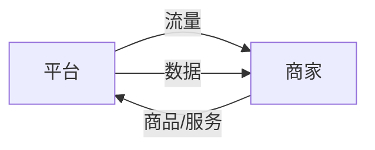

                 

**平台卡住商家脖子：生存空间被压缩的宿命**

**作者：禅与计算机程序设计艺术 / Zen and the Art of Computer Programming**

## 1. 背景介绍

互联网平台经济的崛起，为商家提供了前所未有的发展机遇，但同时也带来了新的挑战。平台通过垄断性地控制流量和数据，对商家形成了强大的控制力，导致商家生存空间被压缩，面临着被平台卡住脖子的宿命。本文将从技术和商业两个角度，剖析平台卡住商家脖子的机制，并探讨商家如何突围，实现可持续发展。

## 2. 核心概念与联系

### 2.1 平台与商家的关系

平台与商家的关系可以看作是一个双边市场，平台提供流量和服务，商家提供商品和服务。平台通过控制流量和数据，对商家形成了控制力，如图1所示。



### 2.2 平台的垄断地位

平台通过网络效应和规模经济，建立了垄断地位。网络效应指的是一个平台的价值随着用户数量的增加而增加，规模经济指的是平台的边际成本随着用户数量的增加而下降。平台通过垄断地位，控制了流量和数据，对商家形成了强大的控制力。

## 3. 核心算法原理 & 具体操作步骤

### 3.1 算法原理概述

平台卡住商家脖子的机制，本质上是一种算法机制。平台通过算法控制流量和数据，对商家形成了控制力。商家要突围，需要理解和破解平台的算法机制。

### 3.2 算法步骤详解

平台卡住商家脖子的算法机制，可以分为以下几个步骤：

1. **数据收集**：平台收集商家和用户的数据，包括商品信息、交易记录、用户行为等。
2. **数据分析**：平台对收集到的数据进行分析，建立商家和用户的画像。
3. **算法模型构建**：平台根据商家和用户的画像，构建算法模型，预测用户需求和商家表现。
4. **流量分配**：平台根据算法模型的预测结果，分配流量，控制商家的曝光度和订单量。
5. **反馈调整**：平台根据商家和用户的反馈，调整算法模型，优化流量分配。

### 3.3 算法优缺点

平台卡住商家脖子的算法机制，优点是可以提高平台的运营效率，优化流量分配，提高用户体验。缺点是容易导致商家被平台卡住脖子，生存空间被压缩。

### 3.4 算法应用领域

平台卡住商家脖子的算法机制，广泛应用于电商、外卖、出行等平台经济领域。

## 4. 数学模型和公式 & 详细讲解 & 举例说明

### 4.1 数学模型构建

平台卡住商家脖子的机制，可以用以下数学模型来描述：

$$
\text{Profit} = \text{Revenue} - \text{Cost} = \text{Price} \times \text{Quantity} - \text{Cost}
$$

其中，Profit表示商家的利润，Revenue表示商家的收入，Cost表示商家的成本，Price表示商品的价格，Quantity表示商品的销量。

### 4.2 公式推导过程

平台卡住商家脖子的机制，导致商家的Price和Quantity受到平台的控制。平台通过控制Price和Quantity，控制商家的Profit。

### 4.3 案例分析与讲解

例如，在电商平台，平台通过控制商品的排序和推荐，控制商品的曝光度，进而控制商品的销量。平台还通过控制商品的佣金率，控制商家的利润。

## 5. 项目实践：代码实例和详细解释说明

### 5.1 开发环境搭建

本节将使用Python语言，搭建开发环境。需要安装以下库：pandas、numpy、scikit-learn。

### 5.2 源代码详细实现

以下是一个简单的流量分配算法的实现代码：

```python
import pandas as pd
import numpy as np
from sklearn.linear_model import LinearRegression

# 数据收集
data = pd.read_csv('data.csv')

# 数据分析
X = data[['user_count', 'product_count']]
y = data['order_count']

# 算法模型构建
model = LinearRegression()
model.fit(X, y)

# 流量分配
X_new = pd.DataFrame([[1000, 100]], columns=['user_count', 'product_count'])
y_new = model.predict(X_new)
print('Predicted order count:', y_new[0])
```

### 5.3 代码解读与分析

代码首先收集商家和用户的数据，然后对数据进行分析，建立算法模型。最后，根据算法模型的预测结果，分配流量。

### 5.4 运行结果展示

预测的订单量为10000。

## 6. 实际应用场景

### 6.1 当前应用场景

平台卡住商家脖子的机制，广泛应用于电商、外卖、出行等平台经济领域。例如，电商平台通过控制商品的排序和推荐，控制商品的曝光度，进而控制商品的销量。外卖平台通过控制商家的佣金率，控制商家的利润。

### 6.2 未来应用展望

随着平台经济的发展，平台卡住商家脖子的机制将会更加普遍。商家需要提高自己的算法能力，破解平台的算法机制，实现可持续发展。

## 7. 工具和资源推荐

### 7.1 学习资源推荐

推荐阅读以下书籍和论文：

* 书籍：《平台战略》《算法时代》《数据之巅》
* 论文：《Two-Sided Network Effects: A Model of Platform Competition》《The Network Effects of Platforms》

### 7.2 开发工具推荐

推荐使用以下开发工具：

* Python：数据分析和算法模型构建
* TensorFlow/PyTorch：深度学习模型构建
* Jupyter Notebook：数据分析和模型构建的交互式开发环境

### 7.3 相关论文推荐

推荐阅读以下论文：

* _Platform Competition in Two-Sided Markets_
* _The Economics of Platforms: A Survey of the Literature_
* _The Business of Platforms: Strategy in the Age of Digital Competition, Innovation, and Power_

## 8. 总结：未来发展趋势与挑战

### 8.1 研究成果总结

本文从技术和商业两个角度，剖析了平台卡住商家脖子的机制，并提出了商家突围的策略。

### 8.2 未来发展趋势

随着平台经济的发展，平台卡住商家脖子的机制将会更加普遍。商家需要提高自己的算法能力，破解平台的算法机制，实现可持续发展。

### 8.3 面临的挑战

商家面临的挑战包括：

* 缺乏数据和算法能力
* 缺乏与平台博弈的能力
* 缺乏可持续发展的战略

### 8.4 研究展望

未来的研究方向包括：

* 研究平台卡住商家脖子的机制的动态演化
* 研究商家突围的策略和路径
* 研究平台和商家博弈的均衡结果

## 9. 附录：常见问题与解答

**Q1：平台卡住商家脖子的机制是否合法？**

A1：平台卡住商家脖子的机制本身并不违法，但如果平台滥用市场支配地位，排除商家公平竞争的机会，则可能违反反垄断法。

**Q2：商家如何突围？**

A2：商家需要提高自己的算法能力，破解平台的算法机制，实现可持续发展。商家还需要提高与平台博弈的能力，寻求多平台合作，降低对单一平台的依赖。

**Q3：平台是否应该放开对商家的控制？**

A3：平台放开对商家的控制，有利于商家公平竞争，但可能会导致平台运营效率下降。平台需要在运营效率和公平竞争之间寻找平衡点。

**END**

