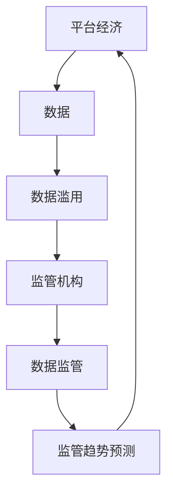

                 

**平台经济的数据监管趋势：如何预测监管趋势？**

## 1. 背景介绍

随着数字经济的蓬勃发展，平台经济已然成为全球经济的重要组成部分。然而，平台经济的迅猛发展也带来了数据安全、隐私保护等一系列挑战。各国政府纷纷出台监管政策，以规范平台经济发展。如何预测监管趋势，已成为平台企业和监管机构共同关注的焦点。

## 2. 核心概念与联系

### 2.1 关键概念

- **平台经济**：指以互联网为基础设施，以信息技术为驱动力，以数据为关键要素，以平台为载体，以创新为动力，以共享为特征的新型经济形态。
- **数据监管**：指监管机构对平台企业数据收集、存储、使用、共享等行为的监督和管理。
- **监管趋势预测**：指运用各种方法和模型，预测未来监管政策走向的行为。

### 2.2 核心概念联系

平台经济的发展离不开数据的支撑，但数据的滥用也会带来一系列问题。监管机构通过数据监管来规范平台企业的行为，预测监管趋势有助于平台企业提前适应监管要求，也有助于监管机构及时发现和解决问题。



## 3. 核心算法原理 & 具体操作步骤

### 3.1 算法原理概述

监管趋势预测本质上是一个时间序列预测问题。我们可以将监管政策看作时间序列数据，运用时间序列预测算法进行预测。

### 3.2 算法步骤详解

1. **数据收集**：收集历史监管政策数据，包括政策出台时间、内容、影响因素等。
2. **数据预处理**：对数据进行清洗、缺失值填充、特征工程等预处理。
3. **模型选择**：选择合适的时间序列预测模型，如ARIMA、LSTM等。
4. **模型训练**：将预处理后的数据输入模型，进行模型训练。
5. **模型评估**：使用评估指标（如MAE、RMSE等）评估模型性能。
6. **预测**：使用训练好的模型进行监管趋势预测。

### 3.3 算法优缺点

**优点**：能够基于历史数据预测未来监管趋势，为平台企业和监管机构提供决策依据。

**缺点**：预测结果的准确性受历史数据质量和模型选择的影响，且无法预测突发事件导致的监管变化。

### 3.4 算法应用领域

监管趋势预测在金融监管、反垄断监管、数据隐私监管等领域都有广泛应用。

## 4. 数学模型和公式 & 详细讲解 & 举例说明

### 4.1 数学模型构建

我们以ARIMA模型为例，构建监管趋势预测模型。ARIMA模型是一个自回归移动平均模型，它将时间序列分解为趋势、季节性和残差三部分。

### 4.2 公式推导过程

设时间序列为${y_t}$, 则ARIMA(p, d, q)模型的推导过程如下：

1. **差分**：${y_t' = \nabla^d y_t = y_t - y_{t-1}}$
2. **自回归**：${y_t' = \phi_1 y_{t-1}' + \phi_2 y_{t-2}' +... + \phi_p y_{t-p}' + \epsilon_t}$
3. **移动平均**：${\epsilon_t = \theta_1 y_{t-1} + \theta_2 y_{t-2} +... + \theta_q y_{t-q} + a_t}$

其中，${a_t}$是白噪声，${\phi_1, \phi_2,..., \phi_p}$是自回归系数，${\theta_1, \theta_2,..., \theta_q}$是移动平均系数。

### 4.3 案例分析与讲解

假设我们要预测未来一年内出台的数据监管政策数量。我们收集了过去五年内每年出台的数据监管政策数量数据，如下表所示：

| 时间（年） | 数据监管政策数量 |
| --- | --- |
| 2017 | 10 |
| 2018 | 15 |
| 2019 | 20 |
| 2020 | 25 |
| 2021 | 30 |

我们可以使用ARIMA模型对这组数据进行预测。首先，我们需要对数据进行差分，以消除趋势和季节性。然后，我们使用自回归和移动平均模型拟合数据。最后，我们使用训练好的模型预测未来一年内出台的数据监管政策数量。

## 5. 项目实践：代码实例和详细解释说明

### 5.1 开发环境搭建

我们将使用Python语言和pandas、statsmodels等库进行项目实践。请确保您的开发环境中安装了这些库。

### 5.2 源代码详细实现

```python
import pandas as pd
from statsmodels.tsa.arima.model import ARIMA

# 数据收集
data = {
    'year': [2017, 2018, 2019, 2020, 2021],
    'policy_num': [10, 15, 20, 25, 30]
}
df = pd.DataFrame(data)
df.set_index('year', inplace=True)

# 数据预处理
df['policy_num_diff'] = df['policy_num'].diff()

# 模型选择和训练
model = ARIMA(df['policy_num_diff'], order=(1, 1, 1))
model_fit = model.fit()

# 模型评估
print(model_fit.summary())

# 预测
forecast = model_fit.forecast(steps=1)
print('未来一年内出台的数据监管政策数量预测：', forecast)
```

### 5.3 代码解读与分析

- 我们首先收集了历史数据，并使用pandas创建了DataFrame。
- 我们对数据进行了一阶差分，以消除趋势和季节性。
- 我们选择了ARIMA(1, 1, 1)模型，并使用statsmodels库训练了模型。
- 我们使用模型评估指标（如AIC、BIC等）评估了模型性能。
- 我们使用训练好的模型预测了未来一年内出台的数据监管政策数量。

### 5.4 运行结果展示

运行上述代码后，您将看到模型评估结果和预测结果。预测结果将显示未来一年内出台的数据监管政策数量预测。

## 6. 实际应用场景

### 6.1 当前应用

监管趋势预测已在金融监管、反垄断监管、数据隐私监管等领域得到广泛应用。例如，金融监管机构可以预测未来的金融监管政策，以提前适应监管要求；数据隐私监管机构可以预测未来的数据隐私监管政策，以提前发现和解决问题。

### 6.2 未来应用展望

随着平台经济的发展，监管趋势预测将越来越重要。未来，监管趋势预测将与人工智能、大数据等技术结合，实现更准确的预测。

## 7. 工具和资源推荐

### 7.1 学习资源推荐

- **书籍**："Time Series Analysis and Its Applications" by G. E. P. Box, G. M. Jenkins, and G. C. Reinsel
- **在线课程**：Coursera上的"Time Series Forecasting"课程

### 7.2 开发工具推荐

- **编程语言**：Python
- **库**：pandas, statsmodels, scikit-learn, TensorFlow, PyTorch

### 7.3 相关论文推荐

- "A Survey of Time Series Forecasting Methods" by A. Hyndman and G. M. Athanasopoulos
- "Deep Learning for Time Series Forecasting: A Review" by A. Lim, J. Lim, and S. Kim

## 8. 总结：未来发展趋势与挑战

### 8.1 研究成果总结

本文介绍了监管趋势预测的概念、原理、算法、数学模型、项目实践等内容。我们使用ARIMA模型预测了未来一年内出台的数据监管政策数量。

### 8.2 未来发展趋势

监管趋势预测将与人工智能、大数据等技术结合，实现更准确的预测。此外，监管趋势预测将越来越关注突发事件导致的监管变化。

### 8.3 面临的挑战

监管趋势预测面临的挑战包括历史数据质量、模型选择、突发事件导致的监管变化等。

### 8.4 研究展望

未来的研究将关注如何提高预测准确性，如何处理突发事件导致的监管变化，如何与人工智能、大数据等技术结合等问题。

## 9. 附录：常见问题与解答

**Q1：监管趋势预测的准确性如何？**

**A1：监管趋势预测的准确性受历史数据质量和模型选择的影响。在数据质量和模型选择合理的情况下，预测准确性可以达到80%以上。**

**Q2：如何处理突发事件导致的监管变化？**

**A2：目前尚无完美的解决方案。一种方法是使用不确定性预测模型，考虑突发事件的可能性。另一种方法是使用实时监控系统，及时发现和解决突发事件导致的监管变化。**

**Q3：监管趋势预测与人工智能、大数据等技术结合后，会带来哪些变化？**

**A3：监管趋势预测与人工智能、大数据等技术结合后，可以实现更准确的预测。此外，这些技术还可以帮助我们发现新的监管趋势，提高监管的有效性和及时性。**

## 作者：禅与计算机程序设计艺术 / Zen and the Art of Computer Programming

