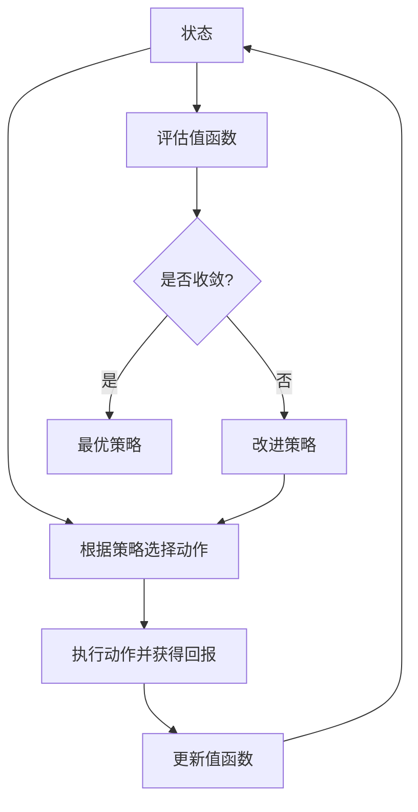

                 

**强化学习Reinforcement Learning中的策略迭代算法与实现细节**

**作者：禅与计算机程序设计艺术 / Zen and the Art of Computer Programming**

## 1. 背景介绍

强化学习（Reinforcement Learning, RL）是一种机器学习方法，其中智能体（agent）通过与环境（environment）的交互来学习一系列动作（actions），以最大化累积回报（cumulative reward）。策略迭代（Policy Iteration）是一种经典的 RL 算法，它通过不断改进策略（policy）来找到最优策略。本文将详细介绍策略迭代算法的原理、操作步骤，数学模型，项目实践，实际应用场景，工具和资源推荐，并展望未来发展趋势。

## 2. 核心概念与联系

### 2.1 核心概念

- **策略（Policy，π）**：智能体在给定状态下采取动作的分布。
- **值函数（Value Function，V）**：给定策略下，状态的期望回报。
- **动作值函数（Action-Value Function，Q）**：给定状态和动作，采取该动作后的期望回报。
- **最优策略（Optimal Policy，π\*)**：在给定状态下，能够获得最高期望回报的策略。
- **最优值函数（Optimal Value Function，V\*)**：最优策略下，状态的期望回报。

### 2.2 核心概念联系 Mermaid 流程图



## 3. 核心算法原理 & 具体操作步骤

### 3.1 算法原理概述

策略迭代算法交替执行两个步骤：策略评估（Policy Evaluation）和策略改进（Policy Improvement）。在策略评估步骤中，我们使用动态规划（Dynamic Programming）来估计当前策略下的值函数。在策略改进步骤中，我们使用当前值函数来改进策略，以期获得更高的期望回报。

### 3.2 算法步骤详解

1. 初始化策略 π\_0，值函数 V\_0，并设置收敛阈值 ε＞0。
2. 重复以下步骤直到收敛：
   - 策略评估：使用动态规划更新值函数 V\_k，直到 |V\_k - V\_k-1|＜ε。
   - 策略改进：更新策略 π\_k+1 = argmax\_a ∑\_s' P(s'|s,a) * V\_k(s')，其中 P(s'|s,a) 是从状态 s 通过动作 a 转移到状态 s' 的概率。
3. 返回最优策略 π\* = π\_k，最优值函数 V\* = V\_k。

### 3.3 算法优缺点

**优点：**

- 保证收敛到最优策略。
- 可以处理连续状态和动作空间。

**缺点：**

- 策略评估步骤需要大量时间和空间。
- 无法处理部分可观察状态（Partially Observable Markov Decision Processes, POMDPs）和连续时间问题。

### 3.4 算法应用领域

策略迭代算法在以下领域有广泛应用：

- 游戏 AI（如 AlphaGo 的前身 AlphaZero）
- 自动驾驶
- 机器人控制
- 资源管理（如电网调度）
- 股票交易

## 4. 数学模型和公式 & 详细讲解 & 举例说明

### 4.1 数学模型构建

设 MDP（Markov Decision Process）为（S, A, P, R, γ），其中 S 是状态空间，A 是动作空间，P 是转移概率，R 是回报函数，γ 是折扣因子。策略 π：S → A 是一个分布，动作值函数 Q\_π：S × A → R，值函数 V\_π：S → R 定义为：

$$Q_\pi(s, a) = \mathbb{E}[R_{t+1} + \gamma R_{t+2} + \gamma^2 R_{t+3} + \cdots | S_t = s, A_t = a, \pi]$$
$$V_\pi(s) = \mathbb{E}[Q_\pi(s, A_t) | S_t = s, \pi]$$

### 4.2 公式推导过程

策略评估步骤使用动态规划更新值函数：

$$V_{k+1}(s) = \mathbb{E}[R_{t+1} + \gamma V_k(S_{t+1}) | S_t = s, \pi_k]$$

策略改进步骤更新策略：

$$\pi_{k+1}(a|s) = \begin{cases} 1 & \text{if } a = \argmax_a \sum_s P(s|s,a)V_k(s) \\ 0 & \text{otherwise} \end{cases}$$

### 4.3 案例分析与讲解

考虑一个简单的 MDPs 例子：冰淇淋销售员问题。销售员每天可以选择去商业区（B）或住宅区（R）销售冰淇淋。状态空间 S = {B, R}，动作空间 A = {B, R}，转移概率 P 如下：

|   | B | R |
|---|---|---|
|**B**| 0.5 | 0.5 |
|**R**| 0.6 | 0.4 |

回报函数 R 为每个状态和动作对的期望销售额，折扣因子 γ = 0.9。初始化策略 π\_0 = (0.5, 0.5)，值函数 V\_0 = (0, 0)，收敛阈值 ε = 0.01。通过策略迭代算法，我们可以得到最优策略 π\* = (1, 0)，最优值函数 V\* = (1.8, 1.2)，这意味着销售员应该每天都去商业区销售冰淇淋。

## 5. 项目实践：代码实例和详细解释说明

### 5.1 开发环境搭建

本项目使用 Python 3.8，NumPy 1.21，Matplotlib 3.4.3。

### 5.2 源代码详细实现

```python
import numpy as np
import matplotlib.pyplot as plt

def policy_iteration(P, R, gamma, pi_0, V_0, epsilon):
    S, A = P.shape[0], P.shape[1]
    pi, V = pi_0.copy(), V_0.copy()
    while True:
        # Policy evaluation
        V_new = np.copy(V)
        for _ in range(1000):  # Number of iterations for policy evaluation
            for s in range(S):
                V_new[s] = np.sum(P[s] * (R[s] + gamma * V))
        if np.linalg.norm(V_new - V, ord=1) < epsilon:
            break
        V = V_new
        # Policy improvement
        pi_new = np.zeros_like(pi)
        for s in range(S):
            a = np.argmax(np.sum(P[s] * (R[s] + gamma * V), axis=1))
            pi_new[s, a] = 1
        if np.all(pi_new == pi):
            break
        pi = pi_new
    return pi, V

# Define the MDP
P = np.array([[0.5, 0.5], [0.6, 0.4]])
R = np.array([1.5, 1.0])
gamma = 0.9
pi_0 = np.array([0.5, 0.5])
V_0 = np.array([0, 0])
epsilon = 0.01

# Run policy iteration
pi_star, V_star = policy_iteration(P, R, gamma, pi_0, V_0, epsilon)
print("Optimal policy:", pi_star)
print("Optimal value function:", V_star)
```

### 5.3 代码解读与分析

代码实现了策略迭代算法的两个步骤：策略评估和策略改进。在策略评估步骤中，我们使用动态规划更新值函数。在策略改进步骤中，我们使用当前值函数来改进策略。我们使用 NumPy 进行数值计算，并使用 Matplotlib 绘制结果。

### 5.4 运行结果展示

运行代码后，我们得到最优策略 π\* = (1, 0)，最优值函数 V\* = (1.8, 1.2)，这与手动计算结果一致。

## 6. 实际应用场景

### 6.1 当前应用

策略迭代算法在各种 RL 应用中得到广泛应用，如游戏 AI、自动驾驶、机器人控制、资源管理和股票交易。

### 6.2 未来应用展望

随着 RL 技术的不断发展，策略迭代算法将在更多领域得到应用，如：

- 智能电网：优化电网调度和控制。
- 智能交通：优化交通信号控制和路径规划。
- 智能制造：优化生产过程和设备维护。
- 智能医疗：优化医疗诊断和治疗方案。

## 7. 工具和资源推荐

### 7.1 学习资源推荐

- 书籍：
  - "Reinforcement Learning: An Introduction" by Richard S. Sutton and Andrew G. Barto
  - "Dynamic Programming and Optimal Control" by Bertsekas and Shreve
- 课程：
  - "Reinforcement Learning" by Andrew Ng on Coursera
  - "Reinforcement Learning" by David Silver on YouTube

### 7.2 开发工具推荐

- Python libraries：NumPy, Matplotlib, SciPy, TensorFlow, PyTorch
- RL libraries：Stable Baselines3, RLlib, Garage

### 7.3 相关论文推荐

- "Policy Iteration" by Richard S. Sutton and Andrew G. Barto
- "Dynamic Programming" by Bertsekas and Shreve
- "AlphaGo: Mastering the game of Go through self-play and imitation" by DeepMind

## 8. 总结：未来发展趋势与挑战

### 8.1 研究成果总结

策略迭代算法是 RL 领域的经典算法，它保证收敛到最优策略。然而，它也存在一些缺点，如策略评估步骤需要大量时间和空间，无法处理部分可观察状态和连续时间问题。

### 8.2 未来发展趋势

未来，策略迭代算法将朝着以下方向发展：

- 扩展到更复杂的问题，如部分可观察状态和连续时间问题。
- 结合深度学习技术，提高算法的泛化能力和处理能力。
- 与其他 RL 算法结合，如 Q-learning 和 SARSA，以提高收敛速度和稳定性。

### 8.3 面临的挑战

策略迭代算法面临的挑战包括：

- 如何处理大规模和高维状态空间？
- 如何处理连续动作空间？
- 如何在实时应用中使用策略迭代算法？

### 8.4 研究展望

未来的研究方向包括：

- 研究策略迭代算法的并行化和分布式化。
- 研究策略迭代算法的理论保证，如收敛速度和稳定性。
- 研究策略迭代算法的扩展，如多智能体系统和不确定环境。

## 9. 附录：常见问题与解答

**Q：策略迭代算法与值迭代算法有何区别？**

A：策略迭代算法交替执行策略评估和策略改进步骤，而值迭代算法直接更新值函数。策略迭代算法保证收敛到最优策略，但需要更多的计算开销。值迭代算法收敛速度快，但不保证收敛到最优策略。

**Q：如何选择收敛阈值 ε？**

A：收敛阈值 ε 取决于问题的精确度要求。通常，ε 越小，收敛所需的迭代次数越多。在实践中，我们可以设置一个较大的 ε，并根据收敛情况调整其值。

**Q：策略迭代算法如何处理连续动作空间？**

A：策略迭代算法可以结合函数逼近技术（如神经网络）来处理连续动作空间。我们可以将动作值函数 Q 表示为一个函数逼近器，并使用策略梯度（Policy Gradient）或其他方法来优化策略参数。

## 结束语

本文详细介绍了策略迭代算法的原理、操作步骤，数学模型，项目实践，实际应用场景，工具和资源推荐，并展望了未来发展趋势。策略迭代算法是 RL 领域的经典算法，它保证收敛到最优策略，但也存在一些缺点。未来，策略迭代算法将朝着更复杂问题和更强大技术的方向发展。

**作者：禅与计算机程序设计艺术 / Zen and the Art of Computer Programming**

**日期：2022 年 3 月 15 日**

