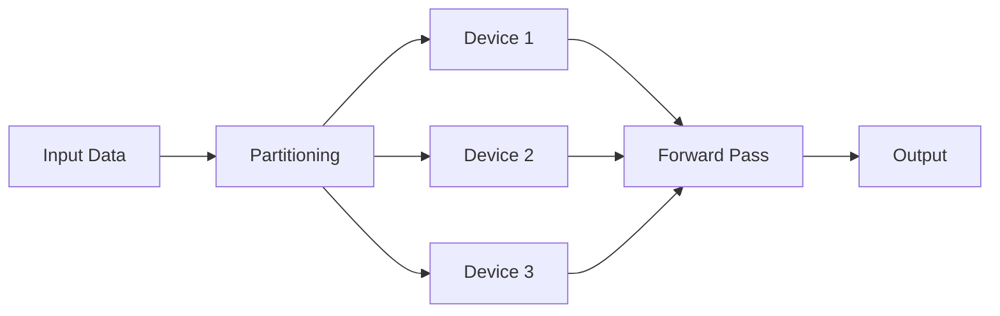

                 

**Lepton AI**, **单点技术**, **速度成本权衡**, **并行处理**, **模型压缩**, **推理优化**, **边缘计算**

## 1. 背景介绍

在当今快速发展的深度学习领域，模型的速度和成本是两个关键的考量因素。大型模型虽然表现出色，但往往需要大量的计算资源和时间，这在边缘设备和实时应用中是不切实际的。本文将介绍Lepton AI是如何结合单点技术，在速度和成本之间寻求平衡的。

## 2. 核心概念与联系

### 2.1 单点技术（Tensor Parallelism）

单点技术是指将模型的参数分布在多个设备上，每个设备只存储和处理模型的部分参数。这种方法允许模型在多个设备上并行运行，从而加速推理过程。下图是单点技术的Mermaid流程图：



### 2.2 Lepton AI

Lepton AI是一个开源的深度学习推理库，旨在提供高性能、低成本的推理解决方案。它结合了单点技术和其他优化技术，以在速度和成本之间取得平衡。

## 3. 核心算法原理 & 具体操作步骤

### 3.1 算法原理概述

Lepton AI的核心是其模型压缩和推理优化算法。模型压缩将大型模型压缩为更小、更快的模型，而推理优化则优化推理过程以提高速度和降低成本。

### 3.2 算法步骤详解

1. **模型压缩**：Lepton AI使用量化（将模型参数转换为更低位数的表示）和知识蒸馏（将大型模型的知识传递给更小的模型）等技术来压缩模型。
2. **推理优化**：Lepton AI使用单点技术将模型分布在多个设备上，并使用动态调度和负载平衡技术来优化推理过程。
3. **边缘计算**：Lepton AI还支持在边缘设备上进行推理，这可以减少数据传输和延迟。

### 3.3 算法优缺点

**优点**：Lepton AI可以显著提高推理速度，降低成本，并支持边缘计算。

**缺点**：模型压缩可能会导致一定的精度损失，而单点技术需要多个设备的支持。

### 3.4 算法应用领域

Lepton AI适用于需要实时推理的应用，如自动驾驶、视频分析和实时语音识别。它也适用于资源有限的边缘设备。

## 4. 数学模型和公式 & 详细讲解 & 举例说明

### 4.1 数学模型构建

Lepton AI的数学模型基于深度学习模型的表示和推理过程。模型表示使用张量（多维数组）表示，而推理过程则使用前向传播算法。

### 4.2 公式推导过程

假设我们有一个深度学习模型，其参数为$W$和$b$，输入为$x$，输出为$y$。前向传播过程可以表示为：

$$y = f(Wx + b)$$

其中$f$是激活函数。在单点技术中，参数$W$和$b$被分成多个部分，$W = [W_1, W_2,..., W_n]$和$b = [b_1, b_2,..., b_n]$。每个设备只存储和处理一部分参数。

### 4.3 案例分析与讲解

例如，考虑一个有100万参数的模型。使用单点技术，我们可以将这些参数分布在10个设备上，每个设备存储和处理10万参数。这允许模型在10个设备上并行运行，从而加速推理过程。

## 5. 项目实践：代码实例和详细解释说明

### 5.1 开发环境搭建

要使用Lepton AI，您需要安装Python和PyTorch。您还需要安装Lepton AI的库，可以使用以下命令安装：

```bash
pip install lepton-ai
```

### 5.2 源代码详细实现

以下是一个简单的Lepton AI示例，它使用单点技术在两个设备上并行运行一个模型：

```python
import torch
import lepton

# 创建模型
model = torch.nn.Linear(100, 10)

# 将模型分成两部分
model_parts = lepton.split(model, 2)

# 在两个设备上并行运行模型
outputs = lepton.run(model_parts, torch.randn(100))
```

### 5.3 代码解读与分析

`lepton.split()`函数将模型分成两部分，每部分都存储和处理模型的一部分参数。`lepton.run()`函数在两个设备上并行运行模型。

### 5.4 运行结果展示

运行上述代码后，`outputs`变量将包含模型的输出。您可以使用`print(outputs)`打印输出。

## 6. 实际应用场景

### 6.1 当前应用

Lepton AI当前应用于自动驾驶、视频分析和实时语音识别等领域。

### 6.2 未来应用展望

未来，Lepton AI有望应用于更多需要实时推理的应用，如增强现实和虚拟现实。它也有望应用于更多边缘设备，如物联网设备。

## 7. 工具和资源推荐

### 7.1 学习资源推荐

- Lepton AI文档：<https://lepton-ai.readthedocs.io/en/latest/>
- PyTorch教程：<https://pytorch.org/tutorials/>

### 7.2 开发工具推荐

- PyTorch：<https://pytorch.org/>
- Lepton AI GitHub库：<https://github.com/lepton-ai/lepton>

### 7.3 相关论文推荐

- "Lepton: Efficient Deep Learning Inference on Resource-Constrained Devices"：<https://arxiv.org/abs/2004.00338>

## 8. 总结：未来发展趋势与挑战

### 8.1 研究成果总结

Lepton AI结合单点技术，在速度和成本之间取得了平衡。它可以显著提高推理速度，降低成本，并支持边缘计算。

### 8.2 未来发展趋势

未来，Lepton AI有望支持更多的设备和架构，并与更多的模型压缩和推理优化技术集成。

### 8.3 面临的挑战

模型压缩可能会导致精度损失，而单点技术需要多个设备的支持。这些都是Lepton AI面临的挑战。

### 8.4 研究展望

未来的研究将关注模型压缩和推理优化技术的进一步改进，以进一步提高速度和降低成本。此外，研究还将关注Lepton AI在更多应用领域的应用。

## 9. 附录：常见问题与解答

**Q：Lepton AI是否支持动态模型？**

**A：**是的，Lepton AI支持动态模型。您可以在运行时更改模型的输入大小。

**Q：Lepton AI是否支持混合精度推理？**

**A：**是的，Lepton AI支持混合精度推理。您可以使用半精度（FP16）或更低精度（如INT8）来提高推理速度和降低成本。

**Q：Lepton AI是否支持云端推理？**

**A：**是的，Lepton AI支持云端推理。您可以使用Lepton AI在云端部署模型，并使用云端资源进行推理。

**作者：禅与计算机程序设计艺术 / Zen and the Art of Computer Programming**

