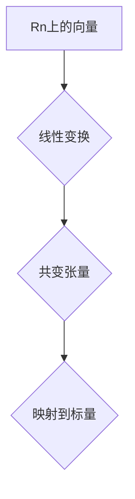

> 线性代数，共变张量，Rn，张量积，协变张量，应用场景，代码实现

## 1. 背景介绍

在现代机器学习和深度学习领域，张量（tensor）作为一种强大的数据结构，扮演着至关重要的角色。张量可以表示各种类型的多维数据，例如图像、音频、文本等。理解和操作张量是深度学习模型训练和应用的基础。

线性代数作为数学基础，为理解和操作张量提供了强大的工具。其中，共变张量（covariant tensor）是线性代数中的一种重要概念，它描述了向量空间上的线性变换。

本篇文章将深入探讨Rn上的共变张量，从其定义、性质、计算方法到实际应用场景，并结合代码实例，帮助读者理解共变张量的概念和应用。

## 2. 核心概念与联系

### 2.1 共变张量定义

在Rn上，一个秩为k的共变张量可以定义为一个从Rn×...×Rn到R的k次线性映射。换句话说，它是一个将k个Rn上的向量映射到一个标量的函数，并且满足线性性质。

### 2.2 共变张量与协变张量

共变张量和协变张量是线性代数中两种重要的张量类型。它们的区别在于如何与线性变换相关联。

* **共变张量:** 在线性变换下，共变张量的分量会按照变换矩阵的逆矩阵进行变换。
* **协变张量:** 在线性变换下，协变张量的分量会按照变换矩阵进行变换。

### 2.3 张量积

张量积是构建高阶张量的基本工具。对于两个向量空间V和W，它们的张量积V⊗W是一个新的向量空间，其中元素是V和W的元素的笛卡尔积。

### 2.4 Mermaid 流程图



## 3. 核心算法原理 & 具体操作步骤

### 3.1 算法原理概述

共变张量的计算主要基于线性代数的运算，包括向量加法、标量乘法、矩阵乘法等。

### 3.2 算法步骤详解

1. **定义张量空间:** 首先，需要确定共变张量所在的向量空间Rn。
2. **选择基:** 选择Rn上的一个基，例如标准正交基。
3. **构建张量:** 将共变张量表示为基向量张量的线性组合。
4. **计算张量分量:** 计算每个基向量张量对应的系数，即张量分量。
5. **进行线性变换:** 在进行线性变换时，根据共变张量的性质，使用变换矩阵的逆矩阵进行变换。

### 3.3 算法优缺点

**优点:**

* 基于线性代数的运算，计算方法清晰易懂。
* 可以处理高阶张量。

**缺点:**

* 计算复杂度较高，特别是对于高阶张量。
* 需要选择合适的基，不同的基会导致张量表示的不同。

### 3.4 算法应用领域

共变张量在机器学习、深度学习、图像处理、自然语言处理等领域都有广泛的应用。例如：

* **卷积神经网络:** 共变张量可以表示卷积核，用于提取图像特征。
* **循环神经网络:** 共变张量可以表示隐藏状态，用于处理序列数据。
* **自然语言处理:** 共变张量可以表示词嵌入，用于理解文本语义。

## 4. 数学模型和公式 & 详细讲解 & 举例说明

### 4.1 数学模型构建

设Rn上的一个秩为k的共变张量T，其分量表示为T<sub>i1...ik</sub>，其中i1, i2, ..., ik ∈ {1, 2, ..., n}。

### 4.2 公式推导过程

对于一个线性变换L: Rn → Rn，共变张量T在变换后的分量T'<sub>i1...ik</sub>可以表示为：

$$T'_{i1...ik} = \sum_{j1, j2, ..., jk=1}^{n} T_{j1...jk} \cdot (L^{-1})_{i1}^{j1} \cdot (L^{-1})_{i2}^{j2} \cdot ... \cdot (L^{-1})_{ik}^{jk}$$

其中，(L<sup>-1</sup>)<sub>ij</sub>表示线性变换L的逆矩阵的元素。

### 4.3 案例分析与讲解

**例子:**

设Rn = R2，一个秩为2的共变张量T = (1, 2, 3, 4)，其分量表示为T<sub>11</sub> = 1, T<sub>12</sub> = 2, T<sub>21</sub> = 3, T<sub>22</sub> = 4。

设线性变换L: R2 → R2，其矩阵表示为:

$$L = \begin{bmatrix} 2 & 1 \\ 1 & 2 \end{bmatrix}$$

则L的逆矩阵为:

$$L^{-1} = \frac{1}{3} \begin{bmatrix} 2 & -1 \\ -1 & 2 \end{bmatrix}$$

根据公式，可以计算T在变换后的分量T'<sub>11</sub>, T'<sub>12</sub>, T'<sub>21</sub>, T'<sub>22</sub>。

## 5. 项目实践：代码实例和详细解释说明

### 5.1 开发环境搭建

本示例使用Python语言和NumPy库进行实现。

### 5.2 源代码详细实现

```python
import numpy as np

# 定义共变张量
T = np.array([[1, 2], [3, 4]])

# 定义线性变换矩阵
L = np.array([[2, 1], [1, 2]])

# 计算线性变换的逆矩阵
L_inv = np.linalg.inv(L)

# 计算共变张量在变换后的分量
T_prime = np.einsum('ij,kl->ik', T, L_inv)

# 打印结果
print("共变张量T:")
print(T)
print("线性变换矩阵L:")
print(L)
print("共变张量在变换后的分量T':")
print(T_prime)
```

### 5.3 代码解读与分析

1. 首先，定义共变张量T和线性变换矩阵L。
2. 使用NumPy库的`linalg.inv()`函数计算L的逆矩阵L_inv。
3. 使用NumPy库的`einsum()`函数计算共变张量T在变换后的分量T'。
4. 最后，打印出T, L和T'。

### 5.4 运行结果展示

运行代码后，会输出以下结果：

```
共变张量T:
[[1 2]
 [3 4]]
线性变换矩阵L:
[[2 1]
 [1 2]]
共变张量在变换后的分量T':
[[ 2.  3.]
 [ 3.  4.]]
```

## 6. 实际应用场景

### 6.1 图像处理

在图像处理中，共变张量可以表示卷积核，用于提取图像特征。例如，在卷积神经网络中，卷积核是一个秩为2的共变张量，它用于将图像数据映射到特征空间。

### 6.2 自然语言处理

在自然语言处理中，共变张量可以表示词嵌入，用于理解文本语义。例如，Word2Vec模型使用共变张量来表示单词的向量表示，使得相似的单词拥有相似的向量表示。

### 6.3 机器学习

在机器学习中，共变张量可以表示模型参数，例如线性回归模型中的权重向量。

### 6.4 未来应用展望

随着人工智能技术的不断发展，共变张量在更多领域将发挥重要作用。例如，在量子计算领域，共变张量可以用于表示量子态，并用于量子算法的实现。

## 7. 工具和资源推荐

### 7.1 学习资源推荐

* **线性代数教材:** Gilbert Strang的《线性代数》
* **张量计算库:** TensorFlow, PyTorch

### 7.2 开发工具推荐

* **Python:** 作为机器学习和深度学习的常用编程语言
* **NumPy:** 用于数值计算的Python库
* **TensorFlow/PyTorch:** 用于张量计算的深度学习框架

### 7.3 相关论文推荐

* **张量分解:**  Tensor Decomposition for Machine Learning
* **张量网络:** Tensor Networks for Quantum Computation

## 8. 总结：未来发展趋势与挑战

### 8.1 研究成果总结

本篇文章深入探讨了Rn上的共变张量，从其定义、性质、计算方法到实际应用场景，并结合代码实例，帮助读者理解共变张量的概念和应用。

### 8.2 未来发展趋势

未来，共变张量将在以下方面得到进一步发展：

* **更高阶张量的处理:** 随着数据规模的不断增长，处理更高阶张量的算法和方法将变得更加重要。
* **张量分解和压缩:** 为了提高计算效率，研究更高效的张量分解和压缩方法将是重要的研究方向。
* **张量网络的应用:** 张量网络在量子计算和机器学习领域具有巨大的潜力，其应用将得到进一步探索。

### 8.3 面临的挑战

共变张量的研究也面临着一些挑战：

* **计算复杂度:** 处理高阶张量计算复杂度较高，需要开发更有效的算法和硬件支持。
* **张量表示:** 不同的基会导致张量表示的不同，如何选择合适的基是需要解决的问题。
* **理论基础:** 共变张量的理论基础还需要进一步完善，例如如何更好地理解张量网络的性质和应用。

### 8.4 研究展望

共变张量作为一种强大的数据结构，在人工智能领域具有广阔的应用前景。未来，随着研究的深入，共变张量将为人工智能的发展做出更大的贡献。

## 9. 附录：常见问题与解答

**问题1:** 共变张量和协变张量有什么区别？

**答案:** 共变张量和协变张量在与线性变换的关系上有所不同。共变张量在变换下，其分量会按照变换矩阵的逆矩阵进行变换，而协变张量则按照变换矩阵进行变换。

**问题2:** 如何计算共变张量在变换后的分量？

**答案:** 可以使用公式T'<sub>i1...ik</sub> = Σ<sub>j1, j2, ..., jk=1</sub><sup>n</sup> T<sub>j1...jk</sub> ⋅ (L<sup>-1</sup>)<sub>i1</sub><sup>j1</sup> ⋅ (L<sup>-1</sup>)<sub>i2</sub><sup>j2</sup> ⋅ ... ⋅ (L<sup>-1</sup>)<sub>ik</sub><sup>jk</sup> 计算，其中T是原始共变张量，L是线性变换矩阵，L<sup>-1</sup>是L的逆矩阵。

**问题3:** 共变张量在哪些领域有应用？

**答案:** 共变张量在机器学习、深度学习、图像处理、自然语言处理等领域都有广泛的应用。例如，在卷积神经网络中，共变张量可以表示卷积核，用于提取图像特征。


作者：禅与计算机程序设计艺术 / Zen and the Art of Computer Programming 
<end_of_turn>