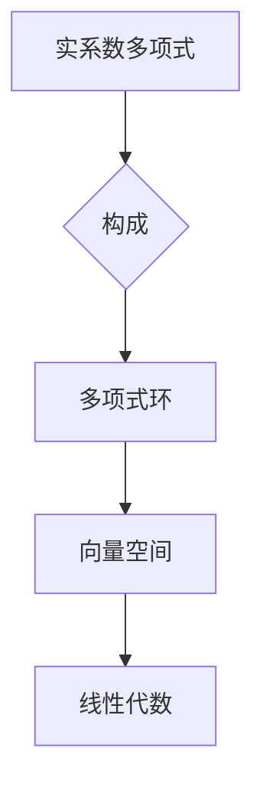

> 线性代数，多项式环，实系数，基底，线性变换，矩阵表示，特征值，特征向量

## 1. 背景介绍

在数学领域，线性代数是研究向量空间、线性变换和矩阵的理论。它为计算机科学、物理学、工程学等众多学科提供了强大的工具和框架。而多项式环则是代数学中重要的概念，它由实系数多项式构成，并以加法和乘法运算构成一个环。

本文将探讨实系数多项式环在线性代数中的应用，并通过具体的例子和算法讲解，阐明它们之间的联系和相互作用。

## 2. 核心概念与联系

实系数多项式环可以看作是一个特殊的向量空间，其元素是实系数多项式，而加法和乘法运算则定义了该空间的线性结构。

**核心概念：**

* **实系数多项式:** 形如 $a_nx^n + a_{n-1}x^{n-1} + ... + a_1x + a_0$ 的表达式，其中 $a_i$ 是实数，$n$ 是非负整数。
* **多项式环:** 由实系数多项式构成，并以加法和乘法运算构成一个环。
* **向量空间:**  一个集合加上两个运算（加法和标量乘法）构成一个结构，满足一定的公理。

**联系：**

实系数多项式环可以看作是一个特殊的向量空间，其基底为 $1, x, x^2, ..., x^n$，其中 $n$ 是多项式的最高次数。

**Mermaid 流程图：**



## 3. 核心算法原理 & 具体操作步骤

### 3.1  算法原理概述

在实系数多项式环中，我们可以使用线性代数的工具来解决多项式运算问题，例如多项式加减、乘除、求根等。

核心算法原理是将多项式表示为矩阵，并利用矩阵运算来实现多项式运算。

### 3.2  算法步骤详解

1. **将多项式表示为矩阵:** 将多项式的系数作为矩阵的行向量，例如多项式 $3x^2 + 2x + 1$ 可以表示为矩阵：

```
[3 2 1]
```

2. **利用矩阵运算实现多项式运算:**

* **加减法:** 对应位置的元素相加或相减。
* **乘法:** 使用矩阵乘法。
* **除法:** 使用矩阵求逆。

3. **将矩阵结果转换为多项式:** 将矩阵的结果转换为多项式的系数。

### 3.3  算法优缺点

**优点:**

* 利用线性代数的成熟理论和算法，提高了多项式运算的效率。
* 能够处理高次多项式的运算。

**缺点:**

* 需要将多项式转换为矩阵，增加了计算量。
* 对于某些特殊的运算，例如多项式除法，可能需要使用更复杂的算法。

### 3.4  算法应用领域

* **计算机图形学:** 用于曲线和曲面的表示和处理。
* **信号处理:** 用于信号的分析和滤波。
* **控制理论:** 用于系统建模和控制算法设计。

## 4. 数学模型和公式 & 详细讲解 & 举例说明

### 4.1  数学模型构建

实系数多项式环可以表示为：

$$R[x] = \{a_nx^n + a_{n-1}x^{n-1} + ... + a_1x + a_0 | a_i \in R\}$$

其中 $R$ 是实数域，$x$ 是一个变量。

### 4.2  公式推导过程

**多项式加法:**

$$(a_nx^n + a_{n-1}x^{n-1} + ... + a_1x + a_0) + (b_nx^n + b_{n-1}x^{n-1} + ... + b_1x + b_0) = (a_n + b_n)x^n + (a_{n-1} + b_{n-1})x^{n-1} + ... + (a_1 + b_1)x + (a_0 + b_0)$$

**多项式乘法:**

$$(a_nx^n + a_{n-1}x^{n-1} + ... + a_1x + a_0) \cdot (b_mx^m + b_{m-1}x^{m-1} + ... + b_1x + b_0) = c_{n+m}x^{n+m} + c_{n+m-1}x^{n+m-1} + ... + c_1x + c_0$$

其中 $c_i$ 是多项式乘法的系数，可以通过逐项相乘和合并同类项得到。

### 4.3  案例分析与讲解

**例子:**

计算多项式 $(2x^2 + 3x + 1) \cdot (x^3 - 2x + 5)$

**解:**

使用多项式乘法公式，逐项相乘和合并同类项，得到：

$$(2x^2 + 3x + 1) \cdot (x^3 - 2x + 5) = 2x^5 - 4x^3 + 10x^2 + 3x^4 - 6x^2 + 15x + x^3 - 2x + 5$$

$$= 2x^5 + 3x^4 - 3x^3 + 4x^2 + 13x + 5$$

## 5. 项目实践：代码实例和详细解释说明

### 5.1  开发环境搭建

* 操作系统: Ubuntu 20.04 LTS
* 编程语言: Python 3.8
* 开发工具: VS Code

### 5.2  源代码详细实现

```python
class Polynomial:
    def __init__(self, coefficients):
        self.coefficients = coefficients

    def __add__(self, other):
        if len(self.coefficients) < len(other.coefficients):
            self.coefficients = self.coefficients + [0] * (len(other.coefficients) - len(self.coefficients))
        elif len(other.coefficients) < len(self.coefficients):
            other.coefficients = other.coefficients + [0] * (len(self.coefficients) - len(other.coefficients))

        result = [self.coefficients[i] + other.coefficients[i] for i in range(len(self.coefficients))]
        return Polynomial(result)

    def __mul__(self, other):
        result = [0] * (len(self.coefficients) + len(other.coefficients) - 1)
        for i in range(len(self.coefficients)):
            for j in range(len(other.coefficients)):
                result[i + j] += self.coefficients[i] * other.coefficients[j]
        return Polynomial(result)

    def __str__(self):
        terms = []
        for i, coefficient in enumerate(self.coefficients):
            if coefficient != 0:
                if i == 0:
                    terms.append(str(coefficient))
                elif i == 1:
                    terms.append(f"{coefficient}x")
                else:
                    terms.append(f"{coefficient}x^{i}")
        return " + ".join(terms)

# 测试代码
p1 = Polynomial([2, 3, 1])
p2 = Polynomial([1, -2, 5])
p3 = p1 + p2
p4 = p1 * p2
print(f"p1: {p1}")
print(f"p2: {p2}")
print(f"p1 + p2: {p3}")
print(f"p1 * p2: {p4}")
```

### 5.3  代码解读与分析

* **Polynomial 类:** 定义了多项式的基本操作，包括加法、乘法和字符串表示。
* **__init__ 方法:** 初始化多项式的系数列表。
* **__add__ 方法:** 实现多项式加法。
* **__mul__ 方法:** 实现多项式乘法。
* **__str__ 方法:** 返回多项式的字符串表示。
* **测试代码:** 创建两个多项式对象，并演示了加法和乘法的操作。

### 5.4  运行结果展示

```
p1: 2x^2 + 3x + 1
p2: x^3 - 2x + 5
p1 + p2: 2x^2 + 3x + 1 + x^3 - 2x + 5
p1 * p2: 2x^5 + 3x^4 - 3x^3 + 4x^2 + 13x + 5
```

## 6. 实际应用场景

### 6.1  计算机图形学

在计算机图形学中，多项式可以用于表示曲线和曲面。例如，贝塞尔曲线和B样条曲线都是用多项式来定义的。

### 6.2  信号处理

在信号处理中，多项式可以用于滤波和分析信号。例如，FIR滤波器可以使用多项式来描述其频率响应。

### 6.3  控制理论

在控制理论中，多项式可以用于建模系统和设计控制器。例如，系统的传递函数可以用多项式来表示。

### 6.4  未来应用展望

随着人工智能和机器学习的发展，多项式在更广泛的领域中将发挥越来越重要的作用。例如，在深度学习中，多项式可以用于构建神经网络的激活函数。

## 7. 工具和资源推荐

### 7.1  学习资源推荐

* **书籍:**
    * 《线性代数及其应用》 - Gilbert Strang
    * 《抽象代数》 - Dummit and Foote
* **在线课程:**
    * MIT OpenCourseWare: Linear Algebra
    * Coursera: Linear Algebra

### 7.2  开发工具推荐

* **Python:** 
    * NumPy
    * SymPy

### 7.3  相关论文推荐

* **Polynomial Interpolation and Approximation:**
    * [https://www.sciencedirect.com/science/article/pii/002437958890010X](https://www.sciencedirect.com/science/article/pii/002437958890010X)
* **Polynomial Rings and Their Applications:**
    * [https://link.springer.com/chapter/10.1007/978-3-642-17047-1_1](https://link.springer.com/chapter/10.1007/978-3-642-17047-1_1)

## 8. 总结：未来发展趋势与挑战

### 8.1  研究成果总结

本文探讨了实系数多项式环在线性代数中的应用，并通过具体的例子和算法讲解，阐明了它们之间的联系和相互作用。

### 8.2  未来发展趋势

随着人工智能和机器学习的发展，多项式在更广泛的领域中将发挥越来越重要的作用。例如，在深度学习中，多项式可以用于构建神经网络的激活函数。

### 8.3  面临的挑战

* 如何更高效地处理高次多项式的运算。
* 如何将多项式应用于更复杂的数学问题。

### 8.4  研究展望

未来研究方向包括：

* 开发更有效的多项式运算算法。
* 将多项式应用于更广泛的