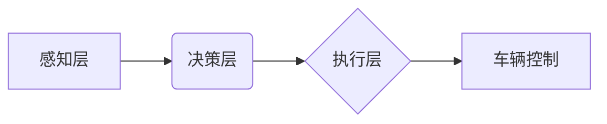

> 自动驾驶, 研发投入, 回报预期, 技术趋势, 市场分析, 投资策略, 挑战与机遇

## 1. 背景介绍

自动驾驶技术作为未来交通运输的重要发展方向，近年来备受关注。从早期的人工驾驶辅助系统到如今的 Level 4 自动驾驶，技术发展迅速，应用场景也日益广泛。自动驾驶公司的研发投入巨大，但回报预期也十分可观。本文将从技术趋势、市场分析、投资策略等方面，探讨自动驾驶公司的研发投入与回报预期。

## 2. 核心概念与联系

**2.1 自动驾驶技术等级**

自动驾驶技术按照其自动化程度分为不同的等级，由 SAE (美国汽车工程师协会) 制定标准。

* **Level 0 (0级):** 无自动化驾驶，驾驶员完全控制车辆。
* **Level 1 (1级):**  部分自动化驾驶，例如车道保持辅助 (LKA) 或自适应巡航控制 (ACC)。
* **Level 2 (2级):**  条件自动化驾驶，例如 Tesla 的 Autopilot，可以同时控制车速和方向，但驾驶员仍需保持注意力。
* **Level 3 (3级):**  条件自动化驾驶，车辆在特定条件下可以自动驾驶，驾驶员可以分心，但需随时接管。
* **Level 4 (4级):**  高自动化驾驶，车辆可以在特定区域内完全自动驾驶，无需驾驶员干预。
* **Level 5 (5级):**  完全自动化驾驶，车辆可以在任何环境下完全自动驾驶。

**2.2 核心技术**

自动驾驶技术依赖于多种核心技术，包括：

* **传感器技术:**  激光雷达、摄像头、毫米波雷达、超声波传感器等，用于感知周围环境。
* **定位导航技术:**  GPS、IMU、地图数据等，用于确定车辆位置和运动状态。
* **决策控制技术:**  机器学习、深度学习、路径规划等，用于分析感知数据并做出驾驶决策。

**2.3  自动驾驶架构**

自动驾驶系统通常采用分层架构，将功能模块进行分层设计，提高系统可靠性和可维护性。



## 3. 核心算法原理 & 具体操作步骤

**3.1 算法原理概述**

自动驾驶算法的核心是利用机器学习和深度学习技术，从传感器数据中学习驾驶规则和驾驶策略。常见的算法包括：

* **强化学习:**  通过奖励和惩罚机制，训练车辆在不同场景下做出最优驾驶决策。
* **监督学习:**  利用标注好的驾驶数据，训练车辆识别道路标志、交通信号灯等，并做出相应的驾驶动作。
* **目标检测:**  利用深度学习算法，识别周围环境中的物体，例如行人、车辆、障碍物等。

**3.2 算法步骤详解**

以强化学习为例，其算法步骤如下：

1. **环境建模:**  构建模拟驾驶环境，包括道路、交通规则、车辆模型等。
2. **奖励函数设计:**  定义车辆在不同场景下获得奖励或惩罚的规则，例如安全驾驶、行驶效率等。
3. **策略网络训练:**  利用强化学习算法，训练车辆的策略网络，使其能够根据感知数据做出最优驾驶决策，最大化奖励。
4. **仿真测试:**  在模拟环境中测试训练好的策略网络，评估其驾驶性能。
5. **真实环境测试:**  将训练好的策略网络部署到真实车辆上，进行实际道路测试，并不断收集数据进行算法优化。

**3.3 算法优缺点**

* **优点:**  能够学习复杂的驾驶规则，适应不同的驾驶场景。
* **缺点:**  训练数据量大，训练时间长，算法复杂度高。

**3.4 算法应用领域**

强化学习算法广泛应用于自动驾驶、机器人控制、游戏 AI 等领域。

## 4. 数学模型和公式 & 详细讲解 & 举例说明

**4.1 数学模型构建**

自动驾驶系统的数学模型通常基于状态空间模型，描述车辆的运动状态和环境信息。

* **状态变量:**  车辆的位置、速度、方向、加速度等。
* **输入变量:**  驾驶员的操作指令、传感器数据等。
* **输出变量:**  车辆的控制指令，例如油门、刹车、转向等。

**4.2 公式推导过程**

根据车辆动力学方程和控制律，可以推导出车辆运动状态的数学模型。例如，车辆的运动方程可以表示为：

$$
m\ddot{x} = F_t - F_d
$$

其中：

* $m$ 为车辆质量
* $\ddot{x}$ 为车辆加速度
* $F_t$ 为牵引力
* $F_d$ 为阻力

**4.3 案例分析与讲解**

以路径规划为例，可以使用数学模型和算法来规划车辆行驶路径。

* **目标函数:**  最小化车辆行驶距离或行驶时间。
* **约束条件:**  车辆必须在道路边界内行驶，避免碰撞等。

通过优化目标函数和约束条件，可以得到车辆行驶的最佳路径。

## 5. 项目实践：代码实例和详细解释说明

**5.1 开发环境搭建**

自动驾驶项目开发通常需要使用 Linux 操作系统、Python 编程语言和 ROS (Robot Operating System) 等工具。

**5.2 源代码详细实现**

以下是一个简单的自动驾驶算法的 Python 代码示例：

```python
import numpy as np

class SimpleController:
    def __init__(self, target_speed=20):
        self.target_speed = target_speed
        self.current_speed = 0

    def control(self, sensor_data):
        # 根据传感器数据，控制车辆速度
        if self.current_speed < self.target_speed:
            return 1  # 加油
        else:
            return 0  # 刹车

# 示例用法
controller = SimpleController()
sensor_data = np.random.rand()  # 模拟传感器数据
control_output = controller.control(sensor_data)
print(f"Control output: {control_output}")
```

**5.3 代码解读与分析**

该代码定义了一个简单的控制器类，根据目标速度和传感器数据控制车辆速度。

* `__init__` 方法初始化控制器对象，设置目标速度。
* `control` 方法根据传感器数据控制车辆速度，如果当前速度低于目标速度，则返回 1 (加油)，否则返回 0 (刹车)。

**5.4 运行结果展示**

运行该代码，会输出控制输出值，例如 1 或 0，表示加油或刹车。

## 6. 实际应用场景

自动驾驶技术在多个领域都有实际应用场景：

* **乘用车:**  自动驾驶汽车可以提高驾驶安全性、效率和舒适性。
* **商用车:**  自动驾驶卡车和货车可以提高运输效率和降低运输成本。
* **公共交通:**  自动驾驶公交车和出租车可以提高公共交通效率和便捷性。
* **物流配送:**  自动驾驶无人配送车可以提高物流配送效率和降低成本。

**6.4 未来应用展望**

未来，自动驾驶技术将更加普及，应用场景更加广泛，例如：

* **智能城市:**  自动驾驶车辆将成为智能城市交通系统的重要组成部分。
* **无人驾驶飞机:**  自动驾驶飞机可以提高航空运输效率和安全性。
* **自动驾驶机器人:**  自动驾驶机器人可以用于工业生产、服务业等领域。

## 7. 工具和资源推荐

**7.1 学习资源推荐**

* **书籍:**  《自动驾驶汽车》
* **在线课程:**  Coursera、Udacity 等平台提供自动驾驶相关的在线课程。
* **开源项目:**  Autoware、Apollo 等开源项目提供自动驾驶软件开发平台和示例代码。

**7.2 开发工具推荐**

* **ROS (Robot Operating System):**  用于机器人软件开发的开源框架。
* **Gazebo:**  用于机器人仿真和测试的开源软件。
* **TensorFlow/PyTorch:**  用于深度学习模型训练的开源框架。

**7.3 相关论文推荐**

* **Deep Learning for Autonomous Driving**
* **End-to-End Learning for Self-Driving Cars**
* **Towards Level 5 Autonomy: A Survey of Recent Advances in Autonomous Driving**

## 8. 总结：未来发展趋势与挑战

**8.1 研究成果总结**

近年来，自动驾驶技术取得了显著进展，从早期的人工驾驶辅助系统到如今的 Level 4 自动驾驶，技术发展迅速。

**8.2 未来发展趋势**

未来，自动驾驶技术将朝着以下方向发展：

* **更高级的自动化程度:**  实现 Level 5 自动驾驶，车辆可以在任何环境下完全自动驾驶。
* **更强的感知能力:**  利用更先进的传感器技术，提高车辆感知环境的能力。
* **更智能的决策控制:**  利用更强大的机器学习算法，提高车辆决策控制的智能化水平。
* **更安全的驾驶体验:**  通过冗余系统和安全机制，确保车辆在任何情况下都能安全行驶。

**8.3 面临的挑战**

自动驾驶技术还面临着一些挑战：

* **技术难题:**  实现 Level 5 自动驾驶仍然是一个巨大的技术挑战，需要解决感知、决策、控制等多个方面的难题。
* **法律法规:**  自动驾驶技术的法律法规体系尚不完善，需要制定相应的法律法规来规范自动驾驶车辆的使用。
* **社会接受度:**  公众对自动驾驶技术的接受度还需要提高，需要通过宣传教育等方式提高公众对自动驾驶技术的了解和信任。

**8.4 研究展望**

未来，自动驾驶技术将继续发展，并对交通运输、城市规划、社会生活等多个领域产生深远影响。


## 9. 附录：常见问题与解答

**9.1 自动驾驶技术是否安全？**

自动驾驶技术仍然处于发展阶段，安全性需要不断提高。自动驾驶车辆配备了多种安全机制，例如冗余系统、紧急制动系统等，但仍存在一定的风险。

**9.2 自动驾驶技术何时能够普及？**

自动驾驶技术的普及时间取决于技术发展、法律法规、社会接受度等多方面因素。预计在未来几年内，自动驾驶技术将逐步普及，并逐渐成为主流交通方式。

**9.3 自动驾驶技术会取代驾驶员吗？**

自动驾驶技术可能会改变驾驶员的工作模式，但不会完全取代驾驶员。未来，驾驶员可能需要承担更多监督和管理工作。


作者：禅与计算机程序设计艺术 / Zen and the Art of Computer Programming 
<end_of_turn>