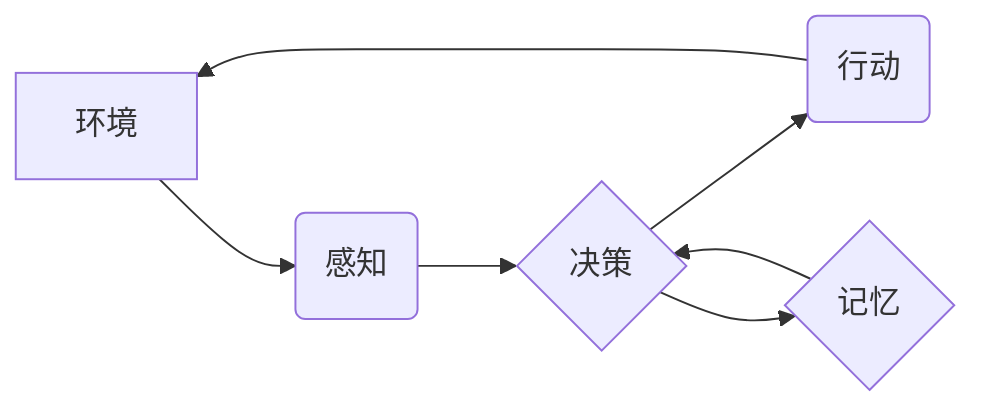

> AI Agent, 规划, 记忆, 强化学习, 决策, 状态空间, 知识表示, 知识图谱, 迁移学习

## 1. 背景介绍

在人工智能领域，AI Agent（智能代理）作为实现智能行为的核心单元，在自动驾驶、机器人控制、游戏AI等领域扮演着越来越重要的角色。AI Agent需要具备感知环境、做出决策、执行行动的能力，并能够根据经验不断学习和改进。其中，规划和记忆是AI Agent实现智能行为的关键要素。

规划是指AI Agent根据当前状态和目标，设计出一系列步骤来实现目标。它涉及到对未来状态的预测、策略的选择和行动的执行。记忆是指AI Agent存储和检索过去的经验，并利用这些经验来指导未来的决策。

传统的AI Agent通常依赖于预先定义的规则和知识库，缺乏灵活性和适应性。随着深度学习技术的兴起，基于强化学习的AI Agent逐渐成为主流。强化学习算法通过与环境的交互，学习一个策略，使AI Agent在特定环境中获得最大奖励。

然而，即使是基于强化学习的AI Agent，也面临着规划和记忆的挑战。

* **状态空间爆炸问题:** 许多现实世界的问题具有巨大的状态空间，这意味着AI Agent需要处理大量的状态和可能的行动，这会导致计算复杂度急剧增加。
* **长期的依赖关系:** 在某些任务中，AI Agent需要根据过去的经验做出决策，而这些经验可能发生在很长时间之前。如何有效地存储和检索这些长期依赖关系是一个挑战。
* **知识表示和迁移问题:** 如何将AI Agent的经验和知识有效地表示出来，并将其迁移到新的环境中也是一个重要的研究方向。

## 2. 核心概念与联系

**2.1 规划与记忆的联系**

规划和记忆是相互关联的。规划需要基于过去的经验和知识，预测未来的状态和选择最优策略。而记忆则提供了一个存储和检索过去经验的机制，支持规划过程。

**2.2 核心概念架构**



**2.3 核心概念原理**

* **环境:** AI Agent所处的外部世界，包括状态、奖励和可能的行动。
* **感知:** AI Agent获取环境信息的过程，例如传感器数据、图像识别等。
* **决策:** AI Agent根据感知到的信息和目标，选择最优行动的过程。
* **行动:** AI Agent执行的指令，例如移动、抓取、说话等。
* **记忆:** AI Agent存储和检索过去的经验和知识的过程。

## 3. 核心算法原理 & 具体操作步骤

### 3.1 算法原理概述

强化学习算法的核心思想是通过与环境的交互，学习一个策略，使AI Agent在特定环境中获得最大奖励。

* **状态:** AI Agent在环境中所处的状态。
* **动作:** AI Agent可以执行的动作。
* **奖励:** 环境对AI Agent动作的反馈。
* **策略:** AI Agent选择动作的策略。

强化学习算法的目标是找到一个策略，使得AI Agent在长期内获得最大的总奖励。

### 3.2 算法步骤详解

1. **初始化:** 初始化AI Agent的状态、策略和奖励函数。
2. **感知环境:** AI Agent感知环境的状态。
3. **选择动作:** 根据当前状态和策略，AI Agent选择一个动作。
4. **执行动作:** AI Agent执行选择的动作。
5. **获得奖励:** 环境根据AI Agent的动作提供奖励。
6. **更新策略:** 根据奖励和环境状态，更新AI Agent的策略。
7. **重复步骤2-6:** 直到AI Agent的策略收敛或达到预设的目标。

### 3.3 算法优缺点

**优点:**

* 可以学习复杂的决策策略。
* 不需要预先定义规则和知识。
* 可以适应动态变化的环境。

**缺点:**

* 训练时间长，计算复杂度高。
* 需要大量的训练数据。
* 难以解释AI Agent的决策过程。

### 3.4 算法应用领域

* **自动驾驶:** 训练自动驾驶汽车在复杂道路环境中做出安全决策。
* **机器人控制:** 训练机器人执行复杂的任务，例如抓取、导航、组装等。
* **游戏AI:** 训练游戏中的AI对手，使其能够与人类玩家进行对抗。
* **推荐系统:** 训练推荐系统，根据用户的历史行为推荐感兴趣的内容。

## 4. 数学模型和公式 & 详细讲解 & 举例说明

### 4.1 数学模型构建

强化学习的数学模型通常由以下几个部分组成:

* **状态空间:** 所有可能的AI Agent状态的集合。
* **动作空间:** AI Agent可以执行的动作的集合。
* **奖励函数:** 将状态和动作映射到奖励值的函数。
* **策略:** 将状态映射到动作的函数。

### 4.2 公式推导过程

强化学习算法的目标是找到一个策略，使得AI Agent在长期内获得最大的总奖励。

总奖励可以表示为:

$$
R = \sum_{t=0}^{\infty} \gamma^t r_t
$$

其中:

* $R$ 是总奖励。
* $r_t$ 是在时间步 $t$ 获得的奖励。
* $\gamma$ 是折扣因子，控制未来奖励的权重。

策略的更新通常使用梯度下降算法，目标函数是总奖励的负值。

### 4.3 案例分析与讲解

**举例说明:**

假设一个AI Agent的任务是学习玩一个简单的游戏，游戏中有两种状态: "win" 和 "lose"，两种动作: "left" 和 "right"。奖励函数如下:

* 当AI Agent进入"win"状态时，奖励为10。
* 当AI Agent进入"lose"状态时，奖励为-10。
* 其他状态下，奖励为0。

通过强化学习算法，AI Agent可以学习到一个策略，使得它在游戏中获得最大的总奖励。

## 5. 项目实践：代码实例和详细解释说明

### 5.1 开发环境搭建

* Python 3.x
* TensorFlow 或 PyTorch
* Jupyter Notebook

### 5.2 源代码详细实现

```python
import tensorflow as tf

# 定义状态空间和动作空间
state_space = 4
action_space = 2

# 定义神经网络模型
model = tf.keras.Sequential([
    tf.keras.layers.Dense(128, activation='relu', input_shape=(state_space,)),
    tf.keras.layers.Dense(action_space, activation='softmax')
])

# 定义损失函数和优化器
loss_fn = tf.keras.losses.CategoricalCrossentropy()
optimizer = tf.keras.optimizers.Adam()

# 训练循环
for epoch in range(100):
    # 训练数据
    states = ...
    actions = ...
    rewards = ...

    with tf.GradientTape() as tape:
        predictions = model(states)
        loss = loss_fn(actions, predictions)

    gradients = tape.gradient(loss, model.trainable_variables)
    optimizer.apply_gradients(zip(gradients, model.trainable_variables))

    # 打印损失值
    print(f'Epoch {epoch+1}, Loss: {loss.numpy()}')
```

### 5.3 代码解读与分析

* 代码首先定义了状态空间和动作空间。
* 然后定义了一个神经网络模型，用于预测动作概率。
* 使用CategoricalCrossentropy损失函数和Adam优化器进行训练。
* 训练循环中，使用训练数据进行模型训练，并打印损失值。

### 5.4 运行结果展示

训练完成后，可以将模型应用于新的环境中，并观察AI Agent的行为。

## 6. 实际应用场景

### 6.1 自动驾驶

强化学习可以用于训练自动驾驶汽车在复杂道路环境中做出安全决策。例如，可以训练AI Agent学习识别交通信号灯、避开障碍物、保持车距等行为。

### 6.2 机器人控制

强化学习可以用于训练机器人执行复杂的任务，例如抓取、导航、组装等。例如，可以训练AI Agent学习如何抓取不同形状和大小的物体，或如何在复杂的环境中导航到目标位置。

### 6.3 游戏AI

强化学习可以用于训练游戏中的AI对手，使其能够与人类玩家进行对抗。例如，可以训练AI Agent学习玩围棋、象棋、Go等游戏。

### 6.4 未来应用展望

* **医疗保健:** 训练AI Agent辅助医生诊断疾病、制定治疗方案。
* **金融:** 训练AI Agent进行风险管理、投资决策。
* **教育:** 训练AI Agent个性化教学，提供定制化的学习体验。

## 7. 工具和资源推荐

### 7.1 学习资源推荐

* **书籍:**
    * Reinforcement Learning: An Introduction by Richard S. Sutton and Andrew G. Barto
    * Deep Reinforcement Learning Hands-On by Maxim Lapan
* **在线课程:**
    * Deep Reinforcement Learning Specialization by DeepLearning.AI
    * Reinforcement Learning by David Silver (University of DeepMind)

### 7.2 开发工具推荐

* **TensorFlow:** 开源深度学习框架，支持强化学习算法的实现。
* **PyTorch:** 开源深度学习框架，也支持强化学习算法的实现。
* **OpenAI Gym:** 强化学习环境库，提供各种标准的强化学习任务。

### 7.3 相关论文推荐

* **Deep Q-Network (DQN):** Mnih et al., 2015
* **Proximal Policy Optimization (PPO):** Schulman et al., 2017
* **Trust Region Policy Optimization (TRPO):** Schulman et al., 2015

## 8. 总结：未来发展趋势与挑战

### 8.1 研究成果总结

近年来，强化学习取得了显著的进展，在许多领域取得了成功应用。

* **算法方面:** 出现了许多新的强化学习算法，例如DQN、PPO、TRPO等，这些算法在效率和性能方面都有显著提升。
* **应用方面:** 强化学习被应用于越来越多的领域，例如自动驾驶、机器人控制、游戏AI等。

### 8.2 未来发展趋势

* **更强大的算法:** 研究更强大、更鲁棒的强化学习算法，能够解决更复杂的任务。
* **更有效的训练方法:** 研究更有效的训练方法，例如迁移学习、联邦学习等，降低训练成本和时间。
* **更广泛的应用:** 将强化学习应用于更多领域，例如医疗保健、金融、教育等。

### 8.3 面临的挑战

* **样本效率:** 强化学习算法通常需要大量的训练数据，这在某些领域难以获得。
* **可解释性:** 强化学习模型的决策过程难以解释，这在一些安全关键的应用场景中是一个挑战。
* **安全性和可靠性:** 强化学习模型在现实世界中的应用需要保证安全性和可靠性，这需要进一步的研究和开发。

### 8.4 研究展望

未来，强化学习将继续是一个重要的研究方向，其发展将推动人工智能技术的进步，并带来更多创新应用。

## 9. 附录：常见问题与解答

**Q1: 强化学习和监督学习有什么区别？**

**A1:** 强化学习和监督学习都是机器学习的范式，但它们的目标和训练方式不同。监督学习的目标是学习一个函数，将输入映射到输出，而强化学习的目标是学习一个策略，使得AI Agent在环境中获得最大奖励。

**Q2: 强化学习的训练过程如何进行？**

**A2:** 强化学习的训练过程通常使用试错法，AI Agent与环境交互，根据环境的反馈调整策略，最终学习到一个能够获得最大奖励的策略。

**Q3: 强化学习有哪些应用场景？**

**A3:** 强化学习的应用场景非常广泛，例如自动驾驶、机器人控制、游戏AI、推荐系统等。

作者：禅与计算机程序设计艺术 / Zen and the Art of Computer Programming


<end_of_turn>