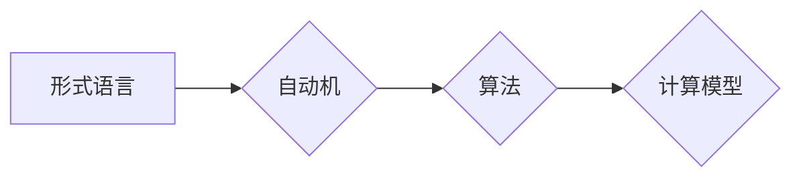

> 计算理论, 形式语言, 自动机理论, 算法复杂度, 计算模型, 决策问题, 证明方法, 逻辑学, 计算机科学基础

## 1. 背景介绍

计算理论作为计算机科学的核心分支，致力于探索计算的本质、能力和局限性。它为计算机科学提供了坚实的理论基础，并推动了计算机技术的发展。

计算理论的发展历程可以追溯到19世纪末，随着逻辑学和数学的进步，人们开始对计算问题进行更深入的思考。1930年代，图灵提出了著名的图灵机模型，为计算理论奠定了基础。此后，计算理论经历了快速发展，涌现出许多重要的成果，例如形式语言理论、自动机理论、算法复杂度理论等。

## 2. 核心概念与联系

### 2.1 形式语言

形式语言是指由有限个符号组成的字符串集合，这些符号可以是字母、数字、符号等。形式语言理论研究的是形式语言的结构、性质和变换。

### 2.2 自动机

自动机是一种抽象模型，它能够接受或拒绝形式语言。自动机由有限个状态、输入符号和转换规则组成。根据自动机的结构和功能，可以分为不同的类型，例如有限自动机、推导自动机、图灵机等。

### 2.3 算法

算法是指解决特定问题的指令序列。算法必须是明确的、有限的、有效的。算法复杂度是指算法执行所需的时间和空间资源。

### 2.4 计算模型

计算模型是指描述计算过程的抽象框架。常见的计算模型包括图灵机、电路模型、随机图模型等。

**核心概念与联系流程图**



## 3. 核心算法原理 & 具体操作步骤

### 3.1 算法原理概述

算法的原理是通过一系列的步骤，将输入数据转换为输出结果。算法的效率取决于其执行时间和空间复杂度。

### 3.2 算法步骤详解

算法的步骤通常包括以下几个方面：

1. **输入:** 获取输入数据。
2. **处理:** 对输入数据进行一系列操作，例如排序、查找、计算等。
3. **输出:** 生成输出结果。

### 3.3 算法优缺点

不同的算法具有不同的优缺点。例如，排序算法中，冒泡排序的实现简单，但效率较低；快速排序的效率较高，但实现复杂。

### 3.4 算法应用领域

算法广泛应用于各个领域，例如：

* **计算机科学:** 搜索算法、排序算法、数据结构等。
* **人工智能:** 机器学习算法、深度学习算法等。
* **生物信息学:** 基因序列比对算法、蛋白质结构预测算法等。
* **金融:** 风险管理算法、投资策略算法等。

## 4. 数学模型和公式 & 详细讲解 & 举例说明

### 4.1 数学模型构建

数学模型可以用来描述计算过程和算法的性质。例如，可以使用图论来描述算法的流程，可以使用概率论来描述算法的效率。

### 4.2 公式推导过程

算法的复杂度可以用时间复杂度和空间复杂度来衡量。时间复杂度是指算法执行所需的时间，空间复杂度是指算法执行所需的空间资源。

**时间复杂度公式:**

$$T(n) = O(f(n))$$

其中，$T(n)$表示算法执行时间，$n$表示输入数据大小，$f(n)$表示时间复杂度函数。

**空间复杂度公式:**

$$S(n) = O(g(n))$$

其中，$S(n)$表示算法执行空间资源，$n$表示输入数据大小，$g(n)$表示空间复杂度函数。

### 4.3 案例分析与讲解

例如，冒泡排序算法的时间复杂度为$O(n^2)$，空间复杂度为$O(1)$。快速排序算法的时间复杂度为$O(n log n)$，空间复杂度为$O(log n)$。

## 5. 项目实践：代码实例和详细解释说明

### 5.1 开发环境搭建

可以使用任何支持编程语言的开发环境，例如：

* **Windows:** Visual Studio Code
* **macOS:** Xcode
* **Linux:** Eclipse

### 5.2 源代码详细实现

以下是一个简单的冒泡排序算法的代码实现：

```python
def bubble_sort(arr):
  n = len(arr)
  for i in range(n):
    for j in range(0, n-i-1):
      if arr[j] > arr[j+1]:
        arr[j], arr[j+1] = arr[j+1], arr[j]
  return arr

# 测试代码
arr = [64, 34, 25, 12, 22, 11, 90]
sorted_arr = bubble_sort(arr)
print("排序后的数组:", sorted_arr)
```

### 5.3 代码解读与分析

代码首先定义了一个名为`bubble_sort`的函数，该函数接受一个数组作为输入。

函数内部使用两个循环来实现冒泡排序算法。外循环控制了排序的次数，内循环控制了每次排序的比较和交换。

如果两个相邻元素的顺序错误，则交换它们的位置。

### 5.4 运行结果展示

运行代码后，输出结果为：

```
排序后的数组: [11, 12, 22, 25, 34, 64, 90]
```

## 6. 实际应用场景

### 6.1 搜索引擎

搜索引擎使用算法来对网页进行排名，并根据用户查询返回最相关的结果。

### 6.2 社交媒体

社交媒体平台使用算法来推荐朋友、内容和广告。

### 6.3 电子商务

电子商务平台使用算法来推荐商品、预测销量和优化物流。

### 6.4 未来应用展望

随着人工智能和机器学习的发展，算法将在更多领域得到应用，例如：

* **医疗保健:** 疾病诊断、药物研发
* **教育:** 个性化学习、智能辅导
* **交通:** 自驾车、智能交通管理

## 7. 工具和资源推荐

### 7.1 学习资源推荐

* **书籍:**
    * 《算法导论》
    * 《计算理论导论》
* **在线课程:**
    * Coursera: 算法与数据结构
    * edX: 计算理论

### 7.2 开发工具推荐

* **编程语言:** Python, Java, C++
* **IDE:** Visual Studio Code, Eclipse, IntelliJ IDEA

### 7.3 相关论文推荐

* **图灵机:** Alan Turing, On Computable Numbers, with an Application to the Entscheidungsproblem (1936)
* **形式语言:** Noam Chomsky, Syntactic Structures (1957)
* **算法复杂度:** Donald Knuth, The Art of Computer Programming (1968)

## 8. 总结：未来发展趋势与挑战

### 8.1 研究成果总结

计算理论的发展取得了巨大的成就，为计算机科学的发展奠定了坚实的基础。

### 8.2 未来发展趋势

未来，计算理论将继续朝着以下方向发展：

* **量子计算:** 研究量子计算模型和算法。
* **分布式计算:** 研究分布式计算模型和算法。
* **人工智能:** 研究人工智能算法的理论基础。

### 8.3 面临的挑战

计算理论也面临着一些挑战，例如：

* **复杂性:** 计算问题越来越复杂，需要新的理论和方法来解决。
* **可解释性:** 许多人工智能算法难以解释，需要提高算法的可解释性。
* **伦理问题:** 计算技术的发展引发了一些伦理问题，需要进行深入思考和讨论。

### 8.4 研究展望

未来，计算理论的研究将继续推动计算机科学的发展，并为解决人类面临的各种挑战提供新的思路和方法。

## 9. 附录：常见问题与解答

### 9.1 什么是图灵机？

图灵机是一种抽象模型，它能够接受或拒绝形式语言。图灵机由有限个状态、输入符号和转换规则组成。

### 9.2 什么是算法复杂度？

算法复杂度是指算法执行所需的时间和空间资源。

### 9.3 什么是形式语言？

形式语言是指由有限个符号组成的字符串集合。

### 9.4 什么是自动机？

自动机是一种抽象模型，它能够接受或拒绝形式语言。

### 9.5 什么是计算模型？

计算模型是指描述计算过程的抽象框架。


作者：禅与计算机程序设计艺术 / Zen and the Art of Computer Programming 
<end_of_turn>