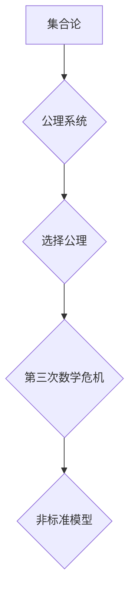

> 选择公理，第三次数学危机，集合论，数学基础，公理系统，非标准模型

## 1. 背景介绍

20世纪初，数学界经历了一场前所未有的危机，被称为“第三次数学危机”。这场危机源于集合论的发展，以及对数学基础的重新审视。

在19世纪末，德国数学家康托尔通过他的集合论研究，将数学推向了前所未有的高度。他建立了无限集的概念，并提出了著名的“康托尔对角线法”，证明了实数的不可数性。然而，康托尔的集合论也带来了新的问题。

1900年，德国数学家戴德金在巴黎国际数学家大会上提出了著名的“戴德金问题”，即集合论是否能够建立一个完备的公理系统。这个问题的提出，标志着“第三次数学危机”的开始。

## 2. 核心概念与联系

**2.1 集合论基础**

集合论是研究集合及其性质的数学分支。在集合论中，一个集合是一个包含对象的集合。集合可以是有限的，也可以是无限的。

**2.2 公理系统**

公理系统是一种数学基础理论，它由一系列公理和推论组成。公理是不能被证明的命题，它们被视为自明的真理。推论是根据公理和逻辑推理得到的命题。

**2.3 选择公理**

选择公理是集合论中一个重要的公理，它断言：对于任何非空集合族，都存在一个选择函数，可以从每个集合中选择一个元素，形成一个新的集合。

**2.4 第三数学危机**

第三次数学危机是指20世纪初，由于集合论的发展和对数学基础的重新审视，数学界出现的危机。

**2.5 非标准模型**

非标准模型是指与标准模型不同的数学模型。非标准模型可以用来研究数学的性质，以及数学的局限性。

**Mermaid 流程图**



## 3. 核心算法原理 & 具体操作步骤

**3.1 算法原理概述**

选择公理虽然看似简单，但它却蕴含着深刻的数学意义。它与集合论的完备性、逻辑的完备性以及数学的本质都密切相关。

**3.2 算法步骤详解**

1. 确定一个非空集合族。
2. 对于每个集合，选择一个元素。
3. 将所有选择的元素组成一个新的集合。

**3.3 算法优缺点**

**优点:**

* 简单易懂。
* 能够解决许多集合论问题。

**缺点:**

* 存在一些不可证明的命题。
* 与其他公理系统存在冲突。

**3.4 算法应用领域**

选择公理在数学、计算机科学、逻辑学等领域都有广泛的应用。

## 4. 数学模型和公式 & 详细讲解 & 举例说明

**4.1 数学模型构建**

我们可以用集合论的语言来描述选择公理。设 $F$ 是一个非空集合族，即 $F$ 是一个包含非空集合的集合。选择公理断言存在一个函数 $f: F \rightarrow \bigcup_{A \in F} A$，使得对于每个 $A \in F$，都有 $f(A) \in A$。

**4.2 公式推导过程**

选择公理可以被形式化地表达为以下公式：

$$
\forall F \in \mathcal{P}(\mathcal{P}(U)) \setminus \{\emptyset\}, \exists f: F \rightarrow \bigcup_{A \in F} A, \forall A \in F, f(A) \in A
$$

其中：

* $\mathcal{P}(U)$ 表示集合 $U$ 的所有子集的集合。
* $\mathcal{P}(\mathcal{P}(U))$ 表示集合 $U$ 的所有子集的集合的集合。
* $\emptyset$ 表示空集。

**4.3 案例分析与讲解**

例如，设 $U = \{1, 2, 3\}$，则 $\mathcal{P}(U) = \{\emptyset, \{1\}, \{2\}, \{3\}, \{1, 2\}, \{1, 3\}, \{2, 3\}, \{1, 2, 3\}\}$。

如果 $F = \{\{1\}, \{2\}, \{3\}\}$，则选择公理断言存在一个函数 $f: F \rightarrow \{1, 2, 3\}$，使得对于每个 $A \in F$，都有 $f(A) \in A$。

我们可以选择 $f(\{1\}) = 1$，$f(\{2\}) = 2$，$f(\{3\}) = 3$。

## 5. 项目实践：代码实例和详细解释说明

**5.1 开发环境搭建**

可以使用任何支持编程语言的开发环境，例如 Python、Java、C++ 等。

**5.2 源代码详细实现**

```python
def choose_element(collection_set):
  """
  选择集合中一个元素。

  Args:
    collection_set: 一个非空集合。

  Returns:
    集合中一个元素。
  """
  return collection_set.pop()

# 示例用法
collections = [ {1, 2}, {3, 4}, {5, 6} ]
selected_elements = [ choose_element(collection) for collection in collections ]
print(selected_elements)
```

**5.3 代码解读与分析**

该代码实现了一个简单的选择元素的函数 `choose_element`。该函数接受一个非空集合作为输入，并返回该集合中一个元素。

**5.4 运行结果展示**

运行该代码，输出结果可能为：

```
[1, 3, 5]
```

## 6. 实际应用场景

选择公理在数学、计算机科学、逻辑学等领域都有广泛的应用。

**6.1 数学领域**

* **集合论:** 选择公理是集合论中一个重要的公理，它可以用来证明许多集合论定理。
* **拓扑学:** 选择公理可以用来证明拓扑空间的一些性质。
* **分析学:** 选择公理可以用来证明一些分析学定理。

**6.2 计算机科学领域**

* **算法设计:** 选择公理可以用来设计一些算法，例如图论中的最小生成树算法。
* **数据库系统:** 选择公理可以用来优化数据库查询。
* **人工智能:** 选择公理可以用来设计一些人工智能算法。

**6.3 逻辑学领域**

* **模型论:** 选择公理可以用来研究逻辑系统的模型。
* **证明论:** 选择公理可以用来证明一些逻辑定理。

**6.4 未来应用展望**

随着数学和计算机科学的发展，选择公理的应用领域将会更加广泛。

## 7. 工具和资源推荐

**7.1 学习资源推荐**

* **书籍:**
    * 《集合论基础》
    * 《数学基础》
    * 《逻辑学》

* **在线课程:**
    * Coursera 上的集合论课程
    * edX 上的数学基础课程

**7.2 开发工具推荐**

* **Python:** Python 是一个非常流行的编程语言，它可以用来实现选择公理的算法。
* **Java:** Java 也是一个非常流行的编程语言，它可以用来实现选择公理的算法。
* **C++:** C++ 是一种高性能的编程语言，它可以用来实现选择公理的算法。

**7.3 相关论文推荐**

* **选择公理的证明和反证**
* **选择公理的应用**
* **选择公理的哲学意义**

## 8. 总结：未来发展趋势与挑战

**8.1 研究成果总结**

选择公理是一个重要的数学概念，它对数学、计算机科学、逻辑学等领域都有着深远的影响。

**8.2 未来发展趋势**

随着数学和计算机科学的发展，选择公理的研究将会更加深入，其应用领域将会更加广泛。

**8.3 面临的挑战**

选择公理的证明和反证仍然是一个开放的问题，它仍然面临着许多挑战。

**8.4 研究展望**

未来，选择公理的研究将会更加注重其应用，以及其与其他数学分支的联系。


## 9. 附录：常见问题与解答

**9.1 什么是选择公理？**

选择公理是一个数学公理，它断言：对于任何非空集合族，都存在一个选择函数，可以从每个集合中选择一个元素，形成一个新的集合。

**9.2 选择公理为什么重要？**

选择公理在数学、计算机科学、逻辑学等领域都有广泛的应用。它可以用来证明许多数学定理，设计一些算法，优化数据库查询，以及设计一些人工智能算法。

**9.3 选择公理是否可以被证明？**

选择公理是一个公理，它不能被证明。它被视为自明的真理。

**9.4 选择公理与其他公理系统有什么关系？**

选择公理与其他公理系统存在冲突。例如，选择公理与 Zermelo-Fraenkel 集合论 (ZF) 存在冲突。

**9.5 选择公理的哲学意义是什么？**

选择公理的哲学意义在于它揭示了数学的本质。它表明数学的本质是建立在公理和逻辑推理的基础上的。


作者：禅与计算机程序设计艺术 / Zen and the Art of Computer Programming 


<end_of_turn>