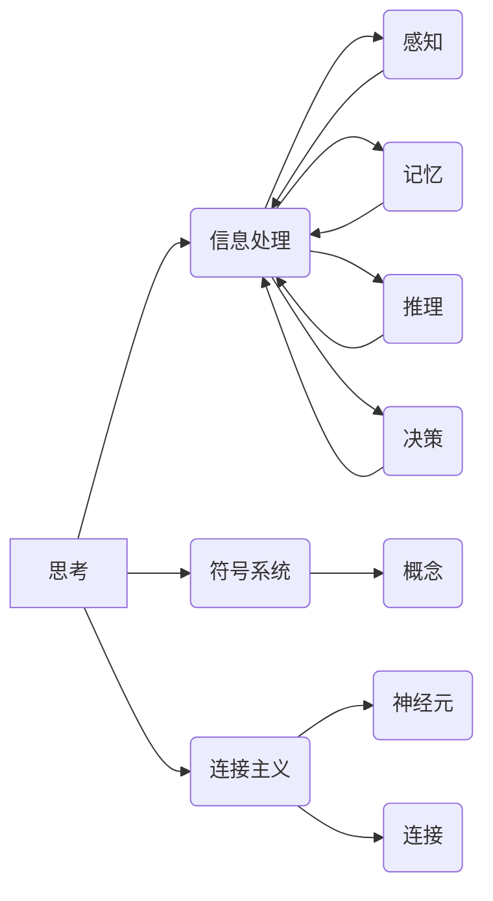

> 机器学习，深度学习，人工智能，认知科学，计算极限，未来方向，思考机制

## 1. 背景介绍

自人类诞生以来，对“思考”的本质和机器是否能思考的疑问一直萦绕着人们心头。随着计算机科学的飞速发展，人工智能（AI）的兴起为这个问题注入了新的活力。从早期简单的规则型系统到如今的深度学习模型，AI技术取得了令人瞩目的成就，例如在图像识别、自然语言处理等领域展现出惊人的能力。然而，这些成就是否意味着机器已经具备了人类的思考能力？这个问题仍然没有确切的答案。

本篇章将探讨机器思考的可能性，分析当前AI技术的局限性，并展望未来发展方向。我们将从认知科学的角度出发，探讨思考的本质，并分析AI技术如何模拟和实现思考过程。同时，我们将深入探讨深度学习模型的原理和局限性，并分析其在模拟思考方面的优势和不足。最后，我们将展望未来AI技术的发展趋势，探讨机器是否能够真正地思考，以及这对人类社会将带来哪些影响。

## 2. 核心概念与联系

**2.1 思考的本质**

思考是一个复杂的过程，涉及到感知、记忆、推理、决策等多种认知功能。认知科学试图从生物学、心理学、神经科学等多学科角度研究思考的机制。目前，对思考的理解主要集中在以下几个方面：

* **信息处理模型:** 将思考看作是一种信息处理过程，大脑接收、存储、加工和输出信息。
* **符号系统理论:** 将思考看作是一种符号系统，大脑使用符号来表示和操作概念。
* **连接主义模型:** 将思考看作是一种网络连接的动态变化，大脑中的神经元通过连接形成网络，信息通过网络传递和处理。

**2.2 AI技术的模拟思考**

AI技术试图通过模仿人类思考的方式来实现智能。早期AI系统主要采用规则型方法，通过预先定义的规则来处理信息。随着深度学习技术的兴起，AI系统开始能够从数据中学习，并自动发现思考模式。

**2.3 核心概念关系图**



## 3. 核心算法原理 & 具体操作步骤

**3.1 算法原理概述**

深度学习算法的核心是多层神经网络。神经网络由多个层级的神经元组成，每个神经元接收来自上一层的输入，并通过激活函数进行处理，输出到下一层。通过训练，神经网络能够学习到数据中的复杂模式和关系，从而实现对数据的理解和预测。

**3.2 算法步骤详解**

1. **数据预处理:** 将原始数据转换为深度学习模型可以理解的格式，例如归一化、编码等。
2. **网络结构设计:** 根据任务需求设计神经网络的层数、神经元数量、激活函数等参数。
3. **模型训练:** 使用训练数据训练神经网络，通过反向传播算法调整神经元的权重和偏差，使模型的预测结果与真实值尽可能接近。
4. **模型评估:** 使用测试数据评估模型的性能，例如准确率、召回率等指标。
5. **模型调优:** 根据评估结果调整模型参数，例如学习率、正则化参数等，以提高模型性能。

**3.3 算法优缺点**

**优点:**

* 能够学习到数据中的复杂模式和关系。
* 性能优于传统机器学习算法。
* 可应用于多种任务，例如图像识别、自然语言处理等。

**缺点:**

* 需要大量的训练数据。
* 训练过程耗时和耗能。
* 模型解释性差，难以理解模型的决策过程。

**3.4 算法应用领域**

深度学习算法已广泛应用于各个领域，例如：

* **计算机视觉:** 图像识别、物体检测、图像分割等。
* **自然语言处理:** 机器翻译、文本摘要、情感分析等。
* **语音识别:** 语音转文本、语音合成等。
* **医疗诊断:** 疾病预测、影像分析等。
* **金融分析:** 风险评估、欺诈检测等。

## 4. 数学模型和公式 & 详细讲解 & 举例说明

**4.1 数学模型构建**

深度学习模型可以看作是一个复杂的数学模型，其核心是神经网络的结构和激活函数。

**4.2 公式推导过程**

深度学习模型的训练过程基于梯度下降算法，其目标是找到最优的模型参数，使得模型的预测结果与真实值尽可能接近。梯度下降算法通过计算损失函数的梯度，不断调整模型参数，最终收敛到最优解。

**损失函数:**

$$L(W,b) = \frac{1}{N} \sum_{i=1}^{N} \mathcal{L}(y_i, \hat{y}_i)$$

其中：

* $W$ 和 $b$ 分别表示模型的参数和偏置。
* $N$ 表示训练数据的数量。
* $\mathcal{L}$ 表示损失函数，例如均方误差函数。
* $y_i$ 表示真实值。
* $\hat{y}_i$ 表示模型预测值。

**梯度下降算法:**

$$W = W - \alpha \frac{\partial L(W,b)}{\partial W}$$

$$b = b - \alpha \frac{\partial L(W,b)}{\partial b}$$

其中：

* $\alpha$ 表示学习率。

**4.3 案例分析与讲解**

例如，在图像识别任务中，深度学习模型可以学习到图像中不同物体特征的表示，并将其用于分类。训练过程中，模型会根据图像标签和预测结果计算损失函数，并通过梯度下降算法调整模型参数，最终实现对图像的准确分类。

## 5. 项目实践：代码实例和详细解释说明

**5.1 开发环境搭建**

深度学习模型的开发通常需要使用Python语言和相关的深度学习框架，例如TensorFlow、PyTorch等。

**5.2 源代码详细实现**

```python
import tensorflow as tf

# 定义模型结构
model = tf.keras.models.Sequential([
    tf.keras.layers.Conv2D(32, (3, 3), activation='relu', input_shape=(28, 28, 1)),
    tf.keras.layers.MaxPooling2D((2, 2)),
    tf.keras.layers.Conv2D(64, (3, 3), activation='relu'),
    tf.keras.layers.MaxPooling2D((2, 2)),
    tf.keras.layers.Flatten(),
    tf.keras.layers.Dense(10, activation='softmax')
])

# 编译模型
model.compile(optimizer='adam',
              loss='sparse_categorical_crossentropy',
              metrics=['accuracy'])

# 训练模型
model.fit(x_train, y_train, epochs=5)

# 评估模型
loss, accuracy = model.evaluate(x_test, y_test)
print('Test loss:', loss)
print('Test accuracy:', accuracy)
```

**5.3 代码解读与分析**

这段代码定义了一个简单的卷积神经网络模型，用于手写数字识别任务。模型包含两层卷积层、两层最大池化层、一层全连接层和一层输出层。模型使用Adam优化器、交叉熵损失函数和准确率作为评估指标。

**5.4 运行结果展示**

训练完成后，模型可以用于预测新的手写数字。

## 6. 实际应用场景

深度学习技术已广泛应用于各个领域，例如：

* **医疗诊断:** 辅助医生诊断疾病，例如癌症检测、眼底病变识别等。
* **金融风险管理:** 识别欺诈交易、评估信用风险等。
* **自动驾驶:** 识别道路场景、预测车辆运动等。
* **个性化推荐:** 推荐用户感兴趣的商品、服务等。

**6.4 未来应用展望**

未来，深度学习技术将继续推动人工智能的发展，并应用于更多领域，例如：

* **科学研究:** 加速药物研发、材料设计等。
* **教育:** 个性化教学、智能辅导等。
* **艺术创作:** 生成音乐、绘画等。

## 7. 工具和资源推荐

**7.1 学习资源推荐**

* **书籍:**
    * 深度学习
    * 
* **在线课程:**
    * Coursera 深度学习课程
    * Udacity 深度学习工程师 Nanodegree

**7.2 开发工具推荐**

* **TensorFlow:** 开源深度学习框架
* **PyTorch:** 开源深度学习框架
* **Keras:** 高级深度学习API

**7.3 相关论文推荐**

* **ImageNet Classification with Deep Convolutional Neural Networks**
* **Deep Residual Learning for Image Recognition**
* **Attention Is All You Need**

## 8. 总结：未来发展趋势与挑战

**8.1 研究成果总结**

近年来，深度学习技术取得了令人瞩目的成就，在图像识别、自然语言处理等领域取得了突破性进展。

**8.2 未来发展趋势**

未来，深度学习技术将朝着以下方向发展：

* **模型规模和复杂度提升:** 训练更大规模、更复杂的神经网络模型。
* **数据效率提升:** 降低模型训练所需的训练数据量。
* **可解释性增强:** 提高模型决策过程的可解释性。
* **跨模态学习:** 融合不同模态数据，例如文本、图像、音频等。

**8.3 面临的挑战**

深度学习技术也面临着一些挑战：

* **数据获取和标注:** 训练深度学习模型需要大量的标注数据，获取和标注数据成本高。
* **计算资源需求:** 训练大型深度学习模型需要大量的计算资源。
* **模型安全性:** 深度学习模型容易受到攻击，例如对抗样本攻击。

**8.4 研究展望**

未来，我们需要继续探索深度学习技术的潜力，解决其面临的挑战，并将其应用于更多领域，为人类社会带来更多福祉。

## 9. 附录：常见问题与解答

**9.1 什么是深度学习？**

深度学习是一种机器学习的子领域，它使用多层神经网络来学习数据中的复杂模式和关系。

**9.2 深度学习与传统机器学习有什么区别？**

深度学习模型比传统机器学习模型更复杂，能够学习到更抽象的特征，并且不需要人工特征工程。

**9.3 如何训练深度学习模型？**

深度学习模型的训练过程基于梯度下降算法，通过调整模型参数，使模型的预测结果与真实值尽可能接近。

**9.4 深度学习有哪些应用场景？**

深度学习已广泛应用于各个领域，例如图像识别、自然语言处理、语音识别、医疗诊断等。

作者：禅与计算机程序设计艺术 / Zen and the Art of Computer Programming


<end_of_turn>