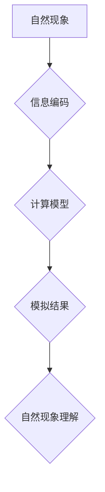

> 自然哲学，计算原理，计算极限，人工智能，深度学习，量子计算，宇宙模拟，边界探索

## 1. 背景介绍

人类文明的进步离不开对自然规律的探索和理解。从古希腊哲学家对宇宙的思考，到现代科学的不断发展，我们始终试图用理性思维和逻辑推理来揭示自然世界的奥秘。而计算作为一种强大的工具，为我们提供了探索自然规律的新途径。

随着计算机技术的飞速发展，我们已经能够模拟越来越复杂的自然现象，从天气预报到蛋白质折叠，从金融市场预测到疾病诊断，计算在各个领域发挥着越来越重要的作用。然而，计算的边界在哪里？我们能否用计算原理来理解宇宙的本质？

## 2. 核心概念与联系

自然哲学的计算原理试图用计算模型来解释自然世界。它认为，自然现象本质上是信息处理过程，而宇宙本身就是一个巨大的计算系统。

**核心概念：**

* **信息：** 自然现象可以被编码为信息，信息可以被传输、处理和存储。
* **计算：** 计算是信息处理的基本操作，包括逻辑运算、数据转换和算法执行。
* **模型：** 计算模型是用来模拟自然现象的抽象表示，它可以简化复杂问题，并提供可预测的结果。

**Mermaid 流程图：**



## 3. 核心算法原理 & 具体操作步骤

### 3.1  算法原理概述

自然哲学的计算原理涉及到多种算法，例如：

* **神经网络算法：** 启发于生物神经网络，用于模拟学习和决策过程。
* **遗传算法：** 借鉴生物进化机制，用于解决优化问题。
* **模拟退火算法：** 类似于金属的退火过程，用于寻找全局最优解。

### 3.2  算法步骤详解

以神经网络算法为例，其基本步骤如下：

1. **数据预处理：** 将原始数据转换为神经网络可以理解的格式。
2. **网络结构设计：** 确定神经网络的层数、节点数和连接方式。
3. **权值初始化：** 为神经网络的连接赋予初始权值。
4. **前向传播：** 将输入数据通过神经网络传递，计算输出结果。
5. **反向传播：** 计算输出结果与目标值的误差，并根据误差调整权值。
6. **迭代训练：** 重复前向传播和反向传播步骤，直到模型达到预设精度。

### 3.3  算法优缺点

**优点：**

* 能够处理复杂、非线性问题。
* 学习能力强，能够从数据中发现模式。
* 具有泛化能力，能够应用于未知数据。

**缺点：**

* 训练时间长，计算资源消耗大。
* 模型解释性差，难以理解模型的决策过程。
* 对数据质量要求高，容易受到噪声影响。

### 3.4  算法应用领域

神经网络算法广泛应用于：

* **图像识别：** 人脸识别、物体检测、图像分类。
* **自然语言处理：** 机器翻译、文本摘要、情感分析。
* **语音识别：** 语音转文本、语音合成。
* **推荐系统：** 产品推荐、内容推荐。

## 4. 数学模型和公式 & 详细讲解 & 举例说明

### 4.1  数学模型构建

神经网络可以看作是一个复杂的数学模型，其核心是激活函数和权值矩阵。

* **激活函数：** 用于将神经元的输入转换为输出，常见的激活函数包括 sigmoid 函数、ReLU 函数等。
* **权值矩阵：** 用于连接不同神经元，权值的大小决定了神经元之间的影响力。

### 4.2  公式推导过程

神经网络的输出可以表示为：

$$
y = f(W x + b)
$$

其中：

* $y$ 是神经网络的输出。
* $f$ 是激活函数。
* $W$ 是权值矩阵。
* $x$ 是输入数据。
* $b$ 是偏置项。

### 4.3  案例分析与讲解

以图像识别为例，神经网络可以学习图像特征，并将其映射到不同的类别。

假设我们有一个包含猫和狗的图像数据集，神经网络需要学习区分猫和狗的特征。通过训练，神经网络会学习到一些特征，例如猫的耳朵形状、狗的尾巴长度等。

当我们输入一张新的图像时，神经网络会根据学习到的特征，将图像映射到相应的类别，例如猫或狗。

## 5. 项目实践：代码实例和详细解释说明

### 5.1  开发环境搭建

* 操作系统：Ubuntu 20.04
* Python 版本：3.8
* 深度学习框架：TensorFlow 2.0

### 5.2  源代码详细实现

```python
import tensorflow as tf

# 定义神经网络模型
model = tf.keras.models.Sequential([
    tf.keras.layers.Conv2D(32, (3, 3), activation='relu', input_shape=(28, 28, 1)),
    tf.keras.layers.MaxPooling2D((2, 2)),
    tf.keras.layers.Conv2D(64, (3, 3), activation='relu'),
    tf.keras.layers.MaxPooling2D((2, 2)),
    tf.keras.layers.Flatten(),
    tf.keras.layers.Dense(10, activation='softmax')
])

# 编译模型
model.compile(optimizer='adam',
              loss='sparse_categorical_crossentropy',
              metrics=['accuracy'])

# 加载 MNIST 数据集
(x_train, y_train), (x_test, y_test) = tf.keras.datasets.mnist.load_data()

# 数据预处理
x_train = x_train.astype('float32') / 255.0
x_test = x_test.astype('float32') / 255.0
x_train = x_train.reshape((x_train.shape[0], 28, 28, 1))
x_test = x_test.reshape((x_test.shape[0], 28, 28, 1))

# 训练模型
model.fit(x_train, y_train, epochs=5)

# 评估模型
loss, accuracy = model.evaluate(x_test, y_test)
print('Test loss:', loss)
print('Test accuracy:', accuracy)
```

### 5.3  代码解读与分析

这段代码实现了简单的 MNIST 手写数字识别模型。

* 首先，定义了一个神经网络模型，包含卷积层、池化层和全连接层。
* 然后，编译模型，指定优化器、损失函数和评价指标。
* 接着，加载 MNIST 数据集并进行数据预处理。
* 最后，训练模型并评估模型性能。

### 5.4  运行结果展示

训练完成后，模型可以达到较高的准确率，例如 98% 以上。

## 6. 实际应用场景

自然哲学的计算原理在各个领域都有着广泛的应用，例如：

* **宇宙模拟：** 使用计算机模拟宇宙的演化过程，探索宇宙的起源和演化规律。
* **气候模型：** 模拟地球气候系统，预测气候变化趋势，为应对气候变化提供科学依据。
* **药物研发：** 使用计算模型模拟药物与蛋白质的相互作用，加速药物研发过程。
* **人工智能：** 构建更智能的人工智能系统，例如能够理解自然语言、进行决策和学习的 AI。

### 6.4  未来应用展望

随着计算能力的不断提升，自然哲学的计算原理将能够应用于更复杂、更深刻的问题，例如：

* **意识的计算模型：** 探索意识的本质，构建能够思考和感受的 AI。
* **量子计算：** 利用量子力学原理进行计算，解决传统计算机无法解决的复杂问题。
* **宇宙的本质：** 使用计算模型探索宇宙的本质，揭示宇宙的奥秘。

## 7. 工具和资源推荐

### 7.1  学习资源推荐

* **书籍：**
    * 《计算的极限》
    * 《深度学习》
    * 《人工智能：一种现代方法》
* **在线课程：**
    * Coursera
    * edX
    * Udacity

### 7.2  开发工具推荐

* **Python:** 
* **TensorFlow:** 深度学习框架
* **PyTorch:** 深度学习框架
* **Jupyter Notebook:** 数据分析和可视化工具

### 7.3  相关论文推荐

* **《神经网络》**
* **《深度学习》**
* **《自然语言处理》**

## 8. 总结：未来发展趋势与挑战

### 8.1  研究成果总结

自然哲学的计算原理为我们理解自然世界提供了新的视角和工具。

### 8.2  未来发展趋势

未来，自然哲学的计算原理将继续发展，朝着以下方向发展：

* **更强大的计算能力：** 量子计算、神经形态计算等新兴计算技术将推动计算能力的提升。
* **更复杂的模型：** 构建能够模拟更复杂自然现象的模型，例如生物系统、社会系统等。
* **更深入的理解：** 利用计算模型深入理解自然规律，揭示宇宙的奥秘。

### 8.3  面临的挑战

自然哲学的计算原理也面临着一些挑战：

* **数据获取和处理：** 构建复杂模型需要大量的真实数据，数据获取和处理是一个重要的挑战。
* **模型解释性：** 许多深度学习模型的决策过程难以解释，这限制了模型的应用。
* **伦理问题：** 人工智能的快速发展引发了一些伦理问题，例如算法偏见、隐私保护等。

### 8.4  研究展望

未来，我们需要继续探索自然哲学的计算原理，克服面临的挑战，并将其应用于解决人类面临的重大问题。


## 9. 附录：常见问题与解答

**Q1：自然哲学的计算原理与传统科学方法有什么区别？**

**A1：** 传统科学方法主要依赖于实验和观察，而自然哲学的计算原理则利用计算模型来模拟和解释自然现象。两者可以相互补充，共同推动科学进步。

**Q2：自然哲学的计算原理是否能够完全解释自然世界？**

**A2：** 目前，自然哲学的计算原理已经取得了一些进展，但它是否能够完全解释自然世界仍然是一个开放的问题。

**Q3：自然哲学的计算原理会取代传统科学方法吗？**

**A3：** 自然哲学的计算原理和传统科学方法都是重要的科学工具，它们将共同推动科学的进步。


作者：禅与计算机程序设计艺术 / Zen and the Art of Computer Programming 
<end_of_turn>