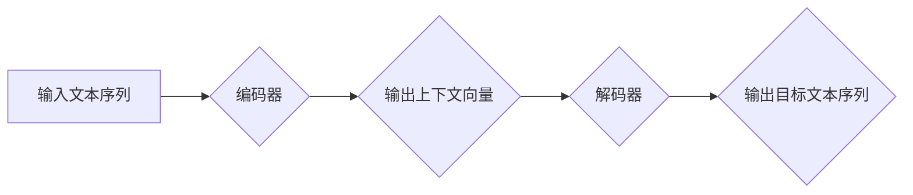

> Transformer, 编码器-解码器, 自注意力机制, 多头注意力, 位置编码, BERT, GPT

## 1. 背景介绍

自然语言处理 (NLP) 领域一直以来都致力于让计算机能够理解和生成人类语言。传统的基于循环神经网络 (RNN) 的模型在处理长文本序列时存在着梯度消失和梯度爆炸的问题，难以捕捉长距离依赖关系。2017 年，谷歌发布了基于 Transformer 架构的论文《Attention Is All You Need》，彻底改变了 NLP 领域的发展方向。Transformer 模型摒弃了 RNN 的循环结构，完全依赖于自注意力机制来捕捉文本序列中的长距离依赖关系，展现出卓越的性能，并在机器翻译、文本摘要、问答系统等任务中取得了突破性进展。

## 2. 核心概念与联系

Transformer 模型的核心思想是利用自注意力机制来捕捉文本序列中的上下文信息，并通过编码器-解码器结构进行文本生成。

**2.1  编码器-解码器结构**

Transformer 模型采用编码器-解码器结构，其中编码器负责将输入文本序列编码成上下文向量，解码器则根据编码后的上下文向量生成目标文本序列。

**2.2  自注意力机制**

自注意力机制是 Transformer 模型的核心，它允许模型关注输入序列中的不同位置，并计算每个位置之间的相关性。通过自注意力机制，模型可以捕捉到长距离依赖关系，理解文本序列的语义结构。

**2.3  多头注意力**

多头注意力机制是自注意力机制的扩展，它将注意力机制应用于多个不同的子空间，从而能够捕捉到更丰富的文本信息。

**2.4  位置编码**

由于 Transformer 模型没有循环结构，无法像 RNN 一样利用时间信息。为了解决这个问题，Transformer 模型引入了位置编码，将每个词的词向量与其位置信息相结合，从而让模型能够理解词语在句子中的顺序。

**2.5  前馈神经网络**

Transformer 模型中还包含前馈神经网络，它对编码后的上下文向量进行进一步的处理，提取更深层次的语义信息。

**Mermaid 流程图**



## 3. 核心算法原理 & 具体操作步骤

### 3.1  算法原理概述

Transformer 模型的核心算法是自注意力机制和编码器-解码器结构。自注意力机制能够捕捉文本序列中的长距离依赖关系，而编码器-解码器结构则能够将输入文本序列编码成上下文向量，并根据上下文向量生成目标文本序列。

### 3.2  算法步骤详解

1. **输入处理:** 将输入文本序列转换为词向量表示。
2. **位置编码:** 将每个词的词向量与其位置信息相结合，形成位置编码向量。
3. **编码器:** 将位置编码向量输入到编码器中，编码器由多个 Transformer 块组成，每个 Transformer 块包含自注意力层、前馈神经网络层和残差连接。
4. **解码器:** 将编码器的输出作为输入，解码器也由多个 Transformer 块组成，每个 Transformer 块包含自注意力层、跨注意力层、前馈神经网络层和残差连接。
5. **输出生成:** 解码器的输出经过 softmax 函数，生成目标文本序列。

### 3.3  算法优缺点

**优点:**

* 能够捕捉长距离依赖关系。
* 并行计算能力强。
* 性能优异。

**缺点:**

* 计算量大。
* 参数量大。
* 对训练数据要求高。

### 3.4  算法应用领域

Transformer 模型在 NLP 领域有着广泛的应用，例如：

* 机器翻译
* 文本摘要
* 问答系统
* 情感分析
* 代码生成

## 4. 数学模型和公式 & 详细讲解 & 举例说明

### 4.1  数学模型构建

Transformer 模型的核心数学模型是自注意力机制。自注意力机制的目的是计算每个词与其他词之间的相关性，并根据相关性调整词的权重。

### 4.2  公式推导过程

**4.2.1  查询、键和值向量**

对于每个词，Transformer 模型会将其词向量转换为三个向量：查询向量 (Q)、键向量 (K) 和值向量 (V)。

$$
Q = XW_Q
$$

$$
K = XW_K
$$

$$
V = XW_V
$$

其中，$X$ 是词向量矩阵，$W_Q$, $W_K$, $W_V$ 是权重矩阵。

**4.2.2  注意力分数**

注意力分数计算每个词与其他词之间的相关性。

$$
Attention(Q, K, V) = softmax(\frac{Q K^T}{\sqrt{d_k}})V
$$

其中，$d_k$ 是键向量的维度。

**4.2.3  多头注意力**

多头注意力机制将注意力机制应用于多个不同的子空间，从而能够捕捉到更丰富的文本信息。

$$
MultiHead(Q, K, V) = Concat(head_1, head_2, ..., head_h)W_O
$$

其中，$head_i$ 是第 $i$ 个子空间的注意力输出，$h$ 是多头数量，$W_O$ 是最终的权重矩阵。

### 4.3  案例分析与讲解

假设我们有一个句子 "The cat sat on the mat"，我们使用 Transformer 模型进行编码，可以得到每个词的上下文向量。

例如，"cat" 的上下文向量会包含 "the" 和 "sat" 的信息，因为它在句子中与这两个词相关。

## 5. 项目实践：代码实例和详细解释说明

### 5.1  开发环境搭建

* Python 3.6+
* PyTorch 1.0+
* CUDA 10.0+

### 5.2  源代码详细实现

```python
import torch
import torch.nn as nn

class Transformer(nn.Module):
    def __init__(self, vocab_size, embedding_dim, num_heads, num_layers, dropout=0.1):
        super(Transformer, self).__init__()
        self.embedding = nn.Embedding(vocab_size, embedding_dim)
        self.pos_encoder = PositionalEncoding(embedding_dim)
        self.encoder = nn.TransformerEncoder(nn.TransformerEncoderLayer(embedding_dim, num_heads, dropout), num_layers)
        self.decoder = nn.TransformerDecoder(nn.TransformerDecoderLayer(embedding_dim, num_heads, dropout), num_layers)
        self.fc_out = nn.Linear(embedding_dim, vocab_size)

    def forward(self, src, tgt, src_mask, tgt_mask):
        src = self.embedding(src) * torch.sqrt(torch.tensor(self.embedding.embedding_dim))
        src = self.pos_encoder(src)
        tgt = self.embedding(tgt) * torch.sqrt(torch.tensor(self.embedding.embedding_dim))
        tgt = self.pos_encoder(tgt)
        output = self.decoder(tgt, src, tgt_mask, src_mask)
        output = self.fc_out(output)
        return output

class PositionalEncoding(nn.Module):
    def __init__(self, embedding_dim, dropout=0.1):
        super(PositionalEncoding, self).__init__()
        self.dropout = nn.Dropout(dropout)

        pe = torch.zeros(10000, embedding_dim)
        position = torch.arange(0, 10000, dtype=torch.float).unsqueeze(1)
        div_term = torch.exp(torch.arange(0, embedding_dim, 2).float() * (-math.log(10000.0) / embedding_dim))
        pe[:, 0::2] = torch.sin(position * div_term)
        pe[:, 1::2] = torch.cos(position * div_term)
        pe = pe.unsqueeze(0).transpose(0, 1)
        self.register_buffer('pe', pe)

    def forward(self, x):
        x = x + self.pe[:x.size(0), :]
        return self.dropout(x)
```

### 5.3  代码解读与分析

* **Transformer 类:** 定义了 Transformer 模型的结构，包括嵌入层、位置编码层、编码器和解码器。
* **PositionalEncoding 类:** 定义了位置编码层，用于将位置信息编码到词向量中。
* **forward 方法:** 定义了 Transformer 模型的正向传播过程。

### 5.4  运行结果展示

运行代码后，可以得到 Transformer 模型的输出结果，例如机器翻译的结果、文本摘要的结果等。

## 6. 实际应用场景

Transformer 模型在 NLP 领域有着广泛的应用场景，例如：

* **机器翻译:** Transformer 模型能够准确地翻译不同语言之间的文本。
* **文本摘要:** Transformer 模型能够生成文本的简洁摘要。
* **问答系统:** Transformer 模型能够理解问题并给出准确的答案。
* **情感分析:** Transformer 模型能够分析文本的情感倾向。
* **代码生成:** Transformer 模型能够生成代码。

### 6.4  未来应用展望

Transformer 模型在未来将有更广泛的应用场景，例如：

* **对话系统:** Transformer 模型能够构建更自然、更智能的对话系统。
* **文本生成:** Transformer 模型能够生成更流畅、更自然的文本。
* **多模态理解:** Transformer 模型能够理解文本、图像、音频等多模态数据。

## 7. 工具和资源推荐

### 7.1  学习资源推荐

* **论文:** Attention Is All You Need
* **博客:** The Illustrated Transformer
* **课程:** Stanford CS224N: Natural Language Processing with Deep Learning

### 7.2  开发工具推荐

* **PyTorch:** 深度学习框架
* **Hugging Face Transformers:** 预训练 Transformer 模型库

### 7.3  相关论文推荐

* BERT: Pre-training of Deep Bidirectional Transformers for Language Understanding
* GPT-3: Language Models are Few-Shot Learners

## 8. 总结：未来发展趋势与挑战

### 8.1  研究成果总结

Transformer 模型在 NLP 领域取得了突破性的进展，其自注意力机制和编码器-解码器结构为 NLP 研究提供了新的思路和方法。

### 8.2  未来发展趋势

Transformer 模型的未来发展趋势包括：

* **模型规模的扩大:** 随着计算资源的增加，Transformer 模型的规模将进一步扩大，从而提升模型的性能。
* **模型效率的提升:** 研究人员将致力于开发更轻量级的 Transformer 模型，使其能够在移动设备等资源有限的设备上运行。
* **多模态理解:** Transformer 模型将被扩展到多模态理解领域，例如文本、图像、音频等数据的融合。

### 8.3  面临的挑战

Transformer 模型也面临着一些挑战，例如：

* **训练成本高:** 训练大型 Transformer 模型需要大量的计算资源和时间。
* **数据依赖性强:** Transformer 模型的性能依赖于训练数据的质量和数量。
* **可解释性差:** Transformer 模型的内部机制比较复杂，难以解释其决策过程。

### 8.4  研究展望

未来，Transformer 模型的研究将继续深入，探索其更广泛的应用场景，并解决其面临的挑战。


## 9. 附录：常见问题与解答

**1. Transformer 模型为什么比 RNN 模型更好？**

Transformer 模型能够并行计算，而 RNN 模型只能顺序计算，因此 Transformer 模型的训练速度更快。此外，Transformer 模型的注意力机制能够捕捉长距离依赖关系，而 RNN 模型难以处理长文本序列。

**2. Transformer 模型的计算量大吗？**

Transformer 模型的计算量确实较大，特别是大型 Transformer 模型。但是，随着硬件技术的进步，计算资源的增加，Transformer 模型的计算量问题将得到缓解。

**