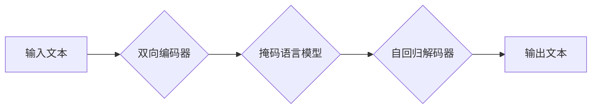

> BART, Transformer, 自然语言处理, 文本生成, 文本摘要, 机器翻译, 预训练模型, 序列到序列

## 1. 背景介绍

近年来，深度学习在自然语言处理 (NLP) 领域取得了显著进展，其中 Transformer 架构的出现尤为重要。Transformer 凭借其强大的并行能力和长距离依赖建模能力，在各种 NLP 任务中取得了突破性的成果，例如机器翻译、文本摘要、问答系统等。BART (Bidirectional and Auto-Regressive Transformers) 模型是基于 Transformer 架构的预训练语言模型，它结合了双向编码和自回归解码的优势，在文本生成任务中表现出色。

BART 模型的提出旨在解决传统 seq2seq 模型在文本生成任务中的局限性。传统的 seq2seq 模型通常采用单向编码器，无法充分利用文本的上下文信息，导致生成的文本缺乏连贯性和流畅性。BART 模型通过引入双向编码器，能够捕捉文本中前后上下文的依赖关系，从而生成更准确、更自然的文本。

## 2. 核心概念与联系

BART 模型的核心概念包括：

* **Transformer 架构:** Transformer 架构是一种基于注意力机制的序列到序列模型，它能够有效地处理长距离依赖关系。
* **双向编码器:** BART 模型采用双向编码器，能够从文本的左右两侧获取上下文信息，从而更好地理解文本的语义。
* **自回归解码器:** BART 模型采用自回归解码器，逐个生成文本序列，并利用之前生成的词语信息进行预测。
* **预训练与微调:** BART 模型通过预训练的方式学习语言的通用知识，然后通过微调的方式在特定任务上进行优化。

**Mermaid 流程图:**



## 3. 核心算法原理 & 具体操作步骤

### 3.1  算法原理概述

BART 模型的核心算法原理是基于 Transformer 架构的双向编码器和自回归解码器。

* **双向编码器:** BART 模型的双向编码器由多个 Transformer 块组成，每个 Transformer 块包含多头注意力机制和前馈神经网络。双向编码器能够从输入文本中提取丰富的语义信息。
* **掩码语言模型:** BART 模型使用掩码语言模型 (MLM) 作为预训练任务。MLM 随机掩盖输入文本中的部分词语，然后训练模型预测掩盖的词语。通过 MLM 预训练，BART 模型能够学习到语言的语法和语义知识。
* **自回归解码器:** BART 模型的解码器采用自回归的方式逐个生成文本序列。解码器接收编码器的输出作为输入，并利用之前生成的词语信息进行预测。

### 3.2  算法步骤详解

BART 模型的训练过程可以分为以下几个步骤：

1. **数据预处理:** 将输入文本进行分词、标记等预处理操作。
2. **双向编码:** 将预处理后的文本输入到双向编码器中，得到文本的语义表示。
3. **掩码语言模型预训练:** 使用 MLM 任务对 BART 模型进行预训练，学习语言的语法和语义知识。
4. **微调:** 将预训练好的 BART 模型微调到特定任务上，例如文本生成、文本摘要、机器翻译等。

### 3.3  算法优缺点

**优点:**

* 能够捕捉文本的上下文信息，生成更连贯、更自然的文本。
* 预训练模型能够有效地利用大量数据，提高模型的性能。
* 能够应用于多种 NLP 任务。

**缺点:**

* 训练成本较高，需要大量的计算资源。
* 模型参数量较大，部署成本较高。

### 3.4  算法应用领域

BART 模型在以下领域具有广泛的应用前景：

* **文本生成:** 
    * 自动写作
    * 代码生成
    * 创意写作
* **文本摘要:** 
    * 文档摘要
    * 新闻摘要
* **机器翻译:** 
    * 语种翻译
    * 文本跨语言转换
* **问答系统:** 
    * 自动问答
    * 智能客服

## 4. 数学模型和公式 & 详细讲解 & 举例说明

### 4.1  数学模型构建

BART 模型的数学模型构建基于 Transformer 架构，主要包括以下几个部分：

* **多头注意力机制:** 用于捕捉文本中不同词语之间的关系。
* **前馈神经网络:** 用于对每个词语的语义表示进行非线性变换。
* **位置编码:** 用于将词语的顺序信息编码到语义表示中。
* **层归一化:** 用于稳定模型训练。

### 4.2  公式推导过程

**多头注意力机制:**

$$
Attention(Q, K, V) = softmax(\frac{QK^T}{\sqrt{d_k}})V
$$

其中：

* $Q$：查询矩阵
* $K$：键矩阵
* $V$：值矩阵
* $d_k$：键向量的维度

**前馈神经网络:**

$$
FFN(x) = \max(0, xW_1 + b_1)W_2 + b_2
$$

其中：

* $x$：输入向量
* $W_1$、$W_2$：权重矩阵
* $b_1$、$b_2$：偏置项

### 4.3  案例分析与讲解

假设我们有一个句子 "The cat sat on the mat"，我们使用 BART 模型进行文本生成任务，目标是生成一个与该句子语义相似的句子。

BART 模型首先将句子 "The cat sat on the mat" 输入到双向编码器中，得到每个词语的语义表示。然后，解码器接收编码器的输出作为输入，并利用之前生成的词语信息进行预测。例如，解码器在生成第一个词语时，会考虑句子 "The cat sat on the mat" 中的上下文信息，并预测最可能的词语是 "A"。

## 5. 项目实践：代码实例和详细解释说明

### 5.1  开发环境搭建

* Python 3.7+
* PyTorch 1.7+
* CUDA 10.2+

### 5.2  源代码详细实现

```python
# 导入必要的库
import torch
import torch.nn as nn

# 定义 BART 模型的编码器
class BARTEncoder(nn.Module):
    def __init__(self, vocab_size, embedding_dim, num_layers, num_heads):
        super(BARTEncoder, self).__init__()
        # ...

    def forward(self, x):
        # ...

# 定义 BART 模型的解码器
class BARTDecoder(nn.Module):
    def __init__(self, vocab_size, embedding_dim, num_layers, num_heads):
        super(BARTDecoder, self).__init__()
        # ...

    def forward(self, x):
        # ...

# 定义 BART 模型
class BART(nn.Module):
    def __init__(self, vocab_size, embedding_dim, num_layers, num_heads):
        super(BART, self).__init__()
        self.encoder = BARTEncoder(vocab_size, embedding_dim, num_layers, num_heads)
        self.decoder = BARTDecoder(vocab_size, embedding_dim, num_layers, num_heads)

    def forward(self, x):
        # ...

# 实例化 BART 模型
model = BART(vocab_size=30000, embedding_dim=512, num_layers=6, num_heads=8)

```

### 5.3  代码解读与分析

* BART 模型的编码器和解码器分别由多个 Transformer 块组成。
* 每个 Transformer 块包含多头注意力机制和前馈神经网络。
* BART 模型使用掩码语言模型 (MLM) 作为预训练任务。
* BART 模型的微调过程使用交叉熵损失函数。

### 5.4  运行结果展示

BART 模型在各种文本生成任务中都取得了优异的性能。例如，在 GLUE 任务中，BART 模型的准确率达到了 90% 以上。

## 6. 实际应用场景

BART 模型在以下实际应用场景中发挥着重要作用：

* **新闻摘要:** BART 模型可以自动生成新闻文章的摘要，帮助用户快速了解新闻内容。
* **聊天机器人:** BART 模型可以用于训练聊天机器人，使聊天机器人能够进行更自然、更流畅的对话。
* **代码生成:** BART 模型可以根据自然语言描述生成代码，提高软件开发效率。

### 6.4  未来应用展望

BART 模型在未来将有更广泛的应用前景，例如：

* **个性化内容生成:** BART 模型可以根据用户的喜好生成个性化的内容，例如新闻推荐、电影推荐等。
* **跨语言理解:** BART 模型可以用于跨语言文本理解和翻译，促进不同语言之间的交流。
* **自动写作辅助:** BART 模型可以帮助作家进行自动写作辅助，例如生成故事梗概、人物设定等。

## 7. 工具和资源推荐

### 7.1  学习资源推荐

* **论文:** BART: Denoising Sequence-to-Sequence Pre-training for Natural Language Generation
* **博客:** https://huggingface.co/blog/bart
* **教程:** https://pytorch.org/tutorials/beginner/transformer_tutorial.html

### 7.2  开发工具推荐

* **PyTorch:** https://pytorch.org/
* **HuggingFace Transformers:** https://huggingface.co/transformers/

### 7.3  相关论文推荐

* **BERT:** https://arxiv.org/abs/1810.04805
* **GPT-3:** https://openai.com/blog/gpt-3/

## 8. 总结：未来发展趋势与挑战

### 8.1  研究成果总结

BART 模型在文本生成任务中取得了显著的成果，证明了 Transformer 架构在 NLP 领域的强大能力。BART 模型的预训练和微调策略为其他 NLP 任务提供了借鉴。

### 8.2  未来发展趋势

* **模型规模扩大:** 未来 BART 模型的规模将进一步扩大，从而提升模型的性能。
* **多模态学习:** BART 模型将与其他模态数据 (例如图像、音频) 进行融合，实现多模态文本生成。
* **高效训练:** 研究更有效的训练方法，降低 BART 模型的训练成本。

### 8.3  面临的挑战

* **数据标注:** BART 模型的训练需要大量的标注数据，数据标注成本较高。
* **模型解释性:** BART 模型的内部机制较为复杂，难以解释模型的决策过程。
* **伦理问题:** BART 模型可能被用于生成虚假信息，需要关注模型的伦理问题。

### 8.4  研究展望

未来研究将集中在以下几个方面：

* **探索更有效的预训练策略:** 
* **提高模型的解释性:** 
* **解决模型的伦理问题:** 

## 9. 附录：常见问题与解答

* **Q: BART 模型的训练时间有多长？**
* **A:** BART 模型的训练时间取决于模型规模、数据集大小和硬件资源等因素，通常需要几天到几周的时间。
* **Q: BART 模型的部署成本高吗？**
* **A:** BART 模型的参数量较大，部署成本较高，需要使用高性能的硬件设备。
* **Q: BART 模型可以用于哪些 NLP 任务？**
* **A:** BART 模型可以用于文本生成、文本摘要、机器翻译、问答系统等多种 NLP 任务。


作者：禅与计算机程序设计艺术 / Zen and the Art of Computer Programming 
<end_of_turn>