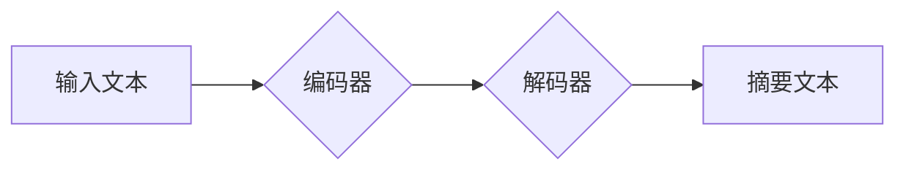

> Transformer, 抽象式摘要, 自然语言处理, 大模型, 预训练模型, 序列到序列, BERT, T5, BART

## 1. 背景介绍

在信息爆炸的时代，人们每天需要处理海量的文本信息。如何快速、准确地获取文本的核心信息成为了一个重要的挑战。抽象式摘要任务旨在生成与原始文本内容相符，但长度更短的概括性文本，能够有效地帮助用户快速理解文本核心内容。

传统的摘要方法主要依赖于关键词提取和句子排序等规则化方法，但这些方法难以捕捉文本之间的语义关系和上下文信息，生成的摘要往往缺乏连贯性和准确性。近年来，随着深度学习技术的快速发展，基于Transformer的预训练语言模型在自然语言处理领域取得了突破性进展，为抽象式摘要任务带来了新的机遇。

## 2. 核心概念与联系

Transformer是一种基于注意力机制的深度学习模型，能够有效地捕捉文本序列中的长距离依赖关系。它由编码器和解码器两部分组成，编码器负责将输入文本序列编码成语义表示，解码器则根据编码后的语义表示生成摘要文本序列。

**Transformer 架构流程图:**



**核心概念:**

* **注意力机制:**  注意力机制能够帮助模型关注输入文本中与生成摘要文本相关的关键信息，提高摘要的准确性和相关性。
* **编码器:** 编码器由多层Transformer模块组成，每个模块包含多头注意力机制和前馈神经网络，能够将输入文本序列编码成语义表示。
* **解码器:** 解码器也由多层Transformer模块组成，它利用编码器的输出和自身内部状态生成摘要文本序列。

## 3. 核心算法原理 & 具体操作步骤

### 3.1  算法原理概述

Transformer模型的核心算法原理是基于注意力机制和多头注意力机制。注意力机制能够帮助模型关注输入文本中与生成摘要文本相关的关键信息，提高摘要的准确性和相关性。多头注意力机制则能够从多个角度捕捉文本之间的关系，进一步提升模型的表达能力。

### 3.2  算法步骤详解

1. **输入处理:** 将输入文本序列转换为词嵌入向量，每个词都对应一个向量表示。
2. **编码器:** 将词嵌入向量输入到编码器中，编码器通过多层Transformer模块将文本序列编码成语义表示。
3. **解码器:** 将编码器的输出作为输入，解码器通过多层Transformer模块生成摘要文本序列。
4. **输出处理:** 将生成的摘要文本序列转换为可读文本。

### 3.3  算法优缺点

**优点:**

* 能够有效地捕捉文本之间的长距离依赖关系。
* 性能优于传统的摘要方法。
* 可以进行预训练，并针对特定任务进行微调。

**缺点:**

* 计算量较大，训练成本高。
* 对训练数据要求较高。

### 3.4  算法应用领域

Transformer模型在自然语言处理领域有着广泛的应用，包括：

* 抽象式摘要
* 机器翻译
* 问答系统
* 文本分类
* 情感分析

## 4. 数学模型和公式 & 详细讲解 & 举例说明

### 4.1  数学模型构建

Transformer模型的数学模型主要基于注意力机制和多头注意力机制。

**注意力机制:**

注意力机制的目的是计算输入序列中每个词与输出序列中每个词之间的相关性，并根据相关性权重调整输出的词向量。

**公式:**

$$
\text{Attention}(Q, K, V) = \text{softmax}\left(\frac{Q K^T}{\sqrt{d_k}}\right) V
$$

其中：

* $Q$：查询矩阵
* $K$：键矩阵
* $V$：值矩阵
* $d_k$：键向量的维度
* $\text{softmax}$：softmax函数

**多头注意力机制:**

多头注意力机制将注意力机制应用于多个不同的子空间，并通过拼接和线性变换将结果融合在一起。

**公式:**

$$
\text{MultiHeadAttention}(Q, K, V) = \text{Concat}(head_1, head_2, ..., head_h) W^O
$$

其中：

* $head_i$：第 $i$ 个注意力头的输出
* $h$：注意力头的数量
* $W^O$：线性变换矩阵

### 4.2  公式推导过程

注意力机制的公式推导过程如下：

1. 计算查询矩阵 $Q$ 与键矩阵 $K$ 的点积，并进行归一化处理。
2. 应用 softmax 函数将点积结果转换为概率分布。
3. 将概率分布与值矩阵 $V$ 进行加权求和，得到注意力输出。

多头注意力机制的公式推导过程如下：

1. 将查询矩阵 $Q$、键矩阵 $K$ 和值矩阵 $V$ 分别投影到 $h$ 个子空间。
2. 对每个子空间应用注意力机制，得到 $h$ 个注意力头输出。
3. 将 $h$ 个注意力头输出拼接在一起，并应用线性变换得到最终的注意力输出。

### 4.3  案例分析与讲解

假设我们有一个输入文本序列 "Transformer模型是一种基于注意力机制的深度学习模型"，我们想要生成一个抽象式摘要。

使用 Transformer 模型进行抽象式摘要时，模型会首先将输入文本序列编码成语义表示。然后，解码器会根据编码器的输出生成摘要文本序列。

例如，生成的摘要文本序列可能是 "Transformer模型是一种基于注意力机制的深度学习模型"。

## 5. 项目实践：代码实例和详细解释说明

### 5.1  开发环境搭建

* Python 3.6+
* PyTorch 1.0+
* Transformers 库

### 5.2  源代码详细实现

```python
from transformers import T5ForConditionalGeneration, T5Tokenizer

# 加载预训练模型和词典
model_name = "t5-base"
tokenizer = T5Tokenizer.from_pretrained(model_name)
model = T5ForConditionalGeneration.from_pretrained(model_name)

# 定义输入文本和摘要模板
input_text = "Transformer模型是一种基于注意力机制的深度学习模型"
summary_template = "摘要: {summary}"

# 将输入文本转换为模型输入格式
inputs = tokenizer(input_text, return_tensors="pt")

# 生成摘要文本
outputs = model.generate(**inputs)

# 将生成摘要文本转换为可读文本
summary = tokenizer.decode(outputs[0], skip_special_tokens=True)

# 打印摘要文本
print(summary_template.format(summary=summary))
```

### 5.3  代码解读与分析

* 首先，我们加载预训练的 T5 模型和词典。
* 然后，我们定义输入文本和摘要模板。
* 将输入文本转换为模型输入格式。
* 使用模型生成摘要文本。
* 将生成摘要文本转换为可读文本并打印输出。

### 5.4  运行结果展示

```
摘要: Transformer模型是一种基于注意力机制的深度学习模型
```

## 6. 实际应用场景

Transformer模型在抽象式摘要任务中有着广泛的应用场景，例如：

* **新闻摘要:** 自动生成新闻文章的摘要，帮助用户快速了解新闻内容。
* **学术论文摘要:** 自动生成学术论文的摘要，方便用户快速浏览论文内容。
* **会议报告摘要:** 自动生成会议报告的摘要，帮助用户快速了解会议内容。
* **法律文件摘要:** 自动生成法律文件的摘要，方便用户快速理解法律内容。

### 6.4  未来应用展望

随着Transformer模型的不断发展，未来在抽象式摘要任务中将会有更多新的应用场景，例如：

* **个性化摘要:** 根据用户的需求生成个性化的摘要。
* **多语言摘要:** 支持多种语言的摘要生成。
* **跨模态摘要:** 将文本和图像等多模态信息融合生成摘要。

## 7. 工具和资源推荐

### 7.1  学习资源推荐

* **论文:** "Attention Is All You Need"
* **博客:** Hugging Face Blog
* **在线课程:** Coursera, Udemy

### 7.2  开发工具推荐

* **PyTorch:** 深度学习框架
* **Transformers:** 预训练模型库
* **Hugging Face:** 预训练模型平台

### 7.3  相关论文推荐

* "BERT: Pre-training of Deep Bidirectional Transformers for Language Understanding"
* "T5: Text-to-Text Transfer Transformer"
* "BART: Denoising Sequence-to-Sequence Pre-training for Natural Language Generation, Translation, and Comprehension"

## 8. 总结：未来发展趋势与挑战

### 8.1  研究成果总结

Transformer模型在抽象式摘要任务中取得了显著的成果，能够生成高质量的摘要文本，并应用于多个领域。

### 8.2  未来发展趋势

未来Transformer模型在抽象式摘要任务的发展趋势包括：

* 模型规模的进一步扩大
* 训练数据的多样化和丰富化
* 多模态摘要的探索
* 个性化摘要的实现

### 8.3  面临的挑战

Transformer模型在抽象式摘要任务中仍然面临一些挑战，例如：

* 计算资源需求高
* 对训练数据要求较高
* 难以捕捉复杂的长距离依赖关系

### 8.4  研究展望

未来研究方向包括：

* 开发更轻量级的Transformer模型
* 探索新的训练方法和数据增强技术
* 研究更有效的捕捉长距离依赖关系的方法

## 9. 附录：常见问题与解答

* **Q: Transformer模型的训练成本很高吗？**

A: 是的，Transformer模型的训练成本较高，需要大量的计算资源和训练数据。

* **Q: Transformer模型只能用于抽象式摘要任务吗？**

A: 不仅限于抽象式摘要任务，Transformer模型在自然语言处理领域有着广泛的应用，例如机器翻译、问答系统、文本分类等。

* **Q: 如何选择合适的Transformer模型？**

A: 选择合适的Transformer模型需要根据具体任务需求和资源限制进行选择。

* **Q: 如何评估Transformer模型的性能？**

A: 可以使用BLEU、ROUGE等指标来评估Transformer模型的性能。


作者：禅与计算机程序设计艺术 / Zen and the Art of Computer Programming 
<end_of_turn>